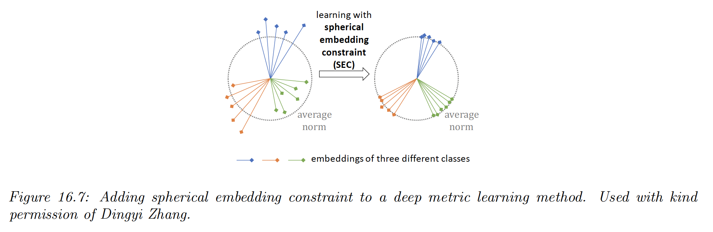

# 16.2 Learning distance metrics

Being able to compute the semantic distance between a pair of points, $d(\bold{x,x'})\in\R^+$, for $\bold{x,x'}\in\mathcal{X}$ or equivalently their similarity $s(\bold{x,x'})\in \R^+$, is of crucial importance to tasks such as nearest neighbors classification, self-supervised learning, similarity-based clustering, content-based retrieval etc.

When the input space is $\mathcal{X}=\R^D$, the most common metric is the Mahalanobis distance:

$$
d_M(\bold{x,x'})=\sqrt{(\bold{x-x'})^\top M(\bold{x-x'})}
$$

We discuss some way to learn the matrix $M$ below. For high dimensional or structured inputs, it is better to first learn an embedding $\bold{e}=f(\bold{x})$ and then to compute distances in this embedding space.

When $f$ is a DNN, this is called **deep learning metric**.

### 16.2.1 Linear and convex methods

In this section, we discuss approaches to learn the Mahalanobis matrix distance $M$, either directly as a convex problem, or indirectly via a linear projection.

**16.2.1.1 Large margin nearest neighbors (LMNN)**

Large margin nearest neighbors learns $M$ so that the resulting distance metric works well when used by a nearest neighbor classifier.

For each example point $i$, let $N_i$ be the set of **target neighbors**, usually chosen as the set of $K$ points sharing the same label and that are closest in Euclidean distance.

We optimize $M$ so that the distance between each point $i$ and its target points is minimized:

$$
\mathcal{L}_{\mathrm{pull}}(M)=\sum_{i=1}^N \sum_{j \in N_i} d_M(\bold{x}_i,\bold{x}_j)^2
$$

We also ensure that examples with incorrect labels are far away.

To do so, we ensure that $i$ is closer (by a margin $m$) to its target neighbors $j$ than some other points $l$ with different labels, called impostors:

$$
\mathcal{L}_{\mathrm{push}}(M)=\sum_{i=1}^N\sum_{j\in N_i}\sum_{l=1}^N \mathbb{I}(j\neq l)\big[m+d_M(\bold{x}_i,\bold{x}_j)^2-d_M(\bold{x}_i,\bold{x}_l)^2\big]_+
$$

where $[z]_+=\max(z,0)$ is the hinge loss function.

The overall objective is:

$$
\mathcal{L}(M)=(1-\lambda)\mathcal{L}_{\mathrm{pull}}(M)+\lambda\mathcal{L}_{\mathrm{push}}(M)
$$

where $0<\lambda <1$. This is a convex function, defined over a convex set, which can be minimized using **semidefinite programming**.

Alternatively, we can parametrize the problem using $M=W^\top W$, and then minimize w.r.t $W$using unconstrained gradient methods. This is no longer convex, but this allows to use a low-dimensional mapping $W$.

 For large datasets, we need to tackle the $O(N^3)$ cost of computing $\mathcal{L}_{\mathrm{push}}$.

**16.2.1.2 Neighborhood component analysis (NCA)**

NCA is another way to learn a mapping $W$ such that $M=W^\top W$.

This defines a probability that sample $\bold{x}_i$ has $\bold{x}_j$ as it nearest neighbor, using the linear softmax function:

$$
p_{ij}^W=\frac{\exp(-|||W\bold{x}_i-W\bold{x}_j||^2_2)}{\sum_{l\neq i} \exp(-||W\bold{x}_i-W\bold{x}_l||^2_2)}
$$

This is a supervised version of the stochastic neighborhood embeddings.

The expected number of correctly classified examples for a 1NN classifier using distance $W$ is given by:

$$
J(W)=\sum_{i=1}^N\sum_{j\neq i: y_i=y_j} p_{ij}^W
$$

Let $\mathcal{L}(W)=1-J(W)/N$ be the leave-one-out error.

We can minimize $\mathcal{L}$ w.r.t $W$ using gradient methods.

 

**16.2.1.3 Latent coincidence analysis (LCA)**

LCA is another way to learn $W$ such that $M=W^\top W$ by defining a conditional latent variable model for mapping a pair of inputs $(\bold{x,x'})$ to a label $y\in \{0,1\}$, which specifies if the inputs are similar (have the same class label) or dissimilar.

Each input $\bold{x}\in\R^D$ is mapped to a low dimensional latent point $\bold{z}\in\R^L$ using:

$$
p(\bold{z|x})=\mathcal{N}(\bold{z}|W\bold{x},\sigma^2I)
$$

We then define the probability that the two inputs are similar with:

$$
p(y=1|\bold{z,z'})=\exp\big(-\frac{1}{2\kappa^2}||\bold{z-z'}||\big)
$$

We can maximize the log marginal likelihood using the EM algorithm:

$$
\ell(W,\sigma^2,\kappa^2)=\sum_{i=1}^N \log p(y_n|\bold{x}_n,\bold{x}_n')
$$

In the E step, we compute the posterior $p(z,z'|\bold{x,x'},y)$, which can be done in close form.

In the M step, we solve a weighted least square problem.

EM will monotonically increase the objective, and does not need step size adjustment, unlike gradient methods used in NCA.

It is also possible to fit this model using variational Bayes, as well as various sparse and nonlinear extensions.

### 16.2.2 Deep metric learning (DML)

When measuring the distances of high-dimensional inputs, it is very useful to first learn an embedding to a lower dimensional “semantic” space, where the distances are more meaningful, and less subject to the curse of dimensionality.

Let $\bold{e}=f(\bold{x},\theta)\in\R^L$ be an embedding of the input, preserving its relevant semantic aspect.

The $\ell_2$-normalized version, $\bold{\hat{e}}=\bold{e}/||\bold{e}||_2$, ensures that all points lie on the hyper-sphere.

We can then measure the distance between two points using the normalized Euclidean distance (where smaller values mean more similar):

$$
d(\bold{x}_i,\bold{x}_j,\theta)=||\bold{\hat{e}}_i-\bold{\hat{e}}_j||^2_2
$$

or the cosine similarity (where larger values mean more similar):

$$
d(\bold{x}_i,\bold{x}_j,\theta)=\bold{\hat{e}}_i^\top \bold{\hat{e}}_j
$$

Both quantities are related by:

$$
||\bold{\hat{e}}_i-\bold{\hat{e}}_j||^2_2=(\bold{\hat{e}}_i-\bold{\hat{e}}_j)^\top (\bold{\hat{e}}_i-\bold{\hat{e}}_j)=2-2\bold{\hat{e}}_i^\top \bold{\hat{e}}_j
$$

The overall approach is called **deep metric learning**.

The basic idea is to learn embedding function such that similar examples are closer than dissimilar examples.

For example, if we have a labeled dataset, we can create a set of similar examples $\mathcal{S}=\{(i,j):y_i=y_j\}$, and enforce $(i,j)\in\mathcal{S}$ be more similar than $(i,k)\notin\mathcal{S}$.

Note that this method also work in non supervised settings, providing we have other way to define similar pairs.

Before discussing DML, it’s worth mentioning that some recent approaches made invalid claims due to improper experimental comparisons, a common flaw in contemporary ML research. We will therefore focus on (slightly) older and simpler methods, that tend to be more robust.

### 16.2.3 Classification losses

Suppose we have labeled data with $C$ classes. We can fit a classification model in $O(NC)$  time, and then reuse the hidden features as an embedding function —it is common to use the second-to-last layer since it generalizes better to new classes than the last layer.

This approach is simple and scalable, but it only learns to embed examples on the correct side of the decision boundary. This doesn’t necessarily result in similar examples being placed closed together and dissimilar examples placed far apart.

In addition, this method can only be used with labeled training data.

### 16.2.4 Ranking losses

In this section, we minimize **ranking loss**, to ensure that similar examples are closer than dissimilar examples. Most of these methods don’t require labeled data.

**16.2.4.1 Pairwise (contrastive) loss and Siamese networks**

One of the earliest approach to representation learning from similar/dissimilar pairs was based on minimizing the contrastive loss:

$$
\mathcal{L}(\theta, \bold{x}_i,\bold{x}_j)=\mathbb{I}(y_i=y_j)d(\bold{x}_i,\bold{x}_j)^2+\mathbb{I}(y_i\neq y_j)[m-d(\bold{x}_i,\bold{x}_j)^2]_+
$$

where $m>0$ is a margin parameter.

Intuitively, we want positive pairs to be close, and negative pairs to be further apart than some safety margin.

We minimize this loss over all pairs of data. Naively, this takes $O(N^2)$ time.

Note that we use the same feature extractor $f(.,\theta)$ for both inputs $\bold{x}_i$ and $\bold{x}_j$ to compute the distance, hence the name Siamese network:

**16.2.4.2 Triplet loss**

One drawback of pairwise losses is that the optimization of positive pairs is independent of the negative pairs, which can make their magnitudes incomparable.

The triplet loss suggest for each example $i$ (known as anchor) to find a similar example $\bold{x}_i^+$ and a dissimilar example $\bold{x}^-_i$, so that the loss is:

$$
\mathcal{L}(\theta,\bold{x}_i,\bold{x}_i^+,\bold{x}_i^-)=[d_\theta(\bold{x}_i,\bold{x}_i^+)^2-d_\theta(\bold{x}_i,\bold{x}_i^-)^2 + m]_+
$$

Intuitively, we want positive example to be close to the anchor, and negative example to be further apart from the anchor by a safety margin $m$.

This loss can be computed using a triplet network:

Naively minimizing this loss take $O(N^3)$ time. In practice, we can use a minibatch where the anchor point is the first entry, and there is at least one positive and one negative example.

However, this can still be slow.

**16.2.4.3 N-pairs loss**

The drawback of triplet loss is that each anchor is only compared to one negative example, therefore the learning signal is not very strong.

A solution is to create a multi-classification problem where we create a set of $N-1$ negatives and one positive for every anchor. This is called the **N-pairs loss**:

$$
\begin{align}
\mathcal{L}(\theta,\bold{x},\bold{x}^+,\{\bold{x}^-_k\}^{N-1}_{k=1})
&=\log\Big(1+\sum_{k=1}^{N-1}\exp(f^\top f^-_k-f^\top f^+)\Big)\\
&= -\log\frac{\exp(f^\top f^+)}
{\exp\big(f^\top f^+)+
\sum_{k=1}^{N-1}\exp (f^\top f^-_k)}
\end{align}
$$

Where $f=\bold{\hat{e}}_\theta(\bold{x})$.

This is the same as the **InfoNCE loss** used in the CPC paper.

When $N=2$, this reduces to the logistic loss:

$$
\mathcal{L}(\theta,\bold{x},\bold{x}^+,\bold{x}^-)=\log(1+\exp (f^\top f^--f^\top f^+))
$$

Compare this to the triplet loss when $m=1$:

$$
\mathcal{L}(\theta,\bold{x},\bold{x}^+,\bold{x}^-)=[1+f^\top f^--f^\top f^+]_+
$$

### 16.2.5 Speeding up ranking loss optimization

The major issue of ranking loss is the $O(N^2)$ or $O(N^3)$ cost of computing the loss function, due to the need to compare pairs or triplet of examples.

We now review speedup tricks.

**16.2.5.1 Mining techniques**

A key insight is that most negative examples will result in zero loss, so we don’t need to take them all into account.

Instead, we can focus on negative examples that are closer to the anchor than positive examples. These examples are called **hard negative.**

If $a$ is an anchor and $p$ its nearest positive example, $n$ is a hard negative if:

$$
d(\bold{x}_a,\bold{x}_n)<d(\bold{x}_a,\bold{x}_p),\quad y_a\neq y_n
$$

When the anchor doesn’t have hard negative, we can include semi-hard negatives for which:

$$
d(\bold{x}_a,\bold{x}_p)<d(\bold{x}_a,\bold{x}_n)<d(\bold{x}_a,\bold{x}_p)+m
$$

This is the technique used by **Google FaceNET** model, which learns an embedding function for faces, so it can cluster similar looking faces together, to which the user can attach a name.

In practice, the hard negative are chosen from the minibatch, which requires a large batch for diversity.

**16.2.5.2 Proxy methods**

Even with hard negative mining, triplet loss is expensive.

Instead, it has been suggested to define a set of $P$ proxies representing each class and compute the distances between each anchor and proxies, instead of using all examples.

These proxies need to be updated online as the distance metric evolve during training. The overall procedure takes $O(NP^2)$ time, where $P\sim C$.

More recently, it has been proposed to take multiple prototypes for each class, while still achieving linear time complexity, using a soft triple loss.

**16.2.5.3 Optimizing an upper bound**

To optimize the triplet loss, it has been proposed to define a fixed proxy or centroid per class, and then use the distance to the proxy as an upper bound on the triplet loss.

Consider a triplet loss without the margin term:

$$
\ell_t(\bold{x}_i,\bold{x}_j,\bold{x}_k)=||f_i-f_j||-||f_i-f_k||
$$

using the triangle inequality, we have:

$$
||f_i-f_j||\le ||f_i-c_{y_i}||+||f_j -c_{y_i}||\\
||f_i-f_k||\ge ||f_i-c_{y_k}||-||f_k-c_{y_k}||
$$

Therefore:

$$
\begin{align}
\ell_t(\bold{x}_i,\bold{x}_j,\bold{x}_k)&\le \ell_u(\bold{x}_i,\bold{x}_j,\bold{x}_k)\\
&\triangleq ||f_i-c_{y_i}||-||f_i-c_{y_k}||+||f_j-c_{y_i}||+||f_k-c_{y_{k}}||
\end{align}
$$

We can use this to derive a tractable upper bound on the triplet loss: 

$$
\begin{align}
\mathcal{L}_t(\mathcal{D},\mathcal{S})&=\sum_{(i,j)\in\mathcal{S},(i,k)\notin\mathcal{S},(i,j,k)\in\{1,\dots,N\}}\ell_t(\bold{x}_i,\bold{x}_j,\bold{x}_k)
\\
&\leq \sum_{(i,j)\in\mathcal{S},(i,k)\notin\mathcal{S},(i,j,k)\in\{1,\dots,N\}}\ell_u(\bold{x}_i,\bold{x}_j,\bold{x}_k)
\\&= N'\sum_{i=1}^N \Big(||\bold{x}_i-c_{y_i}||-\frac{1}{3(C-1)}\sum^C_{m=1,m\neq y_i}||\bold{x}_i-c_m|| \Big)
\\&=\mathcal{L}_u(\mathcal{D},\mathcal{S})
\end{align}
$$

where $N'=3(C-1)(\frac{N}{C}-1)\frac{N}{C}$

It is clear that $\mathcal{L}_u$ can be computed in $O(NC)$ time.

It has been shown that 

$$
0\leq \mathcal{L}_u-\mathcal{L}_t\leq \frac{N^3}{C^2}K
$$

where $K$ is some constant which depends on the number of centroids.

To ensure the bound is tight, the inter-cluster distances should be large and similar.

This can be enforced by defining the $\bold{c}_m$ vectors to be one-hot, one per class. These vectors are orthogonal between each other and have unit norm, so that the distance between each other is $\sqrt{2}$.

The downside of this approach is that it assumes the embedding layer is $L=C$ dimensional. Two solutions:

1. After training, add a linear projection layer mapping $C$ to $L$, or use the second-to-last layer of the embedding network
2. Sample a large number of points on the $L$-dimensional unit sphere (by sampling from the normal distribution, then normalizing) and then running K-means clustering with $K=C$.

Interestingly, [this paper](https://arxiv.org/pdf/2002.08473.pdf) has been shown that increasing $\pi_{\mathrm{intra}}/\pi_{\mathrm{inter}}$ results in higher downstream performance on various retrieval task, where:

$$
\pi_\mathrm{intra}=\frac{1}{Z_{\mathrm{intra}}}\sum_{c=1}^C \sum_{i\neq j,y_i=y_j=c}d(\bold{x}_i,\bold{x}_j)
$$

is the average intra-class distance and

$$
\pi_{\mathrm{inter}}=\frac{1}{Z_\mathrm{inter}}\sum_{c=1}^C\sum_{c'=1}^C d(\mu_c,\mu_c')
$$

is the average inter-class distance, where

$$
\mu_c=\frac{1}{Z_c}\sum_{i:y_i=c}f_i
$$

is the mean embedding for examples of class $c$.

### 16.2.6 Other training tricks for DML

We present other important details for good DML performance.

*i)* One important factor is how the minibatch is created.

In classification tasks (at least with balanced classes), selecting examples at random from the training set is usually sufficient.

For DML, we need to ensure that each example has some other examples in the minibatch that are similar and dissimilar to it.

- One approach is to use hard-mining like we previously saw.
- One other is coreset methods applied to previously learned embeddings to select a diverse minibatch at each step.
- The above cited-paper also shows that picking $B/N_c$ classes and sampling $N_c=2$ samples per class is a simple sampling method that works well for creating our batches.

*ii)* Another issue is avoiding overfitting. Since most datasets used in the DML literature are small, it is standard to use image classifiers like GoogLeNet or ResNet pre-trained on ImageNet, and then to fine-tune the model using DML loss.

In addition, it is common to use data augmentation techniques (with self-supervised learning, it is the only way of creating similar pairs)

*iii)* It has also been proposed to add a spherical embedding constraint (SEC), which is a batchwise regularization term, which encourages all the examples to have the same norm.

The regularizer is the empirical variance of the norms of the unnormalized embeddings in that batch.

This regularizer can be added to any DML loss to modestly improve the training speed and stability, as well as final performances, analogously to how batchnorm is used.