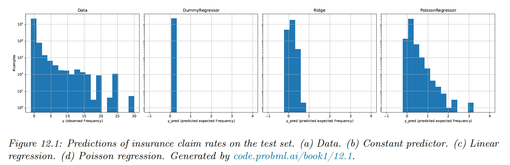
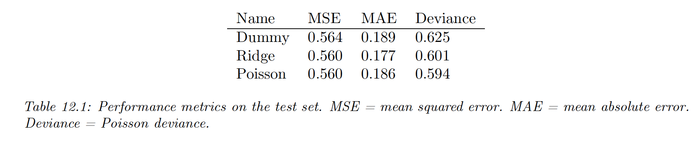
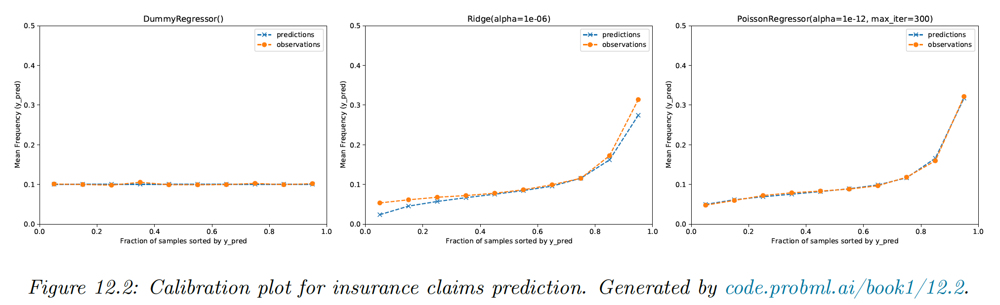

# 12.5 Worked example: predicting insurance claims

In this section, we predict the frequency of insurance claims using linear and Poisson regression. The frequency is the number of claims divided by the duration of the contract (in years).

The following is borrowed from [a scikit-learn tutorial](https://scikit-learn.org/stable/auto_examples/linear_model/plot_poisson_).

We plot the test set and see that for 94% of policies, no claims are made, so the target has a lot of zeros, which is typical for rates and counts. The average frequency is 10%, which can be converted into a dummy regressor, which always predicts the average. Our goal is to do better than this.

A simple approach is to use a ridge regression, with minimal feature engineering on the categorical columns. It is better than the baseline, but not great. We see that it fails to capture the long tail and makes some negative predictions.

We can do better with a Poisson regression, using the same features.

Metrics like MSE and MAE fail to identify Poisson as a better solution than Ridge.

Instead, we can use the deviance, defined as:

$$
D(\bold{y},\hat{\mu})=2\sum_i \log p(y_i|\mu_i^*)-\log p(y_i|\mu_i)
$$

where $\mu_i$ is the predicted mean parameter and $\mu_i^*$ is the optimal parameter.

In the case of Poisson regression we have $\mu_i^*=y_i$, hence:

$$
\begin{align}
D(\bold{y},\mu)&=2 \sum_i (y_i\log y_i-y_i-\log(y_i!))-(y_i \log \hat{\mu}_i -\hat{\mu}_i-\log (y_i!)) \\
&= 2\sum_i y_i \log \frac{y_i}{\hat{\mu}_i}+\hat{\mu}_i-y_i
\end{align}
$$

We can also compute a calibration, which plots the actual frequency against the predicted frequency. This is accomplished by binning the predictions and counting the empirical frequencies that fall into each bin.

We see that the dummy regressor is well-calibrated, but not very accurate. The ridge is miscalibrated for the lower and higher frequency regimes, unlike the Poisson which is well-calibrated.