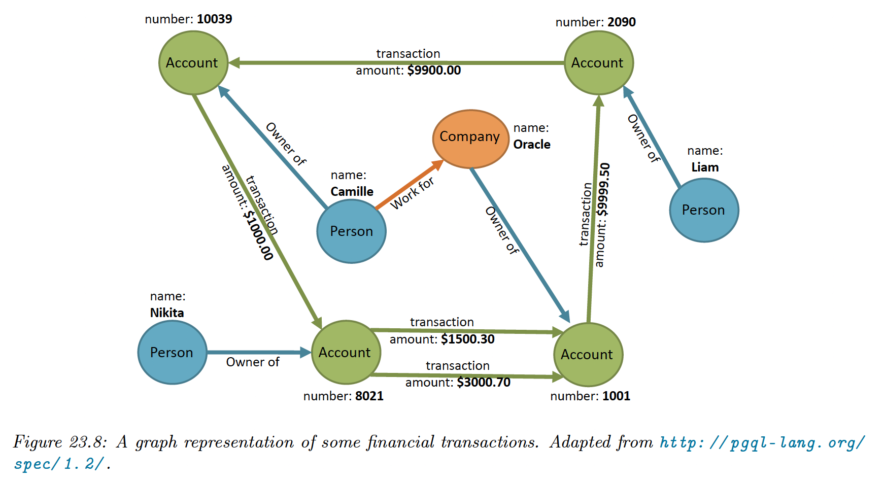
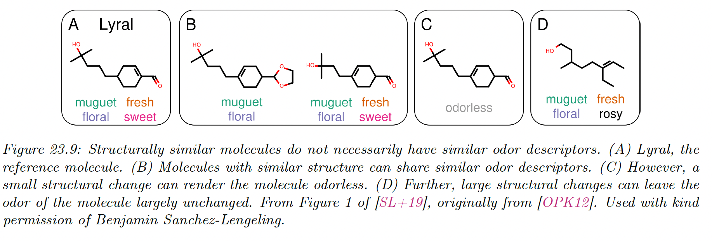

# 23.6 Applications

We give some examples of the applications of supervised and unsupervised graph embeddings.

### 23.6.1 Unsupervised applications

#### 23.6.1.1 Graph reconstruction

Graph reconstruction is a popular unsupervised application, where the goal is to learn a mapping (parametric or not) from nodes onto a manifold which can reconstruct the graph.

This is regarded as unsupervised because there is no supervision beyond the graph structure. Models can be trained to minimize the reconstruction error, which is obtained by reconstructing the graph via learned embeddings.

At a high-level, graph reconstruction is similar to dimension reduction like PCA, but instead of compressing high dimensional vectors into low dimensional ones, it compresses data defined on graph into low dimensional vectors.

#### 23.6.1.2 Link prediction

The goal of link prediction is to infer missing or unobserved links (e.g. links that may appear in the future for dynamic and temporal network). It also can identify spurious links and remove them.

It is a major application of graph learning models, used for predicting

- friendship in **social networks**
- user-product interactions in **recommender systems**
- suspicious links in a **fraud detection system**
- predicting missing relationships in a **knowledge graph**

A common approach to train link prediction models is to mask some edges (positive and negative ones) and use the rest of the graph to predict them.

Note that link prediction is different from graph reconstruction, because the former aims at predicting links that are not observed in the original graph, while the latter learns embeddings that preserve the original graph structure through reconstruction error minimization.

We put link predictions in the unsupervised category. Even if we can consider edges as labels, they are not used during training, but only used to evaluate the predictive quality of the embeddings.

#### 23.6.1.3 Clustering

Clustering is useful to discover communities, with applications in social networks (groups with similar interests) or biological networks (groups of protein with similar properties).

Unsupervised methods uses clustering algorithms like K-means on the embeddings that are output by an encoder.

Further, clustering can be joined with the learning algorithm while learning a shallow or graph convolution embedding model.

#### 23.6.1.4 Visualization

There are many off-the-shelf tools for mapping graph nodes onto 2d manifold for the purpose of visualization. Visualization allow to qualitatively understand graph properties, understand relationships between nodes or visualize clusters.

Unsupervised graph embedding methods can be used: by first training an encoder-decoder model, and then mapping node embedding onto a 2d space using t-SNE or PCA. If nodes have attributes, they can be used to color the nodes on 2d visualization plots.

Finally, beyond mapping every node to a 2d coordinate, methods mapping every graph to an embedding can similarly be projected in 2d to visualize and analyse graph-level properties.

### 23.6.2 Supervised applications

#### 23.6.2.1 Node classification

The goal of node classification is to learn representation that can accurately predict node labels, like topics in citation networks or gender in social networks.

Since labelling large graph is often expensive, semi-supervised techniques are commonly used, where only a fraction of nodes are labeled, and the goal is to leverage links between nodes to predict attributes of unlabeled nodes.

This setting is transductive since there is only one partially labeled fixed graph. It is also possible to do inductive node classification, which correspond to the task of classifying nodes in multiple graphs.

Node features can significantly boost performances on node classification tasks if there are descriptive for the target label. Indeed, methods like GCN or GraphSAGE have achieved SoTA performances on multiple node classification benchmarks due to their ability to combine structural information and semantics coming from features.

Other methods like random walks on graph fail to leverage feature information and therefore achieve lower performance on these tasks.

#### 23.6.2.2 Graph classification

Graph classification aims at predicting graph labels. They are inductive, and a common example is classifying chemical compounds (e.g. predicting toxicity or odor from a molecule).

Graph classification requires some notion of pooling, in order to aggregate node-level information into graph-level information.

As discussed earlier, generalizing this notion of pooling to arbitrary graphs is non trivial because of the lack of regularity in the graph structure, making graph pooling an active research area.

Some unsupervised methods for learning graph-level representation have also been proposed.