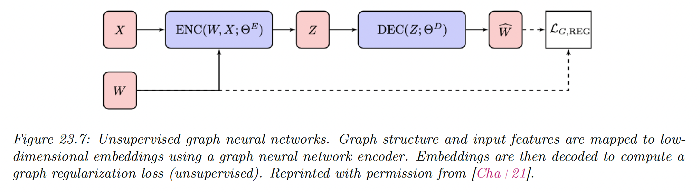

# 23.5 Deep Graph Embeddings

We now focus on graph in unsupervised and semi-supervised settings.

### 23.5.1 Unsupervised graph embeddings

#### 23.5.1.1 Structural deep network embedding (SDNE)

SDNE method uses auto-encoders preserving first and second order node proximity.

It takes a row of the adjacency matrix $W$ as input and produces node embeddings $Z=\mathrm{ENC}(W;\Theta^E)$. Note that this ignores node features $X$.

The SDNE decoder returns $\hat{W}=\mathrm{DEC}(Z;\Theta^D)$, a reconstruction trained to recover the original graph adjacency matrix.

SDNE preserves second order proximity by minimizing the loss:

$$
||(W-\hat{W})\mathbb{I}(W>0)||^2_F+\alpha_{\mathrm{SNDE}}\sum_{ij}W_{ij}||Z_i-Z_j||^2_2
$$

The first term is similar to matrix factorization techniques, except $\hat{W}$ is not computed using outer product. The second term is used by distance based shallow embedding methods.

#### 23.5.1.2 (Variational) graph auto-encoders (GAE)

GAE use graph convolutions to learn node embeddings $Z=\mathrm{GCN}(W,X;\Theta^E)$.

The decoder is an outer product $\hat{W}=\mathrm{DEC}(Z;\Theta^D)=ZZ^\top$

The graph reconstruction term is the sigmoid cross entropy between the true adjacency and the predicted edges similarity scores:

$$
\mathcal{L}_{\mathrm{G,RECON}}(W,\hat{W};\Theta)=-\sum_{ij} \big[W_{ij}\log \sigma(\hat{W}_{ij})+(1-W_{ij})\log (1-\sigma(\hat{W}_{ij}))\big]
$$

To avoid computing the regularization term over all possible nodes pairs, GAE uses negative sampling.

Whereas GAE is a deterministic model, the author also introduced variational graph auto-encoders (VGAE).

The embedding $Z$ is modeled as a latent variable with a standard multivariate prior $p(Z)=\mathcal{N}(Z|\bold{0},I)$ and a graph convolution is used as the amortized inference network $q_\Phi(Z|W,X)$.

The model is training by minimizing the corresponding negative ELBO:

$$
\begin{align}
\mathrm{NELBO} &= -\mathbb{E}_{q_\Phi(Z|W,X)}[\log p(W|Z)]+\mathrm{KL}(q_\Phi(Z|W,X)||p(Z)) \\
&= \mathcal{L}_{\mathrm{G,RECON}}(W,\hat{W};\Theta)+\mathrm{KL}(q_\Phi(Z|W,X)||p(Z))
\end{align}
$$

#### 23.5.1.3 Iterative generative modeling of graphs (Graphite)

The **graphite** model extends GAE and VGAE by introducing a more complex decoder, which iterate between pairwise decoding functions and graph convolutions:

$$
\begin{align}
\hat{W}^{(k)} &=\frac{Z^{(k)}{Z^{(k)}}^\top}{||Z^{(k)}||^2_2}+\frac{11^\top}{N} \\
Z^{(k+1)} &=\mathrm{GCN}(\hat{W}^{(k)},Z^{(k)})
\end{align}
$$

where $Z^{(0)}$ is the input of the encoder.

This process allows Graphite to learn more expressive decoders. Finally, similar to GAE, graphite can be deterministic or variational.

#### 23.5.1.4 Methods based on contrastive loss

The **deep graph infomax (DGI)** method is a GAN-like method for creating graph-level embeddings.

Given one or more real (positive) graphs, each with its adjacency matrix $W\in \R^{N\times N}$ and nodes features $X\in \R^{N\times D}$, this method creates fake (negative) adjacency matrices $W^{-}\in \R^{N^-\times N^-}$ and their features $X^- \in \R^{N^-\times D}$.

DGI trains:

i) an encoder that processes both real and fake samples, giving:

$$
\begin{align}
Z &= \mathrm{ENC}(X,W;\Theta^E)\in \R^{N\times L} \\
Z^- &= \mathrm{ENC}(X^-,W^-;\Theta^E)\in \R^{N^-\times L}
\end{align}
$$

ii) A (readout) graph pooling function $\mathcal{R}:\R^{N\times L}\rightarrow \R^L$

iii) A discriminator function $\mathcal{D}:\R^L \times \R^L \rightarrow [0,1]$ which is trained to output

$$
\begin{align}
\mathcal{D}(Z_i,\mathcal{R}(Z)) &\approx 1 \\
\mathcal{D}(Z_j^-,\mathcal{R}(Z^-)) &\approx 0
\end{align}
$$

for nodes corresponding to given graph $i\in V$ and fake graph $j\in V^{-}$. 

The loss is:

$$
\min_\Theta -\mathbb{E}_{X,W}\sum_{i=1}^N \log \mathcal{D}(Z_i,\mathcal{R}(Z))-\mathbb{E}_{X^-,W^-}\sum_{j=1}^{N^-}\log (1-\mathcal{D}(Z_j^-,\mathcal{R}(Z^-)))
$$

where $\Theta$ contains $\Theta^E$ and the parameter of $\mathcal{R}$ and $\mathcal{D}$. 

In the first expectation, DGI samples from the real graphs. If only one graph is given, it could sample some subgraphs from it (connected components).

The second expectation sample fake graphs. In DGI, fake graphs use the real adjacency matrix $W^-=W$ but fakes features $X^{-}$ are row-wise random permutation of the real $X$.

The encoder used in DGI is a GCN, though any GNN can be used.

The readout $\mathcal{R}$ summarizes an entire (variable size) graph to a single (fixed-dimension) vector. DGI uses a row-wise mean, though other graph pooling might be used, e.g. ones aware of the adjacency.

The optimization of the loss maximize a lower-bound on the mutual information between the outputs of the encoder and the graph pooling function, i.e. between individual node representation and the graph representation.

**Graphical Mutual Information (GMI)** is a variant that maximizes the MI between the representation of a node and its neighbors, rather than the maximizing the MO of node information and the entire graph.

### 23.5.2 Semi-supervised graph embeddings

We now discuss semi-supervised losses for GNNs. We consider the simple special case in which we use a nonlinear encoder of the node features $X$, but ignores the graph structure $W$:

$$
Z=\mathrm{ENC}(X;\Theta^E)
$$

#### 23.5.2.1 SemiEmb

**Semi-supervised embeddings (SemiEmb)** use an MLP for the encoder of $X$. For the decoder, we can use a distance-based graph decoder:

$$
\hat{W}_{ij}=\mathrm{DEC}(Z;\Theta^D)_{ij}=||Z_i-Z_j||^2
$$

where we can use the L1 or L2 norm.

SemiEmb regularizes intermediate layers in the network using the same regularizer as the label propagation loss:

$$
\mathcal{L}_{\mathrm{G,RECON}}(W,\hat{W},\Theta)=\sum_{i,j}W_{ij}||y_i^N-\hat{y}_j^N||^2_2
$$

#### 23.5.2.2 Planetoid

Unsupervised skip-gram methods like DeepWalk and node2vec learn embeddings in a multi-step pipeline, where random walks are first generated from the graph and then used to learn embeddings.

These embeddings are likely not optimal for downstream classification tasks. The **Planetoid** method extends such random walk methods to leverage node label information during the embedding.

Planetoid first maps nodes to embeddings using a neural net (again ignoring graph structure):

$$
Z=[Z^c||Z^F]=\mathrm{ENC}(X;\Theta^E)
$$

The node embeddings $Z^c$ capture structural information while the node embeddings $Z^F$ capture feature information.

There are two variant of encoding for $Z^c$:

- A transductive version that directly learn $Z^c$ as an embedding lookup
- An inductive model where $Z^c$ is computed with parametric mappings that act on input features $X$

The planetoid objective contains both a supervised loss and a graph regularization loss. This latter term measures the ability to predict context using nodes embeddings:

$$
\mathcal{L}_{\mathrm{G,RECON}}(W,\hat{W};\Theta)=-\mathbb{E}_{(i,j,\gamma)}\log \sigma(\gamma \hat{W}_{ij})
$$

with $\hat{W}_{ij}=Z^\top_iZ_j$ and $\gamma\in\{-1,1\}$, with $\gamma=1$ if $(v_i,v_j)\in E$ is a positive pair and $\gamma=-1$ if $(v_i,v_j)$ is a negative pair.

The distribution under the expectation is defined through a sampling process.

The supervised loss in Planetoid is the NLL of predicting the correct labels:

$$
\mathcal{L}_{\mathrm{SUP}}^L(y^N,\hat{y}^N;\Theta)=-\frac{1}{|V_L|}\sum_{i|v_i\in V_L}\sum_{1\leq k\leq C}y_{ik}^N \log \hat{y}_{ik}^N
$$

where $i$ is a node’s index, and $\hat{y}_i^N$  are computed using a neural net followed by a softmax activation, mapping $Z_i$ to predicted labels.