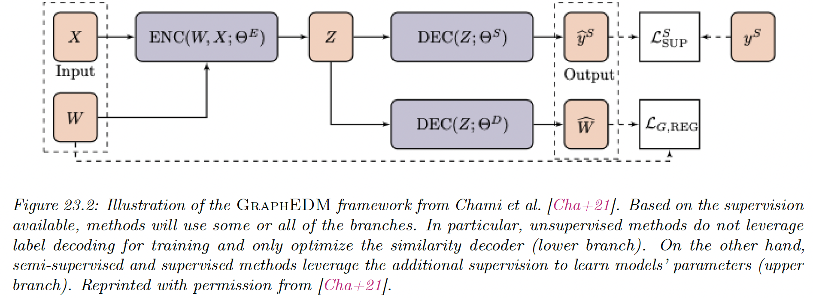

# 23.2 Graph Embedding as an Encoder / Decoder Problem

Many approaches to GRL follow a similar pattern:

1. The network input (node features $X\in \R^{N\times D}$ and graph edges $A\in\R^{N\times N}$) is encoded from the discrete domain of the graph to embeddings $Z\in\R^{N\times L}$
2. The learned representation is used to optimize an objective (e.g., reconstructing the edges of the graph)

In this section, we will use the graph encoder-decoder model (GraphEDM) to analyze popular families of GRL methods, supervised and unsupervised. Some utilizes the graph as a regularizer, positional embeddings, or graph convolutions.

GraphEDM takes as input a weighted graph $W\in\R^{N\times N}$ and optionally $X$.

In (semi-)supervised settings, we assume that we have training target labels for nodes $N$, edges $E$ or the entire graph $G$. We denote the supervision signal $S\in\{N,E,G\}$.

We can decompose GraphEDM into multiple components:

**GraphEncoder network**

$$

Z=\mathrm{ENC}(W,X;\Theta^E)
$$

This might capture different graph properties depending on the supervision task.

**GraphDecoder network**

$$
\hat{W}=\mathrm{DEC}(Z;\Theta^D)
$$

This compute similarity scores for all nodes pairs in matrix $\hat{W}\in\R^{N\times N}$.

**Classification network**

$$
\hat{y}^S = \mathrm{DEC}(Z;\Theta^S)
$$

where $\hat{y}^S\in \R^{N\times |\mathcal{Y}|}$ and $\mathcal{Y}$ is the label space.

This network is used in (semi-)supervised settings output a distribution over the labels.

Specific choices of the encoder and decoder networks allow GraphEDM to perform specific graph embedding methods, as we will explain.

The output of GraphEDM is either a reconstructed graph similarity matrix $\hat{W}$ (often used to train unsupervised embedding algorithms) and/or labels $\hat{y}^S$ for supervised applications.

The label output is task dependent, and can be node-level like $\hat{y}^N\in \mathcal{Y}^{N}$, with $\mathcal{Y}$ representing the node label space.

Alternatively, for edge-level labeling,  $\hat{y}^E\in \mathcal{Y}^{N\times N}$, with $\mathcal{Y}$ representing the edge-level label space.

Finally, we note other kinds of labeling are possible, like graph labeling $\hat{y}^G\in\mathcal{Y}$, with $\mathcal{Y}$ representing the graph label space.

A loss must be specified to optimize $\Theta=\{\Theta^E,\Theta^S,\Theta^G\}$. GraphEDM models can be optimized using a combination of three different terms:

$$
\mathcal{L}=\alpha\mathcal{L}_{\mathrm{SUP}}^S(y^S,\hat{y}^S;\Theta)+\beta \mathcal{L}_{G,\mathrm{RECON}}(W,\hat{W};\Theta)+\gamma \mathcal{L}_\mathrm{REG}(\Theta)
$$

where $\alpha,\beta,\gamma$ are hyper-parameters than can be tuned or set to zero, and:

- $\mathcal{L}_{\mathrm{SUP}}^S$ is a supervised loss term
- $\mathcal{L}_{G,\mathrm{RECON}}$ is a graph reconstruction loss term, leveraging the graph structure to impose regularization constraints on the model parameters
- $\mathcal{L}_{\mathrm{REG}}$ is a weight regularization loss, allowing to represent priors on trainable model parameters to limit overfitting.