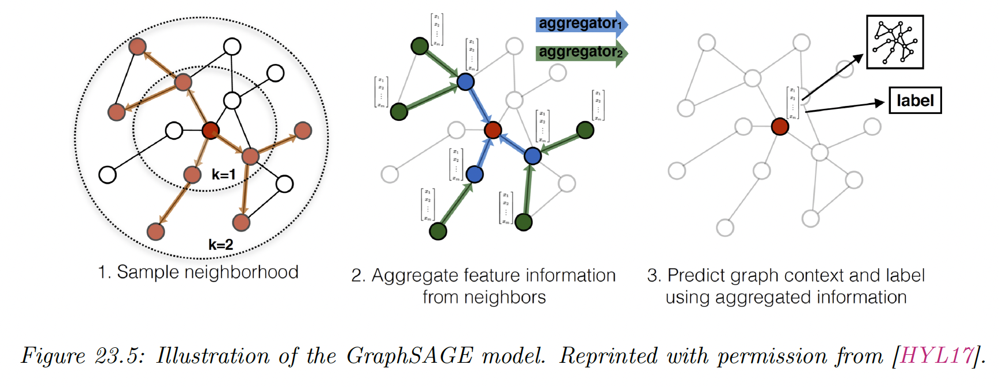
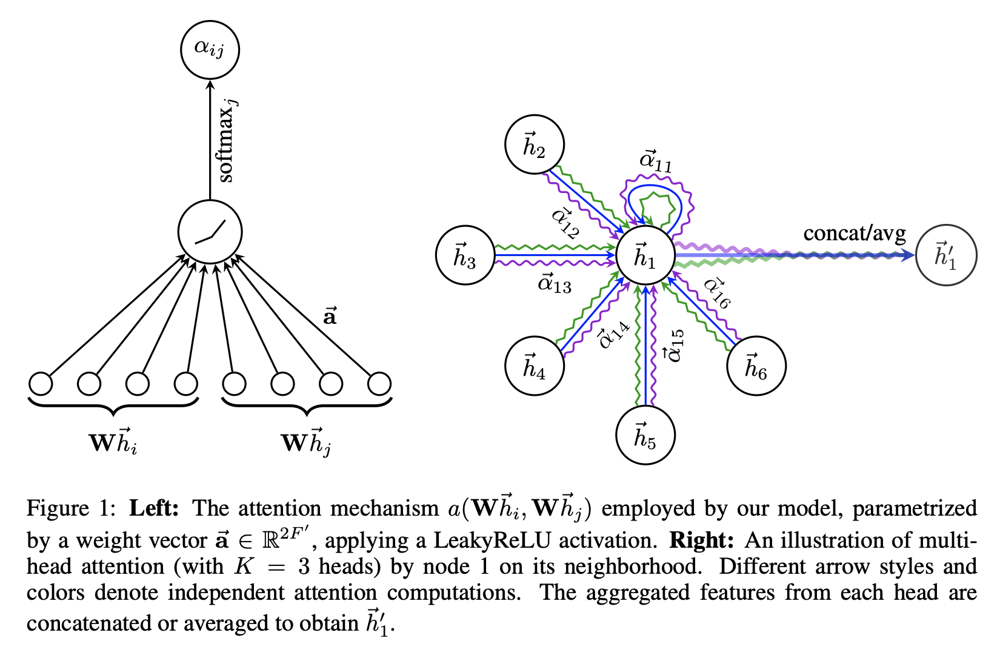
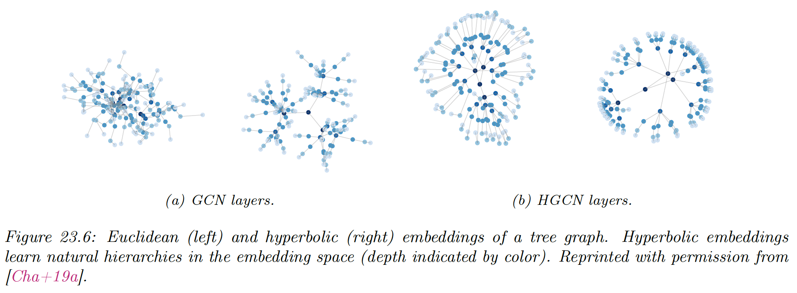

# 23.4 Graph Neural Networks

### 23.4.1 Message passing GNNs

The original **graph neural network (GNN)** was the first application of deep learning to graph-structured data. It views the supervised node embedding problem as an information diffusion mechanism, where nodes send information to their neighbors, until some state of equilibrium is reached.

Given randomly initialized nodes embedding $Z^0$, It applies the following recursion:

$$
Z^{t+1}=\mathrm{ENC}(W,X,Z^t;\Theta^E)
$$

where parameters $\Theta^E$ are reused at each iteration.

After convergence at $t=T$, the embeddings $Z^T$ are used to predict the final output such as node or graph labels:

$$
\hat{y}^S=\mathrm{DEC}(X,Z^T;\Theta^S)
$$

This process is repeated several time to learn $\Theta^E$ and $\Theta^S$ are learned via backpropagation using the Almeda-Pineda algorithm.

By Banach’s fixed point theorem, this is guaranteed to converge to a unique solution when the recursion provides a contraction mapping. We can express maps by using message passing networks.

$$
Z_i^{t+1}=\sum_{j:(v_i,v_j)\in E} f(X_i,X_j,Z_j^t;\Theta^E)
$$

where $f$ is a MLP constrained to be a contraction mapping. The decoder, however, has no specific constraints and can be any MLP.

**Gated Graph Sequence Neural Network (GGSNN)** removes the contraction mapping requirement for GNNs. It relaxes the $Z^{t+1}$ update equation by applying mapping functions for a fixed number of steps, where each mapping function is a gated recurrent unit (GRU) with shared parameters for each iteration.

This model outputs predictions at every steps, making it useful for sequential structures like temporal graphs.

Unlike GNNs that run for an indefinite number of iterations, **Message Passing Neural Network (MPNN)** have a fixed number of layers.

At every layer $\ell$, message functions $f^\ell$ receive messages (based on hidden states) from neighbors, which are then passed to an aggregation functions $h^\ell$:

$$
\begin{align}
\bold{m}_i^{\ell+1} &= \sum_{j:(v_i,v_j)\in E} f^\ell(H^\ell_i,H_j^\ell) \\
H^{\ell+1}_i &= h^\ell (H_i^\ell,\bold{m}_i^{\ell+1})
\end{align}
$$

where $H^0=X$.

After $\ell$  layers of message passing, nodes’ hidden representations encode information within $\ell-$hop neighborhoods.

**GraphNet** extends the MPNN framework to learn representations of the edges and graph as well using message passing function.

### 23.4.2 Spectral Graph Convolutions

Spectral methods define graph convolution using the spectral domain of the graph Laplacian matrix.

We distinguish two categories: spectrum-based methods (e.g. **Spectral CNNs**) and spectrum-free methods, which are motivated by spectral theory but do not actually perform spectral decomposition (e.g., **Graph convolutional network (GCN)**).

A major disadvantage of spectrum-based methods is that they rely on the spectrum of the graph Laplacian and can’t generalize to new graphs. Also, computing the Laplacian’s spectral decomposition is expensive.

Spectrum-free methods overcome these limitations by using approximation of these spectral filters, but they require using the whole graph $W$, which doesn’t scale well.

### 23.4.3 Spatial Graph Convolutions

Spatial graph convolutions takes inspiration from image convolutions, applying rectangular patches around pixels. The core idea is to use neighborhood sampling and attention mechanisms to create fixed-size graph patches.

#### 23.4.3.1 Sampling-based spatial methods

**GraphSAGE** has been proposed to overcome the dependency and storage limitations of GCNs and learn inductive node embeddings.

Instead of averaging signals from one-hop neighbors (via multiplications with the Laplacian matrix), SAGE samples neighborhoods (by fixing a sampling size $q$) for each node.

This removes the strong dependency on fixed graph structure and allows generalization to new graphs. At each layer, nodes aggregate information from nodes sampled from their neighborhood.

The propagation rule can be written:

$$
\begin{align}
\mathrm{Nbr}^\ell_i &= \{ H^\ell_{:,j}|v_j\in\mathrm{sample(Nbr}(v_i),q)\} \\
H^{\ell+1}_{:,i} &= \sigma(\Theta_1^\ell H_{:,i}^\ell + \Theta_2^\ell\mathrm{AGG(Nbr}^\ell_i))
\end{align}
$$

where the aggregation function $\mathrm{AGG}$ can be any permutation invariant function such as mean-averaging (SAGE-mean) or max-pooling (SAGE-pool).

Using fix sampling neighborhood size (and not the full adjacency matrix $W$) also help reduce the computational complexity of training GCNs.

#### 23.4.3.2 Attention-based spatial methods

Attention methods have been successfully used for language models, where they allow to identify relevant part of long sequence inputs.

Graph-based attention model learns to focus on important neighbor during the message passing step, via parametric patches learned on top of node features. This provides more flexibility for inductive settings, compared to methods relying only on mixed weights like GCNs.

**Graph Attention Network (GAT)** is an attention-based version of GCN, attending over the all the neighborhood of each node (rather than a fixed-size sample like SAGE uses) and defining the soft-weights:

$$
\alpha_{ij}=\frac{\exp \big(\mathrm{LeakyRELU}(\bold{a}^\top [W\bold{h}_i||W\bold{h}_j])\big)}{\sum_{k\in\mathcal{N}_i} \exp \big(\mathrm{LeakyRELU}(\bold{a}^\top [W\bold{h}_i||W\bold{h}_k])\big)}
$$

where $\bold{h}\in\R^F$ are node embeddings, $W\in \R^{F'\times F}$ is a share weight matrix, the attention mechanism is a single feedforward network parametrized by $\bold{a}\in \R^{2F'}$, and $\mathcal{N}_i$ is some neighborhoods of $i$.

We use the attention coefficients to compute a linear combination of the features corresponding to them, and use multi-head attention to stabilize the learning process of self-attention:

$$
\bold{h}'_i=\sigma \Big(\frac{1}{K}\sum_{k=1}^K\sum_{j \in \mathcal{N}_i}\alpha_{ij}^kW^k\bold{h}_j\Big)
$$

### 23.4.4 Non-Euclidean Graph Convolutions

Hyperbolic geometry enable us to learn shallow embeddings of hierarchical graphs, which have smaller distortion than Euclidean embeddings.

Shallow embeddings don’t generalize well on new graphs, so Graph Neural Networks has been extended to non-Euclidean embeddings.

One challenge in doing so revolve around the nature of convolution itself. How should we perform convolutions in a non-Euclidean space, when inner products and matrix multiplication are not defined?

**Hyperbolic Graph Convolution Network (HGCN)** applys graph convolutions in hyperbolic space by leveraging the Euclidean tangent space, which gives first order approximation of the hyperbolic manifold at a point.

For every graph convolution step, the embedding are mapping to the Euclidean space to perform convolution, then are mapped back to the hyperbolic space, yielding significant improvements for hierarchical graphs.

