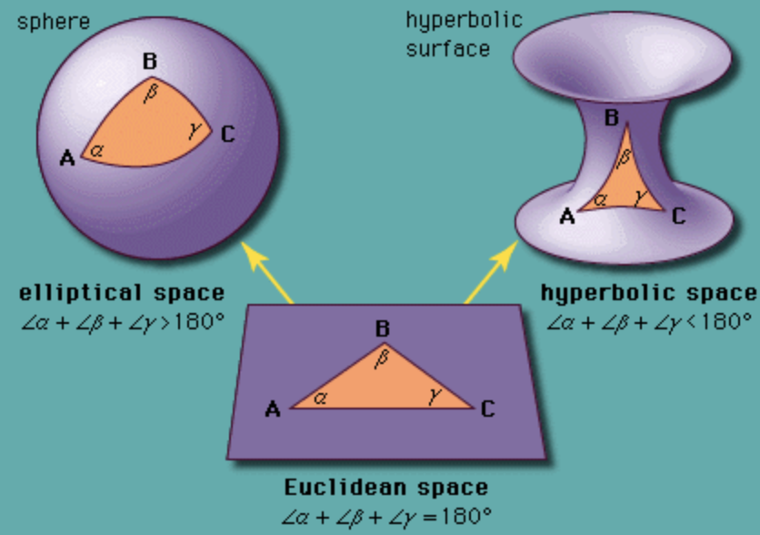

# 23.1 Introduction

We now study the semantic relationships between training samples $\{\bold{x}_n\}^{N}_{n=1}$. The relationships (aka edges) connect samples (aka nodes) with a similarity.

Graphs are the natural data structure for reasoning about this relationships, commonly applied in computational chemistry, social networks, semi-supervised learning, recommender systems and others.

Let $A\in\{0,1\}^{N\times N}$ be the adjacent matrix, where $N$ is the number of nodes, and let $W\in\R^{N\times N}$ be its weighted version. Some methods set $W=A$, while others set a transformation of $A$, like a row-wise normalization.

Finally, let $X\in\R^{N\times D}$ be the matrix of node features.

When designing and training a neural network model over graph data, we desire the model to be applicable to node with different connections and neighborhood structures.

This is in contrast with neural network designed for images, where each pixel has the same settings.

Operations, like Euclidean spatial convolution, can’t be applied on irregular graphs since this operation relies on geometric priors like shift invariance.

These challenges led to the development of **Geometric Deep Learning (GDL)** which aim at applying deep learning to non-Euclidean data. Among these techniques, **Graph Representation Learning (GRL)** methods aim at learning low-dimensional Euclidean representation (embeddings) for node and edges.

We divide GRL in two classes of problems: unsupervised and supervised GRL.

Unsupervised GRL learns embeddings by optimizing a metric which preserves the graph structure of the data.

Supervised GRL also learns embeddings but for a specific downstream task, like graph or node classification.

Further, the graph structure can be fixed during training and testing, called **transductive** learning setting, aiming at predicting properties (e.g. in a large social network), or alternatively, the model is expected to answer questions about graphs unseen during training, called **inductive** learning setting (e.g. classifying molecular structures).

Finally, there is also interest in learning **non-Euclidean representation learning**, which aim at learning non-Euclidean embedding spaces like hyperbolic or spherical spaces.

The main motivations is to use a continuous embedding space that is similar to the underlying discrete structure of the input data it tries to embed (e.g. the hyperbolic space is a continuous version of trees).