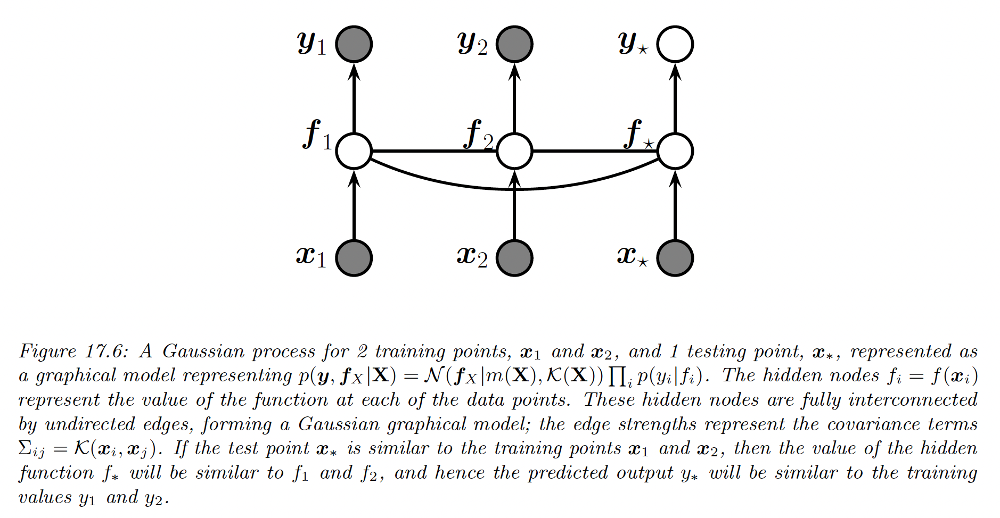
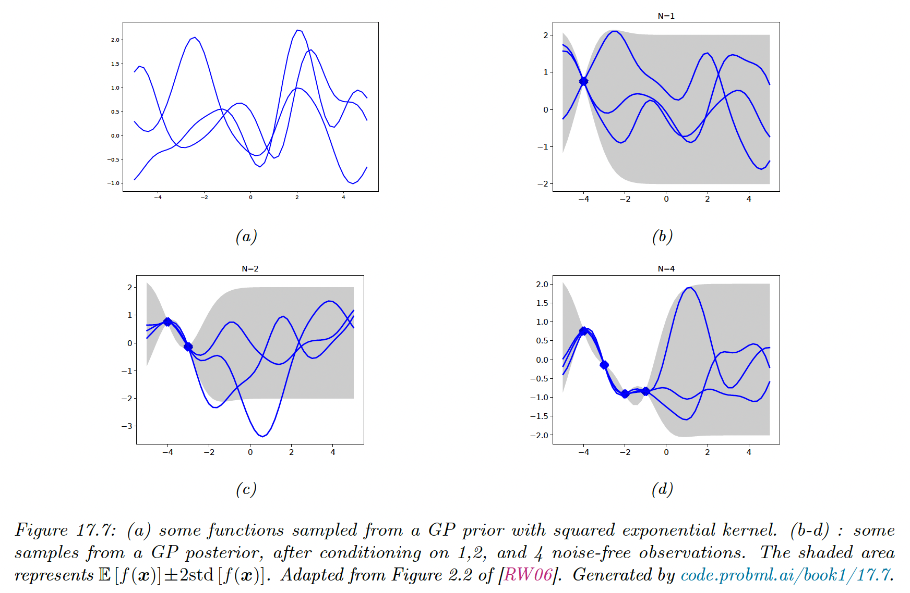
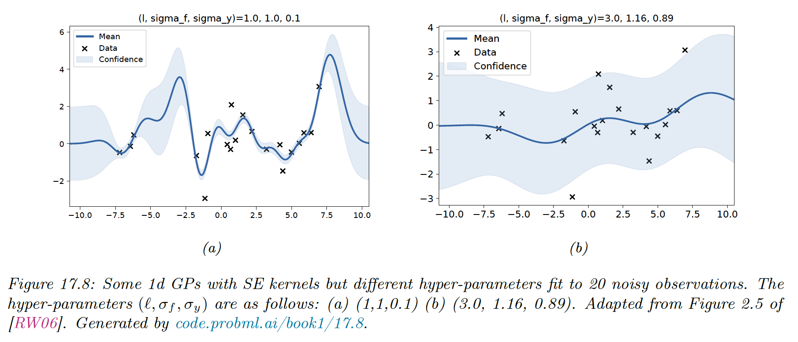
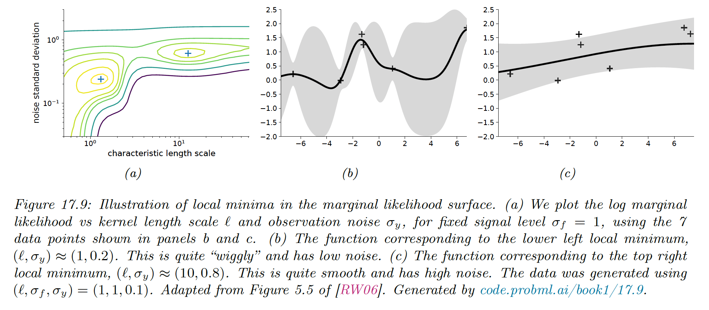
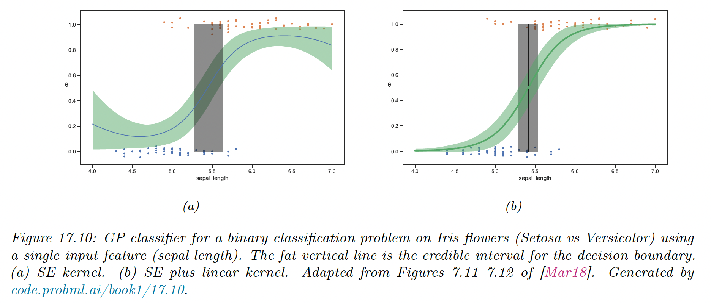

# 17.2 Gaussian processes

Gaussian processes is a way to define distributions over functions of the form $f:\mathcal{X}\rightarrow \R$, where $\mathcal{X}$ is any domain.

The key assumption is that the function values at a set of $M$ inputs, $[f(\bold{x}_1),\dots,f(\bold{x}_M)]$, is jointly Gaussian, with mean $\mu=[m(\bold{x}_1),\dots,m(\bold{x}_M)]$ and covariance $\Sigma_{ij}=\mathcal{K}(\bold{x}_i,\bold{x}_j)$, where $m$ is a mean function and $\mathcal{K}$ is a Mercer kernel.

This assumption holds when $M=N+1$, containing $N$ training points $\bold{x}_n$ and $1$ test point $\bold{x}_*$.

Thus, we can infer $f(\bold{x}_*)$ from knowledge of $f(\bold{x}_1),\dots,f(\bold{x}_n)$ by manipulating the joint Gaussian distribution $p(f(\bold{x}_1),\dots,f(\bold{x}_n),f(\bold{x}_*))$.

We can also extend this to work with noisy observations, such as in regression or classification problems.

### 17.2.1 Noise-free observations

Suppose we observe a training set $\mathcal{D}=\{(\bold{x}_n,y_n):n=1:N\}$, where $y_n=f(\bold{x}_n)$ is the noise-free function at $\bold{x}_n$.

We want the GP to act as an **interpolator** of the training data, i.e. returning the answer $f(\bold{x})$ with no uncertainty when it has already seen $\bold{x}$.

Let’s now consider a test set $X_*$ of size $N_*\times D$ (not in $\mathcal{D}$). We want to predict the function outputs $f_*=[f(\bold{x}_1),\dots,f(\bold{x}_{N_*})]$.

By definition of the GP, the joint distribution $p(f_X,f_*|X,X_*)$ has the form:

$$
\begin{bmatrix}
f_X \\
f_*
\end{bmatrix}=\mathcal{N}
\Bigg(
\begin{bmatrix}
\mu_X \\
\mu_*
\end{bmatrix},
\begin{bmatrix}
K_{X,X} & K_{X,*} \\
K_{X,*}^\top & K_{*,*}
\end{bmatrix}
\Bigg)
$$

where $\mu_X=[m(\bold{x}_1),\dots,m(\bold{x}_N)]$, $\mu_*=[m(\bold{x}_1^*),\dots,m(\bold{x}_N^*)]$, and $K_{X,X}=\mathcal{K}(X,X)$ is $N\times N$.

By the standard rule for conditioning Gaussians, the posterior distribution is:

$$
\begin{align}
p(f_*|X_*,\mathcal{D}) &=\mathcal{N}(f_*|\mu_*,\Sigma_*) \\
\mu_* &= m(X_*)+K_{X,*}^\top K_{X,X}^{-1}(f_X-m(\bold{X})) \\
\Sigma_* &= K_{*,*}-K_{X,*}^\top K_{X,X}^{-1}K_{X,*}
\end{align}
$$

We see the uncertainty increase as we move further away from the training points.

### 17.2.2 Noisy observations

Let’s now consider the case where we observe a noisy version of the underlying function:

$$
y_n=f(\bold{x}_n)+\epsilon_n
$$

where $\epsilon \sim \mathcal{N}(0,\sigma_y^2)$.

In this case, the model is not required to interpolate the training data, but it must come “close”.

The covariance of the noisy response is:

$$
\mathrm{Cov}[y_i,y_j]=\mathrm{Cov}[f_i,f_j]+\mathrm{Cov}[\epsilon_i,\epsilon_j]=\mathcal{K}(\bold{x}_i,\bold{x}_j)+\sigma^2_y \delta_{i,j}
$$

In other words:

$$
\mathrm{Cov}[y|X]=K_{X,X}+\sigma^2_yI_N\triangleq K_{\sigma}
$$

The density of the observed data and the latent, noise-free function on the test points is:

$$
\begin{bmatrix}
y\\
f_*
\end{bmatrix}=\mathcal{N}
\Bigg(
\begin{bmatrix}
\mu_X \\
\mu_*
\end{bmatrix},
\begin{bmatrix}
K_{\sigma} & K_{X,*} \\
K_{X,*}^\top & K_{*,*}
\end{bmatrix}
\Bigg)
$$

Hence the posterior predictive density at a set of points $X_*$ is:

$$
\begin{align}
p(f_*|X_*,\mathcal{D}) &=\mathcal{N}(f_*|\mu_*,\Sigma_*) \\
\mu_{*|X} &= \mu_*+K_{X,*}^\top K_{\sigma}^{-1}(y-\mu_X)) \\
\Sigma_{*|X} &= K_{*,*}-K_{X,*}^\top K_{\sigma}^{-1}K_{X,*}
\end{align}
$$

In the case of a single test point $\bold{x}_*$, this simplifies as follow:

$$
\begin{align}
\mu_{*|X}&=m(\bold{x}_*)+k_{X,*}^\top K_\sigma^{-1}(y-\mu_X) \\
\Sigma_{*|X}&=k_{*,*}-k^\top_{X,*}K_\sigma^{-1}k_{X,*}
\end{align}
$$

where $k_{*,*}=\mathcal{K}(\bold{x}_*,\bold{x}_*)$ and $k_{X,*}=[\mathcal{K}(\bold{x}_1,\bold{x}_*),\dots,\mathcal{K}(\bold{x}_N,\bold{x}_*)]$.

If the mean function is zero, we can write the posterior mean as:

$$
\mu_{*|X}=k_{X,*}^\top (K_{\sigma}^{-1}y)\triangleq k_{X,*}^\top \alpha=\sum_{n=1}^N \mathcal{K}(\bold{x}_n,\bold{x_*})\alpha_n
$$

This is identical to the predictions from kernel ridge regression.

### 17.2.3 Comparison to kernel regression

In section 16.3.5 we discussed kernel regression, which is a generative approach to regression in which we approximate $p(y,\bold{x})$ using a density kernel estimation.

$$
\begin{align}
\mathbb{E}[y|\bold{x},\mathcal{D}]&=\sum_{n=1}^N y_n w_n(\bold{x}) \\
w_n(\bold{x})&=\frac{\mathcal{K}_h(\bold{x}-\bold{x}_n)}{\sum_{{n'}=1}^N \mathcal{K}_h(\bold{x}-\bold{x}_{n'})}
\end{align}
$$

This is very similar to our previous posterior mean $\mu_{*|X}$, we few important differences:

1. In a GP, we use Mercer kernel instead of density kernel. Mercer kernels can be defined on objects such as string or graphs, which is harder to do for density kernels.
2. GP is an interpolator (when $\sigma^2_y =0$) , so $\mathbb{E}[y|\bold{x}_n,\mathcal{D}]=y_n$. By contrast, kernel regression is not an interpolator..
3. GP is a Bayesian model, meaning we can estimate hyperparameters of the kernel by maximizing the marginal likelihood. By contrast, in kernel regression we must use cross-validation to estimate the kernel parameters, such as bandwidth.
4. Computing the weights in kernel regression takes $O(N)$ times, whereas computing the weigths $\alpha_n$ for GP regression takes $O(N^3)$ time (although there are approximations that can reduce it to $MN^2)$

Also note that Bayesian linear regression is a special case of a GP. The former works in weight space whereas the latter works in function space.

### 17.2.5 Numerical issues

For notational simplicity, we assume the prior mean is zero, $m(\bold{x})=0$.

The posterior mean is $y_*=k_{X,*}^\top (K_\sigma^{-1}y)$. For reason of computation stability, it is unwise to compute directly $K_{\sigma}^{-1}$.

Instead we can use a Cholesky decomposition $K_\sigma=LL^\top$ which takes $O(N^3)$ time. We then compute $\alpha =L^\top \setminus (L \setminus y)$, where we have used the backlash operator to represent back-substitution.

Given this, we can compute the posterior mean for each test case in $O(N)$ time using:

$$
y_*=k_{*,X}^\top L^{-\top}(L^{-1}y)=k_{X,*}^\top \alpha
$$

We can also compute the variance using:

$$
\sigma^2_*=k_{*,*}-k_{*,X}^\top L^{-\top} L^{-1}k_{*,X}=k_{*,*}-v^\top v
$$

where $v=L \setminus k_{*,X}$

Finally, the log marginal likelihood can be computed as:

$$
\log p(y|\bold{X})=-\frac{1}{2}y^\top\alpha-\sum_{n=1}^N \log L_{nn}-\frac{N}{2}\log(2\pi)
$$

### 17.2.6 Estimating the kernel

Most models have some free parameters that can play a great role on the predictions.

Let assume we perform a 1d regression using GP with a RBF kernel:

$$
\mathcal{K}(x_i,x_j)=\sigma_f^2\exp\Big(-\frac{(x_i-x_j)^2}{2\ell^2}\Big)
$$

$\ell$ is the horizontal scale over which the function changes, $\sigma^2_f$ control the vertical scale. We assume observation noise with variance $\sigma_y^2$.

We sampled 20 points from an MVN with covariance given by $\Sigma=\mathcal{K}(x_i,x_j)$ for a grid of points $\{x_i\}$, and added observation noise of value $\sigma_y.$

We then fit these points using a GP with the same kernel, but with a range of hyperparameters.

When changing $\ell$ from 1 to 3, the function goes from a good fit to very smooth.

**17.2.6.1 Empirical Bayes**

To estimate the kernel parameters $\theta$ (aka hyperparameters), we could use exhaustive grid search with the validation loss as an objective, but this can be slow (this is the approach used by nonprobabilistic methods such as SVMs).

We consider here the empirical Bayes approach, which use gradient-based approach, which are faster. We maximize the marginal likelihood (and not likelihood, because we marginalized out the latent Gaussian vector $f$):

$$
p(\bold{y}|X,\theta)=\int p(\bold{y}|f,X)p(f|X,\theta)df
$$

Assuming the mean is 0, we have:

$$
\begin{align}
p(f|X,\theta) &=\mathcal{N}(f|0,K) \\
p(\bold{y}|f,X) &=\prod_{n=1}^N\mathcal{N}(y_n|f_n, \sigma^2_y)
\end{align}
$$

So the marginal likelihood is:

$$
\log p(\bold{y}|X,\theta)= \log \mathcal{N}(\bold{y}|0,K_\sigma)= -\frac{1}{2}\bold{y}^\top K_\sigma^{-1} \bold{y}-\frac{1}{2}\log |K_\sigma|-\frac{N}{2}\log(2\pi )
$$

with the dependence of $K_\sigma=K_{X,X}+\sigma^2_yI_N$  on $\theta$ implicit.

The first term is a data fit term, the second is a model complexity term (the third is just a constant).

If the length scale $\ell$ is small, the fit will be rather good so $\bold{y}^\top K_\sigma^{-1}\bold{y}$ will be small. However, $K$ will be almost diagonal since most points will not be considered “near” any others, so $\log |K_\sigma|$ will be large.

We now maximize the marginal likelihood:

$$
\begin{align}
\frac{\partial}{\partial \theta_j}\log (\bold{y}|X,\theta)&=-\frac{1}{2}\bold{y}^\top K_\sigma^{-1}\frac{\partial K_\sigma}{\partial \theta_j} K_\sigma^{-1} \bold{y}-\frac{1}{2}\mathrm{tr}(K_\sigma^{-1}\frac{\partial K_\sigma}{\partial \theta_j}) \\
&= \frac{1}{2}\mathrm{tr}\Bigg((\alpha \alpha^\top -K_\sigma^{-1})\frac{\partial K_\sigma}{\partial \theta_j}\Bigg)
\end{align}
$$

where $\alpha=\bold{y}^\top K_\sigma^{-1}$

 It takes $O(N^3)$ time to compute $K_\sigma^{-1}$, and then $O(N^2)$ time per hyperparameter to compute the gradient.

The form of $\frac{\partial K_\sigma}{\partial \theta_j}$ depends on the form of the kernel, and which parameters we are taking derivatives with respect to. We often have constraints on the HP such as $\sigma^2_y\geq0$. In this case, we can define $\theta=\log(\sigma^2_y)$ and then use the chain rule.

Given an expression for the log marginal likelihood and its derivative, we can estimate the kernel parameters with any gradient-based optimizer. However, since the objective is not convex, local minima can be a problem so we need multiple restart.

Notice that when the noise is high (around $\sigma_y^2=1$), the marginal likelihood is insensitive to the length scale. Similarly, when the length scale is very short $\ell=0.5$, the kernel interpolates exactly the data.

**17.2.6.2 Bayesian inference**

When we have a small number of data points (e.g. using GP for Bayesian optimization) using a point estimate of the kernel parameters can give poor results.

Instead, we can approximate the posterior distribution over the parameters, using slice sampling, Hamiltonian Monte Carlo or sequential Monte Carlo.

### 17.2.7 GPs for classification

So far, we have used GPs for regression, which uses Gaussian likelihood. In this case, the posterior is also a GP and all the computation can be performed analytically.

However, if the likelihood is non Gaussian, such as the Bernoulli likelihood for binary classification, we can no longer compute the posterior exactly.

There are various approximation we can make, and we use there the Hamiltonian Monte Carlo method, both for the latent Gaussian $f$ and the kernel parameters $\theta$.

We specify the negative log joint:

$$
\begin{align}
-\mathcal{E}(f,\theta)&=\log p(f,\theta|X,\bold{y})\\
&=\log \mathcal{N}(f|0,K_{X,X})+\sum_{n=1}^N \log \mathrm{Ber}(y_n|f_n(\bold{x}_n))+\log(\theta)
\end{align}
$$

We then use autograd to compute $\nabla_f\mathcal{E}(f,\theta)$ and $\nabla_\theta\mathcal{E}(f,\theta)$, and use these gradients as input to a Gaussian proposal distribution.

We consider a 1d example of binary classification:

The SE kernel curves probability toward 0.5 on the edges, because the prior mean function has $m(x)=0$ and $\sigma(0)=0.5$.

We can eliminate this artifact by using a more flexible kernel that encodes the knowledge that the probability is monotonically increasing or decreasing. We can use a **linear kernel**, scale it and add it to the SE kernel:

$$
\mathcal{K}(x,x')=\tau(x-c)(x'-c')+\exp\Big[-\frac{(x-x')^2}{2\ell^2}\Big]
$$

### 17.2.9 Scaling DPs to large datasets

The main issue with GPs (and kernel methods such as SVM) is that it requires inverting the $N\times N$ kernel matrix, which takes $O(N^3)$ times, making the method too slow for big datasets.

We review some speed-up techniques.

**17.2.9.1 Sparse (inducing-point) approximations**

A simple approach to speeding up GPs is to use less data. A better approach is to summarize the $N$ training points into $M\ll N$ **inducing points** or **pseudo inputs $Z$.**

This lets us replace $p(f|f_X)$ with $p(f|f_Z)$ where $f_X=\{f(\bold{x}):\bold{x}\in X\}$ is the vector of observed function values at training points.

By estimating $(Z,f_z)$ we can learn to compress the training data and speed up the computation to $O(M^3)$. This is called a **sparse GP**. This whole process can be performed using the framework of variational inference.

**17.2.9.2 Exploiting parallelization and kernel matrix structure**

It takes $O(N^3)$ to compute the Cholesky decomposition of $K_{X,X}$, which is needed to solve the linear system $K_\sigma \alpha=\bold{y}$ and compute $|K_{X,X}|$.

An alternative is to use linear algebra methods, often called **Krylov subspace methods**, which are based on matrix vector multiplication (MVM). These approaches are usually faster because they exploit structure in $K$.

Moreover, even if the Kernel matrix doesn’t have a special structure, matrix multiplication can easily be parallelized over GPUs, unlike Cholesky based methods which are sequential.

This is the basis of the **GPyTorch** package.

**17.2.9.3 Random feature approximation**

We can approximate the feature map for many shift invariant kernels using a randomly chosen finite set of $M$ basis functions, thus reducing the cost to $O(NM+M^3)$.

*i) Random features for RBF kernel*

For Gaussian RBF kernel, one can show that:

$$
\mathcal{K}(\bold{x,x'})\approx\phi(\bold{x'})^\top\phi(\bold{x'})
$$

 where the features vector are:

$$
\begin{align}
\phi(\bold{x})&=\frac{1}{\sqrt{T}}[\sin(\bold{\omega}_1^\top \bold{x}),\dots,\sin(\bold{\omega}_T^\top \bold{x}),\cos(\bold{\omega}_1^\top \bold{x}),\dots,\cos(\bold{\omega}_T^\top \bold{x})] \\
&= \frac{1}{\sqrt{T}}[\sin(\Omega \bold{x}),\cos(\Omega \bold{x})]
\end{align}
$$

where $T=M/2$ and $\Omega\in \R^{T\times D}$ is a random Gaussian matrix, where the entries are sampled iid from $\mathcal{N}(0,1/\sigma^2)$ where $\sigma$ is the kernel bandwidth.

The bias of the approximation decreases as $M$ increases. In practice, we compute a single sample Monte Carlo approximation to the expectation by drawing a single random matrix.

The features in the equation above are called **random Fourier features (RFF)**.

We can also use positive random features instead of trigonometric random features, which can be preferable for some applications, like models using attention. We can use:

$$
\phi(\bold{x})\triangleq \frac{1}{\sqrt{M}}e^{-||\bold{x}||^2/2}[\exp(\omega_1^\top\bold{x}),\dots,\exp(\omega_M^\top\bold{x})]
$$

Regardless of the choice of the features, we can obtain a lower variance estimate by ensuring the rows of $Z$ are random but orthogonal. These are called **orthogonal random features**.

Such sampling can be conducted efficiently via Gram-Schmidt orthogonalization of the unstructured Gaussian matrices.

*ii) Fastfood approximation*

Storing the random matrix $\Omega$ takes $O(MD)$ space and computing $\Omega \bold{x}$ takes $O(MD)$ time, where $D$ is the input dimensionality and $M$ is the number of random features.

This can become prohibitive when $M\gg D$, which it may needs to get any benefits over using the original set of features.

Fortunately, we can use the **fast Hadamard transform** to reduce the memory to $O(M)$ and reduce the time to $O(M\log D)$. This approach has been called **fastfood** as reference to the original term “kitchen sinks”.

*iii) Extreme learning machines*

We can use the random features approximation to the kernel to convert a GP into a linear model of the form:

$$
f(\bold{x},\theta)=W\phi(\bold{x})=Wh(Z\bold{x})
$$

where $h(a)=\sqrt{1/M}[\sin(a),\cos(a)]$ for RBF kernels. This is equivalent to a MLP with fixed and random input-to-hidden weights.

When $M>N$, this corresponds to an over-parametrized model which can perfectly interpolate the training data.

Alternatively, we can use $M<N$, but stack many nonlinear random layers together and just optimize the output weights. This has been called an **extreme learning machine (ELM)**.