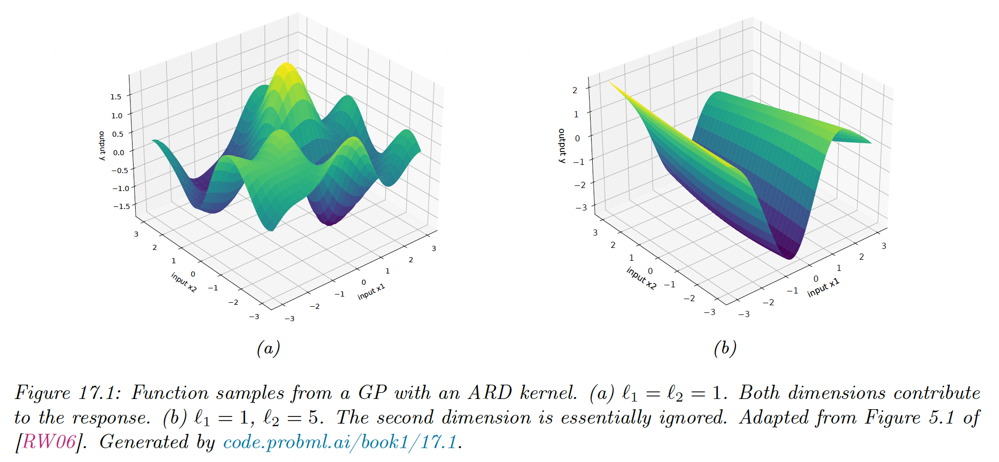
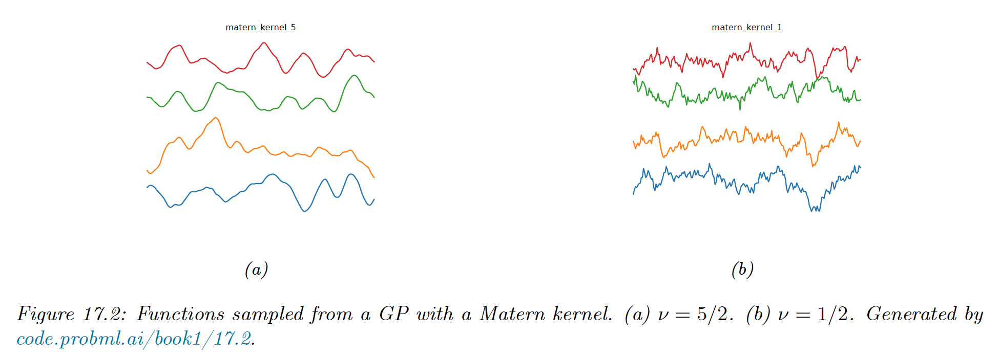
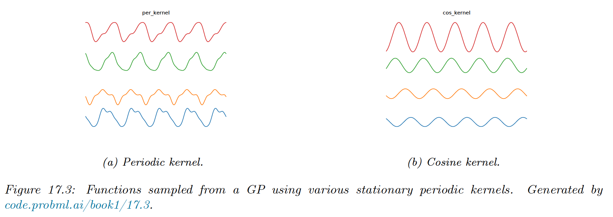
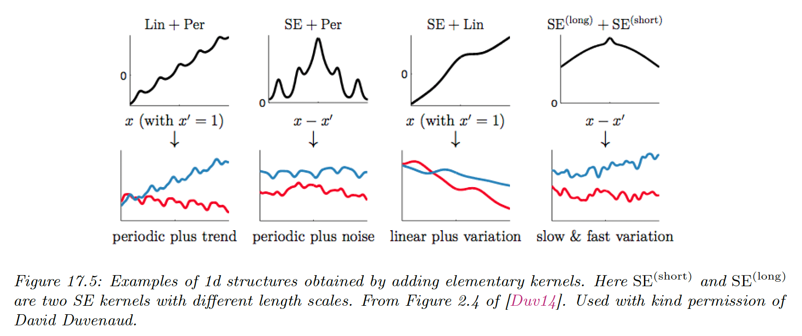

# 17.1 Mercer Kernels

A Mercer kernel or **positive definite kernel** is a symmetric function $\mathcal{K}:\mathcal{X}\times \mathcal{X} \rightarrow \R_+$

Given a set of $N$ data points, we define the **Gram matrix** as the following $N\times N$  similarity matrix:

$$
K=
\begin{bmatrix}
\mathcal{K}(\bold{x}_1 ,\bold{x}_1)&\dots&\mathcal{K}(\bold{x}_1,\bold{x}_n) \\
\vdots & \ddots & \vdots \\
\mathcal{K}(\bold{x}_n ,\bold{x}_1) & \dots & \mathcal{K}(\bold{x}_n,\bold{x}_n)
\end{bmatrix}
$$

$\mathcal{K}$ is a Mercer kernel iff the Gram matrix is positive definite for any set of distinct input $\{x_n\}_{n=1}^N$

The most widely used kernel is the **RBF kernel**:

$$
\mathcal{K}(\bold{x},\bold{x}')=\exp\Big(-\frac{||\bold{x-x'}||^2}{2\ell^2}\Big)
$$

Here $\ell$  corresponds is the **bandwidth** parameter i.e. the distance over which we expect differences to matter.

The RBF measures similarity between two vectors in $\R^D$ using scaled Euclidean distance.

### 17.1.1 Mercer’s theorem

Any positive definite matrix $K$ can be represented using an eigendecomposition of the form $K=U^\top \Lambda U$ where $\Lambda$ is the diagonal matrix of eigenvalues $\lambda_i >0$ and $U$ is a matrix containing the eigenvectors.

Now consider the element $(i,j)$ of $K$:

$$
k_{ij}=(\Lambda^{\frac{1}{2}}U_{:i})^\top(\Lambda^{\frac{1}{2}}U_{:j})
$$

where $U_{:i}$ is the $i$th column of $U$.

If we define $\phi(\bold{x}_i)=\Lambda^\frac{1}{2} U_{:i}$ we can write:

$$
k_{ij}=\phi(\bold{x}_i)^\top \phi(\bold{x}_j)=\sum_m \phi_m(\bold{x}_i)^\top \phi_m(\bold{x}_j)
$$

The entries of the kernel matrix can be computed by performing an inner product of some feature vectors that are implicitly defined by the eigenvectors of the kernel matrix.

This idea can be generalized to apply to kernel function, not just kernel matrices. For example, consider the quadratic kernel $\mathcal{K}(\bold{x},\bold{x'})=\lang \bold{x},\bold{x}'\rang^2$. In 2d, we have:

$$
\mathcal{K}(\bold{x},\bold{x}')=(x_1x_1'+x_2x_2')^2=x_1^2(x_1')^2+2 x_1x_1'x_2x_2'+x_2^2(x_2')^2
$$

We can write this:

$$
\mathcal{K}(\bold{x},\bold{x}')=\phi(\bold{x})^\top \phi(\bold{x}')
$$

where $\phi(\bold{x})=[x_1^2,\sqrt{2}x_1x_2,x_2^2]\in \R^3$.

So, we embedded the 2d input $\bold{x}$ into a 3d feature space $\phi(\bold{x})$.

The feature representation of the RBF kernel is infinite dimensional. However, by working with kernel functions, we can avoid having to deal with infinite dimensional vectors.

### 17.1.2 Popular Mercer kernels

**17.1.2.1 Stationary kernels for real-valued vectors**

For real-valued inputs, $\mathcal{X}=\R^D$, it is common to use **stationary kernels**, of the form:

$$
\mathcal{K}(\bold{x},\bold{x}')=\mathcal{K}(||\bold{x}-\bold{x}'||)
$$

The value of the output only depends on the distance between the inputs. The RBF kernel is a stationary kernel. We give some examples below.

**ARD Kernel**

We can generalize the RBF kernel by replacing the Euclidean distance with the Mahalanobis distance:

$$
\mathcal{K}(\bold{r})=\sigma^2\exp\Big(-\frac{1}{2}\bold{r}^\top \Sigma^{-1} \bold{r}\Big)
$$

where $\bold{r=x-x'}$.

If $\Sigma$  is diagonal, this can be written:

$$
\mathcal{K}(\bold{r};\ell,\sigma^2)=\sigma^2\exp\Big(-\frac{1}{2}\sum_{d=1}^D \frac{r_d^2}{\ell_d^2} \Big)=\prod_{d=1}^D \mathcal{K}(r_d,\ell_d,\sigma^{2/d})
$$

where:

$$
\mathcal{K}(r,\ell,\tau^2)=\tau^2\exp\Big(-\frac{1}{2}\frac{r^2}{\ell^2}\Big)
$$

We can interpret $\sigma^2$ as the total variance and $\ell_d$ as defining the characteristic length scale of dimension $d$. If $d$ is an irrelevant input dimension, we can set $\ell_d=\infin$, so the corresponding dimension will be ignore.

This is known as **automatic relevancy determination (ARD)**, hence this kernel is called ARD kernel.

**Matern kernels**

The SE kernel yields functions that are infinitely differentiable, and therefore very smooth. For many applications, it is better to use the **Matern kernel** which yields rougher functions.

This allow to model small “wiggles” without having to make the overall length scale very small.

The Matern kernel has the following form:

$$
\mathcal{K}(r;v,\ell)=\frac{2^{1-\nu}}{\Gamma(\nu)}\Big(\frac{\sqrt{2}\nu r}{\ell}\Big)^\nu K_\nu\Big(\frac{\sqrt{2}\nu r}{\ell}\Big)
$$

where $K_v$ is a modified Bessel function and $\ell$  the length scale.

Functions sample from this GP are $k$-times differentiable, where $\nu>k$. As $\nu\rightarrow \infin$, this approaches the SE kernel.

For value $\nu =\frac{1}{2}$, the function simplifies as follow:

$$
\mathcal{K}(r;\frac{1}{2},\ell)=\exp(-\frac{r}{\ell})
$$

This corresponds to the **Ornstein-Uhlenbeck process** which describe the velocity of a particle undergoing Brownian motion. The corresponding function is continuous but very jagged.

**Periodic kernels**

The periodic kernel capture repeating structure, and has the form:

$$
\mathcal{K}_{\mathrm{per}}(r;\ell,p)=\exp\Big(-\frac{2}{\ell^2}\sin^2(\pi\frac{r}{p})\Big)
$$

where $p$ is the period.

This is related to the cosine kernel:

$$
\mathcal{K}(r;p)=\cos\Big(2\pi \frac{r}{p}\Big)
$$

**17.1.2.2 Making new kernels from old**

Given a valid kernel $\mathcal{K}_1(\bold{x,x}')$, we can create new kernel using any of the following methods:

$\mathcal{K}(\bold{x,x}')=c \mathcal{K}_1(\bold{x,x}'),\; c\in\R$

$\mathcal{K}(\bold{x,x}')= f(\bold{x})\mathcal{K}_1(\bold{x,x}')f(\bold{x})$, for any function $f$

$\mathcal{K}(\bold{x,x}')= q(\mathcal{K}_1(\bold{x,x}'))$, for any function polynomial $q$ with nonneg coef

$\mathcal{K}(\bold{x,x}')=\exp(\mathcal{K}_1(\bold{x,x}'))$

$\mathcal{K}(\bold{x,x}')=\bold{x}^\top A \bold{x}$, for any psd matrix $A$

For example, suppose we start with the linear kernel $\mathcal{K}(\bold{x,x}')=\bold{x}^\top \bold{x}'$.

We know this is a valid Mercer kernel since the Gram matrix is the (scaled) covariance matrix of the data.

From the above rules we see that the polynomial kernel $\mathcal{K}(\bold{x,x}')=(\bold{x}^\top\bold{x})^M$ is also a valid kernel, and contains all monomial of order $M$

We can also infer that the Gaussian kernel is a valid kernel. We can see this by noting:

$$
||\bold{x-x}'||^2=\bold{x}^\top \bold{x}+\bold{x}'^\top \bold{x}'-2\bold{x}^\top \bold{x}'
$$

Hence:

$$
\begin{align}
\mathcal{K}(\bold{x,x}')&=\exp(-||\bold{x-x}'||^2/2\sigma^2)\\
&=\exp(-\bold{x}^\top\bold{x}/2\sigma^2)\exp(\bold{x}^\top\bold{x}'/\sigma^2)\exp(-\bold{x}'^\top\bold{x}'/2\sigma^2)
\end{align}
$$

We scale by a constant, then use the exponential, then symmetrically multiply by functions of $\bold{x}$ and $\bold{x}'$.

**17.1.2.3 Combining kernels by addition and multiplication**

We can also combine kernels using addition or multiplication:

$\mathcal{K}(\bold{x,x}')=\mathcal{K}_1(\bold{x,x}')+\mathcal{K}_2(\bold{x,x}')$

$\mathcal{K}(\bold{x,x}')=\mathcal{K}_1(\bold{x,x}')\times \mathcal{K}_2(\bold{x,x}')$

Adding (resp. multiplying) positive-definite kernels together always result in another positive definite kernel. This is a way to get a disjunction (resp. conjunction) of the individual properties of each kernel.

**17.1.2.4 Kernels for structured inputs**

Kernels are particularly useful for structured inputs, since it’s often hard to “featurize” variable-size inputs.

We can define a string kernel by comparing strings in terms of the number of ngrams they have in common.

We can also define kernel on graph. For example **random walk kernel** perform random walk simultaneously on two graphs and count the number of paths in common.