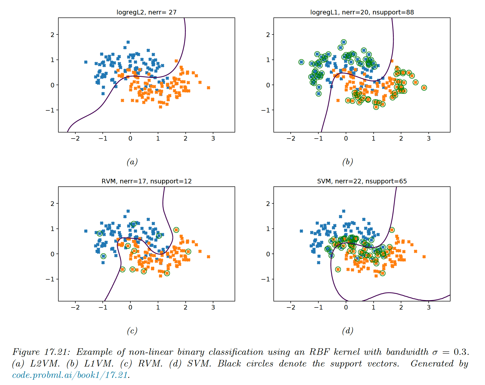
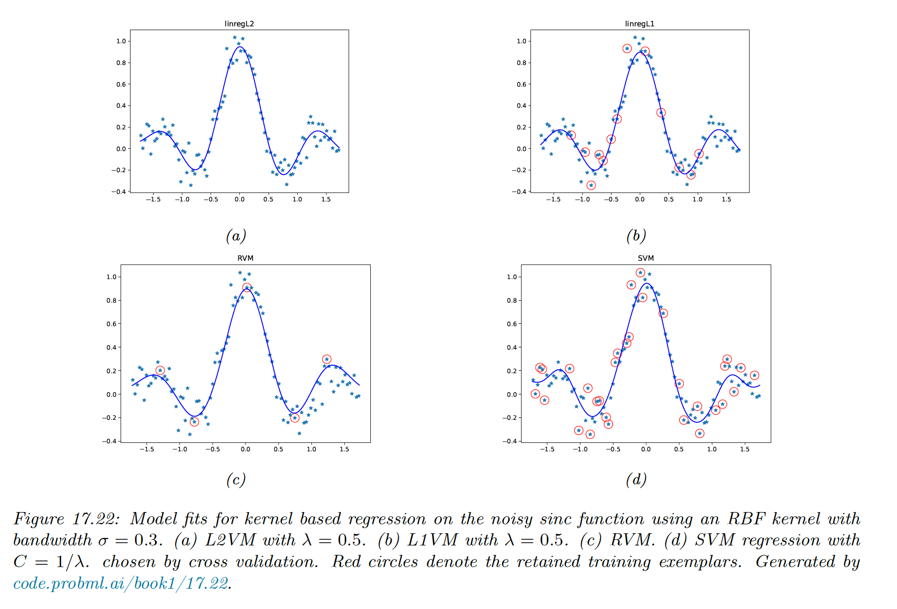
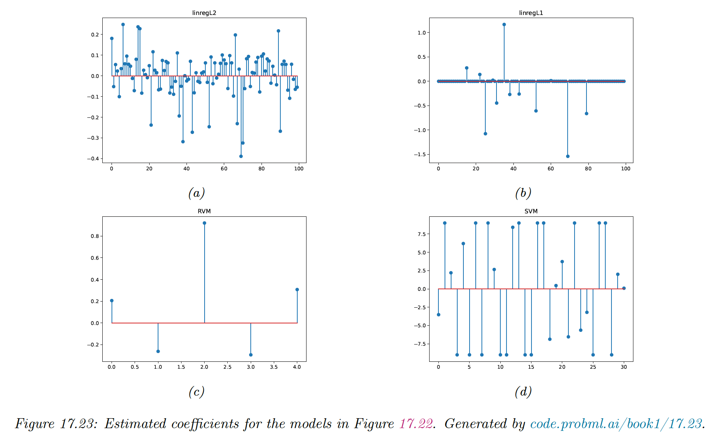

# 17.4 Sparse vector machines

GPs are flexible models but incur a $O(N)$ time for prediction, which can be prohibitive. SVMs solve that problem by estimating a sparse weight vector. SVMs, however, don’t give calibrated probabilistic outputs.

We can get the best of both world by using parametric models, where the feature vector is defined by using basis functions centered on each of the training point:

$$
\phi(\bold{x})=[\mathcal{K}(\bold{x}_1,\bold{x}),\dots,\mathcal{K}(\bold{x}_N,\bold{x})]
$$

where $\mathcal{K}$ is any similarity kernel, not necessarily a Mercer kernel.

We can plug this feature vector in any discriminative model, such as logistic regression.

Since we have $D=N$  features, we need some regularization to prevent overfitting. If we fit such model with $\ell_2$ regularization, we get L2VM. The results will have good performances but the weight vector $\bold{w}$ will be dense and depends on $N$ training points.

A natural solution is to impose a sparsity-promoting prior on $\bold{w}$, so that we drop some examples. We call such methods **sparse vector machine**.

### 17.4.1 Relevance vector machine (RVM)

The simplest way to ensure $\bold{w}$ is sparse is to use $\ell_1$  regularization. We call this L1VM or Laplace VM since this approach is equivalent to using MAP estimation with Laplace prior for $\bold{w}$.

However, sometimes $\ell_1$ regularization doesn’t yield sufficient sparsity for a given level of accuracy. An alternative approach is **automatic relevancy determination (ARD)** which uses type II MLE (aka empirical Bayes) to estimate a sparse weight vector.

If we apply this technique to a feature vector defined in terms of kernel $\phi(\bold{x})$, we get a method called **relevance VM (RVM)**.

### 17.4.2 Comparison of sparse and dense kernel methods

Below, we compare L2VM, L1VM, RVM and SVM using RBF kernel for 2d binary classification.

We cross-validate the SVM to pick $C=1/\lambda$ and use the same value to regularize the other models.

We see that all models give similar predictive performances, but the RVM is the sparsest so it will be the fastest at run time.

We then compare L2VM, L1VM, RVM and SVM using an RBF kernel on 1d regression problem. We see again that RVM is the sparsest, then L1VM, then SVM.

We can also observe the sparse coefficients:

We provide a more general summary of the different methods:

