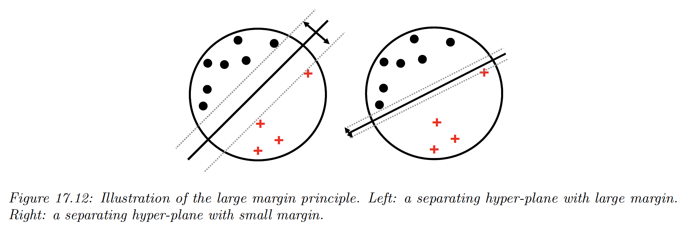
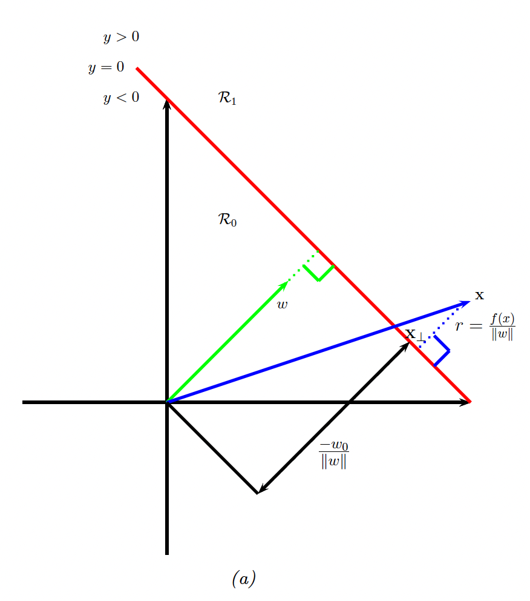
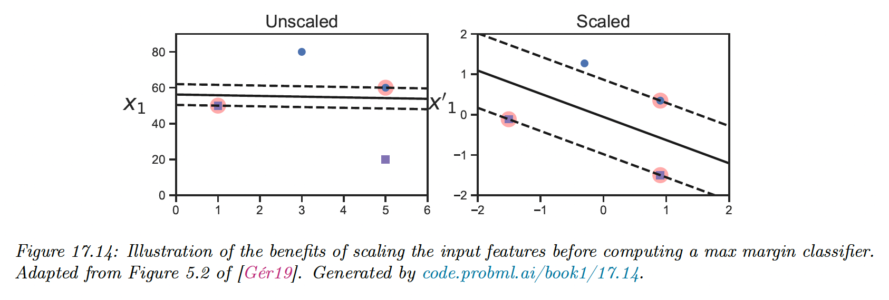
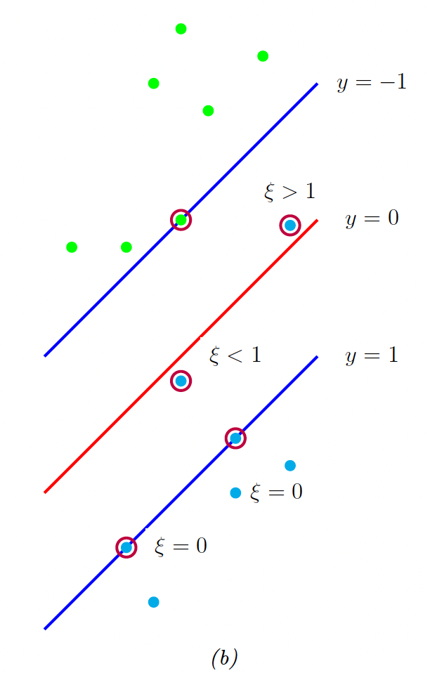
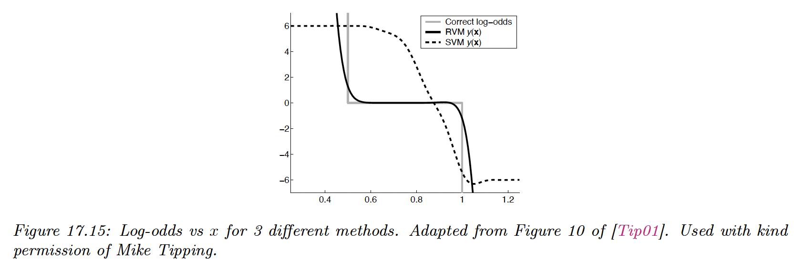
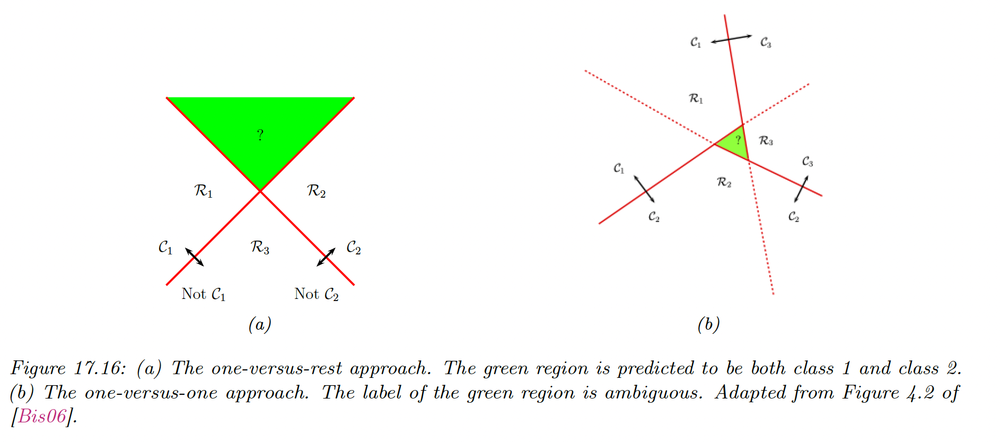
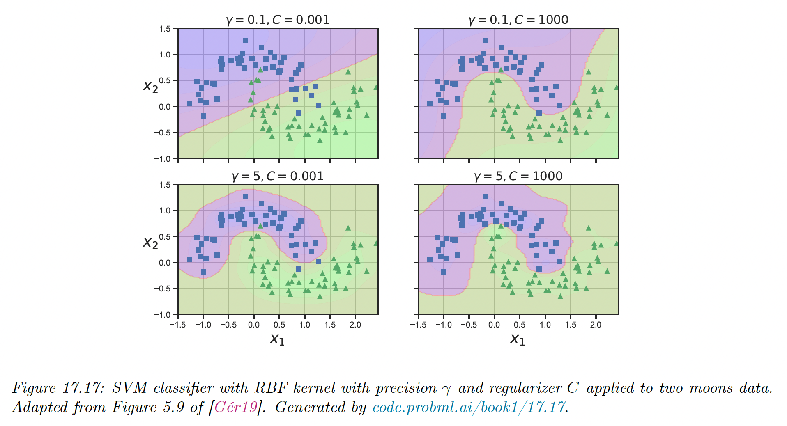
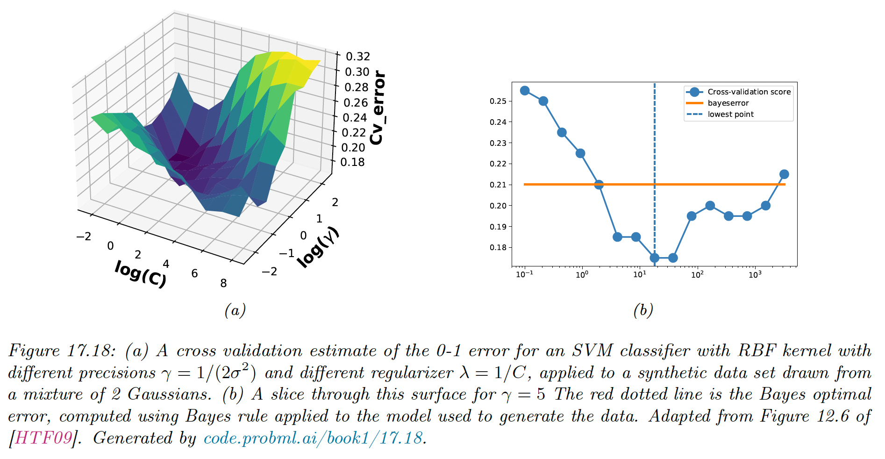
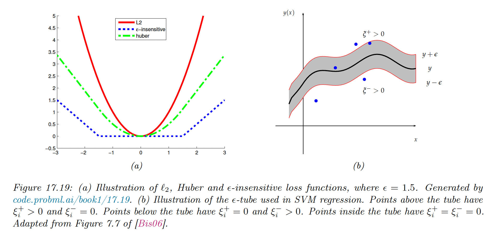
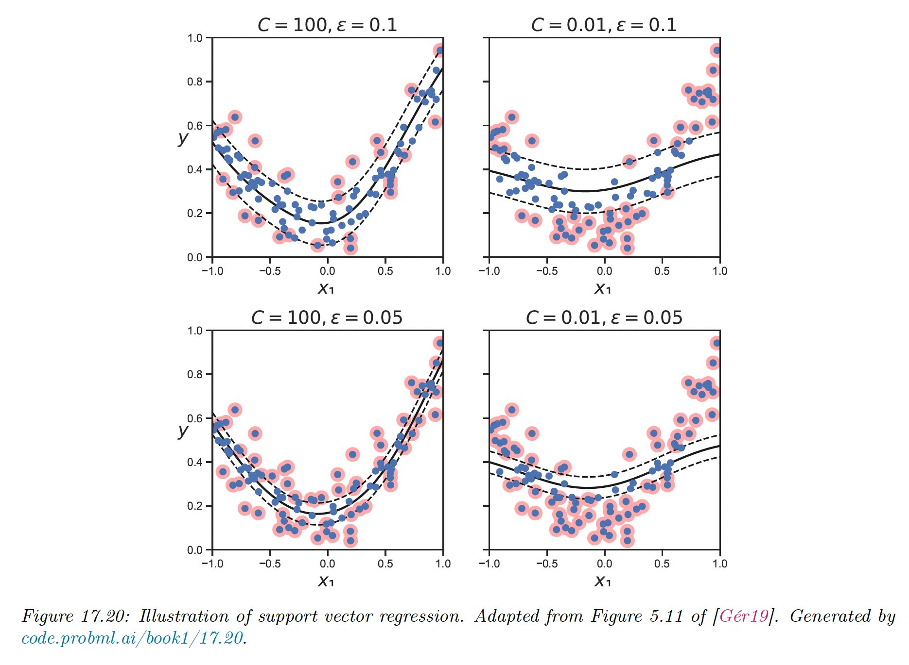

# 17.3 Support vector machines (SVM)

We now discuss a form of (non-probabilistic) predictors for classification and regression problems which have the form:

$$
f(\bold{x})=\sum_{i=1}^N \alpha_i \mathcal{K}(\bold{x},\bold{x}_i)
$$

By adding some constraints, we can ensure only few coefficient $\alpha_i$ are non-zero, so that predictions only depends on a subset of the training points, called **support vectors**.

The resulting model is called support vector machine (SVM)**.**

### 17.3.1 Large margin classifiers

Consider a binary classifier of the form $h(\bold{x})=\mathrm{sign}(f(\bold{x}))$, where the decision boundary is given by:

$$
f(\bold{x})=\bold{w}^\top \bold{x}+w_0
$$

In the SVM literature, it is common to use class labels of $\{-1,+1\}$ rather than $\{0,1\}$. We denote such targets as $\tilde{y}$ instead of $y$.

There might be many lines that separate the data, and intuitively we want to pick the one that has the **maximum margin**. This represents the distance between the closest point to the decision boundary.

The model on the left gives the best solution, because more robust to perturbation of the data.

How can we compute such a **large margin classifier**? First, we need to derive an expression of the distance of a point to the decision boundary.

We see that:

$$
\bold{x}=\bold{x}_\bot+r\frac{\bold{w}}{||\bold{w}||}
$$

where $r$ is the distance from $\bold{x}$ to the decision boundary whose normal vector is $\bold{w}$, and $\bold{x}_\bot$ is the orthogonal projection of $\bold{x}$ on the decision boundary.

We would like to maximize $r$, so we need to express it as a function of $\bold{w}$:

$$
\begin{align}
f(\bold{x})&=\bold{w}^\top (\bold{x}_\bot+r\frac{\bold{w}}{||\bold{w}||})+w_0\\
&= \bold{w}^\top \bold{x}_\bot+w_0+r\frac{\bold{w}^\top \bold{w}}{||\bold{w}||} \\
&= f(\bold{x}_\bot)+r||\bold{w}|| \\
&= r||\bold{w}||
\end{align}
$$

Since $f(\bold{x}_\bot)=0$, therefore $r=f(\bold{x})/||w||$

Since we want to ensure that each point is on the correct point of the boundary, we also require $f(\bold{x}_n)\tilde{y}_n>0$.

We want to maximize the distance to the closest point, so our final objective is:

$$
\max_{\bold{w},w_0} \frac{1}{||\bold{w}||}\min_{n=1}^N [(\bold{w}^\top \bold{x}+w_0)\tilde{y}_n]
$$

Note that rescaling the parameters using $\bold{w}\rightarrow k\bold{w}$ don’t change the distance to the decision boundary, since we divide by $||\bold{w}||$.

Therefore let’s define the scale factor such as $f_n\tilde{y}_n=1$ that closest point to the decision boundary. Hence $f_n\tilde{y}_n\geq 1$ for all $n$.

Thus, we get the new objective:

$$
\min_{\bold{w},w_0} \frac{1}{2}||\bold{w}||^2 \quad s.t.\quad (\bold{w^\top}\bold{x}+w_0)\tilde{y}_n \geq 1,n=1:N
$$

Note that it is important to scale the input variables before using an SVM, otherwise the margin measures distance of a point to the boundary using all input dimensions equally.

### 17.3.2 The dual problem

The last objective is a standard quadratic programming problem since we have a quadratic objective subject to linear constraints. This has $N+D+1$  variables for $N$ constraints, and is known as a **primal problem**.

In convex optimization, for every primal problem we can derive a **dual problem**. Let $\alpha \in \R^N$ be the dual variables, corresponding to Lagrangian multipliers that enforce $N$ inequality constraints.

The generalized Lagrangian is:

$$
\mathcal{L}(\bold{w},w_0,\alpha)=\frac{1}{2}\bold{w}^\top \bold{w}-\sum_{n=1}^N\alpha_n ((\bold{w}^\top \bold{x}_n+w_0)\tilde{y}_n-1)
$$

To optimize this, we must find stationary point that satisfies:

$$
(\hat{\bold{w}},\hat{w}_0,\hat{\alpha})=\argmin_{\bold{w},w_0} \max_\alpha\mathcal{L}(\bold{w},w_0,\alpha)
$$

We do it by computing the partial derivatives wrt $\bold{w}$ and $w_0$ and setting them to zero:

$$
\begin{align}
\frac{\partial}{\partial \bold{w}}\mathcal{L}(\bold{w},w_0,\alpha)&=\bold{w}-\sum_{n=1}^N \alpha_n \tilde{y}_n\bold{x}_n\\
\frac{\partial}{\partial w_0}\mathcal{L}(\bold{w},w_0,\alpha)&=-\sum_{n=1}^N \alpha_n \tilde{y}_n

\end{align}
$$

Hence:

$$
\begin{align}
\hat{\bold{w}} &=\sum_{n=1}^N \alpha_n \tilde{y}_n \bold{x}_n \\
0&=
\sum_{n=1}^N \alpha_n\tilde{y}_n
\end{align}
$$

Plugging these into the Lagrangian yields:

$$
\begin{align}
\mathcal{L}(\hat{\bold{w}},\hat{w}_0,\alpha)&=
\frac{1}{2}\bold{w}^\top \bold{w}-\sum_{n=1}^N \alpha_n  \bold{w}^\top\bold{x}_n\tilde{y}_n-\sum_{n=1}^N \alpha_n  w_0\tilde{y}_n+\sum_{n=1}^N\alpha_n \\
&= \frac{1}{2}\bold{w}^\top\bold{w}-\bold{w}^\top\bold{w}-0+\sum_{n=1}^N\alpha_n \\
&= -\frac{1}{2}\bold{w}^\top \bold{w+}\sum_{n=1}^N\alpha_n 
\end{align}
$$

This is called the **dual form** of the objective. We want to maximize this wrt $\alpha$ subject to the constraints that $\sum_{n=1}^N\alpha_n \tilde{y}_n=0$ and $\alpha_n\geq 0$

The above objective is a quadratic problem with $N$ variables. Standard QP problems solvers take $O(N^3)$ time.

However, specialized algorithms, such as **sequential minimal optimization (SMO)**, have been developed to avoid using generic QP solvers. These take $O(N)$ to $O(N^2)$ time.

Since this is a convex objective, it must satisfied the KKT conditions, which yields the following properties:

$$
\begin{align}
\alpha_n&\geq 0\\
\tilde{y}_n f(\bold{x}_n)-1&\geq 0 \\
\alpha_n(\tilde{y}_n f(\bold{x}_n)-1)&=0

\end{align}
$$

Hence either $\alpha_n=0$ or the constraint $\tilde{y}_n f(\bold{x}_n)=1$ is active. This latter condition means that example $n$ lies on the decision boundary, so it is a **support vector**.

We denote the set of support vectors by $\mathcal{S}$. To perform prediction, we use:

$$
f(\bold{x};\bold{w},w_0)=\bold{w}^\top\bold{x}+w_0=\sum_{n\in\mathcal{S}}\alpha_n\tilde{y}_n\bold{x}_n^\top \bold{x}+\hat{w}_0
$$

To solve for $\hat{w}_0$, we can use the fact that for any support vector, we have $\tilde{y}_nf(\bold{x};\hat{\bold{w}},\hat{w}_0)=1$.

Multiplying each side by $\tilde{y}_n$ and exploiting the fact that $\tilde{y}_n^2=1$, we get $\hat{w}_0=\hat{y}_n-\hat{\bold{w}}^\top \bold{x}_n$

We take to mean to obtain a more robust estimate:

$$
\hat{w}_0=\frac{1}{|\mathcal{S}|}\sum_{n\in\mathcal{S}}(\hat{y}_n-\bold{w}^\top\bold{x}_n)
$$

### 17.3.3 Soft margin classifiers

If the data is not linearly separable, there will be no feasible solution in which $\tilde{y}_nf_n\geq 1$ for all $n$.

We therefore introduce **slack variables $\xi_n\geq 0$** and replace the hard constraints with **soft margin constraints** $\tilde{y}_nf_n\geq 1-\xi_n$.

The objective becomes:

$$
\min_{\bold{w},w_0} \frac{1}{2}||\bold{w}||^2+C\sum_{n=1}^N\xi_n \quad s.t.\quad \xi_n\ge 0,\quad(\bold{w^\top}\bold{x}+w_0)\tilde{y}_n \geq 1-\xi_n
$$

where $C\geq 0$ is a hyperparameter controlling how many points we allow to violate the margin constraint. If $C=\infin$, we recover the previous unregularized hard margin classifier.

The corresponding Lagrangian is:

$$
\begin{align}
\mathcal{L}(\bold{w},w_0,\alpha,\xi,\mu)&=\frac{1}{2}||\bold{w}||^2+C\sum_{n=1}^N \xi_n \\&+\sum_{n=1}^N \alpha_n((\bold{w}^\top \bold{x}_n+w_0)\tilde{y}_n-1+\xi_n)+\sum_{n=1}^N\mu_n \xi_n
\end{align}
$$

where $\alpha_n$  and $\mu_n$ are the Lagrange multipliers.

Optimizing out $\bold{w}$, $w_0$ and $\xi$ gives the dual form:

$$
\mathcal{L}(\alpha)=-\frac{1}{2}||\bold{w}||^2+\sum_{n=1}^N \alpha_n
$$

This is identical to the hard margin case, however the constraints are different. The KKT conditions imply that:

$$
\begin{align}
0\leq \alpha_n &\leq C \\
\sum_{n=1}^N \alpha_n \tilde{y}_n &= 0
\end{align}
$$

- If $\alpha_n=0$, the point is ignored.
- If $0<\alpha_n<C$ then $\xi_n=0$ so the point lies on the margin.
- If $\alpha_n=C$, then the point can lie inside the margin, and can either be correctly classified if $\xi_n\leq 1$, or misclassified if $\xi > 1$.

Hence, $\sum_{n=1}^N \xi_n$ is an upper bound on the number of misclassified points.

As before, the bias term can be computed using:

$$
\hat{w}_0=\frac{1}{|\mathcal{M}|}\sum_{n\in\mathcal{M}}(\tilde{y}_n-\bold{w}^\top\bold{x}_n)
$$

where $\mathcal{M}$ is the set of points having $0<\alpha_n<C$.

There is an alternative formulation called $\nu$**-SVM classifier**. This involves maximizing:

$$
\mathcal{L}(\alpha)=-\frac{1}{2}||\bold{w}||^2=-\frac{1}{2}\sum_{i=1}^N\sum_{j=1}^N \alpha_i\alpha_j\tilde{y}_i\tilde{y}_j \bold{x}_i^\top \bold{x}_j
$$

subject to the constraints:

$$
\begin{align}
&0\leq \alpha_n\leq 1/N \\
&\sum_{n=1}^N \alpha_n\tilde{y}_n=0 \\
&\sum_{n=1}^N \alpha_n \geq \nu
\end{align}
$$

This has the advantage that the parameter $\nu$, which replace the parameter $C$, can be interpreted as an upper bound on the fraction of **margin errors** (point for which $\xi_n\ge 0$)**,** as well as a lower bound on the number of support vectors.

### 17.3.4 The kernel trick

We have converted the large margin classification problem into a dual problem in $N$  unknowns $\alpha_n$ which takes $O(N^3)$ time to solve, which is slow.

The benefit of the dual problem is that we can replace all inner product operation $\bold{x}^\top \bold{x}'$ with a call to a positive definite Mercer kernel function, $\mathcal{K}(\bold{x},\bold{x}')$. This is called **kernel trick**.

We can rewrite the prediction equation as:

$$
\begin{align}
f(\bold{x})=\hat{\bold{w}}^\top\bold{x}+\hat{w}_0&=\sum_{n\in\mathcal{S}}\alpha_n\tilde{y}_n \bold{x}_n^\top \bold{x}+\hat{w}_0\\
&= \sum_{n\in\mathcal{S}}\alpha_n\tilde{y}_n \mathcal{K}(\bold{x}_n,\bold{x})+\hat{w}_0\\

\end{align}
$$

We also need to kernelize the bias term:

$$
\begin{align}
\hat{w}_0&=\frac{1}{|\mathcal{S}|}\Big(\sum_{n\in\mathcal{S}} \tilde{y}_n-(\sum_{m\in\mathcal{S}}\alpha_m\tilde{y}_m\bold{x}_m^\top) \bold{x_n}\Big) \\
&= \frac{1}{|\mathcal{S}|}\Big(\sum_{n\in\mathcal{S}} \tilde{y}_n-\sum_{m\in\mathcal{S}}\alpha_m\tilde{y}_m\mathcal{K}(\bold{x}_m, \bold{x_n})\Big) 
\end{align}
$$

The kernel trick allows us to avoid dealing with explicit feature representation, and allows us to easily apply classifiers to structured objects, such as strings and graphs.

### 17.3.5 Converting SVM outputs into probabilities

An SVM classifier produce hard labeling $\hat{y}(\bold{x})=\mathrm{sign}(f(\bold{x}))$. However, we often want a measure of confidence in our prediction.

One heuristic approach is to interpret $f(\bold{x})$ as the log-odds ratio $\log \frac{p(y=1|\bold{x})}{p(y=0|\bold{x})}$. We can then convert an SVM output to probability:

$$
p(y=1|\bold{x},\theta)=\sigma(af(\bold{x})+b)
$$

where $a$, $b$ can be estimated using MLE on a separate validation set. This is known as **Platt scaling**.

However, the resulting probabilities are not well calibrated, since there is nothing that justifies interpreting $f(\bold{x})$ as the log-odds ratio.

To see this, suppose we have 1d data where:

- $p(\bold{x}|y=0)=\mathrm{Uni}(0,1)$
- $p(\bold{x}|y=1)=\mathrm{Uni}(0.5,1.5)$

Since the class-conditional distributions overlap in this interval, the log-odd should be 0 inside it and infinite outside.

We train a probabilistic kernel classifier (RVM) and a SVM with Gaussian kernel. Both model can perfectly capture the decision boundary and achieve a generalization error of 25%, which is Bayes optimal in this problem.

However, the SVM doesn’t yield a good approximation of the true log-odds.

### 17.3.6 Connection with logistic regression

Data points that are on the (correct side) decision boundary have $\xi_n=0$, the others have $\xi_n=1-\tilde{y}_nf(\bold{x}_n)$. Therefore we can rewrite the soft-margin objective in its primal form as:

$$
\mathcal{L}(\bold{w})=\frac{1}{N}\sum_{n=1}^N \ell_{\mathrm{hinge}}(\tilde{y}_n,f(\bold{x}_n))+\lambda||\bold{w}||^2
$$

where $\lambda=\frac{1}{2C}$ and the hinge loss is defined as:

$$
\ell_{\mathrm{hinge}}(\tilde{y},\mu)=\max(0, 1-\tilde{y}\mu)
$$

This is a convex, piecewise differentiable upper-bound to the 0-1 loss.

By contrast, the (penalized) logistic regression optimizes:

$$
\mathcal{L}(\bold{w})=\frac{1}{N}\sum_{n=1}^N \ell_{ll}(\tilde{y}_n,f(\bold{x}_n))+\lambda||\bold{w}||^2
$$

where the **log loss** is given by:

$$
\ell_{ll}(\tilde{y},\mu)=-\log(p(y|\mu))=\log(1+e^{-\tilde{y}\mu})
$$

The two major differences between both loss is that:

1. The hinge loss is piecewise linear, so we can’t use regular gradient methods to optimize it.
2. The hinge loss has a region where it is strictly 0. This results in sparse estimates.

### 17.3.7 Multi-class classification with SVMs

SVMs are inherently binary classifiers.

One way to convert them to a multi-class classification model is to train $C$ binary classifiers, where the data from class $c$ is treated as positive, and the rest is negative.

We then predict the label by using the rule:

$$
\hat{y}(\bold{x})=\argmax_{c}f_c(\bold{x})
$$

where $f_c(\bold{x})=\log \frac{p(c=1|\bold{x})}{p(c=0|\bold{x})}$. This is known as the **one-vs-rest** approach (aka **one-vs-all**).

Unfortunately, this has shortcomings:

1. This can result in regions of input space where the predicted label is ambiguous
2. The magnitude of the $f_c$ scores are not calibrated well with each other, so there are hard to compare.
3. Each binary subproblem is likely to suffer from imbalance problem, which can hurt performances: for 10 equally represented classes, each positive class represents only 10% of labels.

We can also use the **one-vs-one (OVO)** approach, in which we train $C(C-1)/2$ classifiers to discriminate all pairs $f_{c,c'}$. We then classify a point into a class that has the higher number of votes.

However this can also result in ambiguities, and this require fitting $O(C^2)$  models.

### 17.3.8 How to choose the regularizer $C$

SVMs require to specify the kernel function and the parameter $C$, usually chosen with cross-validation.

Note however that $C$ interact quite strongly with kernel parameters, for example with precision $\gamma=1/2\sigma^2$.

- If $\gamma$ is large, corresponding to narrow kernel, we may need heavy regularization, hence small $C$
- If $\gamma$  is small, a larger value of $C$ should be used.

The authors of libsvm recommend using CV over a 2d grid with values $C\in\{2^{-5},2^{-3},\dots,2^{15}\}$ and $\gamma\in\{2^{-15},2^{-13},\dots,2^3\}$

To choose $C$ efficiently, we can develop a path following algorithm similar to lars.

The idea is to start with a small $C$ so that the margin is wide and all points are inside it. By increasing $C$, points will move from inside the margin to outside, and their $\alpha_i$ value change from 1 to 0 as they cease to be support vectors. When $C$ is maximal, there are no support vectors left.

### 17.3.9 Kernel ridge regression

The ridge regression equation is:

$$
\begin{align}
\hat{\bold{w}}_{\mathrm{map}}&=(X^\top X+\lambda I_D)^{-1}X^\top \bold{y} \\
&= (\sum_{n=1}^N \bold{x}_n\bold{x}_n^\top +\lambda I_D)^{-1}(\sum_n\tilde{y}_n\bold{x}_n)
\end{align}
$$

Using the matrix inversion lemma, we can rewrite the ridge estimate as follows:

$$
\begin{align}
\bold{w}&=X^\top (X X^\top+\lambda I_N)^{-1}\bold{y}\\
&=\sum_{n=1}^N\bold{x}_n ((\sum_{d=1}^D \bold{x}_d\bold{x}_d^\top+\lambda I_N)^{-1}\bold{y})_n
\end{align}
$$

Let’s now define the **dual variables**:

$$
\alpha\triangleq (XX^\top+\lambda I_N)^{-1}\bold{y}
$$

We can rewrite the primal variables as:

$$
\bold{w}=X^\top\alpha =\sum_{n=1}^N \bold{x}_n\alpha_n
$$

So, the solution vector is just a weighted sum of the N training vectors.

We plug this at test time to get the predictive mean:

$$
f(\bold{x};\bold{w})=\bold{x}^\top \bold{w}=\sum_{n=1}^N \alpha_n\bold{x}_n^\top\bold{x}=\sum_{n=1}^N \alpha_n \mathcal{K}(\bold{x}_n,\bold{x})
$$

where we used the kernel trick, with the dual parameter becoming:

$$
\alpha=(K+\lambda I_N)^{-1}\bold{y}
$$

In other words:

$$
f(\bold{x};\bold{w})=\bold{k}^\top (K+\lambda I_N)^{-1}\bold{y}
$$

where $\bold{k}=[\mathcal{K}(\bold{x}_1,\bold{x}),\dots,\mathcal{K}(\bold{x}_N,\bold{x})]$.

This is called **ridge kernel regression**. The issue with this approach is that the solution vector $\alpha$ is not sparse, so predictions at test time will take $O(N)$ time.

### 17.3.10 SVMs for regression

Consider the following $\ell_2$-regularized ERM problem:

$$
J(\bold{w},\lambda)=\sum_{n=1}^N \ell(\tilde{y}_n,\hat{y}_n)+\lambda||\bold{w}||^2
$$

where $\hat{y}_n=\bold{w}^\top \bold{x}_n+w_0$.

If we use the quadratic loss, we recover ridge regression. If we then apply the kernel trick, we recover kernel ridge regression.

By changing the loss function, we can make the optimal set of basis coefficient $\alpha_*$ sparse. In particular, consider the variant of the Huber loss function, the **epsilon insensitive loss function**:

$$
L_{\epsilon}(y,\hat{y})\triangleq \begin{cases} 0 &\mathrm{if}\;|y-\hat{y}|<\epsilon \\
|y-\hat{y}|-\epsilon &\mathrm{otherwise}
\end{cases}
$$

This means any point lying in the $\epsilon$-tube is not penalized.

The corresponding loss function can be written:

$$
J=\frac{1}{2}||\bold{w}||^2+C\sum_{n=1}^N L_{\epsilon}(\tilde{y}_n,\hat{y}_n)
$$

where $C=1/\lambda$ is a regularization constraint.

The objective is convex without constraint but not differentiable, because of the absolute value in the loss term. As for the lasso, there is several algorithm we could use.

One popular approach is to formulate the problem as a constraint optimization one. We introduce **slack variables** to represent the degree to which each point lies outside the tube:

$$
f(\bold{x}_n)-\epsilon-\xi_n^-\leq\tilde{y}_n\leq f(\bold{x}_n)+\epsilon+\xi^+_n
$$

We can rewrite the objective as:

$$
J=\frac{1}{2}||\bold{w}||^2+C\sum_{n=1}^N (\xi_n^++\xi_n^-)
$$

This is a quadratic function of $\bold{w}$ and must be minimized subject to the above constraint, as well as positive constraint on $\xi^+_n\geq 0$ and $\xi_n^-\geq 0$.

This is a standard quadratic problem in $2N+D+1$ variables. By forming the Lagrangian and optimizing as we did above, one can show that the optimal solution is:

$$
\hat{\bold{w}}=\sum_{n=1}^N\alpha_ n\bold{x}_n
$$

where $\alpha_n\geq 0$ are the dual variables.

This time the $\alpha$ vector is sparse, because the loss doesn’t care about errors smaller than $\epsilon.$ The degree of sparsity is controlled by $C$ and $\epsilon.$

The $\bold{x}_n$ for which $\alpha_n>0$  are the sparse vectors, lying on or outside the $\epsilon$  tube. They are the only examples we need to keep since:

$$
f(\bold{x};\bold{w})=\bold{w}^\top\bold{x}+w_0=\sum_{n:\alpha_n>0}\alpha_n\bold{x}_n^\top\bold{x}+w_0=\sum_{n:\alpha_n>0}\alpha_n\mathcal{K}(\bold{x}_n,\bold{x})+w_0
$$

The overall technique is called **SVM regression.**

