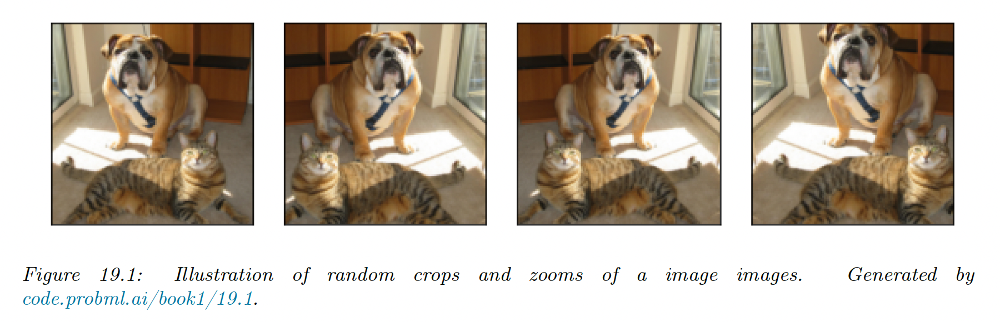

# 19.1 Data augmentation

Suppose we have a small training set. In some cases, we may be able to create artificially modified versions of the input vectors, which capture the kinds of variation we expect to see at test time, while keeping the original labels.

This is called **data augmentation**.

### 19.1.1 Examples

- For image classification tasks, standard data augmentation methods include random crops, zooms and mirror image flips.
- For signal processing, adding background noise
- For text, artificially replace characters or words at random in a text document.

If we afford to train and test the model many times using different version of the data, we can learn which augmentation work best, using blackbox optimization techniques like RL or Bayesian optimization.

We can also learn to combine multiple augmentation together, this is called **AutoAugment**.

### 19.1.2 Theoretical justification

Data augmentation generally increases performances (predictive accuracy, robustness), because it algorithmically inject prior knowledge.

To see this, recall the ERM training, where we minimize the risk:

$$
R(f)=\int \ell(f(\bold{x}),y)p^*(\bold{x,y})d\bold{x}d\bold{y}
$$

where we approximate $p^*(\bold{x,y})$ by the empirical distribution:

$$
p_D(\bold{x,y})=\frac{1}{N}\sum_{n=1}^N \delta(\bold{x}-\bold{x}_n)\delta(\bold{y}-\bold{y}_n)
$$

We can think of data augmentation as replacing the empirical distribution with the following algorithmically smoothed distribution:

$$
p_D(\bold{x,y}|A)=\frac{1}{N}\sum_{n=1} ^N p(\bold{x}|\bold{x}_n,A)\delta(\bold{y}-\bold{y}_n)
$$

where $A$ is the data augmentation algorithm, which generate a sample $\bold{x}$ from a training point $\bold{x}_n$, such that the labeled are unchanged.

A very simple example would be a Gaussian kernel:

$$
p(\bold{x}|\bold{x}_n,A)=\mathcal{N}(\bold{x}|\bold{x}_n,\sigma^2 I)
$$

This has been called **vicinal risk minimization**, since we are minimizing the risk in the vicinity of each training point $\bold{x}$.