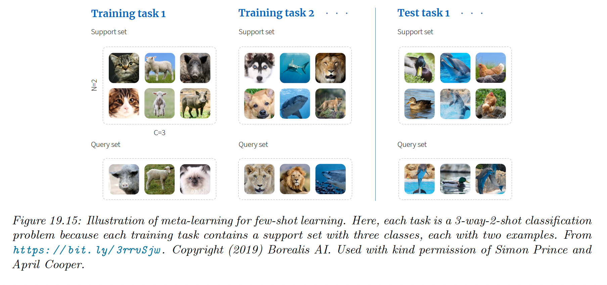
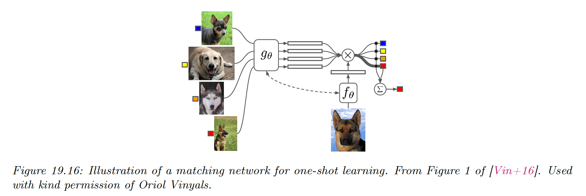

# 19.6 Few-shot learning

People can learn to predict from very few labeled example. This is called **few-shot learning (FSL)**.

In the extreme where we only have one labeled example of each class, this is **one-shot learning**, and if no label are given, this is called **zero-shot learning**. 

A common way to evaluate methods for FSL is to use **$C$-way, $N$-shot** classification, in which we expect the system to learn to classify $C$ classes from $N$ labeled examples for each class.

Typically, $N$ and $C$ are very small.

Since the amount of labeled data per domain is so scarce, we can’t expect to learn from scratch. Therefore, we turn to meta-learning.

During training, a meta-algorithm $M$ trains on a labeled support set from group $j$ and returns a predictor $f_j$, which is then evaluated on a disjoint query set also from group $j$.

We optimize $M$ over the $J$ groups. Finally, we can apply $M$ to our new labeled support set to get $f^{\mathrm{test}}$, which is then applied to the test query set.

We see on the image above that there is no overlap of classes between groups, therefore the model has to learn to predict classes in general rather than any specific set of labels.

We discuss some approach to FSL below.

### 19.6.1 Matching networks

On approach to FSL is to learn a distance metric on some other dataset, and then use $d_\theta(\bold{x}',\bold{x})$ inside a nearest-neighbor classifier.

Essentially, this defines a semi-parametric model of the form $p_\theta(y|\bold{x},\mathcal{S})$ where $\mathcal{S}$ is the small labeled dataset (known as the support set) and $\theta$ are the parameters of the distance function.

This approach is widely used for **fine-grained classification** tasks, where there are many different but visually similar categories, such as products in a catalogue.

An extension of this approach is to learn a function of the form:

$$
p_\theta(y|\bold{x},\mathcal{S})=\sum_{n\in\mathcal{S}}a_\theta(\bold{x},\bold{x}_n;\mathcal{S})y_n
$$

where $a_\theta(\bold{x},\bold{x}_n;\mathcal{S})\in \R^+$ is some kind of adaptive similarity kernel.

For example, we can use an attention kernel of the form:

$$
a(\bold{x},\bold{x}_n;\mathcal{S})=\frac{\exp(c(f(\bold{x}),g(\bold{x}_n)))}{\sum_{n'\in\mathcal{S}}\exp(c(f(\bold{x}),g(\bold{x}_{n'})))}
$$

where $c(u,v)$ is the cosine distance. $f$ and $g$ can be the same function.

Intuitively, the attention kernel compares $\bold{x}$ to $\bold{x}_n$ in the context of all the labeled example, which provides an implicit signal about which feature dimension are relevant. This is called [**matching network**](https://arxiv.org/abs/1606.04080).

We can train $f$ and $g$ using multiple small datasets, as in meta-learning.

Let $\mathcal{D}$ be a large labeled dataset (e.g. ImageNet), and let $p(L)$ be its distributions of labels. We create a task by sampling a small number of labels (say 25) $L\sim p(L)$, and then sample a small support set of examples from $\mathcal{D}$ with those labels $\mathcal{S}\sim L$ and finally sampling a small test set with those same labels $\mathcal{T}\sim L$.

We then train the model to optimize the objective:

$$
\hat{\theta}=\argmax_\theta \mathbb{E}_{L\sim p(L)}\Big[\mathbb{E}_{\mathcal{T}\sim L,\mathcal{S}\sim L}\Big[ \sum_{(\bold{x},y)\in\mathcal{T}} \log p_\theta(y|\bold{x};\mathcal{S}) \Big]\Big]
$$

After training we freeze $\theta$  and predict on a test support set $\mathcal{S}$.