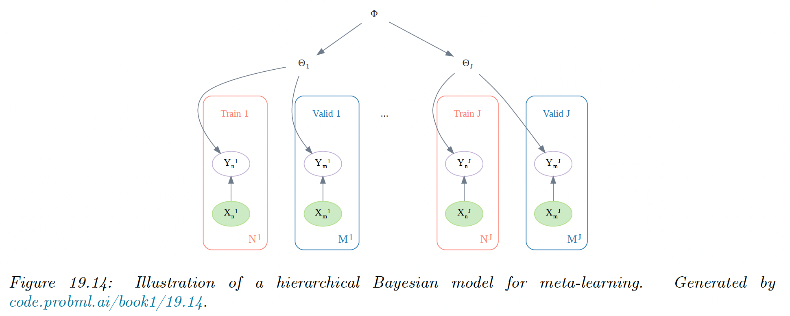

# 19.5 Meta-learning

We can think of a learning algorithm as a function $A$ that maps data to a parameter estimate $\theta=A(\mathcal{D})$. 

The function $A$ usually has its own parameter $\phi$, such as the initial values for $\theta$ or the learning rate. We get $\theta=A(\mathcal{D};\phi)$.

We can imagine learning $\phi$ itself, given a collection of dataset $\mathcal{D}_{1:J}$ and some **meta-learning** algorithm $M$, i.e. $\phi=M(\mathcal{D}_{1:J})$.

We can then apply $A(.;\phi)$ on a new dataset $\mathcal{D}_{J+1}$ to learn the parameters $\theta_{J+1}$. This is also called **learning to learn**.

### 19.5.1 Model agnostic Meta-learning (MAML)

A natural approach to meta-learning is to use a hierarchical Bayesian model.

We can assume that the parameters $\theta_j$ come from a common prior $p(\theta_j|\phi)$, which can be used to help pool statistical strength from multiple data-poor problems.

Meta-learning becomes equivalent to learning the prior $\phi$. Rather than performing full Bayesian inference, we use the following empirical Bayes approximation:

$$
\phi^*=\argmax_\phi\frac{1}{J}\sum_{j=1}^J \log p(\mathcal{D}^j_{\mathrm{valid}}|\hat{\theta}_j(\mathcal{D}^j_{\mathrm{train}},\phi))
$$

where $\hat{\theta}_j=\hat{\theta}(\mathcal{D}^j_{\mathrm{train}},\phi)$ is a point estimate of the parameters of task $j$, and we use cross-validation approximation to the marginal likelihood.

To compute the point estimate of the parameters for the target task $\theta_{J+1}$, we use $K$ steps of a gradient ascent procedure, starting from $\phi$ with a learning rate $\eta$. This is known as **model agnostic meta-learning** **(MAML)**.

This can be shown to be equivalent to an approximate MAP estimate using a Gaussian prior centered at $\phi$, where the strength of the prior is controlled by the number of gradient steps (this is an example of **fast adaptation** of the task specific weights from the shared prior $\phi$).