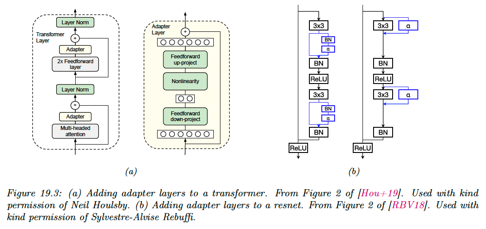
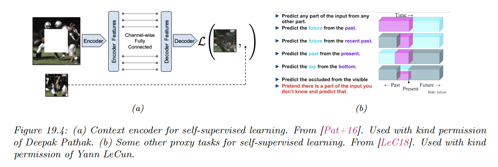

# 19.2 Transfer learning

Many data-poor tasks have similarity to other data rich tasks. For example, classifying rare bird species, where we don’t have a large labeled dataset, bears similarity with classifying all species of birds.

We therefore expect that training first a classifier on a large dataset of birds, then continuing training on a small dataset of rare birds could produce better performances that training on the rare birds dataset alone.

This is called **transfer learning**, since we are transferring information from one dataset to another, via a shared set of parameters.

More precisely:

- We first perform a **pre-training phase**, in which we train a model with parameter $\theta$ on a large **source dataset $\mathcal{D}_p$**, which may be labeled or unlabeled.
- We then perform a second **fine-tuning phase** on the small labeled target dataset $\mathcal{D}_q$.

### 19.2.1 Fine-tuning

Suppose now we already have a pretrained classifier $p(y|\bold{x};\theta_p)$ such as a CNN, that works well for inputs $\bold{x}\in \mathcal{X}_p$ (e.g. natural images) and output $y\in\mathcal{Y}_p$ (e.g. ImageNet labels), where the data comes from a distribution $p(x,y)$ similar to the one used in training.

Now we want to create a new model $q(y|\bold{x},\theta_q)$ that works well for inputs $\bold{x}\in\mathcal{X}_q$ (e.g. bird images) and outputs $y\in\mathcal{Y}_q$ (e.g. fine-grained bird labels), where the data comes from a  different distribution $q(\bold{x},y)$ than p.

We will assume that the set of possible inputs is the same, so $\mathcal{X}_p\approx \mathcal{X}_q$ (e.g. both are RGB images) or that we can easily transform inputs from domain $p$ to $q$, (e.g. from RGB to grayscale by only keeping the luminance channel). If we can’t make this easy transformation, we can use domain adaptation.

However, the output domains are usually different, i.e. $\mathcal{Y}_p \neq \mathcal{Y}_q$. For example, $\mathcal{Y_p}$ could be ImageNet labels and $\mathcal{Y}_q$  could be medical labels.

In this case, we need to “translate” the output of the pretrained model to the new domain. This is easy to do with neural networks: we simply replace the final layer of the original layer by a new one.

For example, suppose:

$$
p(y|\bold{x},\theta_p)=\mathcal{S}(y|W_2\bold{h}(\bold{x};\theta_1)+\bold{b}_2)
$$

where $\theta_p=(W_2,\bold{b}_2,\theta_1)$.

Then we can construct:

$$
q(y|\bold{x},\theta_q)=\mathcal{S}(y|W_3\bold{h}(\bold{x};\theta_1)+\bold{b}_3)
$$

where $\theta_q=(W_3,\bold{b}_3,\theta_1)$ and $h(\bold{x},\theta_1)$ is the shared nonlinear feature extractor.

After performing this “model surgery”, we can fine-tune the new model with parameters $\theta_q$.

If we treat $\theta_1$ as **“frozen parameters”,** then the resulting model $q(y|\bold{x},\theta_q)$ is linear in its parameters, so we have a convex optimization problem for which many simple and efficient fitting method exist. This is particularly helpful for rare labels.

However, a linear “decoder” may be too limiting, so we can also allow $\theta_1$ to be fine-tuned as well, with a lower learning rate to prevent the values moving too far from the values estimated on $\mathcal{D}_p$.

### 19.2.2 Adapters

Fine-tuning on all parameters is usually slow, and every new tasks required a new model to be trained, making task sharing hard.

An alternative approach is to keep the pre-trained model untouched, but to add new parameters  to customize the feature extraction process for each task. This idea is called **Adapter**.

In the figure a) above, we insert two shallow bottleneck MLPs inside each transformer layer, one after the MHA and once after the feed-forward layers. Note that these MLPs have skip connections, so that they can be initialized to implement the identity mapping.

If the transformer layer has features of dimensionality $D$ and the adapter uses a bottleneck of size $M$, this introduces $O(DM)$ new parameter per layer. These adapters MLPs, the layer norm parameter and the final output head are trained for each new task, but all remaining parameters are frozen.

On several NLP benchmarks, this is found to give better performance than fine-tuning, while only needing about 1-10% of the original parameters.

In figure b) , we add a $1\times 1$ convolution layer $\alpha$ to a CNN, which is analogous to the MLP adapter to the transformer case. This can be added in series or in parallel.

The series adapter is:

$$
\rho(\bold{x})=\bold{x}+\mathrm{diag}_1(\alpha)\circledast \bold{x}=\mathrm{diag}_1(\alpha+I)\circledast  \bold{x}
$$

where a matrix $\alpha\in \R^{C\times D}$ is reshaped with $\mathrm{diag_1}(\alpha)\in\R^{1\times 1\times C\times D}$ to be applied to each spatial location in parallel.

If we insert this after a regular convolution layer $\bold{f}\circledast \bold{x}$, we get:

$$
\bold{y}=\rho(\bold{x}\circledast \bold{f})=(\mathrm{diag}_1(\alpha+I)\circledast \bold{f})\circledast \bold{x}
$$

This can be interpreted as a low rank **multiplicative** perturbation of the original filter $\bold{f}$.

The parallel adapter is:

$$
\bold{y}=\bold{f}\circledast \bold{x}+\mathrm{diag}_1(\alpha)\circledast \bold{x}=(\bold{f}+\mathrm{diag}_1(\alpha))\circledast \bold{x}
$$

This can be interpreted as a low rank **additive** perturbation of the original filter $\bold{f}$.

In both cases, setting $\alpha=\bold{0}$ ensures the adapter layers can be initialized to the identity transformation. Both methods requires $O(C^2)$ parameters per layer.

### 19.2.3 Supervised pre-training

The pre-training task may be supervised or unsupervised; the main requirement are that it can teach the model basic structure about the problem domain and it is sufficiently similar to the downstream fine-tuning task.

The diversity and scale of dataset like ImageNet explain why it has become a de-facto pre-training task for transfer learning in computer vision.

However, ImageNet pre-training has been shown to be less helpful when the domain of fine-tuning task is quite different from the natural images (e.g. medical images). In some cases where it is helpful, it seems to be more of a speedup trick (by warm-starting optimization at a good point) rather than an essential step: one can obtain similar performances on the downstream task by training from scratch long enough.

Supervised pre-training is less common in non-visions applications.

### 19.2.4 Unsupervised pre-training (self-supervised learning)

It is increasingly common to use unsupervised pre-training, because unlabeled data are often easy to acquire (e.g. unlabeled images or text document from the web).

Pre-training tasks that use unlabeled data are often called **self-supervised** rather than unsupervised, because the latter often refer to generative approaches, that predict outputs unconditionally.

We use the term self-supervised learning (SSL) because the labels are created by the algorithm, rather than being provided by a human.

Both supervised and SSL are discriminative tasks, since they require predicting outputs given inputs.

We can list three main broad groups of SSL heuristics:

**19.2.4.1 Imputation tasks**

One approach to self-supervised learning is to solve **imputation tasks**. We partition the input $\bold{x}$ into two parts $\bold{x}=(\bold{x}_v,\bold{x}_h)$, and then try to predict the hidden part $\bold{x}_h$ given the visible $\bold{x}_v$.

This can be seen as a fill-in-the-blank task or **cloze task** in NLP.

**19.2.4.2 Proxy tasks**

Another approach to SSL is to solve proxy tasks aka **pretext tasks**.

We create pairs of inputs $(\bold{x}_1, \bold{x}_2)$ and then train a Siamese networks classifier of the form:

$$
p(y|\bold{x}_1,\bold{x}_2)=p(y|r[f(\bold{x}_1),f(\bold{x}_2)])
$$

where $f$ is some functions that performs representation learning, and $y$ is some label that capture the relationship between $\bold{x}_1$ and $\bold{x}_2$.

For instance, suppose $\bold{x}_1$ is an image patch and $\bold{x}_2=t(\bold{x}_1)$ is some transformation of $\bold{x}_1$ that we control, such as random rotation. If this scenario, $y$ could be the rotation angle.

**19.2.4.3 Contrastive tasks**

The most popular approach to use SSL is to use various kinds of **contrastive tasks**.

The basic idea is to create pairs of examples that are semantically similar using data augmentation, and their ensure that their distance is the embedding space is closer than the distance of some two unrelated examples.

This is the same idea used in deep metric learning, with the difference that the algorithm creates its own pairs, rather than relying on an external measure of similarity, such as labels.

We give two examples below.

**19.2.4.4 SimCLR**

SimCLR stands for Simple contrastive learning of visual representation” and has shown SOTA performances on transfer learning and semi-supervised learning.

Each input $\bold{x}\in \R^{D}$ is converted into two augmented views $\bold{x}_1=t_1(\bold{x)}$ and $\bold{x}_2=t_2(\bold{x})$ which are semantically equivalent versions of the input generated by some data transformation $t_1$ and $t_2$ (for images, these could be random crop).

We then sample negative example $\bold{x}_1^-,\dots,\bold{x}_n^-\in N(\bold{x})$ from the dataset, that represent semantically different images (in practice, these are the other examples in the minibatch).

Next, we define some feature mapping $F:\R^D\rightarrow \R^E$ where $D$ is the size of the input and $E$ is the size of the embedding.

We finally try to maximize the similarity of the similar views, while minimizing the similarity of the different views:

$$
J=F(t_1(\bold{x}))^\top F(t_2(\bold{x}))-\log \sum_{\bold{x}_i^- \in N(\bold{x})}\exp[F(\bold{x}_i^-)^\top F(\bold{x})]
$$

In practice, we use cosine similarity, so we $\ell_2$-normalize the representations produced by $F$ (omitted in the equation above).

In this figure, we assumed $F(\bold{x})=g(r(\bold{x}))$, where the intermediate representation $\bold{h}=r(\bold{x})$ is the one that will be used later for fine-tuning and $g$ is an addition

A critical ingredient to the success of SimCLR is the choice of data augmentation methods. By using random crops, we can force the model to predict local views from global views, as well as adjacent views of the same image.

After cropping, images are resized back to the same shape, and some random flipping can also be applied some fraction of time. Color distortion is also needed so that the algorithm doesn’t “cheat” by comparing images using their color histograms. 

SimCLR relies on a large batch training, in order to ensure a sufficiently diverse set of negatives. When this is not possible, we can use a memory bank of past negative embeddings, which can be updated using exponential moving averaging. This is known as momentum contrastive learning or **MoCo**.

**19.2.4.5 CLIP**

CLIP stands for “Contrastive Language-Image Pre-training”. This is a contrastive approach to representation learning which uses a massive corpus of 400M (images, text) from the web.

Let $\bold{x}_i$ be the $i$th image and $\bold{y}_i$ its matching text. Rather than trying to predict the exact words associated with the image, it is easier to determine if $\bold{y}_i$ is more likely to be the correct text compared to $\bold{y}_j$, for some other text string $j$ in the minibatch.

Similarly, the model can try to predict if $\bold{x}_i$ is more likely to be matched than $\bold{x}_j$, for a given $\bold{y}_i$.

Let $f_I(\bold{x}_i)$ be the embedding of the image and $f_T(\bold{y}_i)$ the embedding of the text. We normalize both embeddings to get the unit-norm version of the embeddings:

$$
I_i=f_I(\bold{x}_i)/||f_I(\bold{x}_i)||_2 \\
T_j=f_T(\bold{y}_j)/||f_T(\bold{y}_j)||_2
$$

The vector of pairwise logits (similarity score) is:

$$
L_{ij}=I_i^\top T_j
$$

We now train the parameters of the two embeddings functions $f_I$ and $f_J$ to minimize the following loss, averaged over the minibatches of size $N$:

$$
J=\frac{1}{2}\Big[\sum_{i=1}^N \mathrm{CE}(L_{i,:},1_i)+\sum_{j=1}^N \mathrm{CE}(L_{:,j},1_j)\Big]
$$

where $1_i$ is a one hot encoding of label $i$ and the cross-entropy defined as:

$$
\mathrm{CE}(\bold{p},\bold{q})=-\sum_{k=1}^K y_k \log p_k
$$

In practice, the normalized embeddings are scaled by a temperature parameter which is also learned. This controls the sharpness of the softmax.

In their paper, they considered using a ResNet and a vision transformer for the function $f_I$ and a text transformer for the function $f_T$. They used a very large minibatch of $N\sim 32k$ and trained for many days on hundreds of GPUs.

After the model is trained, it can be used for **zero-shot classification** of an image $\bold{x}$ as follows:

1. Each of the $K$ possible class labels for a given dataset is converted into a text string $\bold{y}_k$ that might occur on the web. For example “dog” becomes “a photo of a dog”.
2. We compute the normalized embeddings: $I\propto f_I(\bold{x})$ and $T_j \propto f_T(\bold{y}_k)$.
3. We compute the softmax probabilities: $p(y=k|\bold{x})=\mathcal{S}([I^\top T_1,\dots,I^\top T_K])_k$

Remarkably, this approach can perform as well as standard supervised learning on tasks like ImageNet classification, without ever being explicitly trained on specific labeled dataset.

Of course, the images of ImageNet come from the web, and the model has seen similar images before. Nevertheless, its generalization to new tasks and robustness to distribution shift are impressive.

One drawback of this approach, however, is that it is quite sensitive to how class labels are converted to textual form, e.g. it is necessary to use strings of the form “photo of guacamole, type of food” for food classification, added by hand.

This is called **prompt engineering** and is needed since the raw class names can be ambiguous across (and sometimes within) a dataset.

### 19.2.5 Domain adaptation

Consider a problem in which we have inputs from a different domain, such as **source domain** $\mathcal{X}_s$ and **target domain $\mathcal{X}_t$,** but a common set of output labels (this is the “dual” of the transfer learning task where the input domains are the same but the output domains are different).

For example, domains could be product reviews and movie reviews.

We assume we don’t have labeled examples from the target domain. Our goal is to fit the model on the source domain, and then modify its parameters so it works on the target domain. This is called (unsupervised) **domain adaptation.**

A common approach to this problem is to train a source classifier in such a way that it can’t distinguish whether the input is coming from the source or target distribution. In this case, it will only be able to use features that are common to both. This is called **domain adversarial learning**.

Let $d_n\in\{s,t\}$ be a label that specifies the domain of an example $n$. We want to optimize:

$$
\max_\theta \min_\Phi \frac{1}{N_s+N_t}\sum_{n\in\mathcal{D}_s,\mathcal{D}_t}\ell(d_n,f_\theta(\bold{x}_n))+\frac{1}{N_s}\sum_{m\in\mathcal{D}_s}\ell(y_m,g_\Phi(f_\theta(\bold{x}_m)))
$$

where $N_s=|\mathcal{D}_s|$, $N_t=|\mathcal{D}_t|$, $f:\mathcal{X}_s \cup\mathcal{X}_t\rightarrow \mathcal{H}$ and $g:\mathcal{H}\rightarrow \mathcal{Y}_t$.

This objective minimizes the loss on the classification of $y$ but maximizes the loss on the auxiliary task of classifying the source domain $d$.

This can be implemented by the **gradient sign reversal** trick and is related to GANs.