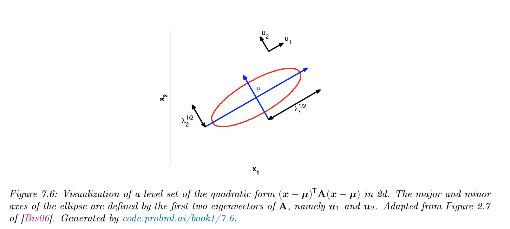

# 7.4 Eigenvalue decomposition (EVD)

### 7.4.1 Basics

For a square matrix $A\in \mathbb{R}^{n\times n}$, $\lambda\in\mathbb{R}$ is an eigenvalue of $A$ if:

$$
A\bold{u}=\lambda \bold{u},\;\;\bold{u}\neq\bold{0}
$$

with $\bold{u}\in \mathbb{R}^n$ eigenvector.

Intuitively, multiplying $\bf u$ by $A$ results in a vector in the same direction that $\bf u$, scaled by $\lambda.$

Since $c\bold{u}$ is also an eigenvector of $\lambda$, we consider eigenvectors to be normalized with length 1.

The equation above gives us:

$$
A\bold{u}-\lambda \bold{u}=(A-\lambda I)\bold{u}=0
$$

Therefore, this has a non-zero solution iff $A-\lambda I$ has a non-empty nullspace, which is only the case if this matrix is singular:

$$
\mathrm{det}(A-\lambda I)=0
$$

Properties:

$$
\begin{align}
\mathrm{tr}(A)&=\sum_{i=1}^n\lambda_i \\
\mathrm{det}(A)&=\prod_{i=1}^n\lambda_i
\end{align}
$$

- The rank of $A$ is equal to its number of non-zero eigenvalues
- If $A$ is non-singular, $1/\lambda_i$ is an eigenvalue of $A^{-1}$ with corresponding eigenvectors: $A^{-1}\bold{u}_i=1/\lambda_i \bold{u}_i$
- The eigenvalues of a triangular matrix are just its diagonal entries.

### 7.4.2 Diagonalization

We can write all eigenvectors equations simultaneously:

$$
AU=U\Lambda
$$

with $U\in\mathbb{R}^{n\times, n}$ and $\Lambda=\mathrm{diag}(\lambda_1, \dots,\lambda_n)$

If the eigenvectors are linearly independent, then $U$ is invertible and:

$$
A=U\Lambda U^{-1}
$$

A matrix that can be written in this form is called diagonalizable.

### 7.4.3 Eigenvalues of symmetric matrices

When $A$ is real and symmetric, it can be shown that its eigenvalues are real and its eigenvectors are orthonormal:

$$
\begin{align}
u^\top_i u_j&=0, \;i\neq j \\
u^\top_i u_i&=1 \\
\end{align}
$$

So in matrix notation: $U^\top U=UU^\top=I$, hence $U$ is an orthogonal matrix.

We can represent $A$ as:

$$
A=U\Lambda U^\top=\sum_{i=1}^n\lambda_i \bold{u}_i\bold{u}_i^\top
$$

Thus multiplying by any symmetrical matrix $A$ can be viewed as multiplying by a rotation matrix $U$, a scaling matrix $\Lambda$ and inverse rotation with $U^\top$.

Since $U^\top=U^{-1}$, $A$ is easily invertible:

$$
A^{-1}=U\Lambda^{-1}U^\top=\sum_{i=1}^n \lambda_i^{-1} \bold{u}_i \bold{u}_i^\top
$$

### 7.4.4 Geometry of quadratic forms

$A$ is positive definite iff $\forall i \in\{{ 1,\dots,n \}}, \lambda_i>0$:

$$
f(\bold{x})=\bold{x}^\top A\bold{x} =\bold{x}^\top U \Lambda U^\top \bold{x}=\bold{y}^\top \Lambda \bold{y} =\sum_{i=1}^n \lambda_i \bold{y}_i^2
$$

$f(\bold{x})$ is called a quadratic form.

In 2d, we have:

$$
\lambda_1 y^2_1 +\lambda_2y^2_2=r
$$

### 7.4.5 Standardizing and whitening data

We can standardize $X\in\mathbb{R}^{N\times D}$ so that each column has a mean of 0 and a variance of 1. To remove the correlations between the columns, we need to **whiten** the data.

Let $\Sigma=\frac{1}{n}X^\top X=EDE^\top$  be the empirical covariance matrix and its diagonalization.

We can define the PCA whitening matrix as:

$$
W_{pca}=D^{-1/2}E^\top
$$

Let $\bold{y}=W_{pca} \bold{x}$, we can check that:

$$
\mathrm{Cov}[\bold{y}]=WE[\bold{xx}^\top]W^\top=W \Sigma W^\top=D^{—1/2}E^\top (EDE^\top)E D^{-1/2}=I
$$

The whitening matrix is not unique, since any rotation $W=RW_{pca}$ will maintain the whitening property $\Sigma^{-1} =W^\top W$.

For example, with $R=E:$

$$
W_{zca}=ED^{-1/2}E^\top=\Sigma^{-1/2}=VS^{—1}V^\top
$$

with, $U,S,V$ the SVD decomposition of $X$.

This is called the Mahalanobis whitening or ZCA (zero-phase component analysis). The advantage of ZCA over PCA is that the resulting matrix is closer to the original matrix —in the least square sense.

When applied to images, the ZCA vectors still look like images.

### 7.4.6 Power method

This method is useful to compute the distribution of massive transition matrices (like Google PageRank).

Let $A$ be a matrix with orthonormal eigenvectors $\bold{u}_i$ and eigenvalues $|\lambda_1|>\dots\geq|\lambda_m|\geq0$

Let $v_{(o)}$ be an arbitrary vector in the range of $A$, such that $A\bold{x}=v_{(o)}$.

We have:

$$
v_{0}=U(\Lambda U^\top x)=a_1 \bold{u}_1 +\dots+a_m\bold{u}_m
$$

So by multiplying with $A$ and renormalizing at each iteration:

$$
v_{t}\propto Av_{t-1}
$$

So:

$$
\begin{align}
v_{t}&\propto a_1 \lambda_1^t\bold{u}_1+\dots+a_m\lambda_m^t\bold{u}_m \\
&= \lambda_1^t\big(a_1\bold{u}_1+\dots+a_m(\frac{\lambda_m}{\lambda_1})^t\bold{u}_m\big) \\
&\rightarrow \lambda_1^ta_1 \bold{u}_1
\end{align}
$$

To compute $\lambda_1$, we define the Reyleight coefficient:

$$
R(A,\bold{u}_i)\triangleq\frac{\bold{u}_i^\top A \bold{u}_i}{\bold{u}_i^\top \bold{u}_i}=\frac{\lambda_i\bold{u}^\top_i\bold{u}_i}{\bold{u}_i^\top\bold{u}_i}=\lambda_i
$$

Therefore in our case:

$$
R(A,v_{t})=\lambda_1
$$

### 7.4.7 Deflation

Suppose we have computed $\lambda_1$ using the power method, we now compute the subsequent $\lambda_i$.

We project out the $\bold{u}_1$ components from $A$:

$$
A^{(2)}=(I-\bold{u}_1\bold{u}_1^\top)A^{(1)}=A^{(1)}-\lambda_1 \bold{u}_1\bold{u}_1^\top
$$

This is called matrix deflation. We can now run the power method on $A^{(2)}$ to find $\lambda_2$, the largest eigenvalue on the subspace orthogonal to $\bold{u}_1$.

Deflation can be used to implement PCA, by computing the first $K$ eigenvectors of a covariance matrix.

### 7.4.8 Eigenvectors optimize quadratic forms

Consider the following constrained optimization problem:

$$
\max_{x\in\mathbb{R}^n}\;\bold{x}^\top A\bold{x}, \;\;\;\mathrm{subject\;to\;}||\bold{x}||^2_2=1
$$

for a symmetric matrix $A\in\mathbb{S}^n$.

A standard way to solve a constrained optimization problem is by forming the Lagrangian:

$$
\mathcal{L}(\bold{x},\lambda)=\bold{x}^\top A\bold{x}+\lambda(1-\bold{x}^\top \bold{x})
$$

Therefore:

$$
\nabla_x\mathcal{L}(\bold{x},\lambda)=2A^\top\bold{x}-2\lambda \bold{x}=0
$$

So the problem is reduced to $A\bold{x}=\lambda \bold{x}$, and the only solutions to maximize $\bold{x}^\top A\bold{x}$ given $\bold{x}^\top\bold{x}=1$ are the eigenvectors of $A$.