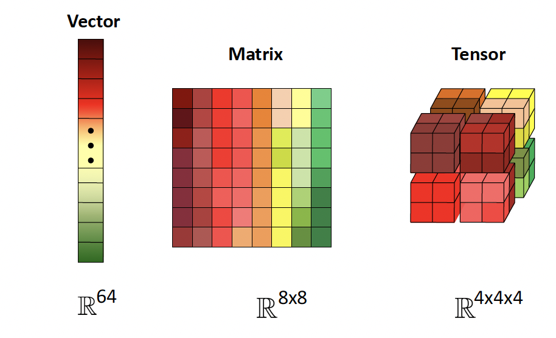
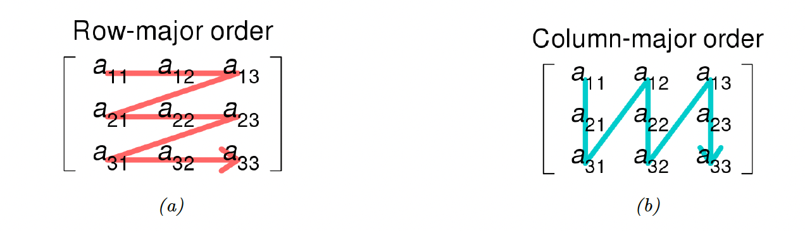
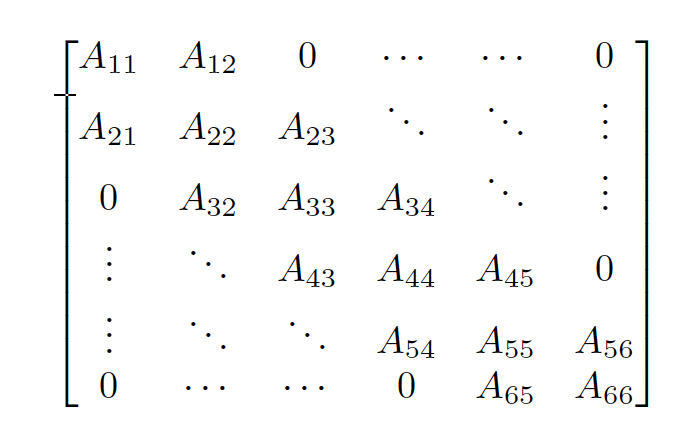

# 7.1 Introduction

### 7.1.1 Notation

**Vector**

A vector $\bold{x}\in \mathbb{R}^n$  is usually written as a column vector:

$$
\bold{x}=\begin{bmatrix}x_1 \\ \vdots \\x_n\end{bmatrix}
$$

The vector of all ones is $\bold{1}$, of all zeros is $\bold{0}$.

The unit or one-hot vector $\bold{e}_i$ is a vector of all zeros except entry $i$ which is $1$.

$$
e_i=(0,\dots, 0,1,0,\dots,0)
$$

**Matrix**

A matrix $\bold{A} \in \mathbb{R}^{n\times m}$ is defined similarly. If $n=m$ the matrix is square.

The transpose of a matrix results in flipping its row and columns: $(A^T)_{ij}=A_{ji}$. Some of its properties:

- $(A^T)^T=A$
- $(A+B)^T=A^T+B^T$
- $(AB)^T=B^TA^T$

A **symmetric** square matrices satisfies $A^T=A$. The set of all symmetric matrices of size $n$ is denoted $\Bbb S^n$.

**Tensor**

A tensor is a generalization of a 2d array:

The rank of a tensor is its number of dimensions.

We can stack rows (resp columns) of a matrix horizontally (resp vertically) to get a C-contiguous or row-major order (resp F-contiguous or columns-major order).

### 7.1.2 Vector spaces

**Spans**

We can view a vector $\bold{x} \in \Bbb R^n$ as a point in n-dimensional Euclidean space. A vector space is a collection of such vector, which can be added together and scale by scalar $c\in\Bbb R$.

A set of vector $\{\bold{x}_1,...,\bold{x}_n\}$ is **linearly independent** if no vector can be represented as a linear combination of the others.

The **span** of $\{\bold{x}_1,...,\bold{x}_n\}$ is the set of all vectors that can be obtained its linear combinations:

$$
\mathrm{span}(\{\bold{x}_1,...,\bold{x}_n\})\triangleq \Big\{v:v=\sum_{i=1}^n \alpha_i \bold{x}_i \;,\alpha_i\in\Bbb R \Big\}
$$

It can be shown that if each $\bold{x_i} \in \mathbb{R}^n$ form a set of linearly independent vectors, then:

$$
\mathrm{span}(\{\bold{x}_1,...,\bold{x}_n\})=\mathbb{R}^n
$$

and therefore any vectors of $\mathbb{R}^n$ can be written as a linear combination of this set of vector.

A basis $\mathcal{B}$ is a set of linearly independent vector that spans the whole space:

$$
\mathrm{span}(\mathcal{B})=\R^n
$$

There are often multiple basis to choose from, a standard one is the coordinate vectors $\bold{e}_i$.

**Linear maps**

A linear map is the transformation $f:\mathcal{V\rightarrow W}$ such that:

- $f(v+w)=f(v)+f(w),\; \forall v,w\in\mathcal{V}$
- $f(av)=af(v)$

Once the basis of $\mathcal{V}$ is chosen, a linear map is completely determined by computing the image basis of $\mathcal{W}$.

Suppose $\mathcal{V}=\mathbb{R}^n,\mathcal{W}=\mathbb{R}^m,$ we can compute $f(\bold{x}_i)\in\mathbb{R}^m$ and store it in $\bold{A} \in \mathbb{R}^{m \times n}$.

We can then compute any $y\in \mathbb{R}^m$ for any $\bold{x}\in\mathbb{R}^n$ by:

$$
y=\Big(\sum_{i=1}^n a_{1,i} x_i, ...,\sum_{i=1}^n a_{m,i} x_i \Big)=\bf Ax
$$

The range of $\bold{A}$ the space reached by the matrix $\bold{A}$:

$$
\mathrm{range}(\bold{A}) \triangleq\{\bold{v}\in \mathbb{R}^m:\bold{v}=\bold{Ax},\;\bold{x}\in\mathbb{R}^n\}
$$

The nullspace is:

$$
\mathrm{nullspace}(\bold{A})\triangleq \{\bold{x}\in \mathbb{R}^n:\bold{Ax=0}\}
$$

**Linear projection**

The projection of $\bold{y} \in \mathbb{R}^m$ onto the span $\{\bold{x}_1,\dots,\bold{x}_n\}$ with $\bold{x}_i \in\mathbb{R}^m$, is:

$$
\bold{v}=\mathrm{Proj}(\bold{y},\{\bold{x}_1,...,\bold{x}_n\})=\argmin_{\bold{v} \in \mathrm{span}(\{x_1,...,x_n\})}||\bold{v}-\bold{y}||_2
$$

And for a full rank matrix $A^{m\times n}$, with $m\geq n$ , we can define the projection of $\bold{y}\in\mathbb{R}^m$ on the range of $A:$

$$
\bold{v}=\mathrm{Proj}(\bold{y},A)=\argmin_{\bold{v}\in \mathcal{R}(a)}||\bold{v-y}||_2=A(A^\top A)^{-1}A^\top y
$$

### 7.1.3 Vector and matrix norms

**Vector norms**

A norms is any function $f:\mathbb{R}^m\rightarrow \mathbb{R}$ that satisfies the following properties:

- non-negativity: $\forall \bold{x} \in \mathbb{R}^n,f(\bold{x})\geq0$
- definiteness: $f(\bold{x})=0\iff \bold{x=0}$
- absolute value homogeneity: $\forall t\in\mathbb{R},f(t\bold{x})=|t|f(\bold{x})$
- triangle inequality: $f(\bold{x}+\bold{y})\leq f(\bold{x})+f(\bold{y})$

Common norms:

- p-norm: $||\bold{x}||_p=\big(\sum_{i=1}^N |x_i|^p\big)^{1/p}$, for $p\ge 1$
- $\ell_1$ or Manhattan: $||\bold{x}||_1=\sum^N_{i=1}|x_i|$
- $\ell_2$ or Euclidean: $||\bold{x}||_2=\sqrt{\sum_{i=1}^N x_i^2}$
    
    also note the square euclidean: $||\bold{x}||^2_2=\bold{x}\bold{x}^\top$
    
- max-norm or Chebyshev: $||\bold{x}||_\infin=\max_i|x_i|$
- zero-norm: $||\bold{x}||_0=\sum_{i=1}^N\mathbb{I}(|x_i|>0)$. This is a pseudo norm since it doesn’t respect homogeneity.

**Matrix norms**

i) Induced norms

Suppose we think of a matrix $A\in\R^{m\times n}$ as defining a linear function $f(\bold{x})=A\bold{x}$.

We define the **induced norm** of $A$ as the maximum amount by which $f$ can lengthen input:

$$
||A||_p=\max_{\bold{x\ne0}} \frac{||A\bold{x}||_p}{||\bold{x}||_p}=\max_{||\bold{x||}=1}||A\bold{x}||_p
$$

In the special case of $p=2$ (the Euclidean norm), the induced norm is the **spectral norm**:

$$
||A||_2= \sqrt{\lambda_{max}(A^\top A)}=\max_i \sigma_i
$$

with $\sigma_i$ the $i$th singular value

ii) Element-wise norms

If we treat a $m\times n$ matrix as a vector of size $m.n$, we can define the $p$-norm:

$$
||A||_p=||\mathrm{vec}(A)||_p=\Big(\sum_i\sum_j a_{ij}^p\Big)^{1/p}
$$

when $p=2$, we get the Frobenius norm:

$$
||A||_F=\sqrt{\sum_i \sum_j a_{ij}^2}=\sqrt{\mathrm{tr}(A^\top A)}
$$

If $A$ is expensive but $Av$ is cheap, we can approximate the F-norm with the Hutchinson trace estimator:

$$
||A||_F^2=\mathrm{tr}(A^\top A)=\mathbb{E}[v^\top A^\top A v]=\mathrm{E}[||Av||_2^2]
$$

with $v \sim \mathcal{N}(0,1)$

iii) Schatten norms

The **Schatten $p$-norms** arise when applying the element-wise $p$-norm to the singular values of a matrix:

$$
||A||_p= \Big(\sum_i \sigma_i^p(A)\Big)^{1/p}
$$

When $p=1$, we get the **nuclear norm** (or **trace norm**):

$$
||A||_*=\mathrm{tr}(\sqrt{A^\top A}) =\sum_i \sigma_i=\sum_i|\sigma_i|=||\sigma||_1
$$

since $\sigma_i\geq0$.

Using this as a regularizer encourages many singular values to become zero, resulting in a low-rank matrix.

When $p=2$, we get the Frobenius norm.

When $p=\infin$, we get the Spectral norm

### 7.1.4 Properties of a matrix

**Trace**

The trace of a square matrix $A\in \mathbb{R}^n$ is:

$$
\mathrm{tr}(A)\triangleq\sum_{i=1}^n a_{ii}=\sum_{i=1}^n \lambda_i
$$

We have the following:

- $\mathrm{tr}(A^\top)=\mathrm{tr}(A)$
- $\mathrm{tr}(A+B)=\mathrm{tr}(A)+\mathrm{tr}(B)$
- $\mathrm{tr}(cA)=c\mathrm{tr}(A)$
- $\mathrm{tr}(AB)=\mathrm{tr}(BA)$
- $\mathrm{tr}(ABC)=\mathrm{tr}(BCA)=\mathrm{tr}(CAB)$

This last property allows to define the trace trick:

$$
\bold{x}^\top A\bold{x}=\mathrm{tr}(\bold{x}^\top A \bold{x})=\mathrm{tr}(\bold{x}\bold{x}^\top A)
$$

In some case, $A$ might be expensive but $Av$  cheap, we can use the Hutchinson trace approximator:

$$
\mathrm{tr}(A)=\mathrm{tr}(A\mathbb{E}[vv^\top])=\mathbb{E}[\mathrm{tr}(Avv^\top)]=\mathbb{E}[\mathrm{tr}(v^\top A v)]
$$

with $\mathbb{E}[vv^\top]=\bold{I}$

**Determinant**

The determinant is a measure of how much a square matrix change a unit volume when viewed as a linear transformation.

With $A\in \mathbb{R}^{n\times n}$:

- $|A|=|A^\top|$
- $|cA|=c^n|A|$
- $|AB|=|A||B|$
- $|A|=0$ iff $A$ is singular
- If $A$ is not singular, $|A|^{-1}=1/|A|$
- $|A|=\prod_{i=1}^n\lambda_i$, where $\lambda_i$ are the eigenvalues of $A$

For a positive definite matrix, $A=LL^\top$ where $L$ is a lower triangle Cholesky decomposition:

$$
|A|=|LL^\top|=|L|^2
$$

so

$$
\log |A|= 2 \log |L|= 2 \log \prod_i L_{ii} = 2 \mathrm{tr}(\log(\mathrm{diag}(L)))
$$

**Rank**

The column (resp row) rank is the dimension spanned by the columns (resp rows) of a matrix, and its a basic fact that they are the same: $\mathrm{rank}(A)$

- For $A \in \mathbb{R}^{n \times m}$, $\mathrm{rank}(A)\leq \min(n,m)$
    
    If equality, $A$ is said to be full rank (it is rank defficient otherwise).
    
- $\mathrm{rank}(A)=\mathrm{rank}(A^\top)=\mathrm{rank}(AA^\top)=\mathrm{rank}(A^\top A)$
- For $B \in \mathbb{R}^{m\times p}$, $\mathrm{rank}(AB)\leq \min(\mathrm{rank}(A),\mathrm{rank}(B))$
- For $A,B \in \mathbb{R}^{n\times m}$, $\mathrm{rank}(A+B)\leq \mathrm{rank}(A)+ \mathrm{rank}(B)$
- A square matrix is invertible iff full rank

**Condition number**

All norms that follow are $\ell_2$.

The condition number of a matrix measures of numerically stable any computation involving $A$ will be:

$$
\begin{align}
\kappa(A)&\triangleq||A||.||A^{-1}||\geq1 \\
&= \sigma_{max}/\sigma_{min}=\sqrt{\lambda_{max}/\lambda_{min}}
\end{align}
$$

If $\kappa$ is close to 1, the matrix is well conditioned (ill-conditioned otherwise).

A large condition means $A$ is nearly singular. This a better measure to nearness of singularity than the size of the determinant.

For exemple, $A=0.1 \bold{I}_{100\times100}$ leads to $|A|=10^{-100}$ but $\kappa(A)=1$, indicating that even though $A$ is nearly singular, it is well conditioned and $A\bold{x}$ simply scales the entry of $\bold{x}$ by 0.1.

### 7.1.5 Special types of matrices

**Diagonal matrices**
All elements are 0 except the diagonal.

$$
\mathrm{diag}(A)=\mathrm{diag}(d_1,...,d_n)
$$

We can convert a vector to a diagonal matrix with this notation

**Identity matrix** $\bold{I}$
Diagonal of ones, with the identity property:

$$
A\bold{I}=\bold{I}A=A
$$

**Block diagonal matrix**

Non zero only on the main diagonal:

$$
\begin{bmatrix}
\bold{A} &\bold{0} \\
\bold{0} &\bold{B}
\end{bmatrix}
$$

**Band-diagonal matrix**
Non-zero entries along k-sides of the diagonal:

**Triangular matrix**
Upper (resp lower) have only non-zero on the diagonal and above (resp below)

Useful property: the diagonal is the eigenvalues, therefore $|L|=\prod_i L_{ii}$

**Positive definite matrices**

A symmetric matrix $A\in\mathbb{S}^n$ is positive definite iff:

$$
\bold{x}^\top A \bold{x} >0
$$

If equality is possible, we call $A$ positive semi-definite.

The set of all positive definite matrices is denoted $\mathbb{S}^n_{++}$

A matrix can also be negative definite or indefinite: there exists $\bold{x}_1$ and $\bold{x}_2$ such that:

$$
\bold{x}_1^\top A\bold{x_1} >0 \;\mathrm{and}\;\bold{x_2} ^\top A \bold{x}_2 <0
$$

Note that a matrix having all positive coefficient doesn’t imply being positive definite ex: $\begin{bmatrix}4 & 3 \\ 3 & 2\end{bmatrix}$

Conversely, it can have negative coefficient.

For a symmetric, real matrix, a sufficient condition for positive definiteness is having the diagonal coefficient “dominate” their rows:

$$
\forall i ,|a_{ii}|> \sum_{j\neq i}|a_{ij}|
$$

The Gram-matrix $G=A^\top A$ is always positive semidefinite.

If $A\in\mathbb{R}^{n,m}$ is full rank and $m\geq n$, then $G$ is positive definite.

**Orthogonal matrices**

- $\bold{x},\bold{y}\in\mathbb{R}^n$ are orthogonal if $\bold{x^\top y}=0$
- $\bold{x}$ is normalized if $||\bold{x}||_2=1$
- A set of vectors that is pairwise orthogonal and normalized is called orthonormal
- $U\in\mathbb{R}^{n\times n}$ is orthogonal if all its columns are orthonormal (note the difference of notation)
    
    If all entries of $U$ are complex valued, we use the term unary instead of orthonormal
    

If $U$ is orthogonal:

$$
U^\top U =\bold{I} =U U^\top
$$

In otherwords, $U^\top=U^{-1}$

One nice property is norm invariance when operating on a vector:

$$
||U\bold{x}||_2=||\bold{x}||_2
$$

with $U\in \mathbb{R}^{n \times n}$ and $\bold{x} \in \mathbb{R}^n$  non-zero

Similarly, the angle is unchanged after a transformation with an orthogonal matrix:

$$
\cos(\alpha(\bold{x,y}))=\frac{\bold{x}^\top \bold{y}}{\bold{||x||}.\bold{|y||}}=\frac{(U\bold{x)}^\top (U\bold{y})}{||U\bold{x}||.||U\bold{y}||}=\cos(\alpha(U\bold{x},U\bold{y}))
$$

In summary, orthogonal matrices are generalization of rotation (if $|U|=1$) and reflections (if $|U|=-1$) since they preserves angle and lenghts.