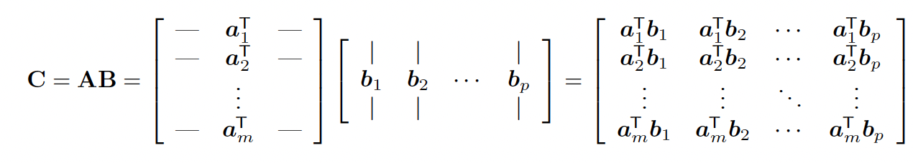

# 7.2 Matrix multiplication

The product of $A\in\mathbb{R}^{m \times n}$ and $B\in\mathbb{R}^{n \times p}$  is $AB=C$ with:

$$
C_{ij}=\sum_{k=1}^n A_{ik}B_{kj}
$$

Note that the number of columns of $A$ must match the number of rows of $B$.

Matrix multiplication complexity averages $O(mnp)$, faster methods exists (like BLAS) and hardware parallelizing the computation, like TPU or GPU.

- Matrix multiplication is associative: $A(BC)=(AB)C$
- Matrix multiplication is distributive: $A(B+C)=AB+BC$
- In general, it is not commutative: $AB\neq BA$

### 7.2.1 Vector-vector products

**Inner product**

Given two vectors $\bold{x}, \bold{y}\in\mathbb{R}^n$, their size is $(n,1)$ . The inner product is the scalar:

$$
\lang\bold{x},\bold{y}\rang=\bold{x}^\top \bold{y}=\sum_{i=1}^n x_iy_i
$$

Note that $\bold{x}^\top\bold{y}=\bold{y}^\top\bold{x}$

**Outer product**

Given two vectors $\bold{x}\in \mathbb{R}^n$ and $\bold{y}\in \mathbb{R}^m$ (they no longer have the same size), the outer product is a matrix $\mathbb{R}^{n\times m}$:

$$
\bold{x}\bold{y}^\top=\begin{bmatrix}x_1y_1 & \dots & x_1y_m \\ \vdots &\ddots & \vdots \\ x_n y_1 & \dots & x_n y_m\end{bmatrix}
$$

### 7.2.2 Vector-matrix products

Given matrix $A\in\mathbb{R}^{m\times n}$ and $\bold{x} \in \mathbb{R}^{n}$, the product is $\bold{y}=A\bold{x} \in \mathbb{R}^m$

This can be viewed as inner product on rows:

$$
\bold{y}=\begin{bmatrix}
a_1^\top \bold{x}\\
\vdots \\
a_m^\top\bold{x}\end{bmatrix}
$$

Or linear combination on columns:

$$
\bold{y}=
\begin{bmatrix}| \\a_1\\|\end{bmatrix}x_1+\dots+\begin{bmatrix}| \\a_n\\|\end{bmatrix}x_n
$$

In this latter view, A is a set of basis vectors defining a linear subspace.

### 7.2.3 Matrix-matrix products

The main view is a inner product between row vectors of $A$ and columns vectors of $B$:

If $A\in\mathbb{R}^{n\times m}$ and $B\in\mathbb{R}^{m\times d}$, then $C\in\mathbb{R}^{n\times d}$

### 7.2.4 Matrix manipulations

**Summing slices**

Let $X\in\mathbb{R}^{n\times d}$, we can average rows of $X$ by pre-multiplying a vector of ones:

$$
\bar{\bold{x}}^\top=\frac{1}{N}\bold{1}_N^\top X= \begin{bmatrix}\sum_{i=1}^n x_{i1}&\dots & \sum_{i=1}^nx_{id}\end{bmatrix}
$$

Conversely, we can average columns by post-multiplying.

Hence, the overall mean is given by:

$$
\bar{x}=\frac{1}{ND}\bold{1}_N^\top X \bold{1}_D
$$

**Scaling**

If we pre-multiply $X$ by a diagonal matrix $S$, we scale each row by $s_i$:

Conversely, we scale columns by post-multiplying $X$ with the diagonal matrix $S$

Therefore, the normalization operation can be written:

$$
X^{std}=(X-\bold{1}_N\mu^\top)\mathrm{diag}(\sigma)^{-1}
$$

where $\mu$ is the empirical mean vector and $\sigma$ the empirical standard deviation vector.

**Scatter matrix**

The sum of squares matrix $S_0\in\mathbb{R}^{D\times D}$  is:

$$
S_0\triangleq X^\top X=\sum_{i=1}^Nx_ix_i^\top 
$$

The scatter matrix $S_{\bar{x}}\in\mathbb{R}^{D\times D}$ is:

$$
S_{\bar{x}}\triangleq\sum_{i=1}^N(x_i-\bar{x})(x_i-\bar{x})^\top=\sum_{i=1}^N x_i x_i^\top-N\bar{x}\bar{x}^\top
$$

The Gram matrix $K\in\mathbb{R}^{N\times N}$ is:

$$
K\triangleq XX^\top
$$

The square pairwise distance between $X\in \mathbb{R}^{m\times d}$ and $Y\in\mathbb{R}^{n \times d}$ is:

$$
D_{ij}=||x_i-y_j||^2_2=(x_i-y_j)^\top(x_i-y_j)=||x_i||^2_2-2x_i^\top y_j+||y_j||^2_2
$$

This can also we written as:

$$
D= \hat{x}\bold{1}_m-2XY^\top+\bold{1}_n\hat{y}
$$

where $\hat{x}=diag(XX^\top)$

### 7.2.5 Kronecker products

$A\in\mathbb{R}^{m\times n}$ and $B\in\mathbb{R}^{p\times q}$, then the Kronecker product belongs to $\mathbb{R}^{mp\times nq}$:

$$
A \otimes B= \begin{bmatrix} 
a_{11}B & \dots & a_{1n}B \\
\vdots & \ddots & \vdots \\
a_{m1}B & \dots & a_{mn}B
\end{bmatrix}
$$

Some useful properties:

$(A\otimes B)^{—1}=A^{-1}\otimes B^{-1}$

$(A \otimes B)\mathrm{vec}(C)=\mathrm{vec}(BCA^\top)$

### 7.2.6 Einstein summation

Einsum consists in removing the $\sum$ operator for matrix and tensor products:

$$
C_{ij}=\sum_k A_{ik}B_{kj} \Rightarrow A_{ik}B_{kj} 
$$

And for more complex operations:

$$
L_{nc}=\sum_d\sum_k\sum_t S_{ntk}W_{kd}V_{dc} \Rightarrow S_{ntk}W_{kd}V_{dc}
$$

Einsum can perform computations in an optimal order, minimizing time and memory allocation.