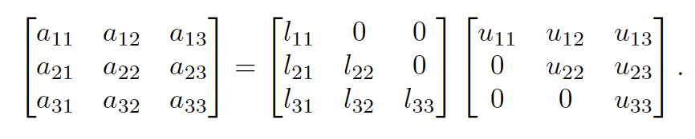
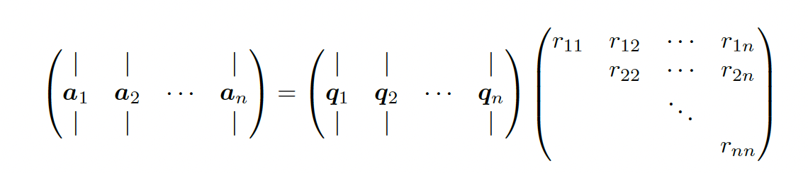

# 7.6 Other matrix decompositions

### 7.6.1 LU Factorization

We can factorize any square matrix $A$ into a lower and upper triangle matrix $L$ and $U$:

We might need to reorder the rows at each iteration so that the first element of $A$ is non-zero: if $a_{11}=l_{11}u_{11}=0$ then either $U$ or $L$ is singular.

$$
PA=LU
$$

where $P$ is a permutation matrix, i.e. a square binary matrix where $a_{ij}=1$ means permuting row $i$ with row $j$.

### 7.6.2 QR Decomposition

Suppose we have $A\in\mathbb{R}^{m\times n}$ a set of linearly independent basis vectors. We want to find a series of orthonormal vectors $\bold{q}_1,\bold{q}_2,\dots$ that span the successive subspace of $\mathrm{span}(\bold{a}_1),\mathrm{span}(\bold{a}_1, \bold{a}_2),\dots$ 

We have:

$$
\begin{align}
\bold{a}_1&=\bold{q}_1 r_{11}\\
\bold{a}_2&=\bold{q}_1 r_{12} + \bold{q}_2 r_{22}\\
\vdots \\
\bold{a}_n&=\bold{q}_1 r_{1n}+\dots+\bold{q}_nr_{nn}
\end{align}

$$

and thus:

$$
A=QR
$$

with $Q \in \mathbb{R}^{m\times n}$ and $R \in \mathbb{R}^{n\times n}$

### 7.6.3 Cholesky decomposition

Any symmetric positive definite matrix can be decomposed as $A=LL^\top$ where $L$ is a lower triangular with real, positive diagonal elements. The complexity is $O(V^3)$.

**7.6.3.1 Application: sampling from an MVN**

Let $y\sim \mathcal{N}(\mu,\Sigma)$. We can easily sample from $x \sim \mathcal{N}(0, I)$ since it requires sampling from $d$ separate 1d Gaussians.

Let $\Sigma=LL^\top$, we then set $y=Lx+\mu$.

We can check that:

$$
Cov[y]=LCov[x]L^\top=LI L^\top=\Sigma
$$