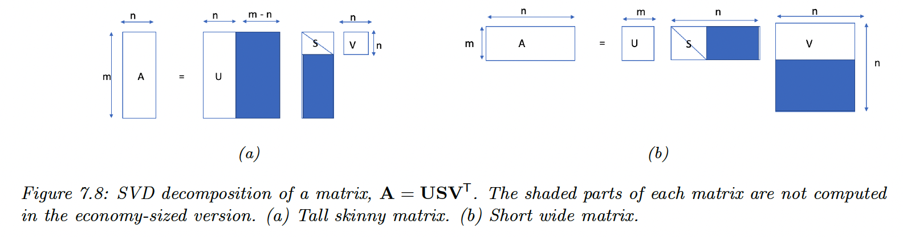
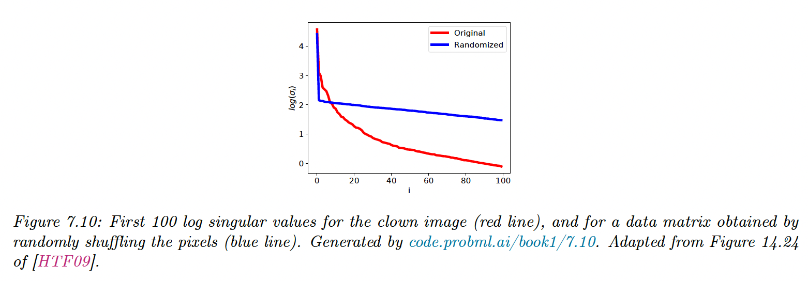

# 7.5 Singular Value Decomposition (SVD)

SVD generalizes EVD to rectangular matrices. Even for square matrices, an EVD does not always exist, whereas an SVD always exists.

### 7.5.1 Basics

Any real $m\times n$ matrix can be decomposed as:

$$
A=USV^\top=\sigma_1 \begin{bmatrix}| \\u_1 \\ |\end{bmatrix} \begin{bmatrix}— v_1^\top—\end{bmatrix}+\dots+\sigma_r \begin{bmatrix}| \\u_r \\ |\end{bmatrix} \begin{bmatrix}— v_r^\top—\end{bmatrix}
$$

with $U$and $V$ orthogonal matrices (left and right singular vectors): 

- $UU^\top=I_m$
- $VV^\top=I_n$
- $S$ is a $m\times n$ matrix, containing the rank $r=\min(m,n)$ singular values $\sigma_i\geq0$.

The cost of computing the SVD is $O(\min(mn^2,m^2n))$

### 7.5.2 Connection between EVD and SVD

If $A$ is real, symmetric, and positive definite, then the singular values are equal to the eigenvalues:

$$
A=USV^\top=USU^\top
$$

More generally, we have:

$$
A^\top A= (VS^\top U^\top)(USV^\top)=V(S^\top S)V^\top
$$

Hence:

$$
(A^\top A) V= V D_n
$$

- $\mathrm{evec}(A^\top A)=V$ and $\mathrm{evec}(A A^\top)=U$
- $\mathrm{eval(A^\top A})=D_n$ and $\mathrm{eval(AA^\top})=D_m$
- In the economy size SVD: $D=S^2=S^\top S=S^\top S$

### 7.5.3 Pseudo inverse

The Moore-Penrose pseudo-inverse of $A$ is denoted $A^\dagger$ and has the following properties:

$$
\begin{align}
AA^\dagger A&= A \\
A^\dagger A A^\dagger&=A^\dagger \\
(A A^\dagger)^\top&=A A^\dagger
\\
(A^\dagger A)^\top &=A^\dagger A
\end{align}
$$

If $A$ is square and non-singular, then $A^\dagger=A^{-1}$

If $m>n$ and all columns of $A$  are linearly independent (i.e. $A$ is full-rank):

$$
A^\dagger=(A^\top A)^{-1}A^\top
$$

In this case, $A^\dagger$  is the left inverse of $A$ (but not its right inverse):

$$
A^\dagger A=I
$$

We can also compute the pseudo-inverse using the SVD:

$$
A^\dagger=V \mathrm{diag}(\begin{bmatrix}1/\sigma_1,\dots,1/\sigma_r,0,\dots,0\end{bmatrix} )U^\top
$$

When $n<m$, the right inverse of $A$ is:

$$
A^\dagger=A^\top(AA^\top)^{-1}
$$

and we have:

$$
AA^\dagger=I
$$

### 7.5.4  SVD and the range and null space

We show that the left and right singular vectors form an orthonormal basis for the range and nullspace.

We have:

$$
A\bold{x}=\sum_{j=1}^r \sigma_j (\bold{v}_j^\top \bold{x})\bold{u}_j
$$

where $r$ is the rank of $A$.

Thus $A\bold{x}$  can be written as any linear combination of left singular vectors $\bold{u_1},...,\bold{u_r}$:

$$
\mathrm{range}(A)=\mathrm{span}(\{\bold{u}_j:\sigma_j>0\})
$$

with dimension $r$.

For the nullspace, we define $\bold{y}\in\mathbb{R}^n$ as a linear combination of the right singular vectors for the zero singular values:

$$
\bold{y}=\sum_{j=r+1}^n c_j \bold{v}_j
$$

Then:

$$
A\bold{y}=U\begin{bmatrix}\sigma_1 \bold{v}_1^\top \bold{y}
\\
\vdots
\\
\sigma_r \bold{v}_r^\top \bold{y} \\
\sigma_{r+1} \bold{v}_{r+1}^\top \bold{y}
\\
\vdots \\
\sigma_n \bold{v}_n^\top \bold{y}\end{bmatrix}=U\begin{bmatrix}\sigma_1 0
\\
\vdots
\\
\sigma_r 0 \\
0 \bold{v}_{r+1}^\top \bold{y}
\\
\vdots \\
0 \bold{v}_n^\top \bold{y}\end{bmatrix}=U\bold{0}=\bold{0}
$$

Hence:

$$
\mathrm{nullspace}(A)=\mathrm{span}(\{\bold{v}_j:\sigma_j=0\})
$$

with dimension $n-r$.

We see that:

$$
\mathrm{dim(range}(A))+\mathrm{dim(nullspace(}A))=n
$$

This is also written: $\mathrm{rank+nullity}=n$

### 7.5.5 Truncated SVD

Let $A_K=U_KS_KV_K^\top$ where we use the $K$ first columns. This can be shown to be the optimal rank $K$ approximation of $A$ in the sense of:

$$
||A-A_K||_F=\sum_{k=K+1}^r \sigma_k
$$

If $K<r=\mathrm{rank}(A)$, we incur some error: this is the truncated SVD.

The number of parameters needed to represent an $M \times N$ matrix is $K (M+N+1)$.

