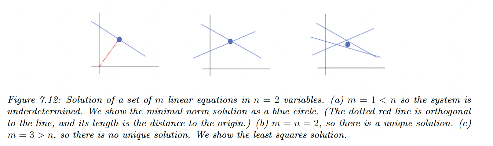
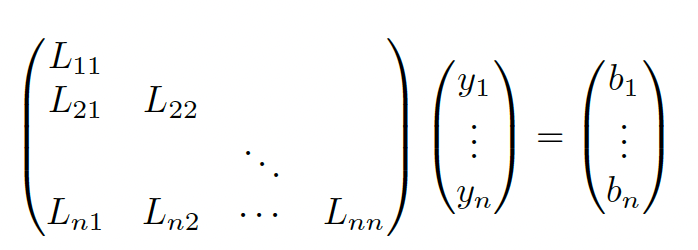

# 7.7 Solving systems of Linear Equation

We can formulate linear equations in the form of $A\bold{x}=\bold{b}$.

If we have $m$ equations and $n$ unknowns, then $A$ will be a $m\times n$ matrix and $\bold{b}$ a $m\times 1$ vector.

- If $m=n$ and $A$ is full rank, there is a single unique solution
- If $m<n$ the system is underdetermined so there is no unique solution
- If $m>n$ the system is overdetermined, not all the lines intersect at the same point

### 7.7.1 Solving square systems

When $m=n$, we can solve the LU decomposition for $\bold{x}$.

$$
\begin{align}
A\bold{x}&=\bold{b} \\
LU\bold{x}&=\bold{b} \\
U\bold{x}&=L^{-1}\bold{b}\triangleq\bold{y} \\
\bold{x}&=U^{-1}\bold{y}
\end{align}
$$

The point is that $L$ and $U$ are triangular, so we don’t need to compute the inverse and can use back substitution instead. For $L^{-1}\bold{b}=\bold{y}$

We start by solving $y_1=b_1/L_{11}$, then we substitute it into $L_{12}y_1+L_{22}y_2=b_2$ and iterate.

Once we have $\bold{y}$, we can apply the same computation for $x=U^{-1}\bold{y}$.

### 7.7.2 Solving under-constrained systems (least norm estimation)

We assume $m<n$ and $A$  to be full-rank, so there are multiple solutions:

$$
\{\bold{x}:A\bold{x}=\bold{b}\}=\{\bold{x}_p+\bold{z}:\bold{z}\in\mathrm{nullspace}(A)\}
$$

Where $\bold{x}_p$ is any solution. It is standard to pick the solution minimizing the $\ell_2$ regularization:

$$
\hat{\bold{x}}=\argmin_{\bold{x}}||\bold{x}||^2_2,\;s.t.\;A\bold{x=b}
$$

We can compute the minimal norm solution using the **right pseudo inverse**:

$$
\bold{x}=A^\top(AA^\top)^{-1}\bold{b}
$$

We can also solve the constrained optimization problem by minimizing the norm:

$$
\begin{align}
\mathcal{L}(\bold{x},\lambda)&=\bold{x}^\top\bold{x}+\bold{\lambda}^\top (A\bold{x-b})\\
\nabla_\bold{x}\mathcal{L}&=2\bold{x} +A^\top\bold{\lambda}=\bold{0} \\
\nabla_{\lambda}\mathcal{L}&= A\bold{x}-b=\bold{0}
\end{align}
$$

Therefore:

$$
\begin{align}
\bold{x}&=-\frac{1}{2}A^\top\lambda \\
A\bold{x}&= -\frac{1}{2}AA^\top \lambda=b \Rightarrow \lambda=-2(AA^\top)^{-1}b
\end{align}
$$

Finally we find the right pseudo inverse again:

$$
\bold{x}=A^\top(AA^\top)^{-1}b
$$

### 7.7.3 Solving over-constrained systems (least square estimation)

If $m>n$, we’ll try to find the closest solution satisfying all constrained specified by $A\bold{x=b}$, by minimizing the least square objective:

$$
f(\bold{x})=\frac{1}{2}||A\bold{x}-b||^2_2
$$

We know that the gradient is:

$$
g(\bold{x})=\frac{\partial}{\partial \bold{x}} f(\bold{x})=A^\top(A\bold{x}-b)=A^\top A\bold{x}-A^\top b
$$

Hence the solution is the OLS:

$$
\hat{\bold{x}}=(A^\top A)^{-1}A^\top b
$$

With $A^\dagger=(A^\top A)^{-1} A^\top$  the left pseudo inverse.

We can check that this solution is unique by showing that the Hessian is positive definite:

$$
h(\bold{x})=\frac{\partial^2}{\partial^2\bold{x}}f(\bold{x})=A^\top A
$$

Which is positive definite if $A$ is full-rank since for any $\bold{v}>\bold{0}$ we have:

$$
\bold{v}^\top A^\top A \bold{v}=(A\bold{v})^\top (A\bold{v})=||A\bold{v}||^2 >0
$$