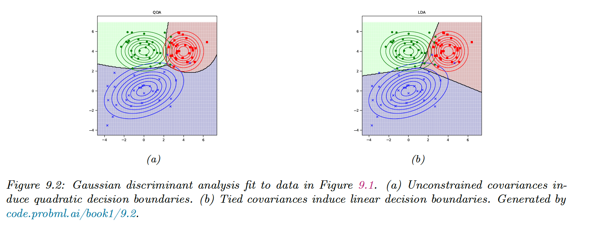

# 9.2 Gaussian Discriminant Analysis

The GDA is a generative classifier where the class conditional densities are multivariate Gaussian:

$$
p(x|y=c,\theta)=\mathcal{N}(x|\mu_c,\Sigma_c)
$$

The corresponding class posterior has the form:

$$
p(y=c|x,\theta) \propto \pi_c \mathcal{N}(x|\mu_c,\Sigma_c)
$$

### 9.2.1 Quadratic decision boundaries

The log posterior over the class labels is:

$$
\log p(y=c|x,\theta)=\log \pi_c- \frac{1}{2}\log |2\pi \Sigma_c | -\frac{1}{2} (x-\mu_c)^\top \Sigma_c^{-1} (x-\mu_c)+const
$$

This is called the discriminant function. The decision function between two classes, $c$ , and $c'$, is a quadratic function of $x$.

This technique is called Quadratic Discriminant Analysis (QDA).

### 9.2.2 Linear decision boundaries

We now consider the case of shared covariance, $\Sigma_c=\Sigma$:

$$
\begin{align}
\log p(y=c|x,\theta)&=\log \pi_c - \frac{1}{2}(x-\mu_c)^\top \Sigma^{-1}(x-\mu_c)+const \\
&= \underbrace{\log \pi_c -\frac{1}{2}\mu_c^\top \Sigma^{-1} \mu_c}_{\gamma_c} +x^\top\underbrace{\Sigma^{-1}\mu_c}_{\beta_c} -\underbrace{\frac{1}{2}x^\top\Sigma x +const}_{\kappa} \\
&= \gamma_c+x^\top \beta_c -\kappa
\end{align}
$$

$\kappa$ is a residual term across classes that can be removed.

This is called the Linear Discriminant Analysis (LDA).

### 9.2.3 Connection between LDA and Logistic Regression

From the LDA equation, we can write:

$$
p(y=c|x,\theta)=\frac{e^{\beta_c^\top x+\gamma_c}}{\sum_{c'}e^{\beta_{c'}^\top x+\gamma_{c'}}}
$$

- In LDA, we first fit the Gaussians (and class prior) to fit the joint likelihood $p(x,y|\theta)$, then we use $\theta$ to derive $w_c=[\gamma_c,\beta_c]$
- In Logistic Regression, we estimate $w$ directly to maximize the conditional likelihood $p(y|x,\theta)$

In the binary case, this resume to:

$$
\begin{align}
p(y=1|x,\theta)&=\frac{1}{1+\exp \Big((\beta_0-\beta_1)^\top x+\gamma_0-\gamma_1\Big)}\\&=\sigma((\beta_1-\beta_0)^\top x+\gamma_1-\gamma_0)
\end{align}
$$

With:

$$
\begin{align}
\gamma_1-\gamma_0&=\frac{1}{2}\mu_0^\top \Sigma^{-1} \mu_0 -\frac{1}{2}\mu_1^\top \Sigma^{-1} \mu_1+\log \frac{\pi_1}{\pi_0} \\ &= (\mu_0-\mu_1)^\top\Sigma^{-1}(\mu_0-\mu_1)+\log \frac{\pi_1}{\pi_0}
\end{align}
$$

And by setting:

$$
\begin{align}
w&=\beta_1-\beta_0 \\
w^\top x_0&=-(\gamma_1-\gamma_0)
\end{align}
$$

We end up with the binary logistic regression:

$$
p(y=1|x,\theta)=\sigma\big(w^\top (x-x_0)\big)
$$

The MAP decision rule is:

$$
\hat{y}(x)=1 \quad \mathrm{iff} \quad w^\top x>w^\top x_0
$$

In the case where $\pi_0=\pi_1$ and $\Sigma=\sigma^2I$, we end up with projecting $x$ on the $w=\sigma^{-2}(\mu_0-\mu_1)$ line and compare it to the centroid, $x_0$.

### 9.2.4 Model fitting

We now discuss how to fit the GDA model using MLE. The likelihood is:

$$
p(\mathcal{D}|\theta)=\prod_{n=1}^N \mathrm{Cat}(y_n|\pi)\prod_{c=1}^C\mathcal{N}(x_n|\mu_c,\Sigma_c)^{\mathbb{I}(y_n=c)}
$$

Hence the log-likelihood is:

$$
\log p(\mathcal{D}|\theta)= \sum_{n=1}^N \sum_{c=1}^C \mathbb{I}(y_n=c)\log \pi_c+ \sum^C_{c=1} \sum_{n:y_n=c} \log\mathcal{N}(x_n|\mu_c,\Sigma_c)
$$

We can optimize $\pi_c$ and $(\mu_c,\Sigma_c)$ separately:

- From section 4.2.4, we have that the MLE of the prior is $\hat{\pi}_c=\frac{N_c}{N}$
- From section 4.2.6, the MLE for the Gaussian is:

$$
\begin{align}
\hat{\mu}_c&=\frac{1}{N_c}\sum_{n:y_n=c} x_n \\
\hat{\Sigma}_c &= \frac{1}{N_c}\sum_{n:y_n=c} (x_n-\hat{\mu}_c)(x_n-\hat{\mu}_c)^\top
\end{align}
$$

Unfortunately, the MLE for $\hat{\Sigma}_c$ can easily overfit if $N_c<D$. Below are some workarounds.

**9.2.4.1 Tied covariance**

If we tied covariance matrices $\Sigma_c=\Sigma$, we get linear boundaries. This also allows pooling from all samples:

$$
\hat{\Sigma}=\frac{1}{N}\sum_{c=1}^C \sum_{n:y_n=c}(x_n-\hat{\mu}_c)(x_n-\hat{\mu}_c)^\top
$$

**9.2.4.2 Diagonal covariance**

If we force $\Sigma_c$ to be diagonal, we reduce the number of parameters from $O(C D^2)$ to $O(CD)$, which avoids the overfitting problem. However, we lose the ability to capture the correlation between features (this is the Naive Bayes assumption).

We can restrict further the model using a tied diagonal matrix: this is the diagonal LDA.

**9.2.4.3 MAP estimation**

Forcing the covariance to be diagonal is a rather strong assumption. Instead, we can perform a MAP estimation from section 4.5.2:

$$
\hat{\Sigma}_{map} = \lambda \mathrm{diag}(\hat{\Sigma}_{mle})+(1-\lambda)\hat{\Sigma}_{mle}
$$

This technique is called regularized discriminant analysis (RDA).

### 9.2.5 Nearest Centroid Classifier

If we assume a uniform prior over classes, we compute the most probable labels as:

$$
\hat{y}(x)=\argmax_c \log p(y=c|x,\theta)=\argmin_c (x-\mu_c)\Sigma^{-1}(x-\mu_c)^\top
$$

This is called the **nearest centroid classifier**, where the distance is measured using squared Mahalanobis distance.

We can replace this distance with any other distance metrics:

$$
\hat{y}(x)=\argmin_c d^2(x,\mu_c)
$$

We can learn distance metrics with one simple approach:

$$
d^2(x,\mu_c)=||x-\mu_c||_W^2=(x-\mu_c)^\top(WW^\top)(x-\mu_c) = ||W(x-\mu_c)||^2
$$

The class posterior becomes:

$$
p(y=c|x,\mu,W)=\frac{\exp(-\frac{1}{2}||W(x-\mu_c)||^2_2)}{\sum_{c'}\exp(-\frac{1}{2}||W(x-\mu_{c'}||^2_2)}
$$

We can optimize $W$ using gradient descent applied to the discriminative loss. This is called **nearest class mean metric learning**. 

This technique can be used for **one-shot learning** of new classes since we just need to see a single labeled $\mu_c$ per class (assuming we have a good $W)$.

### 9.2.6 Fisher LDA

Discriminant analysis is a generative approach to classification, that requires fitting MVN to the feature. This might be problematic in high dimensions.

An alternative could be to reduce the features to $z\in\mathbb{R}^K$ and then to fit MVN, by finding $W\in\mathbb{R}^{K\times D}$ so that $z=Wx$ .

- The simplest way is using a PCA, but this is a non-supervised technique, and not taking the labels into account could lead to suboptimal low-dimensional features
- Alternatively, we could use a gradient-based method to optimize the log-likelihood, derived from the posterior in the low dimensional space, as we did with the **nearest class mean metric learning**
- A third approach relies on eigenvalues decomposition, by finding $W$ so that the low dimensional data can be classified as well as possible using a Gaussian class-conditional density model: this is Fisher’s linear discriminant analysis (FLDA)

The drawback of FLDA is that we don’t take into account the dimensionality $D$, since we reduce it to $K\leq C-1$.

In the two classes cases, we are seeking a single vector $w$ onto which we project the data.

**9.2.6.1 Derivation of the optimal 1d projection**

We now estimate the optimal direction $w$. The class-conditional means are:

$$
\mu_k=\frac{1}{N_k}\sum_{n:y_n=k}x_n\quad \forall k\in\{1,2\}
$$

$m_k=w^\top \mu_k$ is the projection of the mean on the line, and $z_n=w^\top x_n$ is the data projection. The variance of the projected data is:

$$
s_k^2=\sum_{n:y_n=k}(z_n-m_k)^2
$$

The goal is to maximize the distance between the conditional means, while minimizing the variance of the projected clusters. We maximize:

$$
\begin{align}
J(w)&=\frac{(m_2-m_1)^2}{s^2_1+s^2_2} \\
&= \frac{w^\top S_Bw}{w^\top S_W w}
\end{align}
$$

where:

- $S_B=(\mu_2-\mu_1)(\mu_2-\mu_1)^\top$ is the between-class scatter matrix
- $S_W=\sum_{n:y_n=1}(x_n-\mu_1)(x_n-\mu_1)^\top +\sum_{n:y_n=2}(x_n-\mu_2)(x_n-\mu_2)^\top$

$J(w)$ is maximize when:

$$
S_B w=\lambda  S_W w
$$

with $\lambda=\frac{w^\top S_B w}{w^\top S_W w}$

Therefore, if $S_W$ is invertible:

$$
\begin{align}
S_W^{-1}S_Bw &=\lambda w\\
&= S_W^{-1}(\mu_2-\mu_1)(m_2-m_1)
\end{align}
$$

Therefore:

$$
w \propto S_W^{-1}(\mu_2-\mu_1)
$$

And since we only care about the direction and not the scale:

$$
w=S_W^{-1}(\mu_2-\mu_1)
$$

If $S_W\propto I$, $w$ is proportional to $\mu_2-\mu_1$, which is intuitive.

**9.2.6.2 Multiple classes**

We now define:

$$
\begin{align}
z_n&=Wx_n\\
m_c&=\frac{1}{N_c}\sum_{n:y_n=c} z_n\\
m&=\frac{1}{N}\sum_c N_c m_c
\end{align}
$$

We have the following scatter matrices:

$$
\begin{align}
\tilde{S}_B&=\sum_{c=1}^C N_c (m_c-m)(m_c-m)^\top \\
\tilde{S}_W&=\sum_{c=1}^C \sum_{n:y_n=c}(z_n-m_c)(z_n-m_c)^\top
\end{align}
$$

The objective function is:

$$
J(w)=\frac{|\hat{S}_B|}{|\hat{S}_W|}=\frac{|W^\top S_B W|}{|W^\top S_W W|}
$$

This is maximize by:

$$
W=S_W^{-1/2}U
$$

where $U$ are the $K$ leading eigenvectors of $S_W^{-1/2}S_B S_W^{-1/2}$, assuming $S_W$ non singular.

We see that FLDA discriminates classes better than PCA, but is limited to $K\leq C-1$ dimensions, which limits its usefulness.

