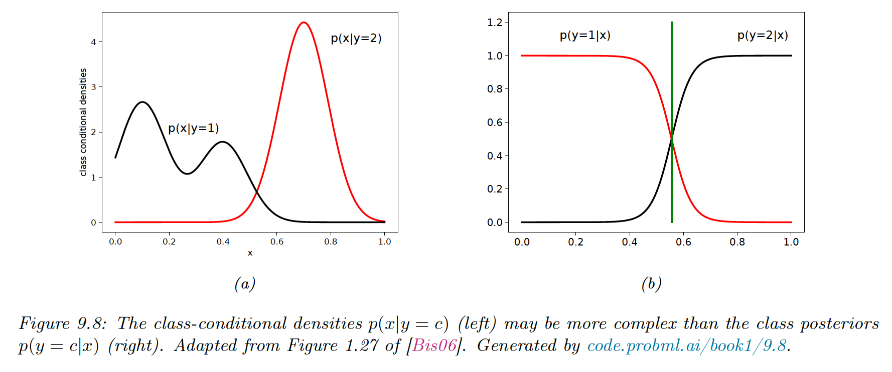

# 9.4 Generative vs Discriminative classifiers

A model of the form $p(x,y)=p(y)p(x|y)$ is generative since it can be used to generate features given the target.

A model of the form $p(y|x)$ is discriminative since it can only be used to discriminate between the targets.

### 9.4.1 Advantages of the Discriminative Classifiers

- **Better predictive accuracy** because $p(y|x)$ is often much simpler to learn than $p(x,y)$.

- **Can arbitrarily handle feature preprocessing**, for example, polynomial expansion of the feature inputs, or replace strings with embeddings. It is hard to do with generative models since the new features can be correlated in complex ways.
- **Well-calibrated probabilities.** Some generative models like NBC make strong and often invalid independence assumptions, leading to extreme posterior class probabilities (near 0 and 1).

### 9.4.2. Advantages of the Generative Classifiers

- **Easy to fit**, the NBC only needs counting and averaging, whereas Logistic Regression needs to solve a convex optimization problem and Neural Nets non-convex optimizations.
- **Can easily handle missing values** by filling them with the fitted generative model (can be the empirical mean for each variable)
- **Can fit classes separately**, we estimate each class density independently. With discriminative models, however, all parameters interact so we need to retrain the model if we add new classes.
- **Can handle unlabeled training data**, it is easy to use generative models for semi-supervised learning, in which we combine labeled data $\mathcal{D}_{xy}=\{(x_n,y_n)\}$ and unlabeled data $\mathcal{D}_x=\{x_n\}$. Discriminative classifiers have no uniquely optimal way to leverage $\mathcal{D}_x$.
- **May be more robust to spurious features**, a discriminative model $p(y|x)$ may choose features that discriminate $y$ well on the training set, but hardly generalize outside of it. By contrast, generative models $p(x|y)$ may be better at capturing the causal mechanism underlying the data generative process, and hence be more robust to distribution shifts.

### 9.4.3 Handling missing features

 

With a generative model, we can easily deal with missing parts of $x$ during training or testing (we assume a MAR situation).

For example, suppose we don’t have access to $x_1$, we have to compute:

$$
\begin{align}
p(y=c|x_{2:D},\theta)&\propto p(y=c|\pi) p(x_{2:D}|y=c,\theta)\\
&= p(y=c|\pi) \sum_{x_1}p(x_1,x_{2:D}|y=c,\theta)
\end{align}
$$

If we make the Naive Bayes assumption, it leads to:

$$
\begin{align}
\sum_{x_1}p(x_1,x_{2:D}|y=c,\theta)&= \sum_{x_1} p(x_1|y=c,\theta)\prod_{d=2}p(x_d|y=c,\theta)\\
&= \prod_{d=2}p(x_d|y=c,\theta)
\end{align}
$$