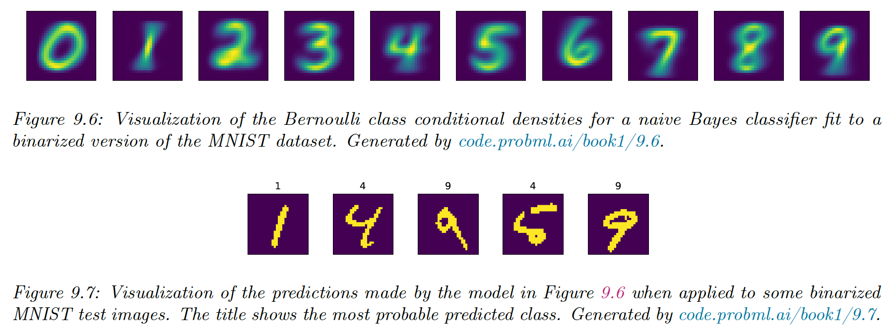

# 9.3 Naive Bayes classifiers

We discuss a simple generative approach where all features are considered conditionally independent given the class label.

Even if this assumption is not valid, it results in good classifiers. Since the model has only $O(CD)$ features, it is immune to overfitting.

We use the following class conditional density:

$$
p(x|y=c,\theta)=\prod_{d=1}^D p(x_d|y=c,\theta_{cd})
$$

Hence, the posterior is:

$$
p(y=c|x,\theta)=\frac{p(y=c|\pi)\prod_{d=1}^D p(x_d|y=c,\theta_{cd})}{\sum_{c'} p(y=c'|\pi)\prod_{d=1}^D p(x_d|y=c',\theta_{c'd})}
$$

where $\pi_c$ is the prior probability density, and $\theta=(\pi,\{\theta_{dc}\})$ are all the parameters.

### 9.3.1 Example models

We need to specify the conditional likelihood, given the nature of the features:

- If $x_d$ is binary, we can use the Bernoulli distribution:

$$
p(x|y=c,\theta)=\prod_{d=1}^D Ber(x_d|\theta_{dc})
$$

where $\theta_{dc}$ is the probability that $x_d=1$ in class $c$.

This is called the **Bernoulli multivariate naive model**. This approach to MNIST has a surprisingly good 84% accuracy.

- If $x_d$ is categorical, we can use the categorical distribution:

$$
p(x|y=c,\theta)=\prod_{d=1}^D Cat(x_d|\theta_{cd})
$$

- If $x_d \in \mathbb{R}$, we use the Gaussian distribution:

$$
p(x|y=c,\theta)=\prod_{d=1}^D \mathcal{N}(x_d|\mu_{dc},\sigma^2_{dc})
$$

### 9.3.2 Model fitting

We can fit the Naive Bayes Classifier using the MLE:

$$
\begin{align}
p(\mathcal{D}|\theta)&=\prod_{n=1}^N Cat(y_n|\pi) \prod_{d=1}^D p(x_{nd}|y_n,\theta_{d}) \\
&= \prod_{n=1}^N Cat(y_n|\pi) \prod_{d=1}^D \prod_{c=1}^C p(x_{nd}|y_n,\theta_{dc})^{\mathbb{I}(y_n=c)}
\end{align}
$$

So:

$$
\log p(\mathcal{D}|\theta)=\sum_{n=1}^N \sum_{c=1}^C \mathbb{I}(y_n=c)\log \pi_c+\sum_{c=1}^C \sum_{d=1}^D \sum_{n:y_n=c} \log p(x_{nd}|y_n,\theta_{dc})
$$

The MLE for the prior is:

$$
\hat{\pi}_c=\frac{N_c}{N}
$$

The MLE for $\theta_{dc}$ depends on the class conditional density:

- If $x_d$  is binary, we use the Bernoulli, so:

$$
\hat{\theta}_{dc}=\frac{N_{dc}}{N_c}
$$

- If $x_d$ is categorical, we use the Categorical, so:

$$
\hat{\theta}_{dck}=\frac{N_{dck}}{\sum_{k'}N_{dck'}}=\frac{N_{dck}}{N_{c}}
$$

- If $x_d\in\mathbb{R}$, the Gaussian gives us:

$$
\begin{align}
\hat{\mu}_{cd}&=\frac{1}{N_c}\sum_{n:y_n=c} x_{nd} \\
\sigma^2&=\frac{1}{N_c}\sum_{n:y_n=c}(x_{nd}-\hat{\mu}_{cd})^2
\end{align}
$$

### 9.3.3 Bayesian Naive Bayes

We now compute the posterior distribution over the parameters. Let's assume we have categorical features, so:

$$
p(x_d|\theta_{dc})=Cat(x_d|\theta_{dc})
$$

where $\theta_{dck}=p(x_d=k|y=c)$.

We show in section 4.6.3 that the conjugate is the Dirichlet distribution:

$$
p(\theta_{dc})=Dir(\theta_{dc}|\beta_{dc})
$$

Similarly, we use a Dirichlet distribution for the prior:

$$
p(\pi)=Dir(\pi|\alpha)
$$

We can compute the posterior in close form:

$$
p(\theta|\mathcal{D})=Dir(\pi|\breve{\alpha}) \prod_{d=1}^D\prod_{c=1}^C Dir(\theta_{dc}|\breve{\beta}_{dc})
$$

Where $\breve{\alpha}_c=\alpha_c+N_c$ and $\breve{\beta}_{dck}=\beta_{dck}+N_{dck}$

We derive the posterior predictive distribution as follows.

The prior over the label is given by:

$$
p(y|\mathcal{D})=Cat(y|\bar{\pi})
$$

where $\bar{\pi}_c=\frac{\breve{\alpha_c}}{\sum_{c'} \breve{\alpha}_{c'}}$

For the features, we have:

$$
p(x_d=k|y=c,\mathcal{D})=\bar{\theta}_{dck}
$$

where $\bar{\theta}_{dck} 
= \frac{\breve{\beta}_{dck}}{\sum_{k'}\breve{\beta}}_{dck'}
=  \frac{\beta_{dck}+N_{nck}}{\sum_{k'}\beta_{dck'}+N_{dck'}}$

is the posterior mean of the parameters.

If $\beta_{dck}=0$, this reduces to the MLE

If $\beta_{dck}=1$, we add 1 to the empirical count before normalizing. This is called Laplace smoothing.

In the binary, case this gives us:

$$
\bar{\theta}_{dc}=\frac{1+N_{dc1}}{2+N_{dc}}
$$

Once we have estimated the parameter posterior, the predicted distribution over the label is:

$$
p(y=c|x,\mathcal{D}) \propto p(y=c|\mathcal{D})\prod_{d=1}^D p(x_d|y=c,\mathcal{D})=\bar{\pi}_c \prod_{d} \prod_k \bar{\theta}_{dck}^{\mathbb{I}(x_d=k)}
$$

This gives us a fully Bayesian form of naive Bayes, in which we have integrated out all the parameters (the posterior mean parameters)

### 9.3.4 The connection between naive Bayes and Logistic regression

Let $x_{dk}=\mathbb{I}(x_d=k)$, so $x_{d}$ is a one-hot encoding of feature $d$.

The class conditional density is:

$$
p(x|y=c,\theta)=\prod_d^D Cat(x_d|y=c,\theta) =\prod_d \prod_k \theta_{dck}^{x_{dk}}
$$

So the posterior over classes is:

$$
p(y=c|x,\theta)=\frac{\pi_c \prod_d \prod_k \theta_{dck}^{x_{dk}}}
{\sum_{c'}\pi_{c'} \prod_d \prod_k  \theta_{dc'k}^{x_{dk}}}
=\frac{\exp \big([\log \pi_c + \sum_d \sum_k x_{dk}\log \theta_{dck}\big)}
{\sum_{c'} \exp \big(\log \pi_{c'} +\sum_d \sum_k  x_{dk}\log \theta_{dc'k}\big)}
$$

which can be written as softmax:

$$
p(y=c|x,\theta)=\frac{\exp(\beta_c x+\gamma_c)}{\sum_{c'} \exp (\beta_{c'}x+\gamma_{c'})}
$$

which corresponds to the multinomial logistic regression.

The difference is that the NBC minimizes the join likelihood $\prod_np(x_n,y_n|\theta)$, whereas the logistic regression minimizes the conditional likelihood $\prod_n p(y_n|x_n,\theta)$