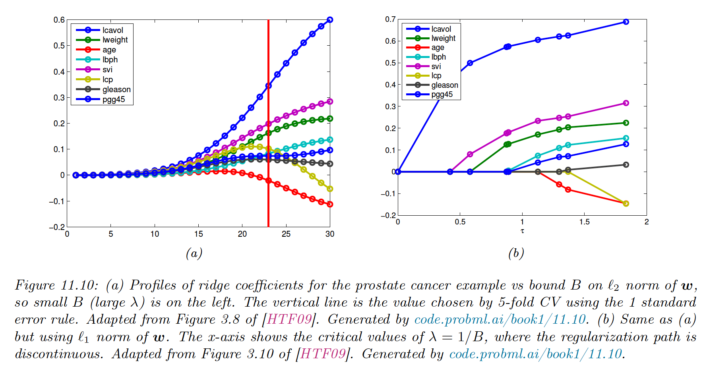

# 11.4 Lasso regression

In ridge regression, we assumed a Gaussian prior on the parameters, which is often a good choice since it leads to smaller parameters and limits overfitting.

However, sometimes we want the parameters to be exactly 0, i.e. we want $\hat{\bold{w}}$ to be **sparse** so that we minimize the $\ell_0$ norm:

$$
||\bold{w}||_0=\sum_{j=1}^D\mathbb{I}(w_j\neq 0)
$$

This is useful because it can perform feature selection, as $f(\bold{x},\bold{w})=\sum_{j=1}^D \bold{x}_jw_j$, if $w_j=0$, the feature $j$ is ignored.

The same idea can be applied to non-linear models (like DNN) and encourage the first layer weight to be sparse.

### 11.4.1 MAP estimation using a Laplace prior ($\ell_1$ regularization)

We now focus on MAP estimation using the Laplace prior:

$$
p(\bold{w}|\lambda)=\prod_{j=1}^D  \mathrm{Lap}(w_j|0,1/\lambda)\propto\prod^D_{j=1}e^{-\lambda|w_d|}
$$

where:

$$
\mathrm{Lap}(w|\mu,b)\triangleq \frac{1}{2b}\exp \Big({-\frac{|w-\mu|}{b}}\Big)
$$

Laplace put more weight on 0 than Gaussian, for the same scale.

To perform MAP estimation of a linear regression model with this prior, we minimize the objective:

$$
\mathrm{PNNL}(\bold{w})=-\log p(\mathcal{D}|\bold{w})-\log p(\bold{w}|\lambda)=||\bold{y}-X\bold{w}||_2^2+\lambda ||\bold{w}||_1
$$

This method is called lasso “least absolute shrinkage and selection operator” or $\ell_1$ regularization.

Note we could also use the q-norm:

$$
||\bold{w}||_q=\Big(\sum_{j=1}^D |w_j|^q\Big)^{1/q}
$$

For $q<1$, we can get even sparser solutions but the problem becomes non-convex. Thus, the $\ell_1$ norm is the tightest convex relaxation of the $\ell_0$ norm.

### 11.4.2 Why does the $\ell_1$ yields sparse solutions?

The lasso objective is a non-smooth objective that can be expressed with the Lagrangian:

$$
\min_{\bold{}w} \mathrm{NLL}(\bold{w})\quad s.t.\quad ||\bold{w}||_1\leq B
$$

where $B$ is an upper bound to the weight. A tight bound corresponds to a high $\lambda$.

From the optimization theory, we know that the optimal solution lies at the intersection of the constraint surface and the lowest level of the objective function.

When we relax the constraint $B$, we grow the constraint surface until reaching the objective. The $\ell_1$ dice is more likely to hit the objective function on the corner rather than on the side, especially in high dimensions. The corners correspond to the sparse solution, lying on the coordinate axes.

Meanwhile, there are no corners on the $\ell_2$ ball, it can intersect the objective function everywhere; there is no preference for sparsity.

### 11.4.3 Hard vs soft thresholding

One can show that the gradient for the smooth part is:

$$
\frac{\partial}{\partial w_j}\mathrm{NLL}(\bold{w})=a_dw_d-c_d
$$

with:

$$
\begin{align}
a_d&=\sum_{n=1}^N x_{nd}^2\\
c_d&= \sum_{n=1}^N x_{nd}(y_n-\bold{w}_{-d}^\top \bold{x}_{n,-d})
\end{align}
$$

where $\bold{w}_{-d}$ is $\bold{w}$ without the component $d$.

Setting the gradient to zero gives the optimal update for feature $d$ while keeping the other constant:

$$
w_d=c_d/a_d=\frac{\bold{x}_d^\top \bold{r}_{-d}}{||\bold{x}_d||^2_2}
$$

with $\bold{r}_{-d}=\bold{y}-X_{-d}\bold{w}_{-d}$ the residuals error obtained by using all features but $d$.

Let’s add the penalty term. Unfortunately, $||\bold{w}_1||_1$ is not differentiable whenever $w_d=0$. We can still compute the subgradient at this point.

$$
\begin{align}
\partial_{w_d}\mathcal{L}(\bold{w})&=a_d w_d-c_d+\lambda\partial_{w_d}||\bold{w}||_1\\
&=\begin{cases}a_d w_d-c_d-\lambda & \mathrm{if}\; w_d<0\\
[-c_d-\lambda ,-c_d+\lambda]&\mathrm{if}\;w_d=0 \\
a_dw_d-c_d+\lambda &\mathrm{if}\;w_d>0
\end{cases}
\end{align}
$$

Depending on the value of $c_d$, the solution to $\partial_{w_d}\mathcal{L}(\bold{w})=0$ can occur at 3 different values of $w_d$ as follows:

1. If $c_d<-\lambda$, the feature is strongly negatively correlated with the residual, then the subgradient is zero at $w_d=\frac{c_d+\lambda}{a_d}<0$
2. If $c_d\in[-\lambda,\lambda]$, the feature is weakly correlated with the residual, then the subgradient is zero at $w_d=0$
3. If $c_d>\lambda$, the feature is strongly correlated with the residual, the subgradient is zero at $w_d=\frac{c_d-\lambda}{a_d}>0$ 

In summary:

$$
\hat{w}_d=\mathrm{SoftThreshold}(\frac{c_d}{a_d},\lambda/a_d)
$$

where:

$$
\mathrm{SoftThreshold}(x,\delta)=\mathrm{sign}(x)\max(|x|-\delta,0)
$$

The slope of the soft-thresholding shrunk line doesn’t match the diagonal (the OLS), meaning that event big coefficients are shrunk to zero.

Consequently, Lasso is a biased estimator. A simple solution known as debiasing is to first estimate which elements are non-zero using lasso, then re-estimate the chosen coefficient using least squares.

### 11.4.4 Regularization path

If $\lambda=0$, we get the OLS, which is dense. As we increase it, we reach $\lambda_{max}$ where $\hat{\bold{w}}=\bold{0}$.

This value is obtained when the gradient of the NLL cancels out the gradient of the penalty:

$$
\begin{align}
\lambda_{max}&=\max_{d}[ \nabla_{w_d}\mathrm{NLL}(\bold{0})]\\&=\max_d c_d(\bold{w}=0)\\&=\max_d |\bold{x}_d^\top \bold{y}|\\
&=||X^\top\bold{y}||_{\infin}
\end{align}
$$

As we increase $\lambda$, the solution vector $\hat{\bold{w}}$ get sparser, although not necessarily monotonically. We plot the regularization path:

### 11.4.6 Variable selection consistency

$\ell_1$ regularization is often used to perform feature selection. A method that can recover the true set of meaningful features when $N\rightarrow \infin$ is called **model selection consistent**.

Let’s create:

- a sparse signal $\bold{w}^*\in\mathbb{R}^{D}$, consisting of 160 randomly placed $\pm 1$ spikes
- a random design matrix $X\in \mathbb{R}^{N\times D}$
- a noisy observation $\bold{y}=X\bold{w}^*+\epsilon$ , with $\epsilon \sim \mathcal{N}(0, 0.01^2)$

with $N=1024\leq D=4096$

The second row is the $\ell_1$ estimate using $\lambda=0.1\lambda_{max}$. We see that it finds all coefficients $\hat{\bold{w}}_{L1}$, but they are too small due to shrinkage.

The third row uses the debiasing technique and recovers the right coefficient values.

By contrast, the last row represents the signal recovered by the OLS, which is dense.

To pick the optimal value of $\lambda$ and perform the feature selection, we use cross-validation. It is important to note that CV will lead to good prediction accuracy, which is not necessarily the same as recovering the true model.

This is because Lasso performs selection and shrinkage i.e. the chosen coefficients are brought closer to $0$, so the CV will pick a value of $\lambda$ that is not too large. This will result in a less sparse model with irrelevant variables.

However, various extensions to the basic method have been designed that are model selection consistent. See [Statistical Learning with Sparsity (2015)](https://www.dropbox.com/scl/fi/y4txlx7cvadjq80wovs6a/stat_learn_sparsity.pdf?rlkey=v7nimje67az6ahlchy0fmnpot&dl=0)

### 11.4.7 Group lasso

In standard $\ell_1$ regularization, we assume a 1:1 correspondence between a parameter and its variable. But in more complex settings, there may be many parameters associated with a single variable, so that each variable has its weight vector $\bold{w}_d$ and the overall weight vector has a block structure $[\bold{w}_1,\dots,\bold{w}_D]$.

To exclude the variable $d$, we have to force the entire $d$ block to be $0$: this is **group sparsity**.

**11.4.7.1 Applications**

- Linear regression with categorical inputs, where we use a one-hot-encoding vector of length $K$
- Multinomial logistic regression: The $d$’th variable will be associated with $C$ different weight (one per class)
- Multi-task learning, similarly each feature is associated with $C$ different weighs (one per output task)
- Neural networks: The $k$’th neuron will have multiple inputs, so we set all incoming weights to zero to turn it off. Group sparsity can help us learn the neural net structure.

**11.4.8.1 Penalizing the two-norm**

To encourage group sparsity, we partition the parameter vector into $G$ groups, then we minimize:

$$
\mathrm{PNNL}(\bold{w})=\mathrm{NLL}(\bold{w})+\lambda \sum_{g=1}^G ||\bold{w}_g||_2
$$

where $||\bold{w}||=\sqrt{\sum_{d\in g}w_d^2}$ is the two-norm of the group weight vector. If the NLL is least-squares, this method is the group lasso. Note that if we had the squared of the two norms, the model would be equivalent to ridge regression.

By using the square root, we are penalizing the radius of a ball containing the group weights: the only way for the radius to be small is if all elements are small too.

Another way to see why the two-norm enforces group sparsity is to consider the gradient of the objective. If we only have one group of two parameters:

$$
\frac{\partial}{\partial w_1}\sqrt{w_1^2+w_2^2}=\frac{w_1}{\sqrt{w_1^2+w_2^2}}
$$

- If $w_2$ is small, the gradient will be close to 1 and the $w_1$ will be shrunk to zero
- If $w_1$ is large, then if $w_1$ is small the gradient will be close to $0$ and $w_1$ will not get updated much.

**11.4.8.2 Penalizing the infinity norm**

A variant of this technique replaces the two-norm with the infinity norm:

$$
||\bold{w}_g||_\infin=\max_{d\in g} |\bold{w}_d|
$$

This will also result in group sparsity, since if the largest element of the group is forced to zero, all the others will be zero.

We have a true signal $\bold{w}\in\mathbb{R}^D$, with $D=4096$, divided into 64 groups of size 64.

We randomly pick 8 groups and assigned them to non-zero values.

We generate a random design matrice $X$ and compute $\bold{y}$ like before.

We see that the group lasso (c) does a much better job than vanilla lasso (b). With the $\ell_\infin$ norm, elements of the same groups have similar magnitude.

### 11.4.8 Elastic net (ridge and lasso combined)

In group lasso, we need to specify the structure ahead of time. For some problems, we don’t know the group structure, and yet we would still like highly correlated coefficients to be treated as an implicit group.

Elastic net can achieve this, named after being “like a stretchable fishing net that retains all the big fish”. It has the following objective:

$$
\mathcal{L}(\bold{w},\lambda_1,\lambda_2)=||\bold{y}-X\bold{w}||^2_2+\lambda_1 ||\bold{w}||_1+ \lambda_2 ||\bold{w}||_2^2
$$

This is strictly convex (assuming $\lambda_2 >0)$, so there is a unique global minimum, even if $X$ is not full rank.

It can be shown that any strictly convex penalty on $\bold{w}$ will exhibit a **group effect**, and coefficients of highly correlated variables will be the same.

If two features are identically equal, so $X_{:,j}=X_{:, k}$, one can show that their estimate $\hat{w}_j=\hat{w}_k$.

By contrast with Lasso, we might have $\hat{w}_j=0$, and $\hat{w}_k \neq 0$ and vice versa. Resulting in less stable estimates.

Also, when $N<D$, lasso can only select up to $N$ non-zero coefficients, while elastic net doesn’t have such limits, thus exploring more subsets of variables.

### 11.4.9 Optimization algorithms

Below, we expand on the method used to solve the lasso problem and other $\ell_1$-regularized convex objectives.

**11.4.9.1 Coordinate descent**

Sometimes, it’s easier to optimize all variables independently. We can solve for the $j$th coefficient while keeping all others constant.

$$
w^*_j=\argmin_{\eta}\mathcal{L}(\bold{w}+\eta \bold{e}_j)
$$

We can either loop through all variables, select them at random, or update the steepest gradient. This approach has been generalized to GLM with the glmnet library.

**11.4.9.2 Projected gradient descent**

We convert the non-differentiable $\ell_1$ penalty into a smooth regularizer. We use the split variable trick

$$
\bold{w}=\bold{w}_+-\bold{w}_-
$$

where $\bold{w}_+=\max(\bold{w},0)$ and $\bold{w}_-=-\min(\bold{w},0)$

Thus we get the smooth but constrained optimization problem:

$$
\min_{\bold{w}^+\geq 0,\bold{w}^-\geq 0}\mathrm{NLL}(\bold{w}^+-\bold{w}^-)+\lambda\sum_{d=1}^D |w_d^++w_d^-|
$$

In the case of Gaussian likelihood, the NLL is the least square loss, and the objective becomes a quadratic program (see section 8.5.4).

One way to solve this is to use projected gradient descent (see section 8.6.1). We can enforce the constraint by projecting onto the positive orthant, using $w_d=\max(w_d,0)$. This operation is denoted $P_+$.

The projected gradient update takes the form:

$$
\begin{bmatrix}\bold{w}_{t+1}^+ \\ \bold{w}_{t+1}^-
\end{bmatrix} = P_+\Big( 
\begin{bmatrix}\bold{w}_t^+ - \nabla \eta_t\mathrm{NLL}(\bold{w}_t^+-\bold{w}_t^-)+\eta_t\lambda\bold{e} \\
\bold{w}_t^- + \nabla \eta_t\mathrm{NLL}(\bold{w}_t^+-\bold{w}_t^-)+\eta_t\lambda\bold{e}
\end{bmatrix}  \Big)
$$

where $\bold{e}$ is the unit vector of all ones.

**11.4.9.3 Proximal gradient descent**

Proximal gradient descent can be used to optimize smooth function with non-smooth penalty, like the $\ell_1$.

In section 8.6.2, we showed that the proximal gradient for the $\ell_1$ penalty corresponds to the soft thresholding. Thus the update is:

$$
\bold{w}_{t+1}=\mathrm{SoftTreshold}(\bold{w}_t-\eta_t\nabla\mathrm{NLL}(\bold{w}_t),\eta_t\lambda)
$$

Where the soft threshold is applied element-wise. This is called the iterative soft threshold algorithm (**ITSA**). If we combine it we Nesterov momentum, we get the fast ISTA or **FISTA** method, which is widely used to fit sparse linear models.

**11.4.9.4 LARS**

The Least Angle Regression and Shrinkage (LARS) generates a set of solutions for different $\lambda$, starting with an empty set up to a full regularization path.

The idea is that we can quickly compute $\hat{w}(\lambda_k)$ from $\hat{w}(\lambda_{k-1})$ if $\lambda_k\approx \lambda_{k-1}$, this is known as **warm starting.**

If we only want a single value $\lambda_*$, it can be more efficient to start from $\lambda_{max}$ down to $\lambda_*$. This is known as the **continuation method** or **homotopy**.

LARS starts with a large $\lambda$ that only selects the feature that is the most correlated to $y$. Then, $\lambda$ is decreased until finding a feature with a correlation of the same magnitude as the first, but with the residual, defined as:

$$
\bold{r}_k=\bold{y}-X_{:, F_k}\bold{w}_k
$$

where $F_k$ is the active set of features at step $k$.

Remarkably, we can find the value of $\lambda$ analytically, by using a geometric argument (hence “least angle”). This allows the algorithm to quickly jump where the next point of the regularization path where the active set changes.

This repeats until all variables are added.