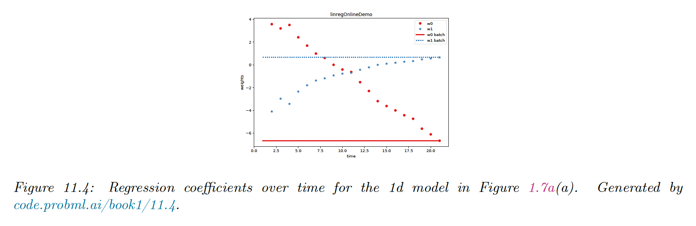

# 11.2 Least squares linear regression

### 11.2.1 Terminology

We consider models of the form:

$$
p(y|\bold{x},\theta)=\mathcal{N}(y|w_0+\bold{w}^\top\bold{x},\sigma^2)
$$

The vector $\bold{w}_{1:D}$ is known as weights. Each coefficient $w_d$ specifies the change in output we expect if we change the corresponding input $x_d$ by 1 unit.

$w_0$ is the bias and corresponds to the output when all inputs are 0. This captures the unconditional mean of the response $w_0=\mathbb{E}[y]$

By assuming $\bold{x}$ to be written as $[1,x_1,\dots,x_D]$, we can absorb the term $w_0$  in $\bold{w}$.

If the input is multi-dimensional $\bold{y}\in\mathbb{R}^j$, this is called **multivariate linear regression:**

$$
p(y|\bold{x},W)=\prod_{j=1}^J\mathcal{N}(y_j|\bold{w}_j^\top \bold{x},\sigma_j^2)
$$

Generally, a straight line will underfit most datasets, but we can apply nonlinear transformations to the input features $\bold{x}'=\phi(\bold{x})$.

As long as the parameters of $\phi$ are fixed, the model remains *linear in the parameters*, even if it’s not linear in the raw inputs.

Polynomial expansion is an example of non-linear transformation: if the input is 1d and we use an expansion of degree $d$, we get $\phi(x)=[1,x,x^2,\dots,x^d]$

### 11.2.2 Least square estimation

To fit a linear regression model to the data, we minimize the negative log-likelihood on the training set:

$$
\begin{align}
\mathrm{NLL}(\bold{w},\sigma^2)&=-\sum_{n=1}^N \log \Bigg[\Big(\frac{1}{2\pi \sigma^2}\Big)^{1/2} \exp\Big(- \frac{1}{2\sigma^2} (y_n-\bold{w}^\top \bold{x}_n)^2\Big)\Bigg]\\
&= \frac{N}{2} \log (2\pi \sigma^2)+\frac{1}{2\sigma^2}\sum_{n=1}^N  (y_n-\bold{w}^\top \bold{x}_n)^2
\end{align}
$$

If we only focus on optimizing $\bold{w}$ and not $\sigma^2$, the NLL is equal to the residual sum of square (RSS):

$$
\mathrm{RSS}(\bold{w})=\frac{1}{2}\sum_{n=1}^n (y_n-\bold{w}^\top \bold{x}_n)^2=\frac{1}{2}||X\bold{w}-\bold{y}||^2_2
$$

**11.2.2.1 Ordinary least square**

We can show that the gradient is given by:

$$
\nabla_\bold{w}\mathrm{RSS}(\bold{w})=X^\top X \bold{w}-X^\top\bold{y}
$$

We set it to zero and obtained the ordinary least square solution:

$$
\hat{\bold{w}}=(X^\top X)^{-1}X^\top \bold{y}
$$

The quantity $X^\dag =(X^\top X)^{-1}X^\top$  is the left pseudo-inverse of the (non-square) matrix $X$.

We check that the solution is unique by showing that the Hessian is positive definite:

$$
\mathrm{H}(\bold{w})=X^\top X
$$

If $X$ is full rank (its columns are linearly independent) then $\mathrm{H}$ is positive definite, hence the least square objective has a global minimum.

**11.2.2.2 Geometric interpretation of least squares**

We assume $N>D$, so there are more equations than unknown, the system is over-determined.

We seek a vector $\hat{\bold{y}}\in\mathbb{R}^N$ that lies in the linear subspace spanned by $X$, as close as possible to $\bold{y}$:

$$
\argmin_{\hat{\bold{y}}\in \mathrm{span}(\{\bold{x}_{:,1},\dots,\bold{x}_{:,d}\})} ||\bold{y-\hat{y}}||_2
$$

Since $\bold{\hat{y}}\in\mathrm{span}(X)$, there exists some weight vector $\bold{w}$ such that:

$$
\bold{\hat{y}}=X\bold{w}
$$

To minimize the norm of the residual $\bold{y-\hat{y}}$, we want the residual to be orthogonal to every column of $X$:

$$
X^\top (\bold{y}-X\bold{w})=\bold{0}\Rightarrow \bold{w}=(X^\top X)^{-1}X^\top \bold{y}
$$

Hence, our projected value is given by:

$$
\bold{\hat{y}}=X(X^\top X)^{-1}X^\top \bold{y}
$$

**11.2.2.3 Algorithmic issues**

Even if we can theoretically invert $X^\top X$ to compute the pseudo-inverse $X^\dag$, we shouldn’t do it since $X^\top X$ could be ill-conditioned or singular.

A more general approach is to compute the pseudo-inverse using SVD. `scikit-learn.linear_model` uses `scipy.linalg.lstsq`, which in turn uses DGELSD, which is an SVD-based solver implemented by the Lapack library, written in Fortran.

However, if $N\gg D$, it can be faster to use QR decomposition:

$$
\begin{align}
(QR)\bold{w}&=y \\
Q^\top QR\bold{w}&=Q^\top y\\
\bold{w}&=R^{-1}(Q^\top y)
\end{align}
$$

Since $R$ is upper triangular, we can solve it using back substitution, avoiding matrix inversion.

An alternative to matrix decomposition is to use an iterative solver, such as the **conjugate gradient method** (assuming $X$ is symmetric positive definite) and the **GMRES** (generalized minimal residual method) in the general case.

**11.2.2.4 Weighted least squares**

In some cases, we want to associate a weight with each example. For example, in heteroskedastic regression, the variance depends on the input:

$$
p(y|\bold{x},\theta)=\mathcal{N}(y|\bold{w}^\top \bold{x},\sigma(\bold{x}))
$$

thus:

$$
p(\bold{y}|\bold{x},\theta)=\mathcal{N}(\bold{y}|X\bold{w},\Lambda^{-1})
$$

where $\Lambda=\mathrm{diag}(1/\sigma^2(\bold{x}_n))$.

One can show that the MLE is given by:

$$
\bold{\hat{w}}=(X^\top \Lambda X)^{-1}X^\top \Lambda\bold{y}
$$

### 11.2.3 Other approaches to computing the MLE

**11.2.3.1 Solving for offset and slope separately**

Above, we computed $(w_0,\bold{w})$ at the same time by adding a constant $\bold{1}$ column to $X$.

Alternatively, we can solve for $w_0$ and $\bold{w}$ separately:

$$
\begin{align}
\bold{\hat{w}}&=(X^\top_cX_c)^{-1}X^\top_c \bold{y}_c \\
&= \Big[\sum_{n=1}^N (\bold{x}_n-\bar{\bold{x}})(\bold{x}_n-\bar{\bold{x}})^\top\Big]^{-1}\Big[\sum_{n=1}^N (\bold{x}_n-\bar{\bold{x}})(\bold{y}_n-\bar{\bold{y}}) \Big] \\
\hat{w}_0&= \bar{\bold{y}} -\bar{\bold{x}}^\top\bold{\hat{w}}
\end{align}
$$

Thus, we can first estimate $\hat{\bold{w}}$ on centered data, then compute $w_0$.

**11.2.3.2 1d linear regression**

In the case of 1d inputs, the above formula reduces to:

$$
\begin{align}
\hat{w}_1&=\frac{\sum_{n=1}^N (x_n-\bar{x})(y_n-\bar{y})}{\sum_{n=1}^N (x_n-\bar{x})^2}=\frac{C_{xy}}{C_{xx}} \\
\hat{w}_0 &= \bar{y}-\hat{w}_1 \bar{x} =\mathbb{E}[y]-\hat{w}_1\mathbb{E}[x]
\end{align}

$$

where $C_{xy}=\mathrm{Cov}[X,Y]$ and $C_{xx}=\mathrm{Cov}[X,X]=\mathbb{V}[X]$

**11.2.3.3 Partial regression**

We can compute the regression coefficient in the 1d case as:

$$
R_{XY}\triangleq \frac{\partial }{\partial x}\mathbb{E}[Y|X=x]=\hat{w}_1
$$

Consider now the 2d case:  $Y=w_0+w_1 X_1 +w_2 X_2+\epsilon$, where $\mathbb{E}[\epsilon]=0$

The optimal regression coefficient for $w_1$ is $R_{Y X_1.X_2}$ where we keep $X_2$ constant:

$$
w_1=R_{Y:X_1.X_2}=\frac{\partial}{\partial x}\mathbb{E}[Y|X_1=x,X_2]
$$

We can extend this approach to all coefficients, by fixing all inputs but one.

**11.2.3.4 Online computing of the MLE**

We can update the means online:

$$
\bar{x}^{(n+1)}=\bar{x}^{(n)}+\frac{1}{n+1}(x_{n+1}-\bar{x}^{(n)})
$$

One can show that we can also update the covariance online as:

$$
C_{xy}^{(n+1)}=\frac{1}{n+1}[x_{n+1} y_{n+1}+nC_{xy}^{(n)}+n\bar{x}^{(n)}\bar{y}^{(n)}-(n+1)\bar{x}^{(n+1)}\bar{y}^{(n+1)}]
$$

We find similar results for $C_{xx}^{(n+1)}$.

To extend this approach to $D$ dimensions inputs, the easiest approach is SGD. The resulting algorithm is called **least mean square**. 

**11.2.3.5 Deriving the MLE from a generative perspective**

Linear regression is a discriminative model of the form $p(y|\bold{x})$, but we can also use generative models for regression.

The goal is to compute the conditional expectation:

$$
f(\bold{x})=\mathbb{E}[y|\bold{x}]=\int y\,p(y|\bold{x})dy=\frac{\int y\,p(\bold{x},y)dy}{\int p(\bold{x},y)dy}
$$

Suppose we fit $p(\bold{x},y)$ using a MVN. The MLEs for the parameters of the joint distribution are the empirical means and covariance:

$$
\begin{align}
\mu_x&=\frac{1}{N}\sum_n \bold{x}_n \\
\mu_y&=\frac{1}{N}\sum_n y_n \\
\Sigma_{xx}&=\frac{1}{N}\sum_n (\bold{x}_n -\mu_x)(\bold{x}_n-\mu_x)^\top = \frac{1}{N} X_c^\top X_c \\
\Sigma_{xy}&=\frac{1}{N}\sum_n (\bold{x}_n -\mu_x)(y_n-\mu_y)^\top = \frac{1}{N} X_c^\top \bold{y}_c

\end{align}
$$

Hence we have:

$$
\mathbb{E}[y|\bold{x}]=\mu_y+\Sigma_{xy}^\top\Sigma_{xx}^{-1}(\bold{x}-\mu_x)
$$

which we can rewrite as:

$$
\mathbb{E}[y|\bold{x}]=w_0+\bold{w}^\top \bold{x}
$$

using $\bold{w}=\Sigma_{xy}^\top \Sigma^{-1}_{xx}$

Thus we see that fitting the joint model and then conditioning it is the same as fitting the conditional model. However, this is only true for Gaussian models.

**11.2.3.6 Deriving the MLE for $\sigma^2$**

After estimating $\hat{\bold{w}}_{mle}$, it is easy to show that:

$$
\hat{\sigma}_{mle}^2=\argmin_{\sigma^2}\mathrm{NLL}(\bold{\hat{w}},\sigma^2)=\frac{1}{N}\sum_n(y_n-\bold{w}^\top \bold{x}_n)^2
$$

which is the MSE on the residuals.

### 11.2.4 Measuring goodness of a fit

**11.2.4.1 Residuals plot**

We can check the fit of the model by plotting the residuals $r_n=y_n-\hat{y}_n$ vs the input $\bold{x}_n$, for a chosen dimension.

The residual model assumes a $\mathcal{N}(0,\sigma^2)$ distribution, therefore the residual plot should show a cloud of points around 0 without any obvious trend. This is why b) above is a better fit than a).

We can also plot the prediction $\hat{\bold{y}}$ against $\bold{y}$, which should show a diagonal line.

**11.4.2.2 Prediction accuracy and R2**

We can assess the fit quantitatively using the RSS or the RMSE:

$$
\begin{align}
\mathrm{RSS}&=\sum_n (y_n-\bold{w}^\top \bold{x}_n)^2\\
\mathrm{RMSE}&\triangleq\frac{1}{N}\sqrt{RSS(\bold{w})}
\end{align}
$$

The R2, or **coefficient of determination** is a more interpretable measure:

$$
R^2\triangleq 1-\frac{\sum_n (\hat{y}_n-y_n)^2}{\sum_n(\bar{y}-y_n)^2}=1-\frac{\mathrm{RSS}}{\mathrm{TSS}}\leq 1
$$

It measures the variance in the prediction relative to a simple constant prediction $\hat{y}_n=\bar{y}$.