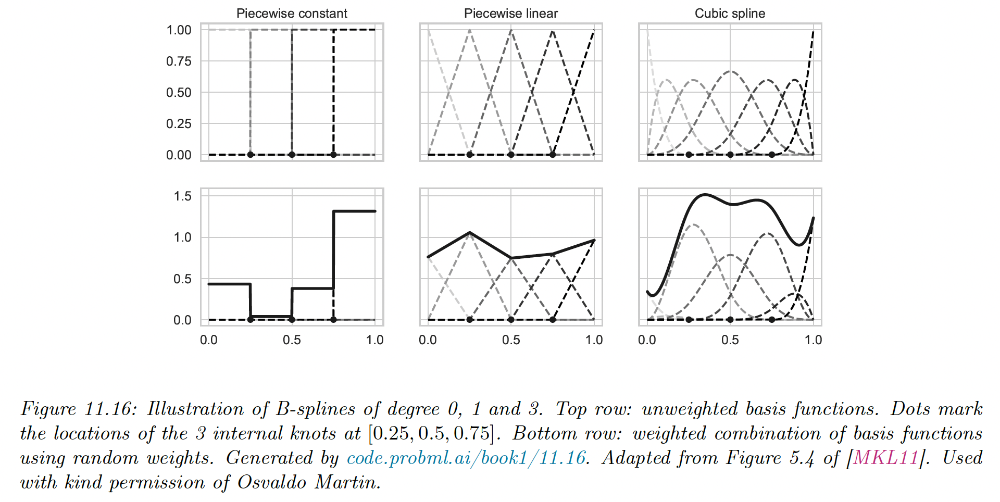
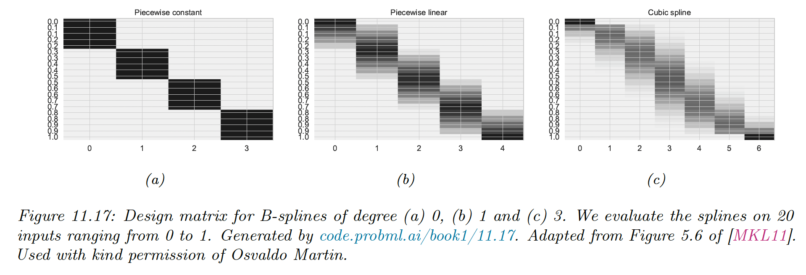
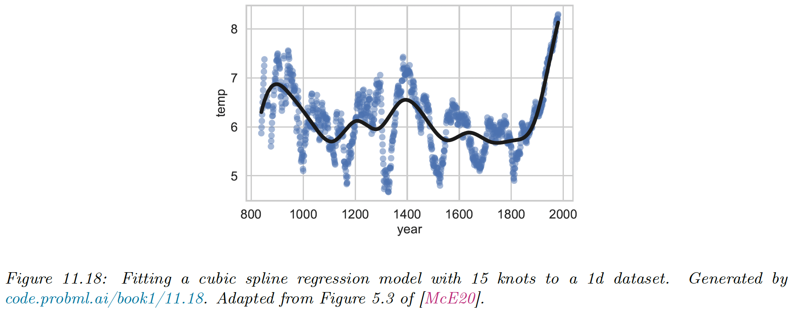

# 11.5 Regression Splines

As we have seen, we can use polynomial basis functions to create nonlinear mappings, even though the model remains linear in parameters.

One issue is that polynomials are a global approximation to the function, we can achieve more flexibility by using a series of local approximations.

We will restrict ourselves to 1d to better understand the notion of locality. We can approximate the function using:

$$
f(x,\theta)=\sum_{i=1}^m w_i B_i(x)
$$

where $B_i$ is the $i$th basis function.

A common way to define such basis functions is to use B-splines (”B” stands for basis and “splines” refers to a piece of flexible material used by artists to draw curves)

### 11.5.1 B-spline basis functions

A spline is a piecewise polynomial of degree $D$, where the locations of the pieces are defined by a set of **knots $t_1<\dots<t_m$.** 

The polynomial is defined on each of the intervals $(-\infin,t_1],\dots,[t_m,+\infin]$. The function has continuous derivatives of order $D-1$ at its knot points.

It is common to use **cubic splines**, where $D=3$, ensuring the function has first and second-order derivatives at each knot.

We don’t focus on the inner working of the splines, it suffices to say we can use scikit-learn to convert the $X\in\mathbb{R}^{N\times 1}$ matrix to $B\in\mathbb{R}^{N\times (K+D+1)}$, with $K$ the number of knots.

We see that for any given input, only $D+1$ basis functions are active (non-zero). For the piecewise constant function, $D=0$, for linear $D=1$, and for cubic $D=3$.

### 11.5.2 Fitting a linear model using a spline basis

After computing the design matrix $B$, we can use it to fit least squares (or ridge regression, having regularization is often better).

We use a dataset of temperature having a semi-periodic structure, a fit it using cubic splines. We chose 15 knots according to the quantiles of the data.

We see that the fit is reasonable, adding more knots would have resulted in a better fit, with a risk of overfitting, we can select these using model selection, like grid-search plus with cross-validation.

### 11.5.3 Smoothing splines

Smoothing splines are related to regression splines, but use $N$ knots, the number of datapoints. They are non-parametric methods since the number of parameters is not fixed a priori but grows with the size of the data.

To avoid overfitting, smoothing splines rely on $\ell_2$ regularization.

### 11.5.4 Generalized additive models (GAM)

A generalized additive models extend the notion of spline to $D$-dimensional inputs, without interaction between features. It assumes a function of the form:

$$
f(\bold{x},\theta)=\alpha+\sum_{d=1}^D f_d(x_d)
$$

where each $f_d$ is a regression or smoothing spline.

This model can be fitted using **backfitting**, which iteratively fits each $f_d$ to the partial residuals generated by the other terms.

We can extend GAM beyond the regression case, e.g. to classification, by using a link function as in generalized linear models.