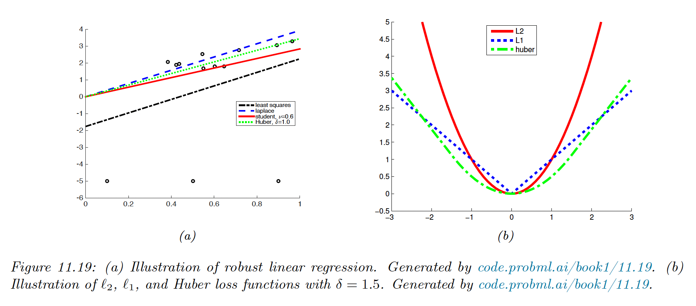
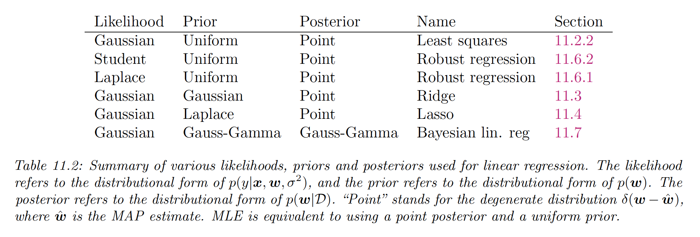

# 11.6 Robust linear regression

It is common to model the noise in linear regression with a Gaussian distribution $r_n\sim \mathcal{N}(0,\sigma^2)$, where $r_n=y_n-\bold{w}^\top x_n$ . In this case, maximizing the likelihood is equivalent to minimizing the sum of squared residuals.

However, if we have outliers in our data, this can result in a bad fit because squared error penalizes deviations quadratically, so points far from the mean have more effect.

One way to achieve robustness is to use a likelihood with a heavy tail, assigning a higher likelihood to outliers without perturbing the straight line to explain them.

 

We discuss several alternative probability distributions for the response variable.

### 11.6.1. Laplace Likelihood

If we use the Laplace distribution as our likelihood, we have:

$$
p(y|\bold{x,w},b)=\mathrm{Laplace}(y|\bold{w}^\top \bold{x},b)\propto \exp(-\frac{1}{b}|y-\bold{w}^\top \bold{x}|)
$$

The robustness arises from the replacement of the squared term by an absolute one.

**11.6.1.1 Computing the MLE using linear programming**

Linear programming solves equations of the form:

$$
\argmin_v \bold{v}^\top \bold{c}\quad \mathrm{s.t.}\quad A\bold{v}\leq \bold{b} 
$$

where $\bold{v}\in\mathbb{R}^n$, $A\in\mathbb{R}^{m\times n}$ and $Av_i\leq b_i$ is the set of $m$ linear constraints we must satisfy.

Let us define $\bold{v}=(w_1,\dots,w_D,e_1,\dots,e_N)\in\mathbb{R}^{D+N}$, where $e_i=|\hat{y}_i-y_i|$.

We want to minimize the sum of residuals, so we define $c=(0,\dots,0,1,\dots,1)\in\mathbb{R}^{D+N}$.

We need to enforce $e_i=|\hat{y}_i-y_i|$, but it is sufficient to enforce $|\bold{w}^\top \bold{x}_i-y_i|\leq e_i$, which we can encode as two linear constraints:

$$
(\bold{w}^\top \bold{x}_i-y_i)\leq e_i\\
-(\bold{w}^\top \bold{x}_i-y_i)\leq e_i
$$

which we can rewrite as:

$$
(\bold{x}_i,0,\dots,0,-1,0,\dots,0)^\top \bold{v}\leq y_i \\
(-\bold{x}_i,0,\dots,0,-1,0,\dots,0)^\top \bold{v}\leq -y_i
$$

where the first $D$ entries are filled with $\bold{x}_i$.

We can write these constraints in the form $A\bold{v}\leq \bold{b}$, with:

$$
A=\begin{bmatrix}
\bold{x}_1 &-1 &0 &\dots&0 \\
-\bold{x}_1 &-1 &0 &\dots&0 \\
\bold{x}_2 &0 &-1 &\dots &0 \\
-\bold{x}_2 & 0  & -1 & \dots &0 \\
&&\vdots

\end{bmatrix}
$$

$$
b=[y_1,-y_1,y_2,-y_2,\dots,y_N,-y_N]
$$

### 11.6.2 Student-t likelihood

To use the Student distribution in a regression context, we can make the mean a linear function of the inputs:

$$
p(y|\bold{x,w},\sigma^2,\nu)=\mathcal{T}(y|\bold{w}^\top \bold{x},\sigma^2,\nu)
$$

where we use the location-scale t-distribution pdf:

$$
\mathcal{T}(y|\mu,\sigma^2,\nu)=\frac{\Gamma(\frac{\nu+1}{2})}{\Gamma(\frac{\nu}{2})\sqrt{\pi\nu}\tau^2}\Big[1+\frac{1}{\nu}\frac{(y-\mu)^2}{\sigma^2}\Big]^{\frac{\nu+1}{2}}
$$

We can fit this model using SGD or EM.

### 11.6.3 Huber loss

An alternative to minimize the NLL using Laplace or Student distribution is using the Huber loss:

$$
\ell_{huber}(r,\delta)=\begin{cases}
r^2/2 & \mathrm{if} &|r|\leq \delta \\
\delta |r| -\delta^2/2 & \mathrm{otherwise}
\end{cases}
$$

This is the equivalent of using the $\ell_2$ loss for errors smaller than $\delta$ and the $\ell_1$ loss for larger errors.

This is differentiable everywhere, consequently using it is much faster than using the Laplace likelihood, since we can use standard smooth optimization methods (like SGD) instead of linear programming.

The parameter $\delta$ controls the degree of robustness and is usually set by cross-validation.

### 11.6.4 RANSAC

In the computer vision community, a common approach to regression is to use random sample consensus (RANSAC).

We sample a small set of points, fit the model to them, identify outliers (based on large residuals), remove them, and refit the model on inliers.

We repeat this procedure for many iterations before picking the best model.

A deterministic alternative to RANSAC is fitting the model on all points to compute $\hat{w}_0$, then iteratively remove the outliers and refit the model with remaining inliers to compute $\hat{w}_{t+1}$.

Even though this hard thresholding makes the problem non-convex, this usually rapidly converges to the optimal estimate.