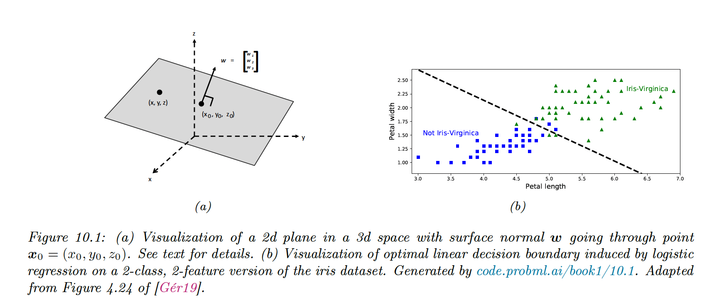
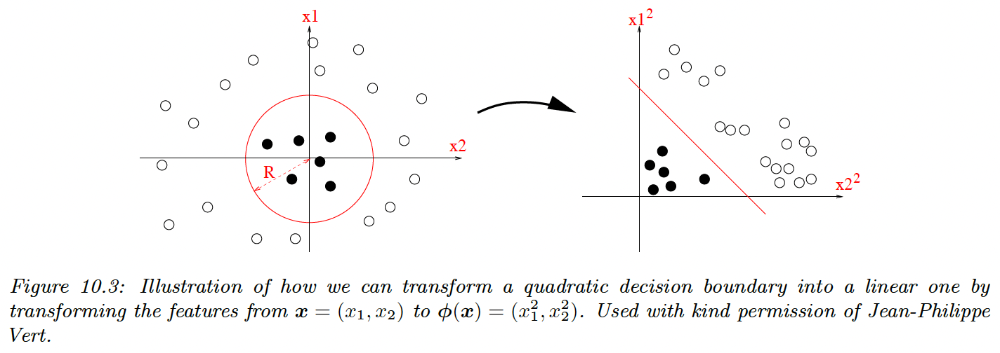
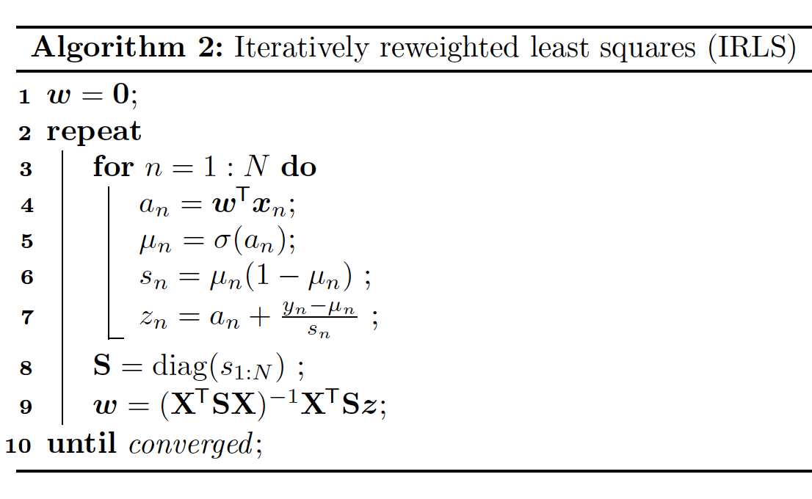

# 10.2 Binary Logistic Regression

Binary logistic regression corresponds to the following model:

$$
p(y|\bold{x},\theta)=\mathrm{Ber}(y|\sigma(w^\top \bold{x} + b))
$$

where $\theta=(w,b)$ are the weights and bias. In other words:

$$
p(y|\bold{x},\theta)=\frac{1}{1+e^{-(w^\top \bold{x}+b)}}
$$

and we call the log odds:

$$
a=w^\top \bold{x} +b=\log (\frac{p}{1-p})
$$

### 10.2.1 Linear classifiers

If the loss for misclassifying each class is the same, the class is given by:

$$
\begin{align}
f(\bold{x})&=\mathbb{I}\Big(p(y=1 | \bold{x},\theta) > p(y=0 | \bold{x},\theta)\Big) \\
&= \mathbb{I}\Big(\log \frac{p(y=1|\bold{x},\theta)}{p(y=0|\bold{x},\theta)}>0\Big) \\
&= \mathbb{I}(a>0)
\end{align}
$$

with:

$$
f(x)=w^\top \bold{x}+b
$$

For $x$ and $x_0$ on the plan and $w$ the normal at $x_0$, we have:

$$
w^\top(\bold{x}-\bold{x}_0)=0 \Rightarrow w^\top \bold{x}+b=0
$$

With $b=-w^\top \bold{x}_0$

This defines the decision boundary between both classes.

### 10.2.2 Nonlinear classifiers

We can often make a problem linearly separable by preprocessing the input.

Let:

- $\phi(x_1,x_2)=[1,x_1^2,x_2^2]$
- $w=[-R^2,1,1]$

Then:

$$
w^\top \phi(\bold{x})=x_1^2+x_2^2-R^2 =0
$$

which is the decision boundary of a circle.

The resulting function is still linear, which simplifies the learning process, and we gain power by learning the parameters of $\phi(\bold{x})$. We can also use polynomial expansion up to the degree $K$, the model becomes more complex and risk overfitting.

### 10.2.3 Maximum Likelihood Estimation

**10.2.3.1 Objective function**

$$
\begin{align}
\mathrm{NLL}(w)&=-\frac{1}{N}\log p(\mathcal{D}|w)=-\frac{1}{N} \log \prod_n \mathrm{Ber}(y_n|\mu_n) \\
&= -\frac{1}{N} \sum_n y_n \log \mu_n + (1 - y_n) \log (1 - \mu_n) \\
&= -\frac{1}{N} \sum_n \mathbb{H}(y_n,\mu_n)
\end{align}
$$

where $\mu_n=\sigma(w^\top x_n)$ is the probability of class 1

**10.2.3.3 Deriving the gradient**

$$
\nabla_w \mathrm{NLL}(w)=-\frac{1}{N}\sum_n y_n \frac{\nabla_w \mu_n}{\mu_n}-(1-y_n)\frac{\nabla_w \mu_n}{(1-\mu_n)}
$$

Then, we compute:

$$
\begin{align}
\frac{\partial \mu_n}{\partial w_d}=\frac{\partial \mu_n} {\partial a_n} \frac{\partial a_n} {\partial w_d}&=\sigma(a_n)\sigma(1-a_n)x_{nd}\\&=\mu_n(1-\mu_n)x_{nd}
\end{align}
$$

We plug it back into the previous equation:

$$
\begin{align}
\nabla_w \mathrm{NLL}(w)&=-\frac{1}{N}\sum_n y_n (1-\mu_n)x_n-(1-y_n)\mu_n x_n \\
&= -\frac{1}{N}\sum_n (y_n - \mu_n)x_n \\
&= \frac{1}{N}(1_N^\top(\mathrm{diag}(\mu-y)X))^\top
\end{align}
$$

**10.2.3.4 Deriving the Hessian**

Gradient-based optimizers will find a stationary point where $g(w)=0$, either a global or local optimum.

To be sure the optimum is global we must show that the objective is convex, by showing that the Hessian is semi-positive definite:

$$
\mathrm{H}(w)= \nabla_w\nabla_w^\top \mathrm{NLL}(w)=\frac{1}{N}\sum_{i=1}^N (\mu_n(1-\mu_n)x_n)x_n^\top=X^\top SX
$$

With $S\triangleq \mathrm{diag}(\mu_1(1-\mu_1),\dots,\mu_N(1-\mu_N))$

We see that $\mathrm{H}$ is positive definite since for all non-zero vector $v$ we have:

$$
(v^\top X^\top S^{1/2})(S^{1/2}Xv)=||v^\top X^\top S^{1/2}||^2_2>0
$$

This follows since $\mu_n>0$ for all $n$, because of the sigmoid function.

Consequently, the NLL is strictly convex, however in practice, values of $\mu_n$ close to 0 and 1 might cause the Hessian to be singular. We can avoid this by using $\ell_2$ regularization.

### 10.2.4 Stochastic gradient descent

We can use SGD to solve the equation:

$$
\hat{w}=\argmin_w \mathcal{L}(w)
$$

where the loss here is the NLL.

If we use a mini-batch of size 1, we have:

$$
\begin{align}
w_{t+t}&=w_t-\eta_t \nabla_w\mathrm{NLL}(w_t) \\
&= w_t-\eta_t (\mu_n-y_n)x_n
\end{align}
$$

Since we know the objective is convex we know this will converge to the global optimum, provided we decay the learning rate appropriately.

### 10.2.5 Perceptron Algorithm

A perceptron is a binary classifier:

$$
f(x_n,\theta)=\mathbb{I}(w^\top x_n+b >0)
$$

This can be seen as a modified logistic regression, where the sigmoid is replaced by a Heaviside function. Since the Heaviside is not differentiable, we can’t use gradient-based optimization to fit the model.

Rosenblatt proposed a perceptron learning algorithm, where we only make updates for wrong predictions (we replaced soft probabilities with hard labels):

$$
w_{t+1}=w_t-\eta_t (\hat{y}_n-y_n)x_n
$$

- If $\hat{y}_n=0$ and $y_n=1$, the update is $w_t+x_n$
- If $\hat{y}_n=1$ and $y_n=0$, the update is $w_t-x_n$

The advantage of Perceptron is that we don’t need to compute probabilities, which is useful when the label space is vast.

The disadvantage is that this method will only converge if the data is linearly separable, whereas SGD for minimizing the NLL will always converge to the globally optimal MLE.

In section 13.2, we will generalize perceptrons to nonlinear functions, enhancing their usefulness.

### 10.2.6 Iteratively weighted least square

Being a first-order method, SGD can be slow, especially when some directions point steeply downhill, while others have a shallow gradient.

In this situation, it can be much faster to use second-order methods that take the curvature of the space into account. We focus on the full batch setting (with $N$ small) since it is harder to make second-order methods work in the stochastic setting.

The hessian is assumed to be positive-definite to ensure the update is well-defined. 

$$
\mathrm{H}_t= \nabla^2\mathcal{L}(w_t)=\mathrm{H}(w_t)
$$

If the hessian is exact, the learning rate can be set to 1:

$$
\begin{align}
w_{t+1}&=w_t- \mathrm{H}_t ^{-1}g_t \\
&= w_t-(X^\top S_tX)^{-1}X^\top(y-\mu_t) \\
&= (X^\top S_t X)^{-1}X^\top S_t z_t
\end{align}
$$

with:

$$
z_t\triangleq X w_t+S^{-1}_t(y-\mu_t)
$$

and:

$$
S_t=\mathrm{diag}(\mu_{t,n}(1-\mu_{t,n}))
$$

Since $S_t$ is diagonal, we can rewrite:

$$
z_{t,n}=w_{t}^\top x_n+\frac{y_n-\mu_{t,n}}{\mu_{t,n}(1-\mu_{t,n})}
$$

The optimal weight $w^*$ is a minimizer of:

$$
\sum_{n=1}^NS_{t,n}(z_{t,n}-w_t^\top x_n)^2
$$

Fisher scoring is the same as IRLS except we replace the Hessian with its expectation i.e. we use the Fisher information matrix. Since the Fisher information matrix is independent of the data, it can be precomputed. This can be faster for problems with many parameters.

### 10.2.7 MAP estimation

Logistic regression can overfit when the number of parameters is high compared to the number of samples. To get this wiggly behavior, the weight values are large (up to +/-50 compared to 0.5 when K=1).

One way to reduce overfitting is to prevent weights from being so large, is performing MAP estimation using a zero mean Gaussian prior:

$$
p(w)=\mathcal{N}(w|0,C\mathrm{I})
$$

The new objectives and gradient takes the form:

$$
\begin{align}
\mathrm{PNNL}(w)&=\mathrm{NNL}(w)+\lambda w^\top w \\
\nabla_w\mathrm{PNNL}(w)&=g(w)+2\lambda w \\
\nabla_w^2\mathrm{PNNL}(w) &=\mathrm{H}(w)+2\lambda \mathrm{I}
\end{align}
$$

### 10.2.8 Standardization

Using the previous isotropic prior $\mathcal{N}(w|0,C\mathrm{I})$ assumes that all weights are of the same magnitudes, which assumes features are of the same magnitudes as well.

To enforce that hypothesis, we can use standardization:

$$
\begin{align}
\mathrm{standardize}(x_{n,d})&=\frac{x_{n,d}-\hat{\mu}_d}{\hat{\sigma}_d}\\
\hat{\mu}_d&=\frac{1}{N}\sum_{n=1}^N x_{n,d}\\
\hat{\sigma}^2_d &= \frac{1}{N}\sum_{n=1}^N(x_{n,d}-\hat{\mu}_d)^2
\end{align}
$$

An alternative is min-max scaling, ensuring that all inputs lie within the interval $[0, 1]$.