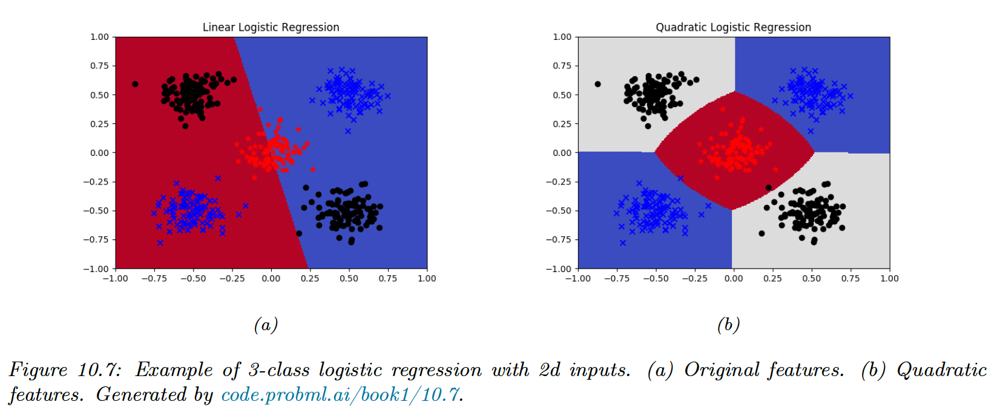
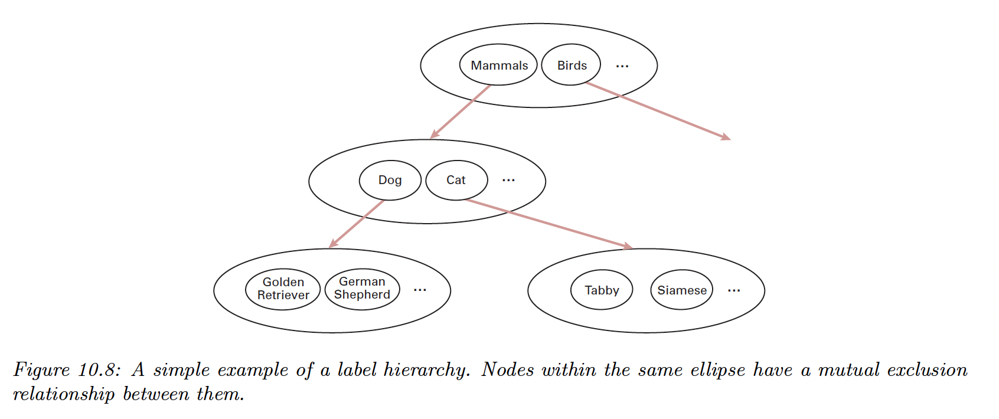
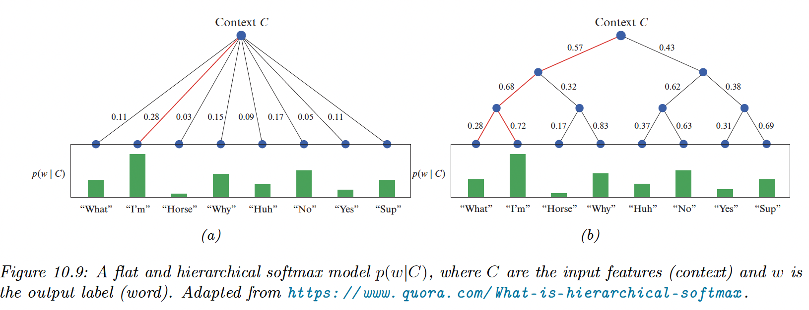

# 10.3 Multinomial logistic regression

In **multinomial** (or **multiclass**) logistic regression, the labels are mutually exclusive. This has the following form:

$$
p(y|\bold{x},\theta)=\mathrm{Cat}(y|S(W\bold{x}+\bold{b}))
$$

with:

- $y\in\{1,\dots,C\}$
- $\bold{x}\in\mathbb{R}^D$ is the input vector
- $W\in\mathbb{R}^{C\times D}$ the weight matrix, if we ignore the bias term $\bold{b}\in \mathbb{R}^C$, $\theta=W$
    
    Because of the normalization condition, we can set $\bold{w}_c=\bold{0}$, so that $W\in\mathbb{R}^{C-1\times D}$
    
- $S()$ the softmax function

This can be written as:

$$
p(y=c|\bold{x},W)=\frac{\exp(a_c)}{\sum_{c'} \exp(a_{c'})}
$$

In **multi-label** logistic regression, we want to predict several labels for a given example.

This can be viewed as $y\in\{0,1\}^C$, with the form:

$$
p(y|\bold{x},\theta)=\prod_{c=1}^C\mathrm{Ber}(y_c|\sigma(\bold{w}_c^\top \bold{x}))
$$

### 10.3.1 Linear and non-linear boundaries

Logistic regression computes linear decision boundaries in the input space.

In this example we have $C=3$ classes and $\bold{x}\in\mathbb{R}^2$.

We can transform the inputs to create non-linear boundaries (here quadratic):

$$
\phi(\bold{x})=[1,x_1,x_2,x_1^2,x_2^2,x_1x_2]
$$

### 10.3.2 Maximum Likelihood Estimation

**10.3.1.1 Objective**

The NLL is given by:

$$
\begin{align}
\mathrm{NLL}(\theta)&=-\frac{1}{N}\sum_{n=1}^N \sum_{c=1}^C y_{n,c} \log \mu_{n,c} \\
&= \frac{1}{N}\sum_{n=1}^N \mathbb{H}(\bold{y}_n,\mu_n)
\end{align}
$$

where:

- $\mu_{n,c}=p(y_{n,c}=1|\bold{x}_n,\theta)=S(W\bold{x}_n)_c$
- $\bold{y}_n$ is the one-hot encoding of the label, meaning $y_{n,c}=\mathbb{I}(y_n=c)$

To find the optimum, we need to solve $\nabla_\bold{w}\mathrm{NLL}(\bold{w})=\bold{0}$, where $\bold{w}$ is a vectorized version of $W$. We derive the gradient and Hessian and prove that the objective is convex.

**10.3.1.3 Deriving the gradient**

We derive the Jacobian of the softmax function:

$$
\frac{\partial \mu_c}{\partial a_j}=\mu_c(\delta_{c,j}-\mu_j)
$$

If we have 3 classes, the Jacobian matrix is:

$$
\Big[\frac{\partial \mu_c}{\partial a_j}\Big]_{c,j}=
\begin{bmatrix}
\mu_1(1-\mu_1) &-\mu_1\mu_2 & -\mu_1 \mu_3 \\
-\mu_2\mu_1 & \mu_2(1-\mu_2) & -\mu_2\mu_3 \\
-\mu_3 \mu_1 & -\mu_3 \mu_2 & \mu_3(1-\mu_3)
\end{bmatrix}
$$

In the matrix form, this can be written:

$$
\frac{\partial \mu}{\partial a}=\mu 1^\top \odot(\mathrm{I}-1\mu^\top )
$$

Let’s now derive the gradient of the NLL w.r.t $\bold{w}_j$, the vector of weights associated to the class $j$:

$$
\begin{align}
\nabla_{\bold{w}_j} \mathrm{NLL}_n&=\sum_{c=1}^C \frac{\partial \mathrm{NLL}_n}{\partial \mu_{n,c}}\frac{\partial \mu_{n,c}}{\partial a_{n,j}}\frac{\partial a_{n,j}}{\partial \bold{w}_j} \\
&= -\sum_{c=1}^C \frac{y_{n,c}} {\mu_{n,c}} \mu_{n,c}(\delta_{c,j}-\mu_{n,j})\bold{x}_n \\
&= \sum_{c=1}^C y_{n,c}\mu_{n,j} \bold{x}_n-\sum_{c=1}^C y_{n,c}\delta_{c,j}\bold{x}_n \\
&= (\mu_{n,j}-y_{n,j}) \bold{x}_n
\end{align}
$$

We can repeat this operation for all classes and sum all examples, to get the $D\times C$ matrix:

$$
\bold{g(w)}=\frac{1}{N}\sum_{n=1}^N\bold{x}_n(\mu_n-\bold{y}_n)^\top
$$

**10.3.1.4 Deriving the Hessian**

We can show that the Hessian of the NLL of a single example is:

$$
\mathrm{H}(\bold{w})=\frac{1}{N}\sum_{n=1}^N (\mathrm{diag}(\mu_n)-\mu_n \mu_n^\top)\otimes \bold{x}_n\bold{x}_n^\top 
$$

Where $A \otimes B$ is the Kronecker product.

The block $c,c'$ submatrix is given by:

$$
H_{c,c'}(\bold{w)=}\frac{1}{N}\sum \mu_{n,c}(\delta_{c,c'}-\mu_{n,c'})\bold{x}_n \bold{x}_n^\top
$$

### 10.3.3 Gradient-based optimization

Based on the binary results, using the gradient to perform SGD is straightforward. Computing the Hessian is expensive, so one would prefer approximating it with quasi-Newton methods like the limited memory BFGS.

Another similar method to IRLS is Bound optimization.

### 10.3.4 Bound optimization

If $\mathrm{LL}$ is a concave function we want to maximize, we can obtain a valid lower bound by bounding its Hessian i.e. find $B$ such that $\mathrm{H}(\theta)\succ B$. 

We can show that:

$$
\begin{align}
\mathrm{LL}(\theta) &\geq \mathrm{LL}(\theta_t)+(\theta-\theta_t)g(\theta_t)+\frac{1}{2}(\theta-\theta_t)B(\theta-\theta_t)^\top \\
&= Q(\theta,\theta_t)
\end{align}
$$

The update becomes:

$$
\theta_{t+1}=\theta_t-B^{-1}g(\theta_t)
$$

This is similar to a Newton update, except we use a fixed matrix $B$. This gives us some of the advantages of the second-order methods at lower computational cost.

We have seen that the Hessian can be written as:

$$
\begin{align}
\mathrm{H}(\bold{w})&=-\sum_{n=1}^N (\mathrm{diag}(\mu_n)-\mu_n\mu_n^\top) \otimes \bold{x}_n\bold{x}_n^\top \\
&\succ-\frac{1}{2}(\mathrm{I}-11^\top/C)\otimes \sum_{n=1}^N \bold{x}_n \bold{x}_n^\top \triangleq B
\end{align}
$$

In the binary case:

$$
\mathrm{H}(\bold{w})\succ -\frac{1}{2}(1-\frac{1}{2})\sum_{n=1}^N \bold{x}_n\bold{x}_n^\top=-\frac{1}{4}X^\top X
$$

The update becomes:

$$
\bold{w}_{t+1}=\bold{w}_t-4(X^\top X)^{-1} g(\bold{w}_t)
$$

Compared to the IRLS:

$$
\bold{w}_{t+1}=\bold{w}_{t}-(X^\top S_t X)^{-1}g(\bold{w}_t)
$$

where $S_t= \mathrm{diag}(\mu_t\odot (1-\mu_t))$

Thus we see that this lower bound is faster since $B$ can be precomputed.

### 10.3.5 MAP estimation

The benefits of $\ell_2$ regularization hold in the multi-class case, with additional benefits about **parameter identifiability**. We say that the parameters are identifiable iff there is a unique value that maximizes the likelihood, i.e. the NLL is strictly convex.

We can arbitrarily “clamp” $W$, say for example for the class $C$ we define $\bold{w}_c=\bold{0}.$

$$
p(y=C|\bold{x},W)=1-\sum_{c=1}^{C-1}p(y=c|\bold{x},W)
$$

The parameters will be identifiable.

If we don’t clamp $W$ but add a $\ell_2$ regularization, the parameters will still be identifiable.

$$
\mathrm{PNLL}(\bold{w})=-\frac{1}{N}\sum_{n=1}^N \log p(y_n|x_n,W)+\lambda \sum_{c=1}^C ||\bold{w}_c||^2_2
$$

At the optimum, we can show that we have $\sum_{c=1}^Cw_{c,j}=0$ for $j=1:D$, therefore the weights automatically satisfy a sum-to-zero constraint, making them uniquely identifiable.

### 10.3.7 Hierarchical classification

When the predicted labels can be structured as a taxonomy, it makes sense to perform hierarchical classification.

We define a model with a binary target for all of its leaves. Then we apply label smearing (we activate the label of a parent when a child is activated).

If we train a multi-label classifier, it will perform hierarchical classification.

However, since the model doesn’t capture that some labels are mutually exclusive, we add exclusion constraints to labels that are siblings. For example, we enforce:

$$
p(\mathrm{mammals}|x)+p(\mathrm{birds}|x)=1
$$

since these 2 labels are children of the root node. We can further the partition as:

$$
p(\mathrm{dog}|x)+p(\mathrm{cat}|x)=p(\mathrm{mammals}|x)
$$

### 10.3.8 Handling large number of classes

In this section, we discuss the issues that arise when there is a large number of potential classes, like in NLP.

**10.3.8.1 Hierarchical softmax**

In regular softmax, computing the normalizing term can become the bottleneck since it has a complexity of $O(C)$.

However, by structuring the labels as a tree, we can compute any labels in $O(\log C)$ times, by multiplying the probabilities of each edge from the root to the leaf.

A good way to structure it is to use Huffman encoding, with the most frequent labels on top.

**10.3.8.2 Class Imbalance and the long tail**

Another issue is having very few examples for most labels, resulting in extreme class imbalance and the model focusing only on the most common labels.

*i)* One method to mitigate this is to set the bias term such as:

$$
S(\bold{b})_c= \frac{N_c}{N}
$$

so that the model will match the empirical prior even if $\bold{w=0}$. As the model adjusts its weights, it learns input-dependent deviations from the prior.

*ii)* Another popular approach is resampling to make it more balance during training. In particular, we sample a point from class $c$ with probability:

$$
p_c=\frac{N_c^q}{\sum_{i}^C N^q_i}
$$

If $q=1$, we recover the **instance-balanced sampling**, where the common classes will be sampled more often.

If $q=0$, we recover **class-balanced sampling**, where we sample a class uniformly at random, and then sample an instance of this class.

We can consider other options, like $q=0.5$, called the **square-root sampling**

*iii)* We can also consider the **nearest class mean classifier:**

$$
f(\bold{x})=\argmin_c||\bold{x}-\mu_c||^2_2
$$

where $\mu_c=\frac{1}{N_c}\sum_{n:y_n=c}\bold{x}_n$

If we replace $\bold{x}_n$ with learned features $\phi(\bold{x}_n)$, like after a Neural Net trained using the cross-entropy loss on the original unbalanced dataset, we can get very good performance on the long tail.