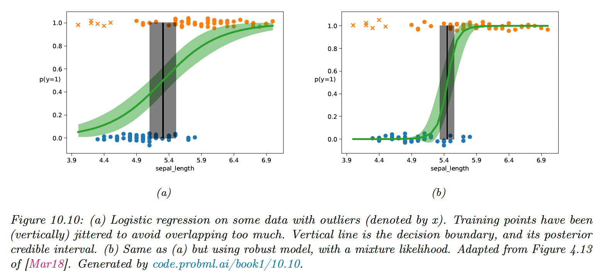
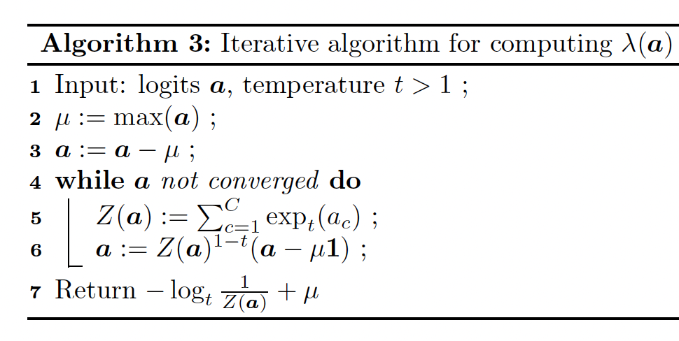
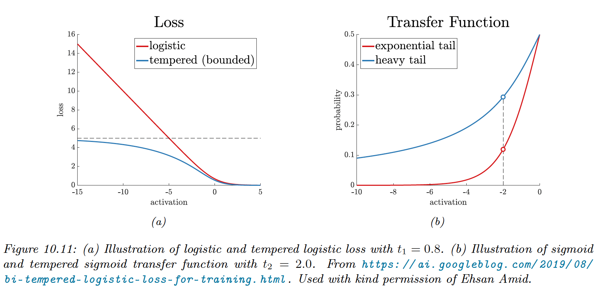

# 10.4 Robust Logistic Regression

When we have outliers in our data, due to label noise, robust logistic regression help avoid adversarial effects on the model.

### 10.4.1 Mixture model for the likelihood

One of the simplest ways to achieve robust logistic regression is to use a mixture likelihood:

$$
p(y|\bold{x})=\pi \mathrm{Ber}(y|0.5)+(1-\pi)p(y|\sigma(w^\top \bold{x}))
$$

This predicts that each label is generated uniformly at random with a probability $\pi$, and otherwise is generated using the regular conditional model.

This approach can also be applied to DNN and can be fit using standard methods like SGD or Bayesian inference methods like MCMC.

### 10.4.2 Bi-tempered loss

Examples far from the decision boundary but mislabeled will have undue adverse effects on the model if the loss is convex.

**Tempered loss**

This can be overcome by replacing the cross entropy loss with a “tempered” version, using a temperature parameter $0\leq t_1\leq 1$ to ensure the loss from outliers is bounded.

The standard cross-entropy loss is:

$$
\mathcal{L}(\bold{y},\hat{\bold{y}})=\mathbb{H}(\bold{y},\hat{\bold{y}})=\sum_c y_c\log \hat{y}_c
$$

The tempered cross-entropy is:

$$
\mathcal{L}(\bold{y}, \hat{\bold{y}})=\sum_c [y_c (\log_{t_1} y_c-\log_{t_1} \hat{y}_c) - \frac{1}{2-t_1}(y_c^{2-t_1}+\hat{y_c}^{2-t_1})
$$

when all the mass of $\bold{y}$ is on $c$ (one-hot encoding) this simplifies to:

$$
\mathcal{L}(c, \hat{\bold{y}})=-\log_{t_1} \hat{y}_c - \frac{1}{2-t_1}(1+\sum_{c'=1}^C \hat{y_c}^{2-t_1})
$$

Here $\log_t$  is the tempered log:

$$
\log_t(x)\triangleq \frac{1}{1-t}(x^{1-t}-1)
$$

which is monotonically increasing and concave, and reduces to the standard logarithm when $t_1$ is 1.

This is also bounded below by $-\frac{1}{1-t}$ for $0\leq t_1< 1$, therefore the tempered cross-entropy is bounded above.

**Transfer function**

Observation near the decision boundary but mislabeled needs to use a transfer function $\mathbb{R}^C\rightarrow[0,1]^C$ with a heavier tail than the softmax.

The standard softmax is:

$$
\hat{y}_c=\frac{e^{a_c}}{\sum_{c'=1}^C e^{a_{c'}}}=\exp[a_c-\log \sum_{c'=1}^C e^{a_{c'}}]=\exp[a_c-\mathrm{LSE}(\bold{a})]
$$

The tempered softmax, with $t_2>1>t_1$ is:

$$
\hat{y}_c=\exp_{t_2}(a_c-\lambda_{t_2}(\bold{a}))
$$

where:

$$
\exp_t(x)\triangleq [1+(1-t)x]^{1/1-t}_+
$$

when $t\rightarrow 1$, we find back the standard softmax.

Finally, we need to compute $\lambda_{t_2}(\bold{a})$, this needs to satisfy:

$$
\sum_{c=1}^C \exp_{t_2}(a_c-\lambda_{t_2}(\bold{a}))=1
$$

Combining the tempered loss with the tempered transfer function is **bi-tempered logistic regression**.

