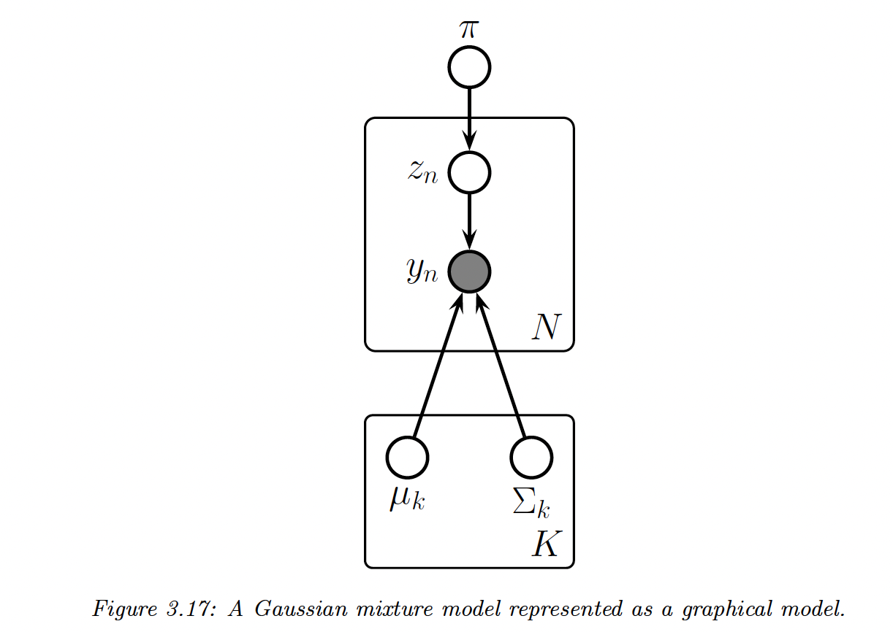

# 3. Probability: Multivariate Models

## 3.1 Joint distributions for multiple random variable

$Cov[X,Y]=\mathbb{E}[(X-\mathbb{E}(X))(Y-\mathbb{E}(Y))^\top]=E[XY^\top]-E[X]E[Y]$

If $\bold{x}\in \mathbb{R}^D$:

$Cov[\bold{x}]=\mathbb{E}[(\bold{x}-\mathbb{E}[\bold{x}])(\bold{x}-\mathbb{E}[\bold{x}])^\top]=\bold{\Sigma}$

$\mathbb{E}[\bold{x}^\top\bold{x}]=\bold{\Sigma} + \mu\mu^\top$

$Cov[\bold{Ax+b}]=\bold{A \Sigma A^\top}$

$\rho=corr(X,Y)=\frac{Cov(X,Y)}{\sigma_X\sigma_Y}$

## 3.2 Multivariate Gaussian (MVN)

### 3.2.2 Mahalanobis distance

pdf of the MVN:

$\mathcal{N}(\bold{y}|\bold{\mu}, \bold{\Sigma})=\frac{1}{(2\pi)^{D/2}|\Sigma|^{1/2}}exp[-\frac{1}{2}(\bold{y}-\bold{\mu})^\top\bold{\Sigma^{-1}}(\bold{y}-\mu)]$

with $\bold{\mu} \in \mathbb{R}^D$ and $\bold{\Sigma} \in \mathbb{R}^{D \times D}$

In 2D the pdf become the bivariate Gaussian distribution:

$\bold{\Sigma}=\begin{bmatrix}  \sigma_1^2 &\rho \sigma_1\sigma_2 \\\rho\sigma_1\sigma_2 & \sigma_2^2\end{bmatrix}$

with $\rho=\frac{\sigma_{12}^2}{\sigma_1\sigma_2}$

Mahalanobis distance:

$\Delta^2=\bold{(y-\mu)^\top\Sigma^{-1}(y-\mu)}$

Eigendecomposition of the inverse Cov matrix:

$\bold{\Sigma}^{-1}=\sum_{i=1}^Du_iu_i^{\top} \frac{1}{\lambda_i}$

We can express the Mahalanobis distance through a transformation:

$\bold{(y-\mu)^\top\Sigma^{-1}(y-\mu)}=\bold{(y-\mu)^\top}\sum_i \frac{1}{\lambda_i}u_iu_i^\top\bold{(y-\mu)}=\sum \frac{z_i^2}{\lambda_i}$

with $\bold{z=U(y-\mu)}$

Thus the Mahalanobis distance can be seen as Euclidean distance with a rotation of $\bold{u}$ and a translation of $\bold{\mu}$.

### 3.2.3 Marginals and conditionals

Let $\bold{y=(y_1,y_2)}$ be jointly Gaussian

Its parameters are:

$\mu= \bold{\begin{bmatrix} \mu_1 \\ \mu_2 \end{bmatrix}}$ and $\bold{\Sigma=\begin{bmatrix}\Sigma_{11} & \Sigma_{12} \\ \Sigma_{21}& \Sigma_{22}\end{bmatrix}}$

Marginals are given by:

$p(y_1)=\bold{\mathcal{N}(y_1|\mu_1,\Sigma_{11})} \\
p(y_2)=\bold{\mathcal{N}(y_2|\mu_2,\Sigma_{22})}$ 

Posterior conditional is given by:

$p(\bold{y_1|y_2)=\mathcal{N}(y_1|\mu_{1|2},\Sigma_{1|2}}) \\\mu_{1|2}=\mu_1+\Sigma_{12}\Sigma_{22}^{-1}(y_2-\mu_2) \\ \Sigma_{1|2}=\Sigma_{11}-\Sigma_{12}\Sigma^{-1}_{22}\Sigma_{21}$

Example in the 2d case:

$\Sigma=\begin{bmatrix} \sigma_1^2 & \rho\sigma_1\sigma_2 \\ \rho\sigma_1\sigma_2 & \sigma_2^2\end{bmatrix}$

Suppose we observe $Y_2=y_2$, the conditional is obtained by slicing the joint distribution through the $Y_2=y_2$ line:

$p(y_1|y_2)=\mathcal{N}(y_1|\mu_1+\frac{\rho\sigma_1\sigma_2}{\sigma_2^2}(y_2-\mu_2),\sigma_1^2-\frac{(\rho \sigma_1 \sigma_2)^2}{\sigma_2^2})$

## 3.3 Linear Gaussian System

Let $\bold{z} \in \mathbb{R}^L$  be an unknown vector of values, $y \in \mathbb{R}^D$ some noisy measurements of $\bold{z}$.

These variable are related as follow:

$p(z)=\mathcal{N}(z|\mu_z,\Sigma_z)$

$p(y|z)=\mathcal{N}(y|Wz+b,\Sigma_y)$

with $W \in \mathbb{R}^{D \times L}$

The joint distribution of this linear Gaussian system is a $L+D$ dimensional Gaussian:

$p(z,y)=p(z)p(y|z)$ with mean and covariance given by

$\mu=\begin{bmatrix} \mu_z \\ W\mu_z+b\end{bmatrix}\\ \Sigma=\begin{bmatrix} \Sigma_z & \Sigma_z W^\top \\ W \Sigma_z & \Sigma_y+ W\Sigma_zW^\top\end{bmatrix}$

The Bayes rule for Gaussian give the posterior over the latent as:

$p(z|y)=\mathcal{N}(z|\mu_{z|y},\Sigma_{z|y})$

$\Sigma_{z|y}^{-1}=\Sigma_z^{-1}+W^\top\Sigma_y^{-1}W$

$\mu_{z|y}=\Sigma_{z|y}[W^{\top}\Sigma_y^{-1}(y-b)+\Sigma_z^{-1}\mu_z]$

- **Exemple 1: Inferring an unknown scalar**
    
    We draw N noisy observations $y_i$ from a latent random variable $\bold{z}$. Let us assume the measurement noise has fixed precision $\lambda_y=\frac{1}{\sigma^2}$, so the likelihood is:
    
    $p(y_i|z)=\mathcal{N}(z,\lambda_y^{-1})$
    
    The Gaussian prior of the source is
    
    $p(z)=\mathcal{N}(z|\mu_0,\lambda_0^{-1})$
    
    Let also be
    
    $\bold{y}=(y_1,...,y_N)$
    
    $\bold{W}=\bold{1}_N$ column vector of 1
    
    $\bold{\Sigma}_y^{-1}=\mathrm{diag}(\lambda_y\bold{I})$
    
    The posterior is:
    
    $p(z|\bold{y})=\mathcal{N}(\mu_N,\lambda_N)$
    
    $\lambda_N=\lambda_0+N\lambda_y$
    
    $\mu_N=\frac{N\lambda_y \bar{y}+\lambda_0\mu_0}{\lambda_N}$
    

- **Exemple 2: Inferring an unknown vector**
    
    We have an unknown quantity of interest $\bold{z}\in\R^D$ with a Gaussian prior $p(\bold{z})=\mathcal{N}(\bold{\mu}_z,\bold{\Sigma}_z)$. If we know nothing about $\bold{z}$, we can set $\bold{\Sigma_z}=\infin \bold{I}$, and by symmetry $\mu_z=\bold{0}$
    
    We make N noisy and independent measures $\bold{y}_n \sim \mathcal{N}(z,\bold{\Sigma}_y)$.
    
    The likelihood is:
    
    $p(\mathcal{D}|z)=\prod_{n=1}^N\mathcal{N}(\bold{y}_n|z,\bold{\Sigma}_y)=\mathcal{N}(\bar{\bold{y}}|z,\frac{1}{N}\Sigma_y)$ 
    
    (we can replace the N observations by their average, provided that we scale down the covariance). Setting $\bold{W=I}$ and $\bold{b=0}$ we apply the Bayes rule for Gaussian:
    
    $p(z|\bold{y_1},...,\bold{y}_N)=\mathcal{N}(z|\bold{\mu}_N, \bold{\Sigma}_N)$
    
    $\bold{\Sigma}_N^{-1}=\bold{\Sigma}_z^{-1}+N\bold{\Sigma}_y^{-1}$
    
    $\mu_N^{-1}=\bold{\Sigma}_N^{-1}(\bold{\Sigma}_y^{-1}N\bold{\bar{y}}+\bold{\Sigma}_z^{-1}\mu_z)$
    

- **Exemple 3: Sensor fusion**
    
    N measurements from M sensors, the model has the form:
    
    $p\bold{(z,y)}=p(\bold{z})\prod_n \prod_m \mathcal{N}(\bold{y}_{n,m}|\bold{z},\Sigma_m)$
    
    Our goal is to combine the evidence together to compute the posterior.
    
    Let suppose $M = 2$, we can combine $\bold{y}_1$ and $\bold{y}_2$ into $\bold{y}=[\bold{y}_1,\bold{y}_2]$, so that:
    
    $p(\bold{y|z})=\mathcal{N}(\bold{y}|Wz,\bold{\Sigma}_y)$
    
    with $\bold{\Sigma}_y=\begin{bmatrix}\bold{\Sigma}_1 & 0 \\ 0 & \bold{\Sigma}_2 \end{bmatrix}$ and $\bold{W=[I, I]}$
    
    We can then apply Bayes rule for Gaussian to get $p(\bold{z|y})$, with $\bold{y}=[\bar{\bold{y}}_1, \bar{\bold{y}}_2]$
    

## 3.4 The exponential family

$p(\bold{y}|\phi)=h(\bold{y})e^{f(\phi)^\top\mathcal{T}(\bold{y})-A(f(\phi))}$

- With
    - $\mathcal{T}(\bold{y})$ the sufficient statistics
    - $f(\phi)=\mu$ the canonical parameters
    - $A(f(\phi))$  is the log partition function
- canonical form: $f(\phi)=\phi$
- natural exponential family (NEF): $\bold{\mathcal{T}(y)=y}$

This becomes:

$p(\bold{y}|\phi)=h(\bold{y})e^{\phi^\top \bold{y}-A(\phi)}$

The first and second cumulants of a distribution are $\mathbb{E}[Y]$ and $\mathbb{V}[Y]$

This first and second moments are $\mathbb{E}[Y]$ and $\mathbb{E}[Y^2]$

Important property of the exponential family: derivatives of the log partition function yields the cumulants of the sufficient statistics

$\nabla A(\phi)=\mathbb{E}[\mathcal{T(\bold{y})}]$

$\nabla^2A(\phi)=Cov[\mathcal{T(\bold{y})}]$

Since the Hessian is pos-def and the log likelihood has the form $\phi^\top \mathcal{T}(\bold{y})-A(\phi)$, it is concave and hence the MLE has a unique global max.

## 3.5 Mixture models

k components, the distribution has the form:

$p(\bold{y|\theta)}=\sum^K_{k=1}\pi_kp_k(\bold{y})$

with $\sum_{k=1}^K\pi_k=1$

This model can be expressed as a hierarchical model in which we introduce a latent variable $z=\{1,...,K\}$ which specificies which distribution to use to model $\bold{y}$

- The prior on this latent variable is $p(z=k|\theta)=\pi_k$
- The conditional is $p(y|z=k, \theta)=p_k(y)=p(y|\theta_k)$

By marginalizing out $z$:

$p(\bold{y}|\theta)=\sum_{k=1}^Kp(y|z=k,\theta)p(z=k|\theta)=\sum^{K}_{k=1}p(y|\theta_k)\pi_k$

Gaussian mixture:

$p(\bold{y}|\theta)=\sum_k\pi_k\mathcal{N(\bold{y}|\mu_k,\Sigma_k)}$

GMM works in 2 phase:

1. Fit the model, ie computing MLE $\hat{\theta}=\mathrm{argmax}_{\theta}\log\,p(\mathcal{D}|\theta)$
2. Associate each $y_n\in D$ to a latent variable $z_n\in\{1,...,K\}$ to specify the identity of the mixture component (or cluster) used to generate $y_n$
    
    We can compute the posterior of this latent identities:
    
    $p(z_n|y_n,\theta)=\frac{p(y_n|z_n=k,\theta)p(z_n=k|\theta)}{\sum_{k'}p(y_n|z_n=k', \theta)p(z_n=k'|\theta)}$
    
    $\hat{z}_n=\argmax_k \log\big[ p(y_n|z_n=k,\theta)+p(z_n=k|\theta)\big]$
    

With uniform prior over $z_n$ and we use spherical Gaussian with $\Sigma_k=I$, the problem become a Kmeans clustering:

$z_n=\argmin_k||y_n-\hat{\mu}_k||_2^2$

Bernoulli Mixture models

$p(\bold{y}|z=k,\theta)=\prod_{d=1}^{D}Ber(y_d|\mu_{dk})=\prod_{d=1}^{D}\mu_{dk}^{y_d}(1-\mu_{dk})^{1-y_d}$

$\mu_{dk}$ is the probability that bit $d$ turns on in cluster $k$

## 3.6 Probabilistic Graphical Models

When the model is a Direct Acyclic Graph (DAG) we call it a Bayesian Network (even though nothing inherently Bayesian about it)

Ordered Markov Property: node given parents are independent of predecessors

$Y_i \perp Y_{pred(i)}|Y_{parents(i)}$

The joint distribution can be represented as:

$p(Y_{i:V})=\prod_{i=1}^Vp(Y_i|Y_{parents(i)})$

Markov Chain or autoregressive model of order 1, the $p$ function is the transition function or Markov kernel

$p(\bold{y}_{1:T})=p(\bold{y}_1)\prod_ {t=2}^T p(y_t|y_{t-1})$

Generalization to m-order:

$p(\bold{y}_{1:T})=p(\bold{y}_{1:M})\prod^T_{t=M+1}p(y_t|y_{t-M:t-1})$

It the parameters of the Conditional Probability Distribution (CPD) are unknown, we can view them as additional random variables and threat them as hidden variables to be inferred.

$\theta \sim p(\theta)$ some unspecified prior over the parameters

$\bold{y}_n \sim p(\bold{y}|\theta)$ some specified likelihood

The joint distribution is has the form:

$p(\mathcal{D},\theta)=p(\theta)p(\mathcal{D}|\theta)$, where $\mathcal{D}=(\bold{y}_1,..., \bold{y}_N)$

$p(\mathcal{D}|\theta)=\prod_{n=1}^Np(\bold{y}_n|\theta)$

The figure below encodes the representation:

$p(\bold{y}_{1:N}, z_{1:N}, \theta)=p(\pi)\Big[\prod^K_{k=1}p(\mu_k)p(\bold{\Sigma_k})\Big]\Big[\prod_{n=1}^N p(z_n|\pi)p(y_n|z_n,\bold{\mu}_{1:K},\bold{\Sigma}_{1:K})\Big]$

