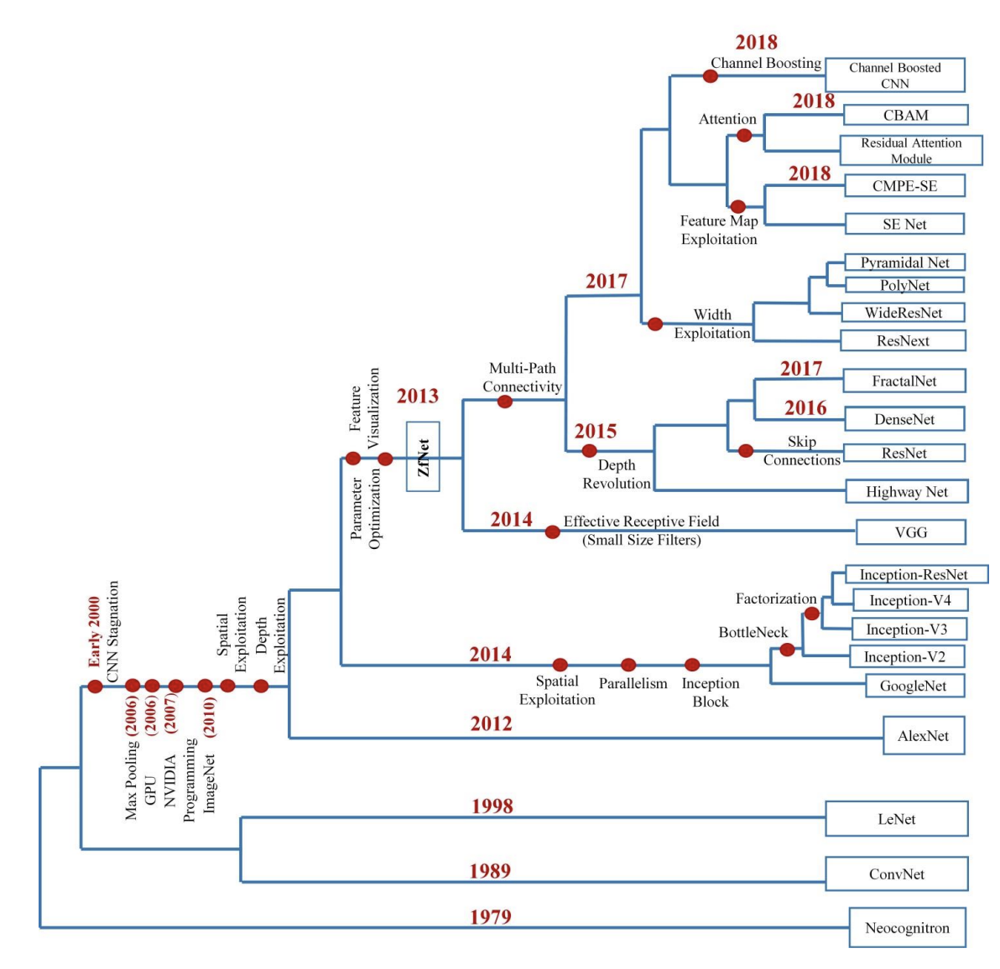
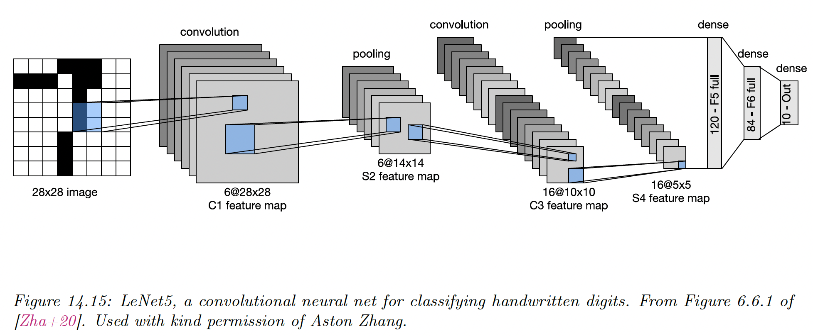
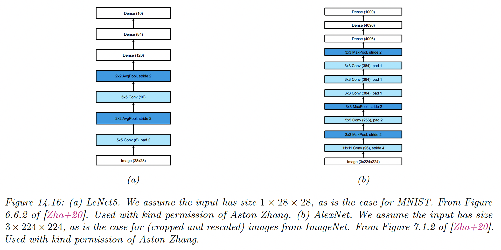
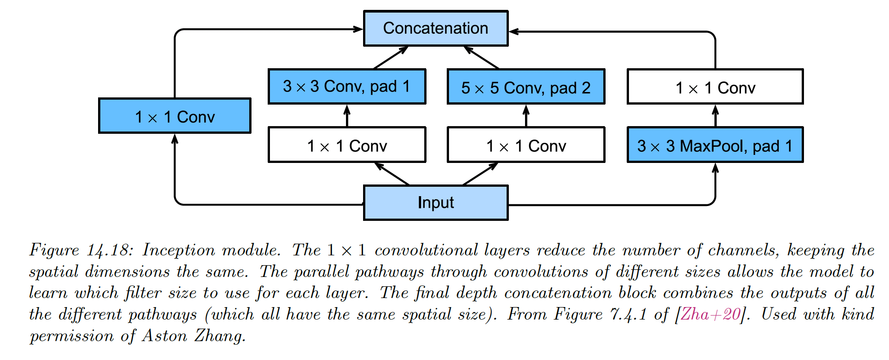
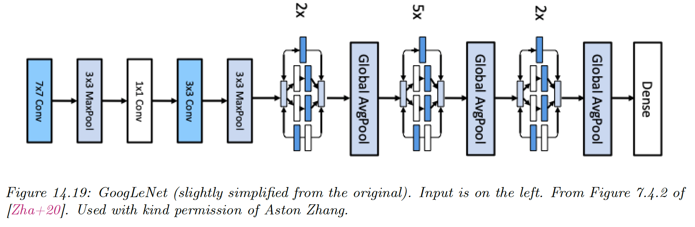
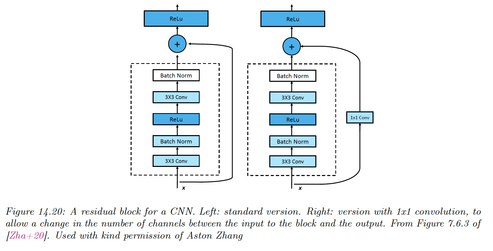
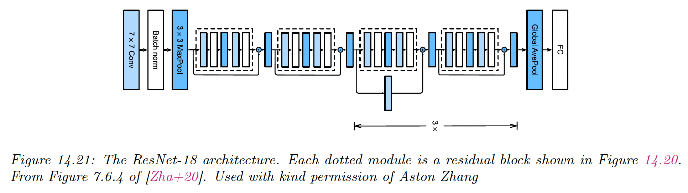
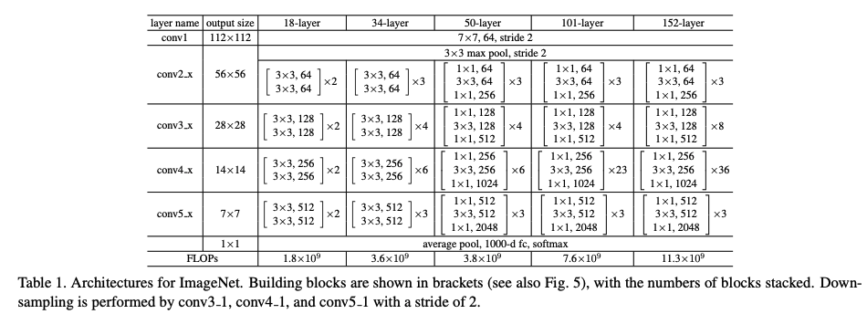
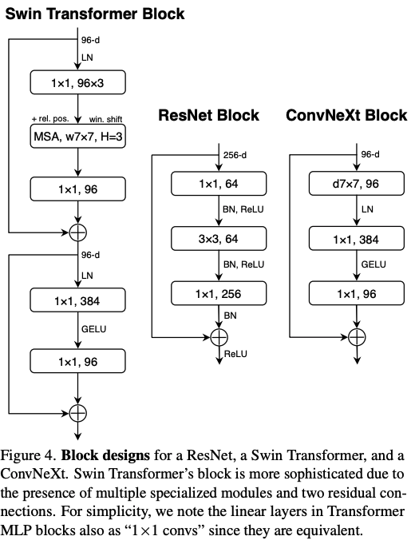

# 14.3 Common architectures for image classification

CNNs are commonly used to perform image classification, which is the task of estimating the function:

$$
f:\mathbb{R}^{H\times W\times K}\rightarrow \{0,1\}^C
$$

where $K$  is the number of channels and $C$ is the number of classes.

We now briefly review various CNNs architectures developed over the years to solve image classification classes.

For more models, see this [extensive review of CNN's history](https://arxiv.org/pdf/1901.06032.pdf).

Also see [timm, now hosted by huggingface,](https://github.com/huggingface/pytorch-image-models) for PyTorch implementations.

### 14.3.1 LeNet

One of the earliest CNN was named after its creator, Yann LeCun. It was designed to classify images of handwritten digitals and was trained on the MNIST dataset.

It achieves 98.8 % accuracy after a single epoch, against 95.9% for the MLP.

Of course, classifying digits is of limited utility. Classifying entire strings also requires image segmentation, so LeCun and its colleague devised a way to combine CNN with a conditional random field.

This system was deployed by US postal services.

### 14.3.2 AlexNet

It was not until 2012 and the AlexNet paper by Alex Krizhevsky that mainstream computer vision researchers paid attention to CNNs.

In this paper, the (top 5) error rate on ImageNet has been reduced from 26% to 15%, which was a dramatic improvement.

Its architecture is very similar to LeNet with the following differences:

- Deeper, with 8 layers instead of 5, excluding pooling layers
- Uses ReLU non-linearities instead of tanh
- Uses Dropout for regularization instead of weight decay
- Stacks several convolutional layers on top of each other instead of strictly alternating them with pooling. This has the advantage of enlarging the receptive field (three stacked $3\times 3$ filters will have a receptive size of $7\times 7$). This is better than using a single filter of size $7\times 7$ because the stacked filters have nonlinearities between them, and have fewer parameters in total than the $7\times 7$ filter.

Note that AlexNet has 60M parameters (much more than the 1M labeled examples), mostly due to the 3 FCN layers at the output.

Fitting this model required using 2 GPUs (since GPUs memory was lower at the time) and is considered an engineering *tour de force*.

### 14.3.3 GoogLeNet (Inception)

The name of this model is a pun between Google and LeNet.

The model innovates with the Inception block, named after the movie *Inception,* in which the phrase “We need to go deeper” became a popular Meme. 

Inception block employs multiple parallel paths, each with a different filter size. This lets the model learn what the optimal filter size should be at each level.

The overall model consists of 9 inception blocks followed by global average pooling.

### 14.3.4 ResNet

The winner of the 2015 ImageNet challenge was a team at Microsoft who proposed **ResNet**.

The key idea is to replace $\bold{x}_{l+1}=\mathcal{F}(\bold{x}_l)$ with **residual block**:

$$
\bold{x}_{l+1}=\varphi(\mathcal{F}(\bold{x}_l)+\bold{x}_l)
$$

$\mathcal{F}_l$ only needs to learn the residual, or difference, between the input and output of this layer, which is a simpler task.

$\mathcal{F}_l$ has the form *conv-BN-ReLU-conv-BN.*

- Padding on the residual $\bold{x}_l$ ensures the spatial dimension matches the output of the convolution layer $\mathcal{F}(\bold{x}_l)$
- 1x1 convolution ensures the channel numbers of the residual match the channel numbers of the convolution layer output

The use of residual blocks allows to train very deep network since the gradient can flow directly from the output to the earlier layers, using skip connections.

Resnet-18 architecture can be represented as:

*(Conv : BN : Max ) : (R : R) : (R’ : R) x 3 : Avg : FC*

where R is a residual block, R’ is a residual block with skip-connection with stride 2, and FC is a fully connected layer.

The input size gets reduced spatially by $2^5=32$ because of the factor of 2 for each R’ block (the stride is 2), plus the MaxPool and the initial Conv-7x7

Therefore a 224x224 image gets reduced to a 7x7 image before going into the global average pooling layer.

Better performances are achieved by scaling the ResNet-18 up to ResNet-152.

**PreResnet** shows that the signal is still being attenuated because of the posterior nonlinearity. They instead propose:

$$
\bold{x}_{l+1}=\varphi(\mathcal{F}_l(\bold{x}_l))+\bold{x}_l
$$

Now it is very easy for the network to learn the identity function. If we use ReLu, we do so by setting all the weights and biases of the layer to zero so that $\mathcal{F}_l(\bold{x_l})=\bold{0}$.

By doing so, they scaled the model to 1001 layers.

**Wide Resnet** suggests an alternative, with a lot of channels per layer.

### 14.3.5 DenseNet

An alternative to Resnet is to concatenate the residual instead of adding it:

$$
\bold{x}_{l+1}=\mathcal{F}_l(\bold{x}_l)\otimes \bold{x}_l
$$

Thus the overall model has the form:

$$
\bold{x}\rightarrow [\bold{x},f_1(\bold{x}),f_2(\bold{x},f_1(\bold{x})),\dots]
$$

The dense connectivity increases the number of parameters since the channels get stacked depthwise. We can compensate by adding 1x1 convolutions in between, along with pooling layers with a stride of 2 to reduce the spatial dimension.

DenseNets can outperform ResNets since all computed features are directly accessible to the output layer. However, they can be more expensive to compute.

### 14.3.6 Neural architecture search

Many CNNs are similar in their design and simply rearrange blocks and hyper-parameters.

In 2022, [ConvNext](https://arxiv.org/pdf/2201.03545.pdf) is considered the state of the art for a wide variety of vision tasks and was created on top of a ResNet, by adapting training and architecture decisions from Swin-T (a ViT model).

We can automate this discovery process by using black-box (derivation-free) optimization models to find architecture that minimizes the validation loss. This is called **AutoML**, or in deep learning **Neural Architecture Search (NAS)**.