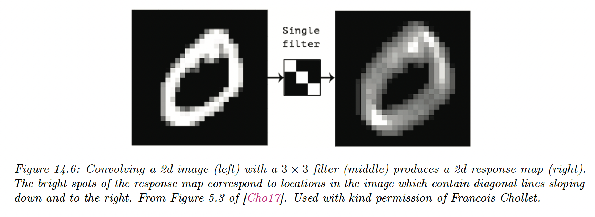

# 14.2 Common layers

### 14.2.1 Convolutional layers

We describe the basics of 1d and 2d convolution and their role in CNNs.

**14.2.1.1 Convolution in 1d**

The convolution between two functions $f,g:\mathbb{R}^D\rightarrow \mathbb{R}$ is:

$$
[f \circledast g](\bold{z})=\int_{\mathbb{R}^D}f(\bold{u})g(\bold{z-u})d\bold{u}
$$

If we use discrete functions, we evaluate

- $f$ at the points $\{-L,\dots,0,\dots,L\}$ to yield the filter $w_{l}=f(l)$
- $g$ at the points $\{-N,\dots,0,\dots,N\}$ to yield the feature vector $x_n=g(n)$

The above equation becomes:

$$
[\bold{w}\circledast \bold{x}](i)=\sum_{k=-L}^L w_k x_{i-k}
$$

**Cross-correlation** is a close operation where we don’t “flip” the weight vector. After eliminating the negative indices: 

$$
[\bold{w}\circledast\bold{x}](i)=\sum_{k=0}^{L-1} w_k x_{i+k}
$$

If the weight vector is symmetric, as it’s often the case, then cross-correlation and convolution are the same.

In deep learning, cross-correlation is often called “convolution”, and we will follow this convention.

**14.2.1.2 Convolution in 2d**

In 2d, the cross-correlation equation becomes:

$$
[\bold{W}\circledast X](i,j)=\sum_{u=0}^{H-1} \sum_{v=0}^{W-1} w_{u,v} x_{u+i,v+j}
$$

where the 2d filter $\bold{W}$ has size $H\times W$.

For instance, convolving a $3\times3$ input $X$ with a $2\times 2$ kernel $\bold{W}$:

$$
\begin{align}
Y&=
\begin{bmatrix}
w_1 & w_2 \\ w_3 & w_4
\end{bmatrix} \circledast 
\begin{bmatrix}
x_1 & x_2 &x_3 \\
x_4 & x_5 &x_6 \\
x_7 & x_8 &x_9 \\
\end{bmatrix}\\
&=
\begin{bmatrix}
(w_1 x_1+w_2x_2+w_3x_4+w_4x_5) & (w_1 x_2+w_2x_3+w_3x_5+w_4x_6) \\
(w_1 x_4+w_2x_5+w_3x_7+w_4x_8)  & (w_1 x_5+w_2x_6+w_3x_8+w_4x_9) \\
\end{bmatrix}
\end{align}
$$

We can think of 2d convolution as feature detection: if $\bold{W}$ represents an edge, the activation will “light-up” where an edge is present in the input.

The result $\bold{W}\circledast X$ is therefore called a **feature map**.

**14.2.1.3 Convolution as matrix-vector multiplication**

Since convolution is a linear operator, we can represent it by matrix multiplication. By flattening $X$ into $\bold{x}$, we get:

We see that CNNs are like MLPs where the weight matrices have a special spatial sparse structure.

This implements the idea of translation invariance and reduces the number of parameters compared to a dense layer.

**14.2.1.4 Boundary conditions and padding**

- **Valid convolution**, where we only apply the filter to “valid” parts of the image, produces outputs that are smaller than inputs
- **Same convolution** uses **zero-padding** (adding a border of 0s) on the input to ensure the size of input and output are the same.

**14.2.1.5 Strided convolutions**

Since every output pixel is generated by a weighted combination of inputs in its **receptive field**, neighboring outputs will have similar values because their inputs are overlapping.

We can reduce this redundancy by choosing a stride different than 1.

Given:

- the input has size $x_h\times x_w$
- the filter $f_h\times f_w$,
- we use zero padding on each side of size $p_h$ and $p_w$
- we use strides of size $s_h$ and $s_w$

The output size will be:

$$
\Big[\frac{x_h-f_h+2p_h+s_h}{s_h}\Big]\times \Big[\frac{x_w-f_w+2p_w+s_w}{s_w}\Big]
$$

**14.2.1.6 Multiple inputs and output channels**

If the input image is not grayscale but has multiple channels (RGB or hyper-spectral bands for satellite images) we can extend the definition of convolution using a 3d weight matrix $\bold{W}$ or **tensor:**

$$
z_{i,j}=b+\sum_{u=0}^{H-1}\sum_{v=0}^{W-1}\sum^{C-1}_{c=0} x_{si+u,sj+v,c}w_{u,v,c}
$$

where $s$ is the stride (same for height and width for simplicity) and $b$ is the bias term.

Each weight matrix can only detect a single type of pattern, but we usually want to detect many.

We can do this by using a 4d weight matrix, where the filter to detect feature $d$ in channel $c$ is stored in $\bold{W}_{:,:,c,d}$

The convolution becomes:

$$
z_{i,j,d}=b_d+\sum_{u=0}^{H-1} \sum_{v=0}^{W-1} \sum_{c=0}^{C-1} x_{u+si,v+sj,c}w_{u,v,c,d}
$$

which is exactly the formula used in PyTorch [Conv2d](https://pytorch.org/docs/stable/generated/torch.nn.Conv2d.html).

Each vertical cylindrical column is a set of output features at $\bold{z}_{i,j,1:D}$, this is called a **hypercolumn.**

Each element is a different weighted combination of the $C$ features in the receptive field of the layer below.

**14.2.1.7 Pointwise ($1\times 1$) convolution** 

Sometimes, we want to take a weighted combination of the feature at a given location, instead of across locations. This can be achieved with **pointwise (or 1x1) convolution**.

$$
z_{i,j,d}=b_d+\sum_{c=0}^{C-1}x_{i,j,c}w_{0,0,c,d}
$$

This changes the number of channels from $C$ to $D$ and can be thought of as a linear layer applied to a 2D input.

### 14.2.2 Pooling layers

Convolution preserves spatial information, this property is known as **equivariance**.

Sometimes, we want to be invariant to the location, e.g. we want to know if an object is inside the image or not, regardless of its location.

This can be achieved using **max pooling**, which just computes the maximum over its incoming values. An alternative is to use **average pooling**, replacing the max by the mean.

If we average over all locations in the feature map, this is called **global average pooling.** This converts a feature map dimensions from $H\times W\times D$ to $1\times 1\times D$.

This can then be reshaped as a $D$-dimensional vector, passed to a fully connected layer to convert it into a $C$-dimensional vector, then finally passed to a softmax output.

The use of global average pooling means we can use images of any size since the final feature map will always be converted to a $D$ dimensional vector before being mapped to a distribution over the $C$ classes.

This is available under the [MaxPool2d operator](https://pytorch.org/docs/stable/generated/torch.nn.MaxPool2d.html) in PyTorch

### 14.2.3 Putting it all together

A common design pattern is to create a CNN by alternating convolution layers with max-pooling layers, followed by a linear classification at the end.

 We omit normalization layers in this example since the model is shallow.

This design pattern first appeared in Fukushima’s **neocognitron** and in 1998 Yann LeCun used it in its eponymous **LeNet** model, which also used SGD and backprop to estimate its parameters.

### 14.2.4 Normalization layers

To scale this design to deeper networks and avoid vanishing or exploding gradient issues, we use normalizing layers to standardize the statistics of the hidden units.

**14.2.4.1 Batch normalization**

The most popular normalization layer is **batch normalization (BN)**. This ensures the distribution of activations within a layer has zero mean and unit variance, when average across the samples in a minibatch:

$$
\begin{align}
\mu_\mathcal{B}&=\frac{1}{|\mathcal{B}|}\sum_{\bold{z}\in\mathcal{B}}\bold{z} \\
\sigma_\mathcal{B}^2&= \frac{1}{|\mathcal{B}|}\sum_{z\in\mathcal{B}}(\mu_{\mathcal{B}} - \bold{z})^2 \\
\bold{\hat{z}}_n &= \frac{\bold{z}-\mu_\mathcal{B}}{\sqrt{\sigma_\mathcal{B}^2+\epsilon}} \\
\bold{\tilde{z}}_n &= \gamma \odot \bold{\hat{z}}_n+\beta
\end{align}
$$

where $\mathcal{B}$ is the minibatch containing example $n$, $\beta$ and $\gamma$  are learnable parameters for this layer (since this operation is differentiable).

The empirical means and variance of layers keep changing, so we need to recompute $\mu$ and $\sigma^2$ for each minibatch.

At test time, we might have a single input, so we can’t compute batch statistics. The standard solution is to:

- Compute $\mu_l$ and $\sigma^2_l$ for each layer using the full batch
- Freeze these parameters and add them along $\beta_l$ and $\gamma_l$
- At test time, use these frozen parameters instead of computing the batch statistics

Thus, when using a model with BN, we need to specify if we are using it for training or inference.

PyTorch implements this with [BatchNorm2d](https://pytorch.org/docs/stable/generated/torch.nn.BatchNorm2d.html).

For speed, we can combine a frozen batch norm layer with the previous layer. If the previous layer computed $W X+b$, using BN yields:

$$
Z=\gamma \odot (WX+\bold{b}-\mu)/\sigma+\beta
$$

We can write the combined layers as the **fused batch norm:**

$$
Z=W'X+\bold{b}'
$$

where $W'=\gamma\odot W /\sigma$ and $\bold{b}'=\gamma \odot (\bold{b}-\mu)/\sigma +\beta$

The benefits of batch normalization for CNN can be quite dramatic, especially for the deeper ones. The exact reasons are still unclear, but BN seems to:

- make the optimization landscape a bit smoother
- reduce the sensitivity to the learning rate (allow a larger one)

In addition to computation advantages, it also has statistical advantages since it plays the role of a regularizer. It can be shown to be equivalent to a form of approximate Bayesian inference.

However, the reliance on a minibatch of data can result in unstable estimates when training with small batch sizes, even though [**batch renormalization](https://arxiv.org/pdf/1702.03275.pdf)** partially addresses this using rolling means on batch statistics.

**14.2.4.2 Other kinds of normalization layers**

While batch normalization struggles with small batch size, we can pool statistics from other dimensions of the tensor:

- **Layer norm** pools over channel, height, and width and match on the batch index
- **Instance norm** pools do the same but for each channel separately
- **Grouping norm** generalizes this to group of channels

More recently, [**filter response normalization](https://arxiv.org/pdf/1911.09737.pdf) (FRN)** has been proposed as an alternative to batch norm that works well on image classification and object detection, even when batch size is 1.

It is applied to each channel and each batch like instance norm, but instead of standardizing it divide by the mean squared norm:

$$
\begin{align}
\nu^2_{b,c}&=\frac{1}{N}\sum_{ij}z_{b,i,j,c}^2 \\
\hat{z}_{b,i,j,c}&= \frac{z_{b,i,j,c}}{\sqrt{\nu^2_{b,c}+\epsilon}}
\end{align}
$$

Since there is no mean centering, the output can drift away from 0, which can have detrimental effects, especially with ReLU activations.

To compensate for it, the authors suggest adding a **thresholded linear unit (TLU)** at the output, that has the form:

$$
y=\max(x,\tau)
$$

where $\tau$ is a learnable offset.

**14.2.4.3 Normalization-free networks**

Recently, [normalizer-free networks](https://arxiv.org/pdf/2102.06171.pdf) have been proposed for residual networks. The key is to replace batch norm with adaptive gradient clipping, as an alternative way to avoid training instabilities.

We therefore use:

$$
\bold{g}'=\min(1,\frac{c}{||\bold{g}||})\bold{g}
$$

but adapt the clipping strength dynamically.

The resulting model is faster to train and more accurate than other competitive models trained with batch norm.