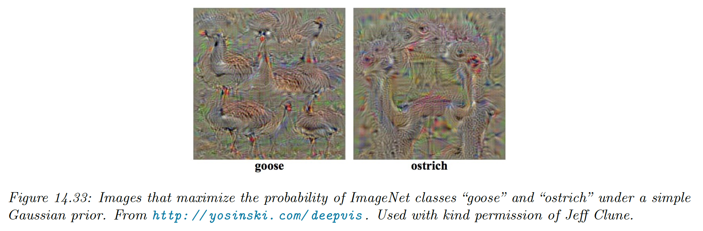
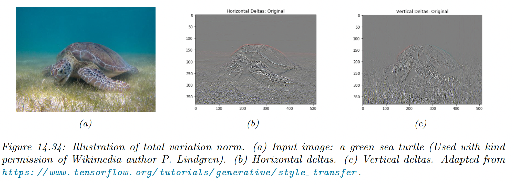
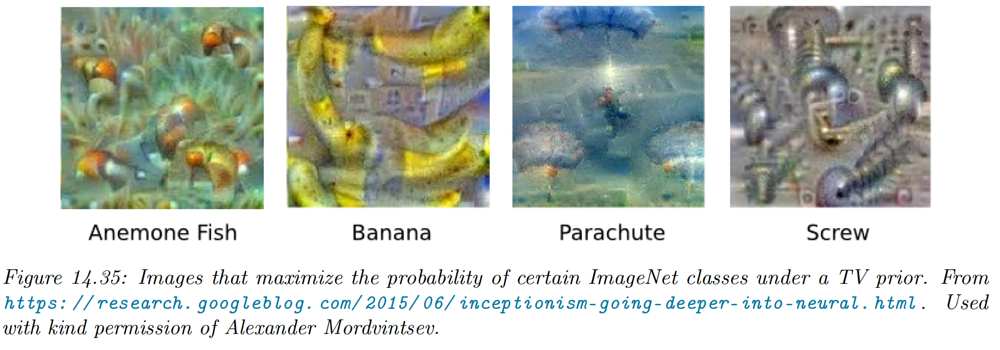
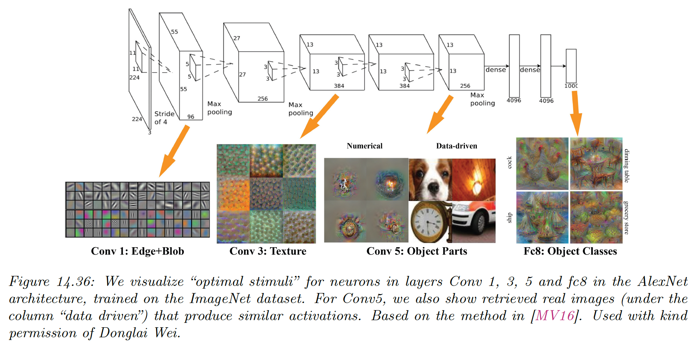
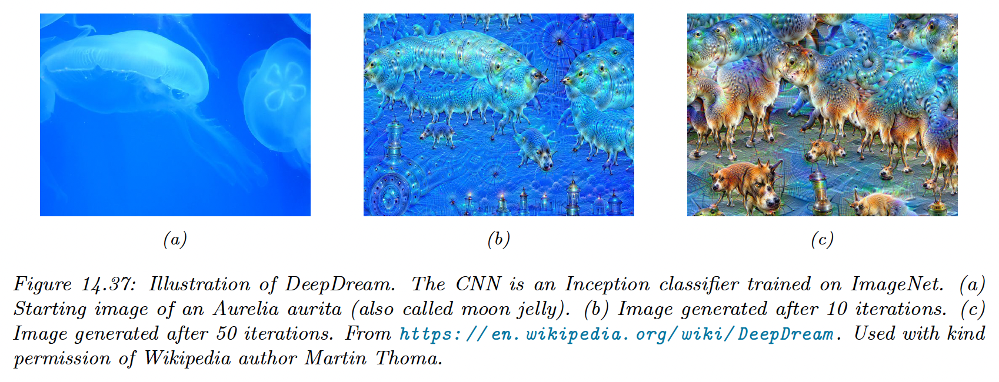
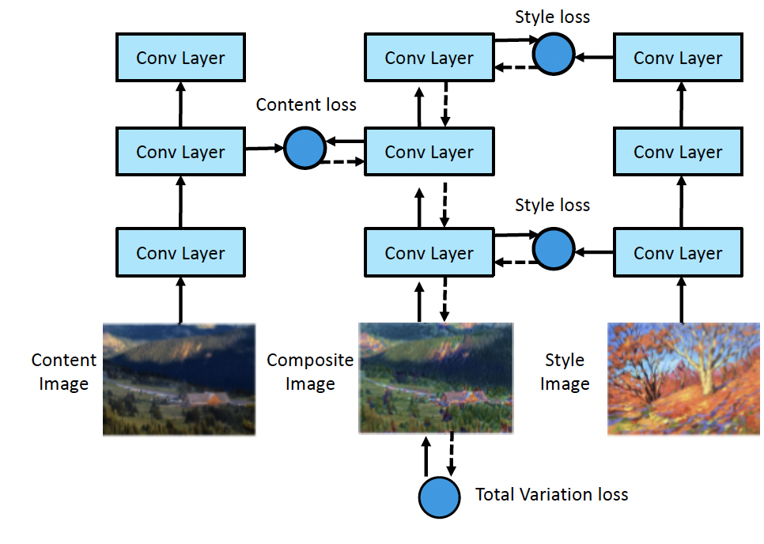
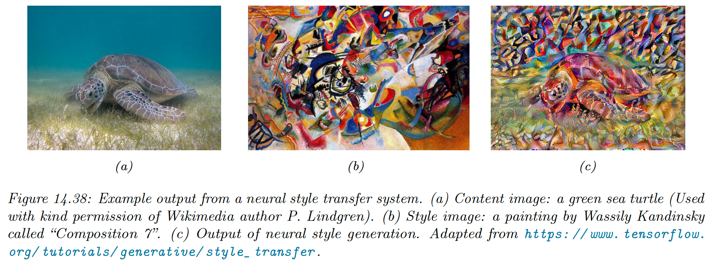

# 14.6 Generating images by inverting CNNs

A CNN trained for image classification is a discriminative model of the form $p(y|\bold{x})$, returning a probability distribution over $C$ class labels.

In this section, we convert this model into a conditional **generative image model** of the form $p(\bold{x}|y)$. This will allow us to generate images belonging to a specific class.

### 14.6.1 Converting a trained classifier into a generative model

We can define a joint distribution over images and labels $p(\bold{x},y)=p(y|\bold{x})p(\bold{x})$.

If we select a specific label value, we can create a conditional generative model $p(\bold{x}|y)\propto p(y|\bold{x})p(\bold{x})$.

Since $p(y|\bold{x})$ is not an invertible function, the prior $p(\bold{x})$ will play an important role as a regularizer.

One way to sample from this model is to use **Metropolis Hasting algorithm**, were the energy function is:

$$
\mathcal{E}_c(\bold{x})=\log p(y=c|\bold{x})+\log (\bold{x})
$$

Since the gradient is available, we then make the update:

$$
q(\bold{x}'|\bold{x})=\mathcal{N}(\bold{x}'|\mu(\bold{x}),\epsilon I)
$$

where:

$$
\mu(\bold{x})=\bold{x}+\frac{\epsilon}{2}\nabla \log \mathcal{E}_c(\bold{x})
$$

This is called the **Metropolis adjusted Langevin algorithm (MALA)**.

As an approximation we skip the rejection part and accept every candidate, this is called the **unadjusted Lanvin algorithm** and we used for [conditional image generation](https://arxiv.org/abs/1612.00005).

Thus, we get an update over the space of images that looks like a noisy SGD, but the gradient are taken w.r.t the inputs instead of the weights:

$$
\bold{x}_{t+1}=\bold{x}_t+\epsilon_1\frac{\partial \log p(\bold{x}_t)}{\partial \bold{x}_t}+\epsilon_2\frac{\partial \log p(y=c|\bold{x}_t)}{\partial \bold{x}_t}+\mathcal{N}(\bold{0},\epsilon_3^2I)
$$

- $\epsilon_1$ ensures the image is plausible under the prior
- $\epsilon_2$ ensures the image is plausible under the likelihood
- $\epsilon_3$ is a noise term to enforce diversity. If set to 0, the method a deterministic algorithm generating the “most likely image” for this class.

### 14.6.2 Image priors

We now discuss priors to regularize the ill-posed problem of inverting a classifier. Priors, combined with the initial image, determine the kinds of outputs to generate.

**14.6.2.1 Gaussian prior**

The simplest prior is $p(\bold{x})=\mathcal{N}(\bold{x}|\bold{0},I )$, assuming the pixels have been centered. This can prevent pixels to have extreme values.

The update due to the prior term has the form:

$$
\nabla_\bold{x}\log p(\bold{x}_t)=\nabla_\bold{x} \Big[-\frac{1}{2}||\bold{x}_t-\bold{0}||^2_2\Big]=-\bold{x}_t
$$

The update is (assuming $\epsilon_2=1$ and $\epsilon_3=0$):

$$
\bold{x}_{t+1}=(1-\epsilon_1)\bold{x}_t+\frac{\partial \log (y=c|\bold{x}_t)}{\partial \bold{x}_t}
$$

This can generate the following samples:

**14.6.2.2 Total variation (TV) prior**

To help generating more realistic images, we can add extra regularizers like **total variation or TV norm** of an image. This is the integral of the per-pixel gradients, approximated as:

$$
\mathrm{TV}(\bold{x})=\sum_{ijk}(x_{i+1,j,k}-x_{i,j,k})^2+(x_{i,j+1,k}-x_{i,j,k})^2
$$

where $x_{i,j,k}$ is the pixel value of at location $(i,j)$ for channel $k$.

We can rewrite this in term of the horizontal and vertical **Sobel edge detector** applied to each channel:

$$
\mathrm{TV}(\bold{x})=\sum_k ||\bold{H}(\bold{x}_{:,:,k})||_F^2+||\bold{V}(\bold{x}_{:,:,k}||^2_F)
$$

Using:

$$
p(\bold{x})\propto e^{-\mathrm{TV}(\bold{x})}
$$

discourage images from having high frequency artifacts.

Gaussian blur can also be used instead of TV, with similar effects.

### 14.6.3 Visualizing the feature learned by a CNN

**Activation maximization (AM)** optimizes a random image to maximize the activation of a given layer. This can be useful to get a better grasp of the features learned by the ConvNet.

Below are the results for each layer of an AlexNet, using a TV prior. Simple edges and blobs are recognized first, and then as depth increase, we find textures, object parts and finally full objects.

This is believed to be roughly similar to the hierarchical structure of the visual cortex.

### 14.6.4 Deep Dream

Instead of generating images that maximize the feature map of a given layer or class labels, we now want to express these features over an input image.

We view or trained classifier as a feature extractor. To amplify features from layers $l\in\mathcal{L}$, we define a loss function of the form:

$$
\mathcal{L}(\bold{x})=\sum_{l\in\mathcal{L}}\bar{\phi_l}(\bold{x})
$$

where

$$
\phi_l(\bold{x})=\frac{1}{HWC}\sum_{hwc}\phi_{lhwc}(\bold{x})
$$

is the feature vector for layer $l$.

We can now use gradient descent to optimise this loss and update our original image. By using the output as input in a loop, we iteratively add features to it.

This is called **DeepDream**, because the model amplifies features that were only initially hinted.

The output image above is a hybrid between the original image and “hallucinations” of dog parts, because ImageNet contains contains so many kinds of dogs.

### 14.6.5 Neural style transfer

[**Neural style transfer**](https://www.cv-foundation.org/openaccess/content_cvpr_2016/papers/Gatys_Image_Style_Transfer_CVPR_2016_paper.pdf) give more generative control to the user, by specifying a “content” image $\bold{x}_c$ and a “style” image $\bold{x}_s$. The model will try to generate new image $\bold{x}$ that re-renders$\bold{x}$$\bold{x}_c$ by applying the style $\bold{x}_s$.

**14.6.5.1 How it works**

Style transfer works by optimizing the loss function:

$$
\mathcal{L}(\bold{x}|\bold{x}_s,\bold{x}_c)=\lambda_{TV} \mathrm{TV}(\bold{x})+\lambda_s \mathcal{L}_s(\bold{x},\bold{x}_s)+\lambda_c \mathcal{L}_c(\bold{x},\bold{x}_c)
$$

where $\mathrm{TV}$ is the total variation prior.

The content loss measures similarity between $\bold{x}$ to $\bold{x}_c$ by comparing feature maps of a pre-trained ConvNet $\Phi$ in the layer $\ell$:

$$
\mathcal{L}_c(\bold{x},\bold{x}_c)=\frac{1}{C_\ell H_\ell W_\ell}||\phi_\ell(\bold{x})-\phi_\ell(\bold{x}_c)||_2^2
$$

We can interpret the style as a statistical distribution of some kinds of image features. Their location don’t matter, but their co-occurence does.

To capture the co-occurence statistics, we compute the **Gram matrix** for the image using feature maps at layer $\ell$:

$$
G_\ell(\bold{x})_{c,d}=\frac{1}{H_\ell W_\ell}\sum_{h=1}^{H_\ell}\sum_{w=1}^{W_\ell} \phi_\ell(\bold{x})_{h,w,c}\phi_\ell(\bold{x})_{h,w,d}
$$

The Gram matrix is a $C_\ell\times C_\ell$ matrix proportional to the uncentered covariance.

Given this, the style loss is:

$$
\mathcal{L}_s(\bold{x},\bold{x}_s)=\sum_{\ell \in \mathcal{S}}||G_\ell(\bold{x})-G_\ell(\bold{x}_s)||^2_F
$$

**14.6.5.2 Speeding up the method**

In the Neural style transfer paper, they used L-BFGS to optimize the total loss, starting from white noise.

We can get faster results if we use Adam and we start from an actual image instead of noise. Nevertheless, running optimization for every single content and style image is slow.

**i) Amortized optimization**

Instead, we can train a network to predict the outcome of this optimization. This can be viewed as a form of amortized optimization.

We fit a model for every style image:

$$
f_s(\bold{x}_c)=\argmax_{\bold{x}}\mathcal{L}(\bold{x}|\bold{x}_s,\bold{x}_c)
$$

We can apply this to new content images without having to reoptimize.

**ii) Conditional instance normalization**

More recently, it has been shown that we can train a network that take both the content image and a discrete style representation as inputs:

$$
f(\bold{x}_c, s)=\argmax_\bold{x}\mathcal{L}(\bold{x}|s,\bold{x}_c)
$$

This avoids training a separate network for every style instances.

The key idea is to standardize the features at a given layer using scale and shift parameters that are specific to the style.

In particular, we use conditional instance normalization:

$$
\mathrm{CIN}(\phi(\bold{x}_c),s)=\gamma_s\Big(\frac{\phi(\bold{x}_c)-\mu(\phi(\bold{x}_c))}{\sigma(\phi(\bold{x}_c))}\Big)+\beta_s
$$

where $\mu(\phi(\bold{x}_s))$ and $\sigma(\phi(\bold{x}_s))$ are the mean and std of feature maps at a given layer, and $\gamma_s$ and $\beta_s$ are parameters for style $s$.

This simple trick is enough to capture many kind of styles.

**iii) Adaptative instance normalization**

The drawback of the above techniques is that they are limited to a set of pre-defined styles.

[Adaptative instance normalization](https://arxiv.org/abs/1703.06868) proposes to generalize this by replacing $\gamma_s$ and $\beta_s$ by learned parameters from another network, taking arbitrary style image as input:

$$
\mathrm{AIN}(\phi(\bold{x}_c), \phi(\bold{x}_s))=f_\gamma(\phi(\bold{x}_s))\Big(\frac{\phi(\bold{x}_c)-\mu(\phi(\bold{x}_c))}{\sigma(\phi(\bold{x}_c))}\Big)+f_\beta(\phi(\bold{x}_s))
$$