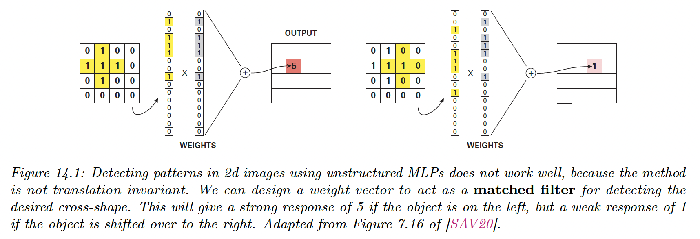

# 14.1 Introduction

This chapter considers the case of data with a 2d spatial structure.

To see why MLP isn’t a good fit for this problem, recall that the $j$th element of a hidden layer has value $\bold{z}_j=\varphi(\bold{w}_j^\top \bold{x})$. We compare $\bold{x}$ to a learned pattern $\bold{w}_j$, and the resulting activation is high if the pattern is present.

However, this doesn’t work well:

- If the image has a variable dimension $\bold{x}\in\mathbb{R}^{WHC}$, where $W$ is the width, $H$ is the height and $C$ is the number of channels (e.g. 3 if the image is RGB).
- Even if the image is of fixed dimension, learning a weight of $(W\times H\times C)\times D$ parameters (where $D$ is the number of hidden units) would be prohibitive.
- A pattern occurring in one location may not be recognized in another location. The MLP doesn’t exhibit **translation invariance**, because the weights are not shared across locations.

To solve these problems, we use **convolutional neural nets (CNN),** which replace matrix multiplications with convolutions.

The basic idea is to chunk the image into overlapping patches and compare its patch with a set of small weight matrices or **filters** that represent parts of an object.

Because the matrices’ weights are small (usually $3\times 3$ or $5\times5$), the number of learned parameters is considerably reduced.

And because we use convolution to perform template matching, the model will be translationally invariant.