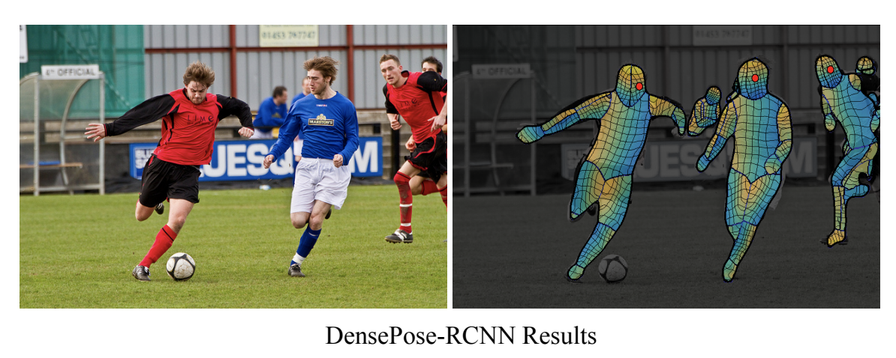

# 14.5 Solving other discriminative vision tasks with CNNs

We briefly discuss other tasks using CNNs, each task introduces a new architectural innovation.

### 14.5.1 Image tagging

In many problems, we may want to label each object present in a single image. This is known as image tagging, an application of multi-label prediction.

The output space becomes $\mathcal{Y}=\{0,1\}^C$, where $C$ is the number of tag types.

Since the labels are independent, we should replace the final softmax with a set of $C$ logistic units.

Image tagging is often a more sensible objective than image classification since when images have many objects in them, it can be challenging to say which one we should be labeling.

Indeed, Andrej Karpathy, who created the “human performance benchmark” on ImageNet noted:

> Both [CNNs] and humans struggle with images that contain multiple ImageNet classes (usually many more than five), with little indication of which object is the focus of the image. This error is only present in the classification setting, since every image is constrained to have exactly one correct label. In total, we attribute 16% of human errors to this category.
> 

### 14.5.2 Object detection

In object detection, we return a set of bounding boxes representing the locations of objects of interest, together with their class labels.

Face detection is a special case with only one class of interest.

The simplest way to tackle this problem is to convert it into a closed-world problem, in which there is a finite number of possible locations (and orientations) any object can be in.

These candidate locations are known as **anchor boxes**. For each box, we train the model to predict what categories of object (if any) it contains.

We can also perform regression to predict the offset of the object from the anchor center (allowing subgrid spatial location).

We learn a function of the form:

$$
f_\theta :\mathbb{R}^{H\times W \times K}\rightarrow [0,1]^{A\times A} \times \{1,\dots,C\}^{A\times A}\times (\mathbb{R}^4)^{A\times A}
$$

where $K$ is the number of channels, $A$ is the number of anchor boxes in each dimension and $C$ is the number of class labels.

For each box location $(i,j)$ we predict 3 outputs:

1. an object presence probability $p_{ij}\in[0,1]$
2. an object categories $y_{ij}\in\{1,\dots,C\}$
3. two 2d offset vectors, $\delta_{ij}\in\mathbb{R}^4$, that can be added to the anchor center to obtain the top left and bottom right corners

Many models of this type have been introduced, including the [**single shot detector (SSD)](https://arxiv.org/abs/1512.02325)** model and the [**YOLO (you only look once)](https://arxiv.org/abs/1506.02640)** model.

See [this review](https://arxiv.org/abs/1807.05511) of object detection models.

### 14.5.3 Instance segmentation

In image segmentation, the goal is to predict the label and the 2d mask of each object.

This can be done by applying a semantic segmentation model to each box from the image detection algorithm, classifying each pixel as object or background.

### 14.5.4 Semantic segmentation

In semantic segmentation, we have to predict a class $y=\{1,\dots,C\}$ for each pixel.

In contrast to instance segmentation above, all car pixels get the same labels, so semantic segmentation does not differentiate between objects.

We can combine semantic segmentation of “stuff” (sky, road) and instance segmentation of “things“ (car, people) into a framework called **panoptique segmentation**.

A common way to tackle semantic segmentation is by using an encoder-decoder architecture.

- The encoder applies standard convolution to map inputs to a 2d bottleneck of high level properties with coarse spatial resolution (this can used dilated convolution to capture a larger input field)
- The decoder map the 2d bottleneck back to a full-sized image using transposed convolution.
    
    Since the bottleneck loses information, we add skip connections between encoder and decoder layers of the same level.
    

With this shape, this model is known as **U-net.**

Similar encoder-decoder architecture can be used for other image-to-image tasks, like:

- **depth-estimation:** predict the distance from camera $z_i$ for each pixel
- **surface normal prediction:** predict the orientation of the surface $z_i\in\mathbb{R}^3$, at each image patch

We can train a model to do all these tasks simultaneously, using multiple output heads.

### 14.5.5 Human pose estimation

We can train an object detector to detect people and predict their 2d shape, but we can also train the model to predict the location of a fixed set of skeletal keypoints (e.g. the location of the hands and neck).

This is called human **pose estimation**, with techniques such as **PersonLab** and **OpenPose**.

[See this 2019 review](https://nanonets.com/blog/human-pose-estimation-2d-guide/).

We can also predict 3d properties of each object, by training models on synthetic 3d image datasets generated by **computer graphics.** See [**DensePose](https://arxiv.org/abs/1802.00434).**

