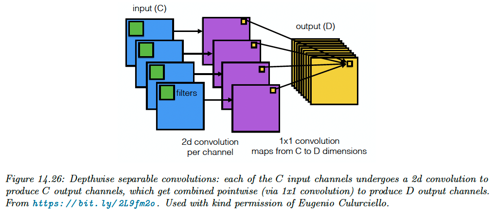

# 14.4 Other forms of convolution

### 14.4.1 Dilated convolution

By using striding and stacking many layers of convolution together, we enlarge the receptive field of each neuron.

To cover the entire image with filters, we would need either many layers or a large kernel size with many parameters, which would be slow to compute.

Dilated convolution increases the receptive field without increasing the number of parameters:

$$
z_{i,j,d}=b_d+\sum_{u=0}^{H-1}\sum_{v=0}^{W-1}\sum_{c=0}^{C-1} x_{i+ru,j+rv,c}w_{u, v,c, d}
$$

in comparison, regular convolution uses $x_{si+u,sj+v,c}$

### 14.4.2 Transposed convolution

Transposed convolution to the opposite of convolution, producing a larger output from a smaller input.

### 14.4.3 Depthwise separable convolution

Standard convolution uses a filter of size $H\times W\times C\times D$, requiring a lot of data to learn and a lot of time to compute with.

Depthwise separable convolution simplifies this operation by first applying 2d weight convolution to each input channel, then performing 1x1 convolution across channels:

$$
z_{i,j,d}=b_d+w'_{c,d}\sum_{c=0}^{C-1}\Big(\sum_{u=0}^{H-1} \sum_{v=0}^{W-1} x_{i+u,j+v,c}w_{u,v}\Big)
$$

Compared to regular convolution, a 12x12x3 input with a 5x5x3x256 filter will be performed using:

1. A 5x5x1x1 filter across space to get an 8x8x3 output
2. A 1x1x3x256 filter across channels to get an 8x8x256 output

So, the output has the same size as before, with many fewer parameters.

For this reason, separable convolution is often used in lightweight CNN like **MobileNet** and other edge devices.