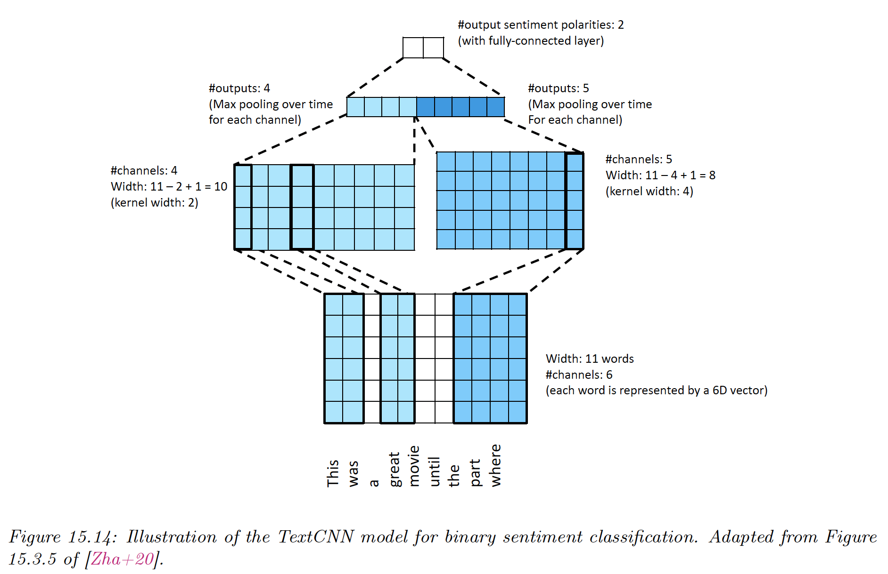
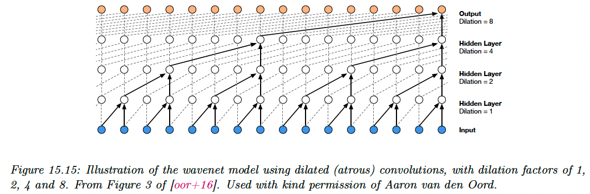

# 15.3 1d CNNs

CNNs are usually for 2d inputs, be can alternatively be applied to 1d sequences.

1d CNNs are an interesting alternative to RNNs because they are easier to train, since they don’t need to maintain long term hidden state.

### 15.3.1 1d CNNs for sequence classification

In this section, we learn the mapping $f_\theta:\mathbb{R}^{DT}\rightarrow \mathbb{R}^{C}$, where $T$ is the length of the input, $D$ the number of feature per input, and $C$ the size of the output vector.

We begin with a lookup of each of the word embeddings to create the matrix $X\in\mathbb{R}^{TD}$.

We can then create a vector representation for each channel with:

$$
z_{ic}=\sum_d x_{i-k:i+k,d}w_{d,c}
$$

This implements a mapping from $TD$ to $TC$.

We then reduce this to a vector $z\in\mathbb{R}^C$ using a max-pooling over time:

$$
z_c=\max_i z_{ic}
$$

Finally, a fully connected layer with a softmax gives the prediction distribution over the $C$ label classes.

### 15.3.2 Causal 1d CNNs for sequence generation

To use 1d CNNs in generative context, we must convert them into **causal CNNs**, in which each output variable only depends on previously generated variables (this is also called **convolutional Markov model**).

We define the model as:

$$
p(\bold{y})=\prod_{t=1}^T p(y_t|\bold{y}_{1:t-1})=\prod_{t=1}^T \mathrm{Cat}(y_t|\mathcal{S}(\varphi(\sum^{t-k}_{\tau=1}\bold{w}^\top \bold{y}_{\tau:\tau+k})))
$$

where $\bold{w}$ is the convolutional filter of size $k$.

This is like regular 1d convolution except we masked future inputs, so that $y_t$ only depends on past observations. This is called **causal convolution**.

We can use deeper model and we can condition on input features $\bold{x}$.

In order to capture long-range dependencies, we use dilated convolution.

[**Wavenet**](https://arxiv.org/abs/1609.03499) perform text to speech (TTS) synthesis by stacking 10 causal 1d convolutional layer with dilation rates 1, 2, 4…, 512. This creates a convolutional block with an effective receptive field of 1024.

They left-padded each input sequence with a number of zeros equal to the dilation factor, so that dimensions are invariant.

In wavenet, the conditioning information $\bold{x}$ is a set of linguistic features derived from an input sequence of words; but [this paper](https://arxiv.org/abs/1703.10135) shows that it’s also possible to create a fully end-to-end approach, starting with raw words rather than linguistics features.

Although wavenet produces high quality speech, it is too slow to run in production. [Parallel wavenet](https://arxiv.org/abs/1711.10433) distils it into a parallel generative model.