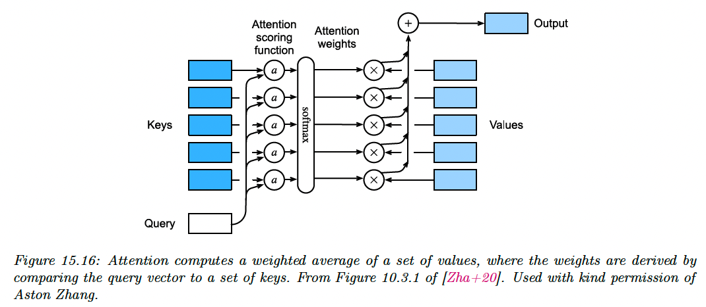
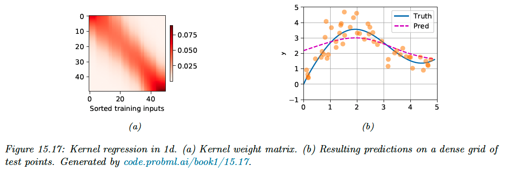
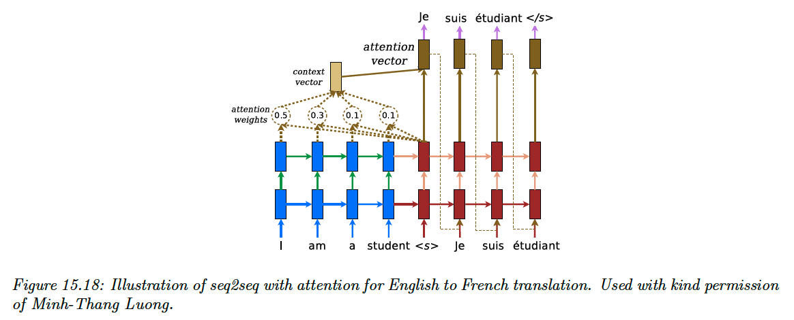
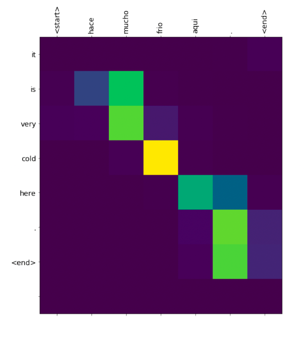
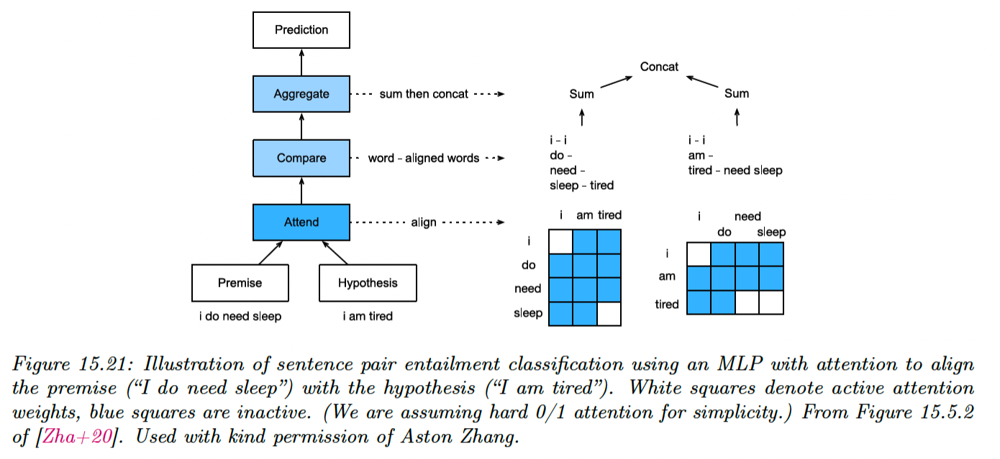
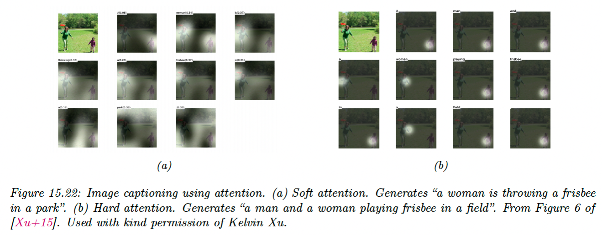

# 15.4 Attention

So far, we have only considered hidden activations as $z=\varphi(W\bold{v})$, where $W$ is a fixed set of learnable weights.

However, we can imagine a more flexible model where we have a set of $m$ feature vectors $V\in\mathbb{R}^{m\times v}$, and the model dynamically decides which feature to use, based on the similarity between an input query $\bold{q}\in\mathbb{R}^{q}$ and a set of keys $K\in\mathbb{R}^{m\times k}$.

If $\bold{q}$ is most similar to $\bold{k}_i$, we use $\bold{v_i}$. This is the basic idea behind **attention mechanisms.**

Initially developed for sequence models, they are now used in a broader set of tasks.

### 15.4.1 Attention as a soft dictionary lookup

To make this lookup operation differentiable, instead of retrieving a single value $\bold{v}_i$, we compute a convex combination as follow:

$$
\mathrm{Attn}(\bold{q},(\bold{k}_{1:m},\bold{v}_{1:m}))=\sum_{i=1}^m \alpha_i(\bold{q},\bold{k}_{1:m})\bold{v}_i \in \mathbb{R}^{v}
$$

where $\alpha_i$ is the ith attention weight, and $0<\alpha_i<1$, $\sum_i \alpha_i=1$, computed as:

$$
\alpha_i(\bold{q},\bold{k}_{1:m})=\mathcal{S}_i([a(\bold{q},\bold{k}_1),\dots,a(\bold{q},\bold{k}_m)])=\frac{\exp(a(\bold{q},\bold{k}_i))}{\sum_{j=1}^m\exp(a(\bold{q} , \bold{k}_j))}
$$

with the attention score function $a(\bold{q},\bold{k}_i)\in\mathbb{R}$. 

In some cases, we want to restrict attention to a a subset of the dictionary. For example, we might pad sequences to a fix length (for efficient mini-batching), and “mask out” the padded locations. This is called **masked attention**.

We implement this by setting the attention score to large negative number like $-10^6$, so that the exponential output will be zero (this is analogous to causal convolution).

### 15.4.2 Kernel regression as non-parametric attention

Kernel regression is a nonparametric model of the form:

$$
f(x)=\sum_{i=1}^n \alpha_i(x,x_{1:n})y_i
$$

The similarity $\alpha$ is computed by using a density kernel in the attention score:

$$
\mathcal{K}_\sigma(u)=\frac{1}{\sqrt{2\pi \sigma^2}}e^{-\frac{1}{2 \sigma^2}u^2}
$$

where $\sigma$ is called the bandwidth. We then define $a(x,x_i)=K_\sigma(x-x_i)$.

Since the score are normalized, we can drop the $\frac{1}{\sqrt{2\pi\sigma^2}}$ term and write it:

$$
\mathcal{K}(x;w)=\exp(-\frac{w^2}{2}u^2)
$$

Plugging this into the first equation gives us:

$$
f(x)=\sum_{i=1}^n \mathcal{S}_i([\mathcal{K}(x-x_1,w),\dots,\mathcal{K}(x-x_n,w)])y_i
$$

We can interpret this as a form of nonparametric attention, where the queries are the test points $x$, the keys are the training points $x_i$  and the values are the training labels $y_i$.

If we set $w=1$, we obtain the attention matrix $A_{ji}=\alpha_i(x_j,x_{1:n})$ for test input $j$:

The size of the diagonal band of figure 15.17a narrows when $w$ augment, but the model will start to overfit.

### 15.4.3 Parametric attention

Comparing a scalar query (test point) to each of the scalar values in the training set doesn’t scale well to large training sets, or high-dimensional inputs.

In parametric models, we have a fixed set of keys and values, and we compare keys and queries in a learned embedding space.

One general way to do it is assuming $\bold{q}\in\mathbb{R}^q$ and $\bold{k}\in\mathbb{R}^k$ might not have the same size, so we compare them by mapping them in a common embedding space of size $h$.

This gives us the following additional attention function:

$$
a(\bold{q},\bold{k})=\bold{w}_v^\top\tanh(W_q\bold{q}+W_k\bold{k})\in\mathbb{R}
$$

with $W_q\in\mathbb{R}^{h\times q}$, $W_k\in\mathbb{R}^{h\times k}$

A more computationally efficient approach is to assume the keys and queries both have the same size $d$.

If we assume these to be independent random variables with mean 0 and unit variance, the mean of their inner product is 0 and their variance is $d$, since $\mathbb{V}[\sum_i X_i]=\sum_i \mathbb{V}[X]_i$.

To ensure the variance of the inner product stays 1 regardless of the size of the inputs, we divide it by $\sqrt{d}$.

We can define the **scaled dot-product attention**:

$$
a(\bold{q},\bold{k})=\frac{\bold{q}^\top\bold{k}}{\sqrt{d}} \in\mathbb{R}
$$

In practice, we deal with minibatch of $n$ vectors at a time. The attention weighted output is:

$$
\mathrm{Attn}(Q,K,V)=\mathcal{S}(\frac{QK^\top}{\sqrt{d}})V\in\mathbb{R}^{n\times v}
$$

with $Q\in\mathbb{R}^{n\times d},K\in\mathbb{R}^{m\times d},V\in\mathbb{R}^{m\times v}$ and the softmax function applied row-wise.

### 15.4.4 Seq2Seq with attention

In the seq2seq model from section 15.2.3, we used a decoder in the form:

$$
\bold{h}_t^d=f(\bold{h}^d_{t-1},\bold{y}_{t-1},\bold{c})
$$

where $\bold{c}$ represents the fixed-length encoding of the input $\bold{x}_{1:T}$. We usually set $\bold{c}=h^e_T$, the final state of the encoder (or average pooling for bidirectional RNN).

However, for tasks like machine translation, this can result in poor predictions, since the decoder doesn’t have access to the input words themselves.

We can avoid this bottleneck by allowing the output words to “look at” the input words. But which input should them look at, since each language has its own word order logic?

We can solve this problem in a differentiable way by using soft attention, as proposed by [this paper](https://arxiv.org/abs/1409.0473). In particular, we can replace the fix context vector $\bold{c}$ in the decoder with a dynamic context vector $\bold{c}_t$ computed as:

$$
\bold{c}_t=\sum_{i=1}^T\alpha_i(\bold{h}^d_{t-1},\bold{h}^e_{1:T})\bold{h}^e_i
$$

where the query is the hidden state of the decoder at the previous step, and both the keys and values are all the hidden state of the encoder. When the RNN has multiple hidden layers, we take the one at the top).

We then obtain the next hidden state as:

$$
\bold{h}^d_t=f([\bold{y}_{t-1};\bold{c}_t],\bold{h}_{t-1}^d)
$$

We can train this model the usual way on sentence pairs.

We can observe the attention weights computed at each step of decoding to determine which input words are used to generate the corresponding output.

Each output word $\bold{y_t}$ was sampled from $\bold{h}^d_{t}$ (query, vertical axis), and each line represent the attention of this decoder hidden state with all the encoder hidden states $\bold{h}^e_{1:T}$(keys, horizontal axis).

### 15.4.5 Seq2Vec with attention (text classification)

We can also use attention with sequence classifiers. For example, [this paper](https://www.nature.com/articles/s41746-018-0029-1) applies an RNN classifier to predict the death of patients. It uses a set of electronic health record as input, which is a time series containing structured data as well as unstructured text (clinical note).

Attention is useful for identifying the “relevant” parts of the inputs.

### 15.4.6 Seq+Seq2Vec with attention (text pair classification)

Our task is now to predict whether two sentences (premises and hypothesis) are in agreement (premises entails the hypothesis), in contradiction or neutral.

This is called **textual entailment** or **natural language inference**. A standard benchmark is **Stanford Natural Language Inference (SNLI)** corpus, consisting in 550,000 labeled sentence pairs.

Below is a solution to this classification problem presented by [this paper](https://arxiv.org/abs/1606.01933).

Let $A=(\bold{a}_1,\dots,\bold{a}_m)$ be the premise and $B=(\bold{b}_1,\dots,\bold{b}_n)$ by the hypothesis, with $\bold{a}_i,\bold{b}_j\in\mathbb{R}^{E}$ the words embedding vectors.

First, each word in the premise attends to each word in the hypothesis, to compute an attention weight:

$$
e_{ij}=f(\bold{a}_i)^\top f(\bold{b}_j)
$$

where $f:\mathbb{R}^E\rightarrow \R^D$ is an MLP.

We then compute a weighted average of the matching words in the hypothesis:

$$
\beta_i=\sum_{j=1}^n \frac{\exp(e_{ij})}{\sum_{k=1}^n \exp(e_{ik})}\bold{b}_j
$$

We compare $\bold{a}_i$ and $\beta_i$ by mapping their concatenation to a hidden space using an MLP $g:\R^{2E}\rightarrow \R^H$:

$$
v_{A,i}= g([\bold{a}_i,\beta_i]),\; i=1,\dots,m
$$

Finally, we aggregate over the comparison to get an overall similarity of premise to hypothesis:

$$
v_A=\sum_{i=1}^m v_{A,i}
$$

We can similarly get an overall similarity of hypothesis to premises by computing:

$$
\begin{align}
\alpha_j &=\sum_{i=1}^m \frac{\exp(e_{ij})}{\sum_{k=1}^m \exp(e_{kj})}\bold{a}_i \\
\bold{v}_{B,j} &=g([\bold{b}_j,\alpha_j]),\,j=1,\dots,n \\
\bold{v}_B &=\sum_{j=1}^n \bold{v}_{B,j}
\end{align}
$$

At the end, we classify the output using another MLP $h: \R^{2H}\rightarrow \R^3$:

$$
\hat{y}=h([\bold{v}_A,\bold{v}_B])
$$

We can modify this model to learn other kinds of mappings from sentence pairs to label. For instance, in the **semantic textual similarity** task, we predict how semantically related two inputs are.

### 15.4.7 Soft vs hard attention

If we force the attention heatmap to be sparse, so that each output only attends to a single input location instead of a weighted combination of all of them, we perform **hard attention**.

We compare these two approaches in image captioning:

Unfortunately, hard attention is a nondifferentiable training objective, and requires methods such as reinforcement learning to fit the model.

It seems that attention heatmaps can explain why a model generates a given output, but their interpretability is controversial.

See these papers for discussion:

[Is attention interpretable?](https://arxiv.org/abs/1906.03731)

[On identifiability of transformers](https://arxiv.org/abs/1908.04211)

[Attention is not explanation](https://arxiv.org/abs/1902.10186)

[Attention is not not explanation](https://arxiv.org/abs/1908.04626)