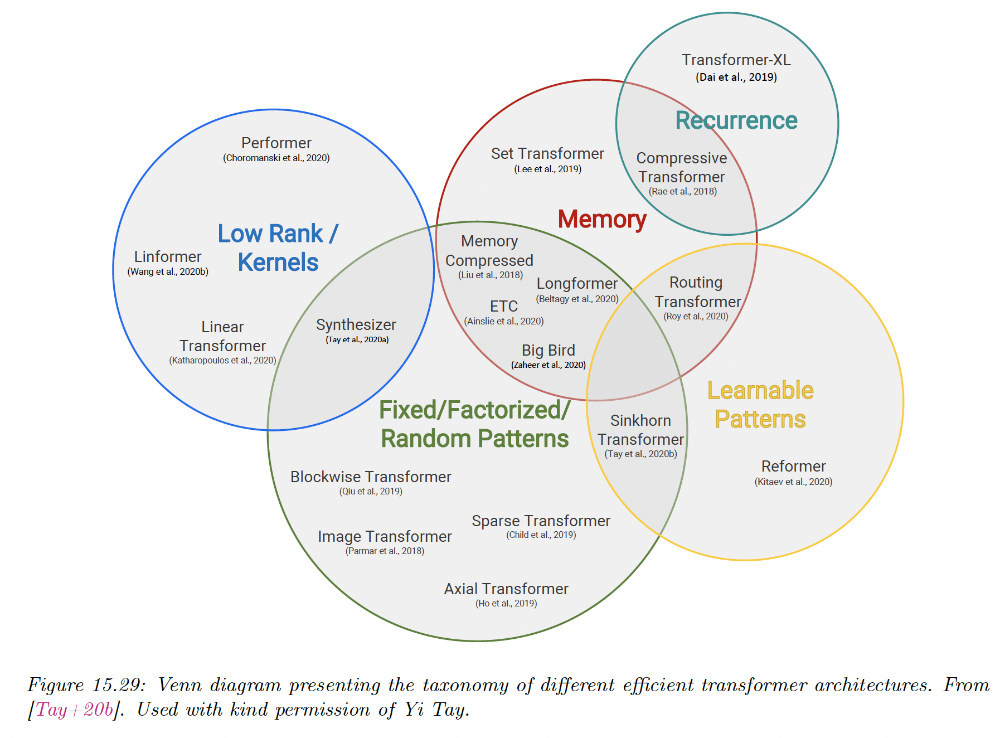
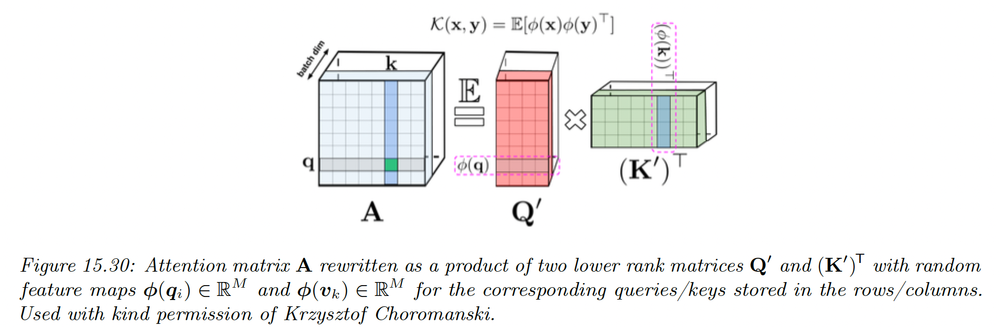
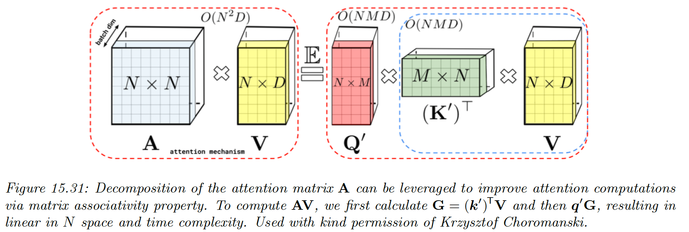

# 15.6 Efficient transformers

Regular transformers takes $O(N^2)$ in time and space complexity, for a sequence of length $N$, which makes them impracticable for long sequences.

To bypass this issue, various efficient variants have been proposed.

### 15.6.1 Fixed non-learnable localized attention patterns

The simplest modification of the attention mechanism is to restrain it to a fixed non-learnable localized window.

We chunk a sentence into $K$ blocks of size $\frac{N}{K}$, and attention is performed only in each blocks. This gives a complexity of $O(\frac{N^2}{K})$.

If $K\gg 1$ this can give a substantial computational improvement.

Other approaches leverage strided/dilated windows, or hybrid patterns, where several fixed attention patterns are combined together.

### 15.6.2 Learnable sparse attention patterns

A natural extension of the above is to use learnable attention patterns, with the attention still restricted to pairs of token within a single partition. We distinguish the hashing and clustering approaches.

In the hashing approach, all tokens are hashed and the partitions correspond to the hashing-buckets. This is how the **Reformer** uses locality sensitive hashing (LSH), with a complexity of $O(NM^2\log(M))$ where $M$ is the dimension of tokens’ embeddings.

This approach requires to set of queries to be identical to the set of keys, and the number of hashes used for partitioning can be a large constant.

In the clustering approach, tokens are clustered using standard algorithms like K-Means. This is known as the **clustering transformer**. As in the block-case, if $K$ equal sized blocks are used, the complexity of the attention module is reduced to $O(\frac{N^2}{K})$.

In practice, we choose $K=\Theta(\sqrt{N})$, yet imposing the clusters to be similar in size is difficult.

### 15.6.3 Memory and recurrence methods

In some approaches, a side memory module can be used to access several tokens simultaneously.  This method has the form of a global memory algorithm.

Another approach is to connect different local blocks via recurrence. This is used by Transformer-XL methods.

### 15.6.4 Low-rank and kernel methods

The attention matrix $A$ can be directly approximated by a low rank matrix, so that:

$$
A_{i,j}=\phi(\bold{q}_i)^\top\phi(\bold{k}_j)
$$

where $\phi(\bold{x})\in\R^M$ with $M<D$.

We can then exploit this structure to compute $AV$ in $O(N)$ time. Unfortunately, for softmax attention, $A$ is not low rank.

In [**Linformer**](https://arxiv.org/abs/2006.04768), they transform the keys and values via random Gaussian projection. Then, they approximate the softmax attention in this lower dimensional space using the Johnson-Lindenstrauss Transform.

In [**Performer](https://arxiv.org/abs/2006.03555),** they show that the attention matrix can be computed using a (positive definite) kernel function:

$$
A_{i,j}=\exp\Big(\frac{\bold{q}_i^\top\bold{k}_j}{\sqrt{D}}\Big)=\exp\Big(\frac{-||\bold{q}_i-\bold{k}_j||^2_2}{2\sqrt{D}}\Big)
\exp\Big(\frac{||\bold{q}_i||^2_2}{2\sqrt{D}}\Big)
\exp\Big(\frac{||\bold{k}_j||^2_2}{2\sqrt{D}}\Big)
$$

The first term is equal to $\mathcal{K}_{gauss}(\bold{q}_iD^{-1/4},\bold{k}_jD^{-1/4})$, where:

$$
\mathcal{K}_{gauss}(\bold{q,k})=\exp\Big(-\frac{1}{2\sigma^2}||\bold{q-k}||^2_2\Big)
$$

and the two other terms are independent scaling factors.

To gain a computational advantage, we can show that the Gaussian kernel can be written as the expectation of a set of random features:

$$
\mathcal{K}_{gauss}(\bold{q,k})=\mathbb{E}[\eta(\bold{q})^\top \eta(\bold{k})]
$$

where $\eta(\bold{x})\in\R^M$ is a random feature vector derived from $\bold{x}$, either from trigonometric or exponential functions (the latter ensure positivity of all features, which gives better results).

Therefore we can write:

$$
A_{i,j}=\mathbb{E}[\phi(\bold{q}_i)^\top \phi(\bold{k}_j)]
$$

where:

$$
\phi(\bold{x})\triangleq\eta\Big(\frac{\bold{x}}{D^{1/4}}\Big)\exp \Big(\frac{||\bold{x}||^2_2}{2\sqrt{D}}\Big)
$$

And we can write the full attention matrix as:

$$
A=\mathbb{E}[Q' (K')^\top]
$$

where $Q',K' \in \R^{N\times M}$ have rows encoding random features corresponding to queries and keys. We can get better results by ensuring these random features are orthogonal.

We can create an approximation of $A$ by sampling a single vector of the random features $\phi(\bold{q}_i)$ and $\phi(\bold{k}_j)$, using a small value $M=O(D\log (D))$.

We can then approximate the entire attention operation with:

$$
\widehat{\mathrm{attention}}(Q,K,V)=\mathrm{diag}(Q'((K')^\top 1_n))^{-1}(Q'((K')^\top V))
$$

This is an unbiased estimate of the softmax attention operator.

