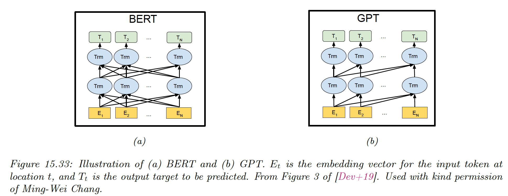
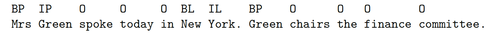

# 15.7 Language models and unsupervised representation learning

We have discussed how RNN and transformer (decoder only) can be used as **language models**, which are generative sequence models of the form:

$$
p(\bold{x}_1,\dots,\bold{x}_T)=\prod^{T}_{t=1}p(x_t|\bold{x}_{1:t-1})
$$

where each $x_t$ is a discrete token, such as a word or wordpiece.

The latent state of these models can be used as a continuous vector representation of the text. Instead of using the one-hot vector $\bold{x}_t$ or a learned embedding of it, we use the hidden state $\bold{h}_t$, which depend on all the previous words of the sentence.

The advantage of this approach is that we can **pre-train** the language model on large corpus in a unsupervised way, before **fine-tuning** it on a smaller, task-specific dataset in supervised way (this is called **transfer learning**).

### 15.7.1 Embeddings for Language Models (ELMo)

The basic idea of “[Embeddings for Language Models](https://arxiv.org/abs/1802.05365v2)” is to fit two RNNs, one left-to-right and one right-to-left, before combining their hidden state to come up with an embedding for each word.

Unlike a biRNN which needs input-output pair, ELMo is trained in a unsupervised way, to minimize the NLL of the input sequence:

$$
\mathcal{L}(\theta)=-\sum^T_{t=1}\log p(x_t|\bold{x}_{1:t-1},\theta_e,\theta^{\rightarrow},\theta_s)+p(x_t|\bold{x}_{t+1:T},\theta_e,\theta^{\leftarrow},\theta_s)
$$

where $\theta_e$ and $\theta_s$ are the share parameters of the embedding and softmax output layers, and $\theta^{\rightarrow}, \theta^{\leftarrow}$ are the parameters of the RNNs.


After training, we define the contextual representation $\bold{r}_t=[\bold{e}_t,\bold{h}_{t,1:L}^{\rightarrow},\bold{h}_{t,1:L}^{\leftarrow}]$, where $L$ represents the number of layers in the LSTM.

We then learn a task-specific set of linear weights to get the final context-specific embedding of each token:

$$
\bold{r}^j_t=\bold{r}_t^\top \bold{w}^j
$$

where $j$ is the task id.

If we are performing a syntactic task like **part-of-speech (POS)** tagging (i.e. labeling each word as a noun, adjective, verb), then the task will put more weight on the lower layers.

If we are performing a semantic task, like **word sense disambiguation (WSD)**, then the task will learn to put more weight on the higher layers.

In both case, we only need a small amount of task-specific labeled data, since we are just learning a single weight vector to map from $\bold{r}_{1:T}$ to the target labels $\bold{y}_{1:T}$.

### 15.7.2 Bidirectional Embeddings Representations from Transformer (BERT)

Like ELMo, BERT is a non-causal model that can create representation of text but can’t generate text. It has a very close architecture than the first version of GPT while outperforming it on major downstream supervised tasks.

This is due to a better pre-training that leverages a **fill-in-the-blank** (or **cloze**) task and a **next sentence prediction (NSP)** task.

**15.7.2.1 Masked language model task**

The model is training on the negative log **pseudo-likelihood**, computed at the masked locations:

$$
\mathcal{L}=\mathbb{E}_{\bold{x}\sim\mathcal{D}}\mathbb{E}_{\bold{m}}\sum_{i\in\bold{m}}-\log p(x_i|x_{-\bold{m}})
$$

where $\bold{m}$ is the random mask, indicating the tokens to replace by the special [MASK] token.

A training sentence has the form:

```
Let’s make [MASK] chicken! [SEP] It [MASK] great with orange sauce.
```

where [SEP] is a special token inserted between two sentences. The desired target for this example is “some” and “tastes”.

The conditional probability is obtained by applying a softmax to the final hidden vector:

$$
p(x_i|\hat{\bold{x}})=\frac{\exp(\bold{h(\hat{x})}^\top \bold{e}(x_i))}{\sum_{j} \exp(\bold{h(\hat{x})}^\top\bold{e}(x_j))}
$$

where $\bold{\hat{x}}=\bold{x_{-m}}$ is the masked input sentence and $\bold{e}(x_i)$ is the embedding of token $x_i$.



This is similar to a denoising autoencoder.

**15.7.2.2 Next sentence prediction task**

In addition to the masked language task, BERT also trained on NSP, in which the model is trained to classify whether a sentence follows another.

The input has the form:

```
CLS A1 A2 ... Am SEP B1 B2 ... Bn SEP
```

where [CLS] is a special token marking the class: $y=1$ if sentence B follows sentence A, and $y=0$ otherwise.

This pre-training objective can be useful for sentence-pair classification tasks, such as textual entailment or textual similarity.

Note that this pre-training is considered unsupervised or self-supervised, since the label can be generated automatically, by selecting the following or random sentences.

When performing NSP, the input tokens go through three different embedding layers: one per token, one for each segment label (sentence A or B), and one for each location (using learned positional embeddings).

These are then added.  


BERT then uses a transformer encoder to learn a mapping from this input embedding sequence to an output embedding sequence, which gets decoded into word labels or a class label.

**15.7.2.3 Fine-tuning BERT for NLP applications**

After pre-training, we can use BERT for various downstream tasks by performing supervised fine-tuning.


We can perform:

a) **Single sentence classification** by feeding the feature vector associated to the [CLS] token to a MLP, which maps it to the desired label space.

Since each output attends to all inputs, the [CLS] hidden vector will summarize the entire sentence.

b) **Sentence pair classification** by feeding two input sentences, then classify the [CLS] token

c) **Single sentence tagging**, in which we map a label to each word instead of the entire sentence. 

In part of speech (POS), we annotate each word as a verb, noun, adjective.

Another application is **noun phrase chunking** in which we annotate the span of each noun phrase. The span is encoded using the **BIO** notation: B is beginning, I-x for inside and O for outside of any entity.


We can associate types with each noun phrase to distinguish person, location, organization and other. The label space becomes `{B-Per, I-Per, B-Loc, I-Loc, B-Org, I-Org, Outside}`.



This is called **named entity recognition (NER)** and is key to information extraction.

d) **Question answering**, where the first input sentence is the question, the second is the background text, and the output specifies the start and end positions of the answer in the background text.

The start location $s$ and end location $e$ are obtained by applying two different MLPs to a pooled version of the encoding output of the background tokens.

The output of the MLPs is a softmax over locations and at test time we extract the span $(i,j)$ that maximizes the sum of scores $s_i+s_j$, for $i\leq j$.

BERT achieves state-of-the-art performance on many NLP tasks. It has been shown that it rediscover the standard NLP pipeline, in which different layers perform tasks like POS tagging, parsing, NER, detection, semantic role labeling (SRL) or coreference resolution.

See [this jax tutorial](https://colab.research.google.com/github/probml/pyprobml/blob/master/notebooks/book1/15/bert_jax.ipynb).

### 15.7.3 Generative Pre-training Transformer (GPT)

GPT is a causal generative model, that uses a masked transformer as the decoder.

In the original GPT paper, they jointly optimize on a large unlabeled dataset and a small labeled dataset:

$$
\mathcal{L}=\mathcal{L}_{\mathrm{cls}}+\lambda \mathcal{L}_{\mathrm{LM}}
$$

where:

$$
\mathcal{L}_{\mathrm{cls}}=-\sum_{(\bold{x},y)\in\mathcal{D}_L} \log p(y|\bold{x})
$$

is the classification loss of the labeled data and:

$$
\mathcal{L}_{\mathrm{LM}}=-\sum_{\bold{x}\in\mathcal{D_u}}\sum_{t} \log p (x_t|\bold{x}_{1:t-1})
$$

is the language model loss of the unlabeled data.

**GPT-2** is a larger version of GPT, trained on a larger web corpus called **WebText**. They also eliminated any task specific training, and only train it as a language model.

More recently, OpenAI proposed **GPT-3**, which is an even larger version but based on the same principles. It was trained on an 800GB English-language web corpus called **The Pile**.

**15.7.3.1 Application of GPT**

GPT can generate text given an initial input prompt. The prompt can specify a task, if the model fulfilled the task out of the box, we say if performed **zero-shot task transfer**.

For example, to perform **abstractive summarization** to some input text $\bold{x}_{1:T}$ (in contrast to **extractive summarization** which just select a subsample of words), we sample from:

$$
p(\bold{x}_{T+1:T+100}|\bold{x}_{1:T},[\mathrm{TL;DR}])
$$

where $[\mathrm{TL;DR}]$ is a special token added to end of the input text, with which the user hopes to trigger the transformer decoder into a state of summarization mode.

A better way to tell the model what task to perform is to train it on input-output pairs, as we discuss below.

### 15.7.4 Text-to-Text Transfer Transformer (T5)

Many models (like BERT) are trained in an unsupervised way and fine-tuned on a specific tasks.

T5 proposes to train a single model to perform multiple tasks, by telling it which task to perform as part of the input sentence and train it as a seq2seq transformer model.


The model is pre-trained on $(\bold{x}',\bold{x}'')$ where $\bold{x}'$ is a masked version of the input $\bold{x}$ and $\bold{x}''$ are the missing tokens to be predicted. We then fine-tune it on multiple supervised $\bold{(x,y})$ pairs.

The unsupervised dataset is C4 (Colossal Clean Crawled Corpus), a 750GB corpus of web text. This is used to train a BERT-like denoising objective. For example:

```
x' = "Thank you <X> me to your party <Y> week"
x'' = "<X> for inviting <Y>last <EOS>"
```

Where <X> and <Y> are tokens that are unique to this example.

The supervised datasets are manually created and taken from the literature.

### 15.7.5 Discussion

Models like BERT and GPT-3 have gained a lot of interest, but some doubt remains about there capacity to “understand” a language in a meaningful way, beyond rearranging word patterns seen in their massive datasets.

For this example [this article](https://arxiv.org/abs/1907.07355) showed that the human-level performances of BERT in the “Argument Reasoning Comprehension Task” exploits spurious statistical cues in the dataset.

By tweaking slightly the dataset, performances can be reduced to chance-level.

For other criticisms of the model, see [this](https://aclanthology.org/2020.acl-main.463/) and [this article](https://arxiv.org/abs/2002.06177).