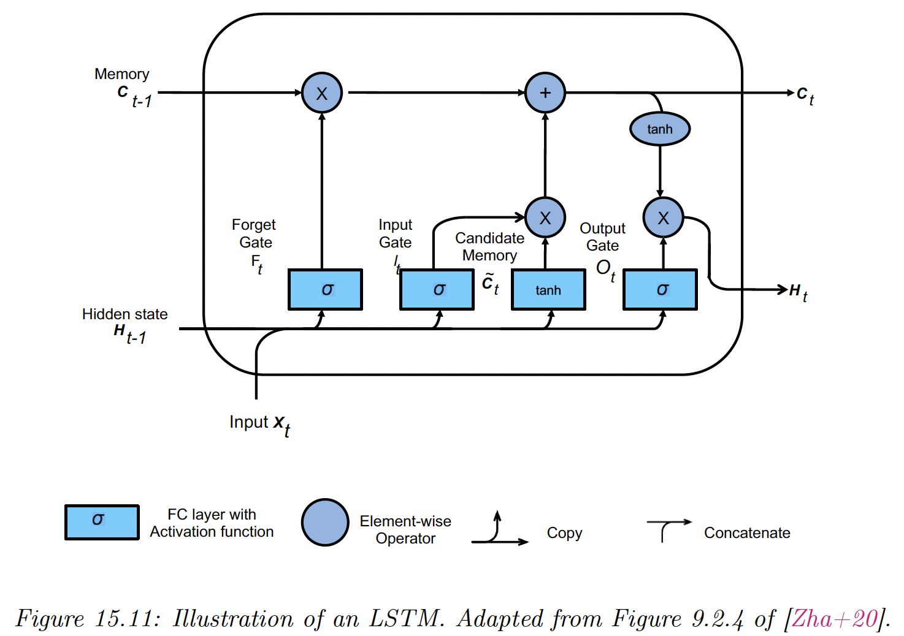

# 15.2 Recurrent neural networks (RNNs)

A RNN is a model mapping a sequence of inputs to a sequence of outputs in a stateful way.

The prediction $\bold{y}_t$ depends on the input $\bold{x}_t$ but also on the hidden state of the model $\bold{h}_t$ that gets updated over time, as the sequence is processed.

We can use these models for sequence generation, sequence classification and sequence translation.

See this [intro to RNNs by Karpathy](https://www.notion.so/fac622c1e50c4553b853e4efda561a46?pvs=21).

### 15.2.1 Veq2Sec (sequence generation)

We now discuss how to learn functions of the form $f_\theta : \mathbb{R}^D\rightarrow  \mathbb{R}^{N_\infin C}$, were $D$ is the size of the input vector, and $N_\infin$ is an arbitrary-length sequence of vectors, each of size $C$.

The output sequence $\bold{y}_{1:T}$ is generated one token at the time. At each time step, we sample $\tilde{y}_t$ from the hidden state $\bold{h}_t$ and then “feed it back in” in the model to get $\bold{h}_{t+1}$ (which also depends on $\bold{x}$).

In this way, we define a conditional generative model of the form $p(\bold{y}_{1:T}|\bold{x})$, which capture dependencies between output tokens.

**15.2.1.1 Models**

The RNN corresponds to the following conditional generative model:

$$
p(\bold{y}_{1:T}|\bold{x})=\sum_{\bold{h}_{1:T}} p(\bold{y}_{1:T},\bold{}\bold{h}_{1:T}|\bold{x})=\sum_{\bold{h}_{1:T}} \prod_{t=1}^T p(\bold{y}_t|\bold{h}_t)p(\bold{h}_{t}|\bold{h}_{t-1},\bold{y}_{t-1},\bold{x})
$$

where we define $p(\bold{h}_1|\bold{h}_0,\bold{y}_0,\bold{x})=p(\bold{h}_1|\bold{x})$ as the initial hidden state distribution, often deterministic.

Also, remember that $\bold{h}_{1:T}$ is a random variable from which we sample $\tilde{y}_t$.

The output distribution is given by:

For categorical values:

$$
p(\bold{y}_t|\bold{h}_t)=\mathrm{Cat}(\bold{y}_t|\mathcal{S}(W_{hy}\bold{h}_t+\bold{b}_y))
$$

For numerical values:

$$
p(\bold{y}_t|\bold{h}_t)=\mathcal{N}(\bold{y}_t|W_{hy}\bold{h}_t+\bold{b}_y,\sigma^2I)
$$

The hidden state is computed deterministically:

$$
p(\bold{h}_t|\bold{h}_{t-1},\bold{y}_{t-1},\bold{x})=\mathbb{I}(\bold{h}_t=f(\bold{h}_{t-1}, \bold{y}_{t-1},\bold{x}))
$$

where:

$$
\bold{h}_t=\varphi(W_{xh}[\bold{x};\bold{y}_{t-1}]+W_{hh}\bold{h}_{t-1}+\bold{b}_h)
$$

Therefore $\bold{y}_t$ implictly depends on all past observations, as well the optional fix input $\bold{x}$.

Thus an RNN overcomes the limitation of a standard Markov models, in that they can be unbounded in memory. This makes the RNN theoretically as powerful as a Turing machine.

In practice, the length of the memory is determined by the size of the latent state and the strength of the parameters.

When we generate from a RNN, we sample from $\tilde{\bold{y}}_t\sim p(\bold{y}_t|\bold{h}_t)$ and feed it to compute $\bold{h}_{t+1}$ deterministically. The stochasticity only comes from this sampling.

**15.2.1.2 Applications**

RNNs can be used to generate sequences unconditionally ($\bold{x}=\empty)$ or conditionally on $\bold{x}$.

Unconditional sequence generation is also called **language modeling** and aims at learning the joint probability distribution over sequences of discrete tokens, i.e. models of the form $p(\bold{y}_1,\dots,\bold{y}_T)$

The result on the simple RNN below are not very plausible, but we can create better models with more data, measuring their performances using perplexity.

We can also make the generated sequence depends on some input vector $\bold{x}$. In the example below, $\bold{x}$ is the embedding generated by a ConvNet on a image and the RNN is used to generate captions.

See [this Pytorch implementation](https://github.com/yunjey/pytorch-tutorial/tree/master/tutorials/03-advanced/image_captioning) of the model above.

### 15.2.2 Seq2Vec (sequence classification)

We now predict fixed-length output with variable length sequences inputs. We learn a function of the form: $f_\theta :\mathbb{R}^{TD} \rightarrow \mathbb{R}^C$.

The simplest approach is to use the final state of the RNN as input to the classifier:

$$
p(\bold{y}|\bold{x}_{1:T})=\mathrm{Cat}(\bold{y}|\mathcal{S}(W \bold{h}_T))
$$

We often can get better results if we let the hidden states depends on future and past context.

We do so by using two RNNs: one recursively computing hidden states in the forward direction, and another one in the backward direction.

This is called **bi-directional RNN**. We have:

$$
\bold{h}\overrightarrow{_t} = \varphi(W\overrightarrow{_{xh}}\bold{x}_t + W\overrightarrow{_{hh}} \bold{h}\overrightarrow{_{t-1}}+\bold{b}\overrightarrow{_t})
\\
\bold{h}\overleftarrow{_t} = \varphi(W\overleftarrow{_{xh}}\bold{x}_t + W\overleftarrow{_{hh}} \bold{h}\overleftarrow{_{t+1}}+\bold{b}\overleftarrow{_t})
$$

Then we define $\bold{h}_t=[\bold{h}\overrightarrow{_t},\bold{h}\overleftarrow{_t}]$ to be the representation of the hidden states at time step $t$, compounding past and future information.

Finally, we average pool over these hidden states to get the final classifier:

$$
\begin{align}
\bar{\bold{h}}&=\frac{1}{T}\sum_{t=1}^T \bold{h}_t \\
p(\bold{y}|\bold{x}_{1:T})&=\mathrm{Cat}(\bold{y}|W \mathcal{S}(\bar{\bold{h}}))
\end{align}
$$

### 15.2.3 Seq2Seq (sequence translation)

In this section, we consider learning functions of the form $f_\theta :\mathbb{R}^{TD} \rightarrow \mathbb{R}^{T'C}$.

We consider two cases:

1. $T=T'$, the input and output sequences have the same length (aligned)
2. $T\neq T'$ (unaligned)

**15.2.3.1 Aligned case**

We can think of the aligned case as a **dense sequence labeling** where we predict one label per location.

This RNN corresponds to:

$$
p(\bold{y}_{1:T}|\bold{x}_{1:T})=\sum_{\bold{h}_{1:T}} \prod_{t=1}^T  p(\bold{y}_t|\bold{h}_t)\mathbb{I}(\bold{h}_t=f(\bold{h}_{t-1},\bold{x}_t))
$$

where $\bold{h}_1=f(\bold{h}_0,\bold{x}_1)=f_0(\bold{x}_1)$ is the initial state.

We can get better results by letting the decoder looks into the past and future of $\bold{x}$, by using a bi-directional RNN.

We can create more expressive models by stacking multiple hidden chains on top of each other.

This corresponds to:

$$
\bold{h}^l_t=\varphi(W^l_{xh}\bold{h}^{l-1}_{t} + W_{hh}^l \bold{h}_{t-1}^l+ \bold{b}_h^l)
$$

The output is given by:

$$
\bold{o}_t=W_{ho} \bold{h}_{t}^L+\bold{b}_o
$$

**15.2.3.2 Unaligned case**

We learn a mapping from one sequence of length $T$ to another of length $T'$.

We use an encoder to learn embeddings $\bold{c}=f_e(\bold{x}_{1:T})$ using the last hidden state (or average pooling over time steps for biRNN).

We then generate a sequence using a decoder $\bold{y}_{1:T}=f_d(\bold{c})$

This is the **encoder-decoder architecture.**

**Neural machine translation** is an important application (as opposed to the older approach called **statistical machine translation**).

### **15.2.4 Teacher forcing**

When training a language model, the likelihood of a sequence of words $w_1,\dots,w_T$ is given by:

$$
p(\bold{w}_{1:T})=\prod_{t=1}^T p(w_t|\bold{w}_{1:t-1})
$$

In an RNN, we set the output $y_t =w_t$ and the input $x_t =w_{t-1}$.

Note that we condition on the ground truth from the past $w_{1:t-1}$, not the labels generated by the model.

This is called **teacher forcing** since the teacher’s values are forced fed into the model at each time step (i.e. $x_t$ is set to $w_{t-1}$).

An issue of teacher forcing is that the model is only trained on correct inputs, so during testing it may not know what to do if it encounter an input sequence $\bold{w}_{1:t-1}$ generated from the previous steps that deviate from what it saw during training.

The common solution is to use [**scheduled sampling**](https://arxiv.org/abs/1506.03099). It starts with teacher forcing, then at some random time steps, feeds in samples from the model instead. The fraction this happens increases gradually.

An alternative solution is using models where MLE works better (1d CNN or Transformers).

### 15.2.5 Backpropagation through time

We compute the MLE of the RNN by solving:

$$
\hat{\theta}=\argmax_\theta p(\bold{y}_{1:T}|\bold{x}_{1:T},\theta)
$$

To compute the MLE, we have to compute gradients of the loss w.r.t parameters. To do this, we unroll the computational graph, and then apply the backpropagation algorithm.

We compute the following model:

$$
\begin{align}
\bold{h}_t&=W_{hx}\bold{x}_t+W_{hh}
\bold{h}_{t-1}\\
\bold{o}_t &= W_{ho} \bold{h}_t
\end{align}
$$

where $\bold{o}_t$  are the output logits and we dropped the bias term for notational simplicity.

We assume $y_t$ are the true target labels at time step $t$, and define the loss as:

$$
L=\frac{1}{T}\sum_{t=1}^T \ell(y_t,\bold{o}_t)
$$

We need to compute the derivative: $\frac{\partial L}{\partial W_{hx}},\frac{\partial L}{\partial W_{hh}},\frac{\partial L}{\partial W_{ho}}$. The latter term is easy, since it is local to each time step.

However, the first two terms depend on the hidden state, thus require to work backwards in time.

We simplify the notation by defining:

$$
\begin{align}
\bold{h}_t&=f(\bold{h}_{t-1},\bold{x}_t,\bold{w}_h) \\
\bold{o}_t&=g(\bold{h}_t,\bold{w}_o)
\end{align}
$$

where $\bold{w}_h$ is the flattened version of the weights $W_{xh}$ and $W_{hh}$ stacked together.

We focus on computing $\frac{\partial L}{\partial \bold{w}_h}$, by chain rule we have:

$$
\begin{align}
\frac{\partial L}{\partial \bold{w}_h}&= \frac{1}{T}\sum^T_{t=1} \frac{\partial \ell(\bold{o}_t,y_t)}{\bold{w}_h}\\&=\frac{1}{T}\sum^T_{t=1} \frac{\partial \ell(\bold{o}_t,y_t)}{\bold{o}_t}\frac{\partial g(\bold{h}_t,\bold{w}_o)}{\bold{h}_t}\frac{\partial \bold{h}_t}{\bold{w}_{h}}
\end{align}
$$

we expand the last terms as follow:

$$
\frac{\partial \bold{h}_t}{\partial \bold{w}_h}=\frac{\partial f(\bold{h}_{t-1},\bold{x}_t,\bold{w}_h)}{\partial \bold{w}_h}+\frac{\partial f(\bold{h}_{t-1},\bold{x}_t,\bold{w}_h)}{\partial \bold{h}_{t-1}}\frac{\partial \bold{h}_{t-1}}{\partial \bold{w}_h}
$$

If we expand it recursively, we get the following:

$$
\frac{\partial \bold{h}_t}{\partial \bold{w}_h}= \frac{\partial f(\bold{h}_{t-1},\bold{x}_t,\bold{w}_h)}{\partial \bold{w}_h}  + \sum_{i=1}^{t-1} \frac{\partial f(\bold{h}_{i-1},\bold{x}_i,\bold{w}_h)}{\partial \bold{w}_h} \prod_{j=i+1}^{t}  \frac{\partial f(\bold{h}_{j-1},\bold{x}_j,\bold{w}_h)}{\partial \bold{h}_{j-1}}  
$$

However, this is takes $O(T^2)$ to compute overall.

It is standard to truncate the sum to the most recent $K$ terms. It is possible to adaptively choose a suitable truncation parameter $K$, but in practice it is set to the length of the subsequence in the current minibatch.

When using BPTT, we can train the model with batches of short sequences, created with non-overlapping windows from the original sequence.

If the subsequences are not ordered by time steps, we need to reset the hidden state for each batch.

### 15.2.6 Vanishing and exploding gradients

RNNs with enough hidden units can in principle remember inputs from long in the past.

Unfortunately, the gradient can vanish or explode through time, since we recursively multiply by $W_{hh}$ at each time step forward, and by the Jacobian $J_{hh}$ backward.

A simple heuristic is to use gradient clipping. More sophisticated methods attempt to control the spectral radius $\lambda$  of the forward mapping $W_{hh}$ as well as the backward mapping $J_{hh}$. 

The simplest way to control the spectral radius is to randomly initialize $W_{hh}$ so that $\lambda \approx 1$ and then keep it fixed. We only learn$W_{hx}$$W_{ho}$, resulting in a convex optimization problem.

This is called an **echo state network (ESN)**. A similar approach called **liquid state machine (LSM)** uses binary-valued neurons (spikes) instead of continuous ones.

A more generic term for both ESNs and LSMs is **reservoir computing**. Another approach to this problem is to use constrained optimization to ensure $W_{hh}$ stays orthogonal.

An alternative to explicitly controlling the spectral radius is to modify the architecture of the RNN itself, to use additive rather than multiplicative weights, similar to residual nets. This significantly improves training stability.

### 15.2.7 Gating and long term memory

We now focus on solutions were we update the hidden state in an additive way.

**15.2.7.1 Gating recurrent units (GRU)**

We assume $X\in\mathbb{R}^{N\times D}$, where $N$ is the batch size and $D$ is the vocabulary size. Similarly, $H\in\mathbb{R}^{N\times H}$ where $H$ is the number of hidden units.

The **reset** gate and **update** gate are computed as:

$$
\begin{align}
R_t=\sigma(X_tW_{xr}+H_{t-1}W_{hr}+\bold{b}_r)\\
Z_t=\sigma(X_tW_{xz}+H_{t-1}W_{hz}+\bold{b}_z)
\end{align}
$$

Note that each elements of $R_t$ and $Z_t$ is in $[0,1]$ because of the sigmoid.

We then define a **candidate** next vector using:

$$
\tilde{H}_t=\tanh(X_t W_{xh}+(R_t\odot H_{t-1})W_{hh}+\bold{b}_h)
$$

This combines the old memories that are not reset with the new inputs.

If the entries of the reset gate $R_t$ are close to 1, we get the regular RNN update.

If these entries are close to 0, we don’t use memories and the update is the regular MLP.

Once we have computed the new candidate state, we compute the actual new state:

$$
H_t=Z_{t}\odot H_{t-1}+(1-Z_t)\odot \tilde{H}_t
$$

When an update gate value $Z_{td}$ is close to 1, we dismiss the new inputs and capture long term dependencies.

**15.2.7.2 Long short term memory (LSTM)**

LSTM is a more sophisticated model than GRU, even if it pre-dates it by almost 20 years.

The main idea is to augment the state $\bold{h}_t$ with a memory cell $\bold{c}_t$.

We need three gates to control this cell:

- the output $O_t$ determines what gets read out
- the input $I_t$ determines what gets read in
- the forget $F_t$ determines when we should reset the cell

We compute them as:

$$
\begin{align}
O_t &= \sigma(X_tW_{xo}+H_{t-1}W_{ho}+\bold{b}_o) \\
I_t &= \sigma(X_t W_{xi}+H_{t-1}W_{hi}+\bold{b}_i) \\
F_t &= \sigma(X_t W_{xf}+H_{t-1}W_{hf}+\bold{b}_f) 
\end{align}
$$

We then compute a new candidate cell:

$$
\tilde{C}_t=\tanh(X_tW_{xc}+H_{t-1}W_{hc}+\bold{b}_c)
$$

The actual update to the cell is a combination between the old cell or the candidate cell:

$$
C_t=F_t\odot C_{t-1}+I_t \odot \tilde{C}_t
$$

When $F_{td}=1$ and $I_{td}=0$, this can remember long terms dependencies.

Finally, we compute the hidden state as a transformed version of the cell, provided the output gate is on:

$$
H_t=O_t\odot\tanh({C_t})
$$

Note that $H_t$ plays both the role of the output of the cell and the hidden state of the next step. This lets the model remember what it has just output (short term), whereas $C_t$ deals with the long term memory.

Many variants of the LSTM have been introduced, but this architecture has good performances for most tasks.

### 15.2.8 Beam search

The simplest way to generate from a RNN is to use greedy decoding, where we compute at each step:

$$
\hat{y}_t=\argmax_y p(y_t=y|\hat{\bold{y}}_{1:t},\bold{x})
$$

We can repeat this process until we generate the “end of sentence” token. 

However, this will not generate the MAP sequence:

$$
\bold{y}^*_{1:T}=\argmax_{\bold{y}_{1:T}} p(\bold{y}_{1:T}|\bold{x})
$$

The reason is that locally optimum at step $t$ might not be on the globally optimum path (see figure below, where the likelihood is the product of all blue items).

For hidden Markov models, we can use **Viterbi decoding** (which is an example of **dynamic programming**) in $O(TV^2)$ where $V$ is the vocabulary size.

But for RNN, computing the global optimum takes $O(V^T)$, since the hidden state is not a sufficient statistic for the data.

Beam search is a faster heuristic, where we only keep the $K$ best path at any time step. We then expand for every $V$ possible way, generating $VK$ candidates. We only takes the $K$ best, and iterate.

This algorithm takes $O(KV)$.

We can also sample the top $K$ outputs without replacement. This is called **stochastic beam search**, where we add Gumbel noise to perturb the model partial probability at each step.