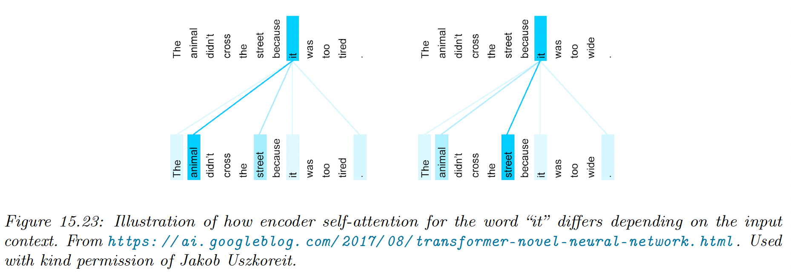
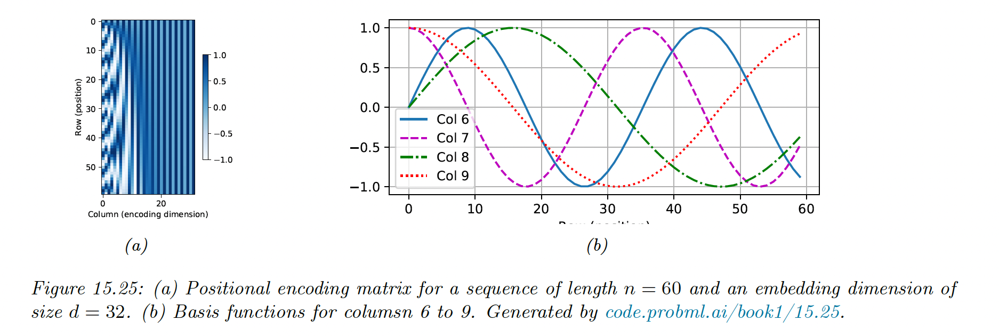
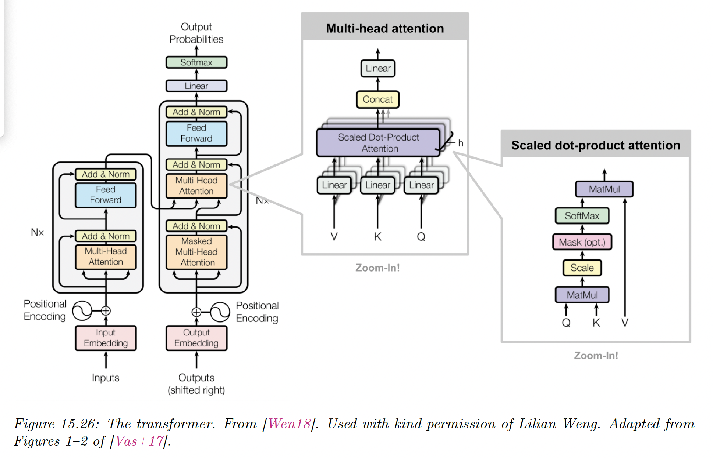
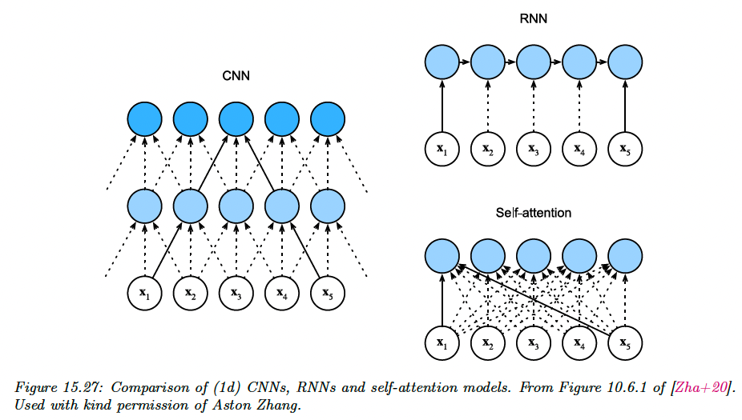
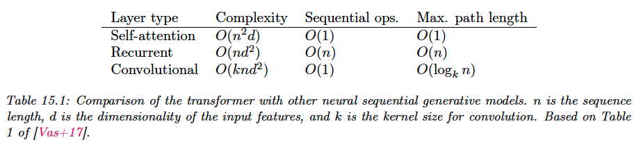
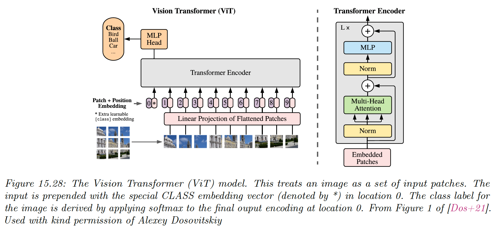

# 15.5 Transformers

The [transformer model](https://arxiv.org/abs/1706.03762) uses attention in both the encoder and decoder, thus eliminating the need for RNN.

It has been used in a wide diversity of sequence generation tasks, like machine translation music generation, protein sequence generation and [image generation](https://arxiv.org/abs/1802.05751) (treating images as a rasterized 1d sequence).

### 15.5.1 Self-attention

We saw in section 15.4.4 how the decoder section of an RNN could attend to the encoder to capture contextual embedding of each input.

We can modify this architecture so the encoder attends to itself. This is called **self-attention**.

Given a sequence of token $\bold{x}_1,\dots,\bold{x}_n$, with $\bold{x}_i\in\R^d$, self-attention can generate output of the same size using:

$$
\bold{y}_i=\mathrm{Attn}(\bold{x}_i,(\bold{x}_1,\bold{x}_1),\dots,(\bold{x}_n,\bold{x}_n))
$$

where the query is $\bold{x}_i$ and keys and values are all the inputs $\bold{x}_{1:n}$.

To use this in a decoder, we can set $\bold{x}_i=\bold{y}_{i-1}$, and $n=i-1$, so that all previously generated outputs are available. At training time, all the outputs are already known, so we run self-attention in parallel, overcoming sequential bottleneck of RNNs.

In addition to improve speed, self attention can give improved representation of context. For instance translating into french the sentences:

- “The animal didn’t cross the street because it was too tired”
- “The animal didn’t cross the street because it was too wide”

This phrase is ambiguous because “it” can refer to the animal or the street, depending on the final adjective. This is called **coreference resolution.**

Self attention is able to resolve this.



### 15.5.2 Multi-headed attention

If we think about attention matrix like a kernel matrix, we naturally want to use multiple attention matrix to capture different notion of similarity. This is the basic idea behind **multi-headed attention (MHA)**.

Given a query $\bold{q}\in\R^{d_q}$, keys and values $\bold{k}_j\in\R^{d_k}$, $\bold{v}_j\in\R^{d_v}$, we define the $i$th attention head as:

$$
\bold{h}_i=\mathrm{Attn}(W^{(q)}_i\bold{q}, \{W^{(k)}_i \bold{k}_j,W_i^{(v)}\bold{v}_j\})\in\R^{p_v}
$$

where $W_i^{(q)}\in\R^{p_q\times d_q}$, $W_i^{(k)}\in\R^{p_k\times d_k}$  and $W_i^{(v)}\in\R^{p_v\times d_v}$ are projection matrices.

We then stack the $h$ heads together, and project to $\R^{p_o}$:

$$
\bold{h}=\mathrm{MHA}(\bold{q},\{\bold{k}_j,\bold{v}_j\})=W_o \begin{bmatrix} \bold{h}_1 \\ \vdots \\ \bold{h}_h \end{bmatrix} \in \R^{p_o}
$$

with $W_o\in \R^{p_o\times hp_v}$.

If we set $hd_q=hd_k=hd_v=p_o$, we can compute all heads in parallel.

See this [code snippet](https://colab.research.google.com/github/probml/pyprobml/blob/master/notebooks/book1/15/multi_head_attention_jax.ipynb#scrollTo=gqSglANA1PCJ).

### 15.5.3 Positional encoding

Vanilla self-attention is permutation invariant, hence ignores the input word ordering. Since this can lead to poor results, we can concatenate or add positional encodings to the word embeddings.

We can represent positional encodings as the matrix $P\in\R^{n\times d}$, where $n$ is the sequence length and $d$ is the embedding size.

The original Transformer paper suggests to use sinusoidal basis:

$$
\begin{align}
p_{i,2j} &=\sin(\frac{i}{C^{2j/d}}) \\
p_{i,2j+1}&=\cos(\frac{i}{C^{2j/d}})
\end{align}
$$

where $C=10,000$ corresponds to some maximum sequence length.

For $d=4$, we have:

$$
\bold{p}_i=[\sin(\frac{i}{C^{0/4}}),\cos(\frac{i}{C^{0/4}}),\sin(\frac{i}{C^{2/4}}),\cos(\frac{i}{C^{2/4}})]
$$

Below, we see that the leftmost columns toggle fastest. Each row has a blueprint representing its position in the sequence.



This representation has two advantages:

1. It can be computed for arbitrary sequence size $T\leq C$, unlike a learned mapping from integers to vectors.
2. The representation of one location is linearly predictable from any other: $\bold{p}_{t+\phi}=f(\bold{p}_t)$, where $f$ is a linear transformation.
    
    

To see this last point, note that:

$$
\begin{align}
\begin{bmatrix}
\sin(w_k(t+\phi))\\
\cos(w_k(t+\phi))\\
\end{bmatrix}&=
\begin{bmatrix}
\cos(w_k t)\sin(w_k\phi)+\sin(w_kt)\cos(w_k\phi) \\
\cos(w_kt)\cos(w_k\phi)-\sin(w_kt)\sin(w_k\phi)
\end{bmatrix}\\
&=
\begin{bmatrix}
\cos (w_k\phi) &\sin(w_k\phi) \\
-\sin(w_k\phi) & \cos(w_k\phi)
\end{bmatrix}
\begin{bmatrix}
\sin(w_kt)\\
\cos(w_kt)
\end{bmatrix}
\end{align}
$$

If $\phi$ is small, then $\bold{p}_{t+\phi}\approx \bold{p}_t$. This provide a useful form of inductive bias.

Once we have computed the position embeddings $P$, we need to combine them with the word embeddings $X$:

$$
\mathrm{POS}(\mathrm{Embed}(X))=X+P
$$

We could also concatenate both matrix, but adding takes less space.

Additionally, since the $X$ embeddings are learned, the model could simulate concatenation by zeroing the first $K$ dimensions of $X$ and the last $D-K$ dimensions of $P$.

### 15.5.4 Putting it all together

A transformer is a seq2seq model using self-attention in the encoder and decoder rather than an RNN.



The encoder uses positional encoding, followed by a series of $N$ encoder blocks, each of which uses multi-head self-attention, residual connections and layer normalization.

```python
def EncoderBlock(X):
    Z = LayerNorm(MultiHeadAttn(Q=X, K=X, V=X) + X)
		E = LayerNorm(FeedForward(Z) + Z)
		return E

def Encoder(X, N):
    E = POS(Embed(X))
    for n in range(N):
        E = EncoderBlock(E)
    return E
```

The decoder has a more complex structure.

The previous generated outputs $Y$ are shifted and then combined with a positional embedding.

Then, they are fed to a causal (masked) multi-head attention model, before combining the encoder embeddings in another MHA.

Finally, the probability distribution over tokens are computed in parallel.

```python
def DecoderBlock(Y, E):
    Z_1 = LayerNorm(MultiHeadAttn(Q=Y, K=Y, V=Y) + Y)
    Z_2 = LayerNorm(MultiHeadAttn(Q=Z_1, K=E, V=E) + Z_1)
    D = LayerNorm(FeedForward(Z_2) + Z_2)
    return D

def Decoder(Y, E, N):
    D = POS(Embed(Y))
    for n in range(N):
        D = DecoderBlock(D, E)
    return D
```

See [this notebook](https://colab.research.google.com/github/probml/pyprobml/blob/master/notebooks/book1/15/transformers_jax.ipynb) for a tutorial.

Note that:

*i)* During training, teacher forcing is applied by using masked softmax. It processes all tokens of a sentence in a single pass, instead of looping for each one.

During inference however, we use a for-loop on the `num_steps`. If we consider a single sentence ($n=1$), the initial decoder input is only `[[”<bos>”]]` (beginning of sequence):

Then, we take as input for the next loop the maximum of the output probabilities. Hence, the input $X\in\R^{1\times 1\times d}$ stays a single token across loops.

However, `state` persists the input $X$ of the previous loops for each decoder layer, by concatenating it with the new input, resulting in $\mathrm{key\_value}\in\R^{1\times i\times d}$.

In consequence, the first attention query is $X$, but the key and values are the $\mathrm{key\_value}$.

*ii)* The word embeddings of the source (resp. target) language are located in the embedding layer of the encoder (resp. decoder). 

### 15.5.5 Comparing transformers CNNs and RNNs

We visually compare three different architectures to map a sequence $\bold{x}_{1:n}$ to another sequence $\bold{y}_{1:n}$ :



For a 1d CNN with kernel size $k$ and and $d$ feature channels, the time to compute is $O(knd^2)$, which can be done in parallel. We need a stack of $n/k$ layers (or $\log_k(n)$ if we use dilated convolution, to ensure all pairs of inputs communicate.

For a RNN, the computational complexity is $O(kd^2)$, because for a hidden state of size $d$ we have to perform matrix-vector multiplication at each step.

Finally, for self-attention models, every output is directly connected to every input. However, the computational cost is $O(n^2d)$, which is fine for short sequence where $n\ll d$. For longer sequence, we need fast versions of attention, called efficient transformers.



### 15.5.6 Transformers for images

CNNs are the most common model type for processing image data, since they have useful built-in inductive bias, locality (due to small kernel), equivariance (due to weight tying) and invariance (due to pooling).

Surprisingly, transformers can also perform well at image classification, but they need a lot of data to compensate for the lack of relevant inductive bias.

The first model of this kind is **ViT** (vision transformer), which chop images into 16x16 patches, project each patch into an embedding space, and passes these patches as a $\bold{x}_{1:T}$ sequence to a transformer.

The input is also prepended with a special `[CLASS]` embedding, $\bold{x}_0$. The output of the encoder is a set of encodings $\bold{e}_{0:T}$, the model maps $\bold{e}_0$ to the target class $y$, and is trained in a supervised way.



After supervised training, the model is fine-tuned on various downstream classification tasks, an approach known as transfer learning.

When trained on a “small dataset” like ImageNet (1k classes, 1.3m images), ViT can’t outperform a pretrained ResNet model known as **BiT** (Big transfer).

However, when trained on a bigger dataset, like ImageNet-21k (21k classes, 14m images) or the Google-internal JFT dataset (18k classes, 303m images), ViT outperforms BiT at transfer learning, and matches ConvNext performances.

ViT is also cheaper to train than ResNet at this scale (however, training is still expensive, the large ViT model on ImageNet-21k takes 30 days on a Google Cloud TPUv3 with 8 cores).

### 15.5.7 Other transformer variants

Many extensions of the transformer have been proposed.

For example, **Gshard** scales up transformers to even more parameters by replacing some of the feed forward dense layer with a mixture of experts regression module. This allows for sparse conditional computation, where a subset of the model (chosen by a gate) is used.

**Conformer** adds convolutional layer inside the transformer, which is helpful for various speech recognition tasks.