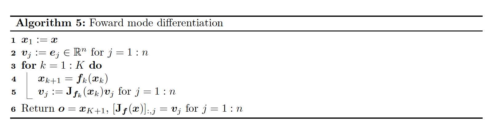
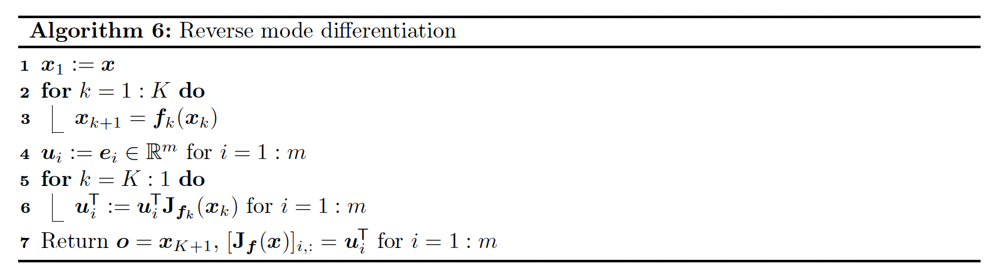
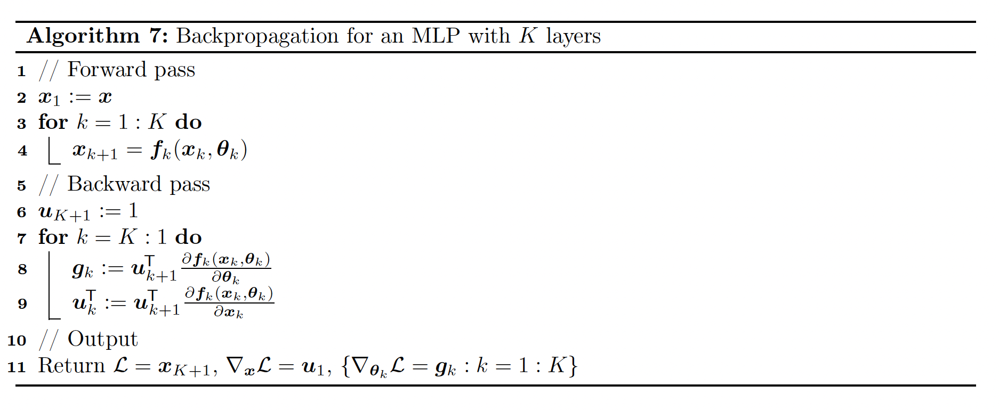
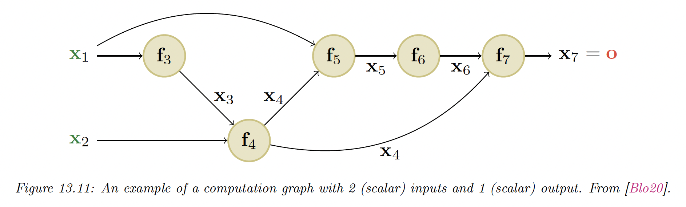
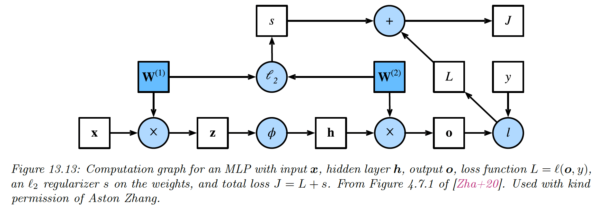

# 13.3 Backpropagation

In this section, we’ll cover the famous backpropagation algorithm which can be used to compute the gradient of a loss function applied to the output of the network w.r.t to the parameters in each layer.

### 13.3.1 Forward vs reverse mode differentiation

Consider a mapping of the form $\bold{o}=f(\bold{x})$, where $\bold{o}\in\mathbb{R}^{m},\bold{x}\in\mathbb{R}^n$ and

$$
f=f_4 \circ f_3 \circ f_2 \circ f_1 
$$

We can compute the Jacobian $J_f(\bold{x}) \in\mathbb{R}^{m \times n}$ using the chain rule:

$$
\begin{align}
J_f(\bold{x})=\frac{\partial \bold{o}}{\partial \bold{x}}&=\frac{\partial \bold{o}}{\partial \bold{x}_4} \frac{\partial \bold{x}_4}{\partial \bold{x}_3} \frac{\partial \bold{x}_3}{\partial \bold{x}_2} \frac{\partial \bold{x}_2}{\partial \bold{x}} \\
&= \frac{\partial f_4(\bold{x}_4)}{\partial \bold{x}_4}\frac{\partial f_3(\bold{x}_3)}{\partial \bold{x}_3} \frac{\partial f_2(\bold{x}_2)}{\partial \bold{x}_2} \frac{\partial f_1(\bold{x})}{\partial \bold{x}}\\
&= J_{f_4}(\bold{x_4}) J_{f_3}(\bold{x_3}) J_{f_2}(\bold{x_2}) J_{f_1}(\bold{x})
\end{align}
$$

Recall that the Jacobian can be written as:

$$
\begin{align}
J_f(\bold{x})=\frac{\partial 
f(\bold{x})}{\partial \bold{x}}&=\begin{bmatrix}\frac{\partial f_1}{\partial x_1}&\dots & \frac{\partial f_1}{\partial x_n}\\
\vdots &\ddots &\vdots \\
\frac{\partial f_m}{\partial x_1} &\dots &\frac{\partial f_m}{\partial x_n} 
\end{bmatrix}\\
&=\begin{bmatrix}
\nabla{f_1}(\bold{x})^\top  \\
\vdots \\
\nabla{f_m}(\bold{x})^\top 
\end{bmatrix}\\
&=\begin{bmatrix}\frac{\partial f}{\partial x_1} &\dots & \frac{\partial f}{\partial x_n}\end{bmatrix}\in \mathbb{R}^{m\times n}
\end{align}
$$

$m=1$ means the output is a scalar.

If $n<m$ (i.e. the number of features in the input is smaller than the dimension of the output), it is more efficient to compute the Jacobian for each column of $J_f(\bold{x})$ using a **Jacobian vector product (JVP),** in a right to left manner:

$$
J_f(\bold{x})\bold{v}=\underbrace{J_{f_4}(\bold{x}_4)}_{m\times m_3} \underbrace{J_{f_3}(\bold{x}_3)}_{m_3\times m_2} \underbrace{J_{f_2}(\bold{x}_2)}_{m_2\times m_1}\underbrace{J_{f_1}(\bold{x})}_{m_1\times n}\underbrace{\bold{v}}_{n\times 1}
$$

This can be computed using **forward mode differentiation**. Assuming $m=1$ and $m_3=m_2=m_1=n$, the cost of computation is $O(n^3)$.

If $n>m$ (this is the most frequent scenario, e.g. if the output is a scalar), it is more efficient to compute the Jacobian for each row using a **vector Jacobian product (VJP)**, in a left to right manner:

$$
\bold{u}^\top J_f(\bold{x})=
\underbrace{\bold{u}^\top}_{1\times m}
\underbrace{J_{f_4}(\bold{x}_4)}_{m\times m_3} \underbrace{J_{f_3}(\bold{x}_3)}_{m_3\times m_2} \underbrace{J_{f_2}(\bold{x}_2)}_{m_2\times m_1}\underbrace{J_{f_1}(\bold{x})}_{m_1\times n}
$$

This can be done using **reverse mode differentiation**. Assuming $m=1$ and $m_3=m_2=m_1=n$, the cost of computation is $O(n^2)$.

Both algorithms 5 and 6 can be adapted to compute JVPs and VJPs of any collection of input vectors by accepting $\{v_j\}_{j=1:n}$ or $\{u_i\}_{i=1:m}$ as input.

Initializing these vectors to the standard basis is only useful to produce the complete Jacobian as output.

### 13.3.2 Reverse mode differentiation for MLP

Let’s now consider layers with learnable parameters. We consider the example of a scalar output, so that the mapping has the form $\mathcal{L}:\mathbb{R}^n\rightarrow \mathbb{R}$.

For example, consider a $\ell_2$  loss for a MLP with one hidden layer:

$$
\mathcal{L}((\bold{x},y),\theta)=\frac{1}{2}||y-W_2\varphi(W_1 \bold{x})||^2_2
$$

We can represent this as the following feedforward model:

$$
\mathcal{L}=f_4 \circ f_3 \circ f_2 \circ f_1
$$

with:

$$
\begin{align}
\bold{x}_2&=f_1(\bold{x},\theta_1)=W_1\bold{x} \\
\bold{x}_3 &= f_2(\bold{x}_2,\empty)=\varphi(\bold{x}_2) \\
\bold{x}_4 &= f_3(\bold{x}_3,\theta_2)=W_2\bold{x}_3 \\
\mathcal{L}&=f_4(\bold{x}_4,y)=\frac{1}{2}||y-\bold{x}_4||_2^2
\end{align}
$$

We can compute the gradient wrt the parameters in each layer using the chain rule:

$$
\begin{align}
\frac{\partial \mathcal{L}}{\partial \theta_2}&=\frac{\partial \mathcal{L}}{\partial \bold{x}_4} \frac{\partial \mathcal{\bold{x}_4}}{\partial \theta_2} \\
\frac{\partial \mathcal{L}}{\partial \theta_1} &= \frac{\partial \mathcal{L}}{\partial \bold{x}_4} \frac{\partial \bold{x}_4}{\partial \bold{x}_3} \frac{\partial \bold{x}_3}{\partial \bold{x}_2} \frac{\partial \bold{x}_2}{\partial \theta_1}
\end{align}
$$

where each $\frac{\partial \mathcal{L}}{\partial \theta_k}=(\nabla_{\theta_k}\mathcal{L})^\top$ is a $d_k$-dimensional gradient row vector, $d_k$ being the number of parameters of the layer $k$.

Each Jacobian $\frac{\partial \bold{x}_k}{\partial \bold{x}_{k-1}}$ is an $n_k \times n_{k-1}$ matrix and can be computed recursively:

We now have to define the VJP $\bold{u}^\top J_f(\bold{x})$ of each layer.

### 13.3.3 VJP of common layers

**13.3.3.1 Cross entropy layer**

$$
z=f(\bold{x})=-\sum_c y_c\log p_c
$$

where $p_c$ is the predicted probability for class $c$:

$$
p_c=\frac{e^{x_c}}{\sum_{c'=1}^C e^{x_{c'}}}
$$

and $y_c$ is the true label for class $c$.

The Jacobian is:

$$
J=\frac{\partial z}{\partial \bold{x}}=(\bold{p-y})^\top \in\mathbb{R}^{1\times C}
$$

**13.3.3.2 Element wise non-linearity**

$$
\bold{z}=f(\bold{x})=\varphi(\bold{x})
$$

Since it is element wise, we have $z_i=\varphi(x_i)$

The $(i,j)$ element of the Jacobian is given by:

$$
\frac{\partial z_i}{\partial x_j}=\begin{cases}\varphi'(x_j) &\mathrm{if}\,i=j\\0 &\mathrm{otherwise}\end{cases}
$$

In other words, the Jacobian wrt the input is:

$$
J=\frac{\partial f}{\partial \bold{x}}=\mathrm{diag}(\varphi'(\bold{x}))
$$

The VJP becomes $\bold{u}^\top J_f(\bold{x})=\bold{u}^\top \odot \varphi'(\bold{x})$

For example, if $\varphi(x)=\mathrm{ReLU}(x)$, we have:

$$
\varphi'(x)=\begin{cases}1&\mathrm{if}\,x>0\\0&\mathrm{otherwise}\end{cases}=\mathrm{H}(x)
$$

The subderivative at 0 is any value in $[0,1]$, but we often take $0$.

**13.3.3.3 Linear layer**

$$
\bold{z}=f(\bold{x})=W\bold{x}
$$

where $W\in\mathbb{R}^{m\times n}$

*i)* The Jacobian wrt the input is:

$$
J=\frac{\partial \bold{z}}{\partial \bold{x}}=W
$$

since:

$$
\frac{\partial z_i}{\partial x_j}=\frac{\partial }{\partial x_j}\sum_{k=1}^n W_{ik} x_k=\sum_{k=1}^n W_{ik}\frac{\partial x_k}{\partial x_j}=W_{ij}
$$

Then the VJP is:

$$
\bold{u}^\top \frac{\partial \bold{z}}{\partial \bold{x}}= \bold{u}^\top W \in\mathbb{R}^{1\times n}
$$

*ii)* The Jacobian wrt the parameters is:

$$
J=\frac{\partial \bold{z}}{\partial W}\in\mathbb{R}^{m\times (m\times n)}
$$

which is complex to deal with.

Instead, taking a single weight:

$$
\frac{\partial z_k}{\partial W_{ij}}=\sum_{l=1}^m \frac{\partial}{\partial W_{ij}} W_{kl}x_l=\sum_{l=1}^m x_l \mathbb{I}(i=k\;\mathrm{and}\;j=l)=x_j\mathbb{I}(i=k)
$$

Hence:

$$
\frac{\partial \bold{z}}{\partial W_{ij}}=[0,\dots,0 ,x_j,0,\dots,0]^\top
$$

where $x_j$ occurs on the $i$th location.

Therefore we have:

$$
\bold{u}^\top \frac{\partial \bold{z}}{\partial W_{ij}}=\sum_{k=1}^m u_k \frac{\partial z_k}{\partial W_{ij}}=u_i x_j
$$

So the VJP can be represented by a matrix:

$$
\bold{u}^\top \frac{\partial \bold{z}}{\partial W}=\bold{u}\bold{x}^\top\in\mathbb{R}^{m\times n}
$$

**13.3.3.4 Putting all together**

$$
\begin{align}
\bold{u}_2 &= \nabla_{\bold{x}_4}\mathcal{L} = \bold{(p-y)} \in \mathbb{R}^C \\
\bold{u}_1 &= \nabla_{\bold{x}_2}\mathcal{L} = (W_2^\top \bold{u}_2)\odot \mathrm{H}(\bold{x}_2)  \in \mathbb{R}^K
\end{align}
$$

And

$$
\begin{align}
\frac{\partial \mathcal{L}}{\partial W_2} &=\frac{\partial \mathcal{L}}{\partial \bold{x}_4}\frac{\partial f_3(\bold{x}_3)}{\partial W_2}=\bold{u}_2 \bold{x}_3^\top \in\mathbb{R}^{C\times K} \\
\frac{\partial \mathcal{L}}{\partial W_1} &=\frac{\partial \mathcal{L}}{\partial \bold{x}_4}\frac{\partial f_3(\bold{x}_3)}{\partial \bold{x}_3} \frac{\partial f_2(\bold{x}_2)}{\partial \bold{x}_2}\frac{\partial f_1(\bold{x}_1)}{\partial W_1}=\bold{u}_1 \bold{x}_1^\top  \in \mathbb{R}^{K\times D}
\end{align}
$$

### 13.3.4 Computation Graph

MLP are simple kind of DNN with only feed forward passes. More complex structures can be seen as DAGs or computation graphs of differentiable elements.

For example, here we have:

$$
\frac{\partial \bold{o}}{\partial \bold{x}_4}= \frac{\partial \bold{o}}{\partial \bold{x}_5} \frac{\partial \bold{x}_5}{\partial \bold{x}_4} + \frac{\partial \bold{o}}{\partial \bold{x}_7} \frac{\partial \bold{x}_7}{\partial \bold{x}_4}
$$

The $\frac{\partial \bold{o}}{\partial \bold{x}_k}$ is computed once for each child $k$, this quantity is called **the adjoint**. This then gets multiplied by the Jacobian $\frac{\partial \bold{x}_k}{\partial \bold{x}_j}$ of each child.

The graph can be computed ahead of time, by using a **static graph** (this is how Tensorflow 1 worked), or it can be computed **just in time** by **tracing** the execution of the function on a input argument (this is how Tensorflow eager mode, Jax, and PyTorch works).

The later approach makes it easier to work on a dynamic graph, where the paths can change wrt the inputs.

