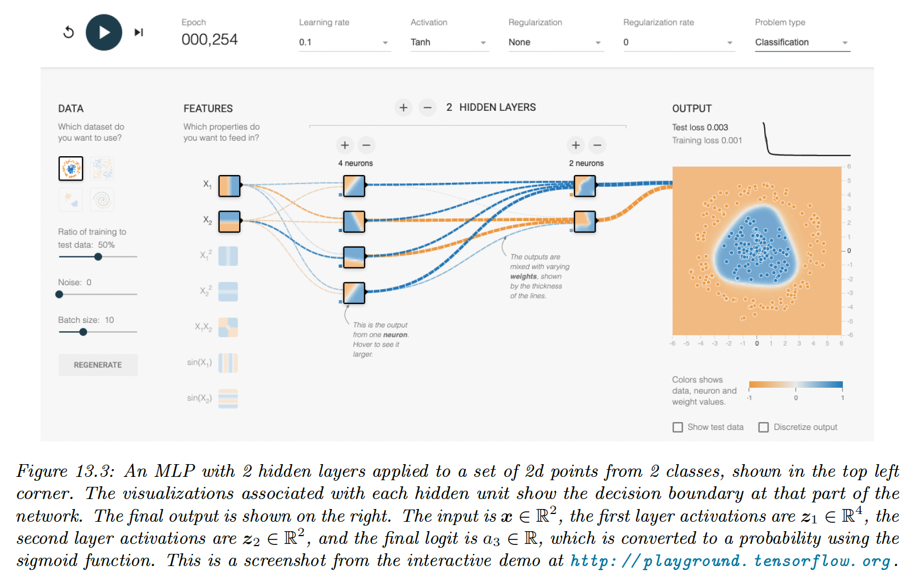

# 13.2 Multilayer perceptrons (MLP)

In section 10.2.5, we explained that the perception is a deterministic version of logistic regression:

$$
f(\bold{x};\theta)=\mathbb{I}(\bold{w}^\top \bold{x}+b\geq 0)=\mathrm{H}(\bold{w}^\top \bold{x}+b)
$$

where $\mathrm{H}$ is the Heaviside step function.

Since the decision boundaries of the perceptron are linear, they are very limited in what they can represent.

### 13.2.1 The XOR problem

One of the most famous problems of the perceptron is the XOR problem. Its truth table is:

We visualize this function and see that this is not linearly separable, so a perception can’t represent this mapping.

However, we can solve this problem by stacking multiple perceptrons together, called a **multilayer perceptron (MLP)**.

Above, we use 3 perceptions ($h_1,h_2$, and $y)$, where the first two layers are **hidden units** since their output is not observed in the training data.

This gives us:

$$
y=f(x_1,x_2)=\overline{(x_1 \land x_2)}\land (x_1\lor x_2)
$$

where the activation are $x_1,x_2\in\{0,1\}$, the overline is the negative operator, $\lor$ is OR, and $\land$ is AND.

By generalizing, we see the MLP can represent any logical function.

However, we obviously want to avoid learning the weights and biases by hand and learn these parameters from the data.

### 13.2.2 Differentiable MLPs

The MLP we discussed involves the non-differentiable Heaviside function, which makes it difficult to learn. This is why the MLP under this form was never widely used.

We can replace the Heaviside $H:\mathbb{R}\rightarrow\{0,1\}$ with a differentiable activation function $\varphi:\mathbb{R}\rightarrow \mathbb{R}$

The hidden units at layer $\ell$ are defined by the linear transformation of the previous hidden units passed element-wise through an activation function:

$$
z_l=f_l(z_{l-1})=\varphi_l(W_l z_{l-1}+\bold{b}_l)
$$

If we now compose $L$ of these functions together, we can compute the gradient of the output w.r.t the parameters in each layer using the chain rule. This is called **backpropagation**.

We can then pass the gradient to any optimizer and minimize some training objectives.

### 13.2.3 Activation functions

If we use a linear activation function, then the whole model is equivalent to a regular linear model. For this reason, we need to use non-linear activation functions.

Sigmoid and tanh functions were common choice, but they saturate for large positive or negative values, making the gradient close to zero, so any gradient signal from higher layers won’t be able to propagate back to earlier layers.

This is known as the **vanishing gradient** problem and makes it hard to train models with gradient descent.

The most common non-saturating activation function is **rectified linear unit (ReLU)**:

$$
\mathrm{ReLU}(x)=\max(0,x)=x\mathbb{I}(x>0)
$$

### 13.2.4 Example models

**13.2.4.1 MLP for classifying 2d data into 2 categories**

The model has the following form:

$$
\begin{align}
p(y|\bold{x},\theta) &=\mathrm{Ber}(y|\sigma(a_3)) \\
a_3&=\bold{w}_3^\top \bold{z}_2+b_3 \\
\bold{z}_2 &= \varphi(\bold{w}_2^\top \bold{z}_1+\bold{b}_2) \\
\bold{z}_1 &= \varphi(\bold{w}_1^\top \bold{x}+\bold{b}_1) 

\end{align}
$$

**13.2.4.2 MLP for image classification**

To apply MLP to 2d images ($28 \times 28$), we need to flatten them to 1d vectors ($784$). We can then use a feedforward architecture.

On MNIST, the model achieves a test set accuracy of 97%.

CNNs are better suited to handle images by exploiting their spatial structure, with fewer parameters than the MLP.

By contrast, with a MLP we can randomly shuffle the pixels without affecting the output.

**13.2.4.3 MLP for text classification**

We need to convert a variable-length sequence of words $\bold{v}_1,\dots,\bold{v}_T\in\mathbb{R}^V$ into a fixed dimensional vector $\bold{x}$, where $V$ is the vocabulary size and $\bold{v}_i$ are one-hot-encoding vectors.

The first layer is an embedding matrix $\bold{W}_1\in\mathbb{R}^{V\times E}$, which converts a sparse $V-$dimensional vector into a $E-$dimensional embedding.

Next, we convert this set of $T$ embeddings into a fixed-size vector using global average pooling.

Then we can pass it to an MLP.

This has the form:

$$
\begin{align}
p(y|\bold{v}_t;\theta)&=\mathrm{Ber}(y|\sigma(\bold{w}_3^\top \bold{h}+b_3)) \\
\bold{h}&=\varphi(W_2\bar{\bold{e}}+\bold{b_2})\\
\bar{\bold{e}}&=\frac{1}{T}\sum^T_{t=1}\bold{e}_t\\
\bold{e}_t &= W_1 \bold{v}_t
\end{align}
$$

If we use $V=10,000$, an embedding size of $E=16$, and a hidden layer of size $16$ , and apply this model to the IMDB movie review sentiment classification dataset, we get an accuracy of 86% on the validation set.

The embedding layer has the most parameters, and with a training set of only 25k elements, it can easily overfit.

Instead of learning these parameters in a supervised way, we could reuse unsupervised pre-training of word-embedding models. If $W_1$ is fixed, we have much fewer parameters to learn.

**13.2.4.4 MLP for heteroskedastic regression**

We can also use MLP for regression. “Heteroskedastic” means the output-predicted variance is input-dependent.

This function has two outputs to compute $f_\mu(\bold{x})=\mathbb{E}[y|\bold{x},\theta]$ and $f_\sigma^2=\mathbb{V}[y|\bold{x},\theta]$.

We can share most of the layers with these two functions by using a common “**backbone**” and two outputs “**heads**”

For the $\mu$ head, we use a linear activation $\varphi(a)=a$, and for the $\sigma^2$, we use the soft-plus activation $\varphi(a)=\sigma(a)_+=\log( 1+e^{a})$.

If we use linear heads and a non-linear backbone, the model is given by:

$$
p(y|\bold{x};\theta)=\mathcal{N}\big(y|\bold{w}^\top_\mu f(\bold{x},\bold{w}_{shared}),\sigma_+(\bold{w}_{\sigma^2}^\top f(\bold{x},\bold{w}_{shared}))\big)
$$

This model suits datasets where the mean grows linearly over time, with seasonal oscillations, and the variance quadratically. This is a simple example of **stochastic volatility**, as can be seen in financial or temperature data with climate change.

The model is underconfident at some points when it considers a fix $\sigma^2$ since it needs to adjust the overall noise model and can’t make adjustments.

### 13.2.5 The importance of depth

One can show that an MLP with one hidden layer can approximate any smooth function, given enough hidden parameters, to any desired level of accuracy.

The literature has shown that deep networks work better than shallow ones. The idea is that we can build **compositional** or **hierarchical** models, where later layers can leverage the feature extracted by earlier layers.

### 13.2.6 The deep learning revolution

Although the idea behind DNN date back several decades ago, they started to become widely used only after the 2010s. The first area to adopt these methods was the field of automatic speech recognition (ASR).

The moment that got the most attention was the introduction of deep CNN to the ImageNet challenge in 2012, which significantly improve the error rate from 26% to 16%. This is was a huge jump since the benchmark only improved by 2% every year.

The explosion in the usage of DNNs has several factors:

- The availability of cheap GPUs, that can massively reduce the fitting time for CNNs
- The growth of large, labeled datasets, allows models to gain in complexity without overfitting (ImageNet has 1.3M of labeled images)
- High-quality open-source software like Tensorflow (by Google), PyTorch (by Facebook), and MXNet (by Amazon). These libraries support automatic differentiation and scalable gradient-based optimization.