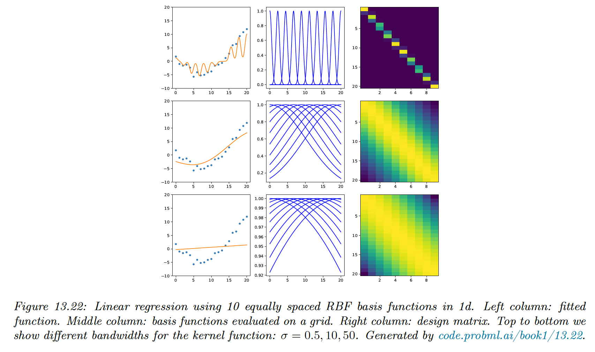
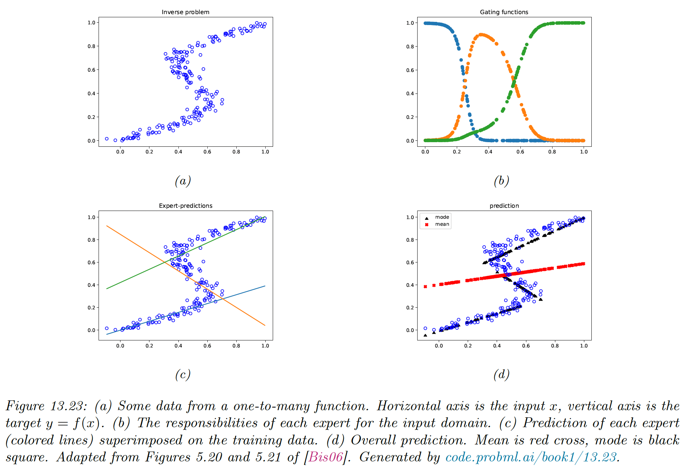
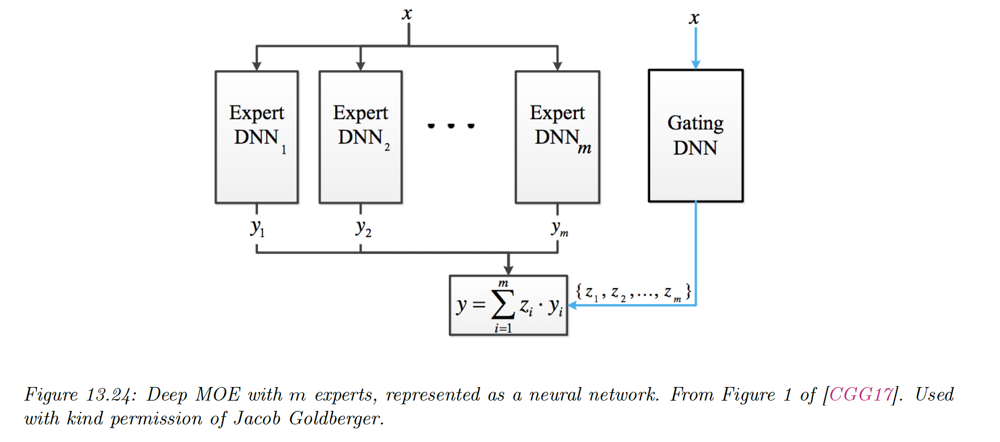
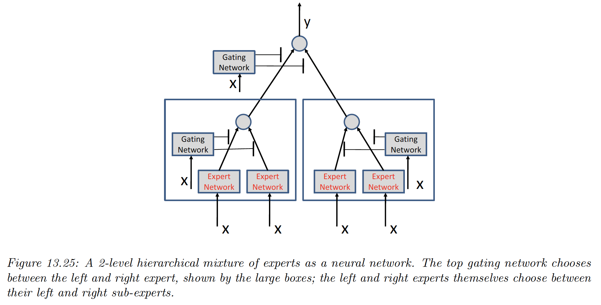

# 13.6 Other kinds of feedforward networks

### 13.6.1 Radial basis function networks

Consider a 1-layer neural network where the hidden units are given by:

$$
\phi(\bold{x})=[\mathcal{K}(\bold{x},\mu_1),\dots,\mathcal{K}(\bold{x},\mu_K)]
$$

where $\mu_k\in\mathcal{X}$ are a set of $K$ centroids, and $\mathcal{K}(\bold{x},\mu_k)\geq 0$ is a kernel function (see section 17.1).

We use the simplest kernel function, the Gaussian kernel:

$$
\mathcal{K}_{gauss}(\bold{x,y})=\exp\Big(-\frac{1}{2\sigma^2}{||\bold{x-y}||^2_2} \Big)
$$

where $\sigma$ is called the bandwith. This is called a **radial basis function (RBF) kernel.**

A RBF network has the form:

$$
p(y|x;\theta)=p(y|\bold{w}^\top \phi(\bold{x}))
$$

where $\theta=(\mu,\bold{w})$. The centroids can be fixed or learned using unsupervised learning methods like K-means.

Alternatively, we can associate one centroid per datapoint, $\mu_k=x_n$ with $K=N$. This is an example of **non-parametric model**, since the number of parameters grow with the size of the data.

If $K=N$ the model can perfectly interpolate the data and overfit. However, by ensuring the weights $\bold{w}$ are sparse, the model will use a finite number of weights and will result in a **sparse kernel machine.**

Another way to avoid overfitting is to use a Bayesian approach, by marginalizing the weights, this gives rise to the **Gaussian process** model.

**13.6.1.1 RBF network for regression**

We can use RBF for regression by defining:

$$
p(y|x;\theta)=\mathcal{N}(y|\bold{w}^\top \phi(\bold{x}),\sigma^2)
$$

Below, we fit 1d data to a model with $K=10$ uniformly spaced RBF clusters, with the bandwith  ranging from low to large.

When the bandwidth is small, the predicted function is wiggly since points far from the clusters will lead to predicted value of 0.

On the contrary, if the bandwidth is large, each points is equally close to all clusters, so the prediction is a straight line.

**13.6.1.2 RBF network for classification**

We can use RBF in classification by considering:

$$
p(y|x;\theta)=\mathrm{Ber}(y|\sigma(\bold{w}^\top \phi(\bold{x})))
$$

RBF are able to solve the XOR problem.

### 13.6.2 Mixtures of experts

When considering regression, it is common to assume an unimodal output distribution. However, this won’t work well with **one-to-many** functions, in which each input is mapped to multiple outputs.

There are many real-world problems like 3d pose estimation of a person given an image, [colorization of a black and white image](https://arxiv.org/pdf/1705.07208.pdf), and predicting future frames of a video sequence.

Any model trained to maximize likelihood using a unimodal output density (even non-linear and flexible ones) will have poor performances on one-to-many functions since it will produce a blurry average output.

To prevent this problem of regression to the mean, we can use a conditional mixture model. We assume the output is a weighted mixture of $K$ different outputs, corresponding to different modes of the output distribution for each input $\bold{x}$.

In the Gaussian case, this becomes:

$$
p(\bold{y}|\bold{x})=\sum_{k=1}^K p(\bold{y}|\bold{x},z=k)p(z=k|\bold{x})
$$

where:

$$
\begin{align}
p(\bold{y}|\bold{x},z=k)&=\mathcal{N}(\bold{y}|f_{\mu,k}(\bold{x}),\mathrm{diag}( f_{\sigma,k}(\bold{x})))\\
p(z=k|\bold{x}) &=\mathrm{Cat}(z|\mathcal{S}_k(f_z(\bold{x})))
\end{align}
$$

Here, $f_z$ predicts which mixture to use, $f_{\mu,k}$ and $f_{\sigma, k}$ predict the mean and the variance of the kth Gaussian.

This is called a **Mixture of Expert** (MOE), where we choose submodels that are experts on some region of the input space, with a **gating function $p(z=k|\bold{x})$.**

By picking the most likely model expert for a given $\bold{x}$, we can activate a subset of the model. This is an example of **conditional computation**.

**13.6.2.1 Mixture of linear experts**

The model becomes:

$$
\begin{align}
p(\bold{y}|\bold{x},z=k,\theta)&=\mathcal{N}(\bold{y}|\bold{w}_k^\top \bold{x},\sigma^2_k))\\
p(z=k|\bold{x},\theta) &=\mathrm{Cat}(z|\mathcal{S}_k(V\bold{x})))
\end{align}
$$

where $S_k$ is the kth output from the softmax. Each expert corresponds to a linear regression with different parameters.

As we can see in the figure above, if we take the average prediction from all experts, we obtain the red curve, which fits our data poorly. Instead, we only predict using the most active expert to obtain the discontinuous black curve.

**13.6.2.2 Mixture density networks**

The gating and expert functions can be any kind of conditional probabilistic model, like DNN. In this situation, the model becomes a **mixture density network (MDN)**.

**13.6.2.3 Hierarchical MOEs**

If each network is a MOE itself, we obtain a **hierarchical mixture of experts.**

An HME with $L$ levels can be thought of as a “soft” decision tree of depth $L$, where each example is passed through every branch of the tree, and the final prediction is the weighted average.

