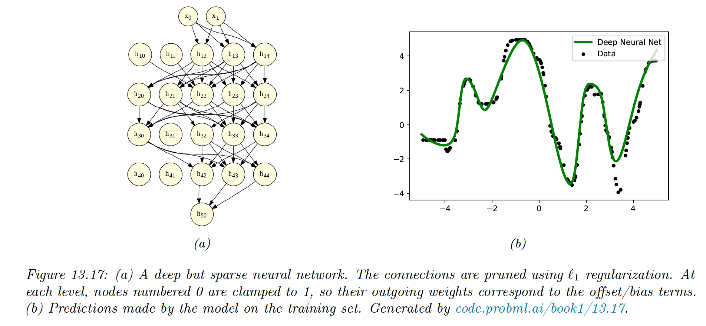
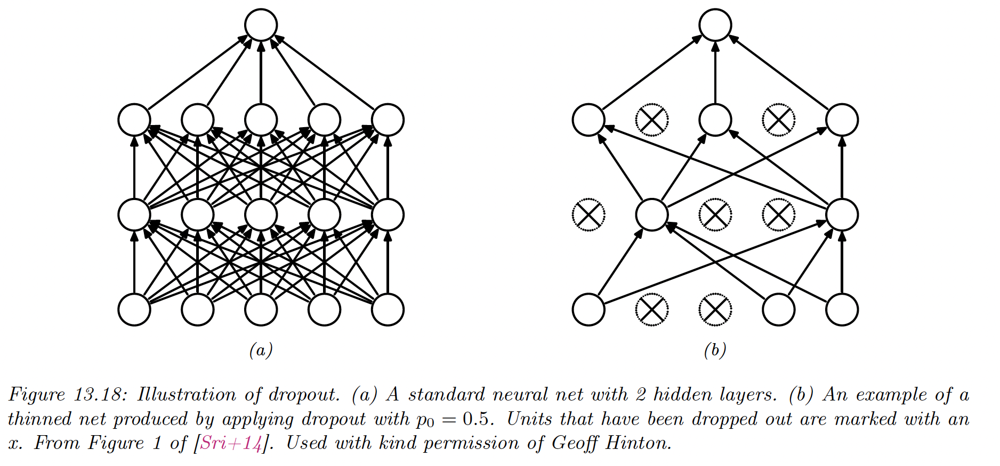
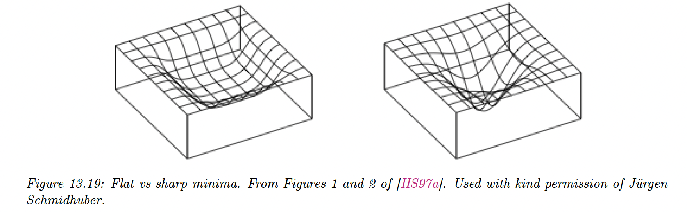
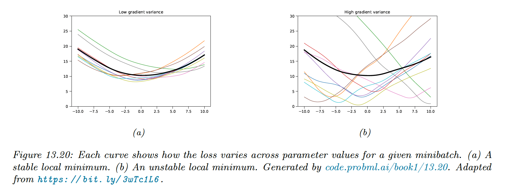

# 13.5 Regularization

The previous section discussed computational issues arising when training DNNs. We now focus on statistical issues, in particular on avoiding overfitting.

Large neural nets can easily have millions of parameters, which makes them particularly prone to overfitting. 

### 13.5.1 Early stopping

One of the easiest ways to perform regularization is to stop the training procedure when the validation error increases.

This works because we restrain the optimization algorithm from further transferring information from the training example to the parameters.

### 13.5.2 Weight decay

A common approach to reduce overfitting is to impose a prior of the parameter and use MAP estimation.

It is standard to use a Gaussian distribution on the weighs $\mathcal{N}(\bold{w}|0,\alpha^2\bold{I})$ and biases $\mathcal{N}(\bold{w}|0,\beta^2\bold{I})$.

This is equivalent to $\ell_2$ regularization for SGD (but not for Adam, see the [AdamW paper](https://arxiv.org/pdf/1711.05101.pdf)). In the neural networks literature, this is called **weight decay** since it encourages smaller weights. 

### 13.5.3 Sparse DNNs

Since there are many weights in DNN, it is often helpful to encourage sparsity. This allows us to perform **model compression** to save memory and time.

We can achieve this with a $\ell_1$ regularization or ARD, for instance.

In the example below, a 5-layer MLP fit on 1d regression with $\ell_1$ regularization has a sparse topology.

Despite their intuitive appeal, these methods are not widely used because GPUs are optimized for dense matrix multiplication.

However, if we use group sparsity, we can prune out whole layers of the model. This results in **block sparse** weight matrices, which can result in speedup and memory saving.

### 13.5.4 Dropout

Suppose, for each example, we randomly turn off all the outgoing connections of a neuron with probability $p$. This is called **dropout**.

Dropout can dramatically reduce overfitting and is widely used. It works because it prevents complex co-adaptation of the hidden units. Each unit must learn to perform well when others are missing at random.

We can view dropout as estimating a noisy version of the term $\theta_{ij}=w_{ij}\epsilon_{i}$ where $\epsilon_{li}\sim \mathrm{Ber}(1-p)$. At test time, we usually turn the noise off.

To ensure the weights have the same expectation during training and testing, we multiply them by $\mathbb{E}[\epsilon]=1-p$.

We can also use dropout during testing. This results in an **ensemble** of networks, each with a slightly different sparse graph structure. This is known as the **Monte Carlo dropout**:

$$
p(y|x,\mathcal{D})\approx \frac{1}{N}\sum_{n=1}^N p(y|x,\hat{W} \epsilon_n+\hat{b})
$$

### 13.5.5 Bayesian neural networks

Modern DNNs are often trained using a penalized maximum likelihood to find a single setting of parameters. However, sometimes the number of parameters far exceeds the number of data points, and multiple models may fit the data equally well.

It is therefore often useful to capture the uncertainty with a posterior predictive distribution, rather than optimizing on a single set of parameters. This can be done by marginalizing the parameters:

$$
p(y|x,\mathcal{D})=\int p(y|x,\theta)p(\theta|\mathcal{D})d\theta
$$

Here the model is an ensemble over all possible models, weighted by the posterior probability of the parameters. This is known as **Bayesian neural networks (BNN).**

BNN is challenging for large neural networks but [can bring some performance gains](https://arxiv.org/pdf/2002.08791.pdf).

### 13.5.6 Regularization effects of SGD

Some optimization methods (in particular second-order ones) are able to find a narrow set of parameters with a very low loss, called a **sharp minima**.

While this effectively reduces the empirical loss, the optimizer has overfitted, and we prefer finding instead **flat minima.** Such solutions are more robust and generalize better since there is a lot of posterior uncertainty and less data point memorization.

SGD often finds flat minima by adding noise, preventing it to enter narrow landscapes. This is called **implicit regularization**. We can also explicitly encourage flat minima with **entropy SGD**, **sharpness-aware minimization,** and **stochastic weight averaging (SWA)**.

The loss landscape depends on the data and not only on the parameters. As we usually can’t afford to perform full-batch gradient descent, we will end up with a series of loss curves, one for each minibatch.

If the variance of these curves is low, the model has found a flat minima and will generalize well.

We can consider the continuous-time gradient flow, which has the form:

$$
\dot{\bold{w}}=-\nabla _{\bold{w}}\tilde{\mathcal{L}}_{GD}(\bold{w})
$$

where:

$$
\tilde{\mathcal{L}}_{GD}(\bold{w})=\mathcal{L} (\bold{w})+\frac{\epsilon}{4}||\nabla \mathcal{L} (\bold{w})||^2
$$

where $\mathcal{L}(\bold{w})$ is the original loss and second term penalizes large gradient.

If we extend this analysis to SGD, we obtain the following flow:

$$
\tilde{\mathcal{L}}_{SGD}(\bold{w})=\mathcal{L} (\bold{w})+\frac{\epsilon}{4}\sum_{k=1}^m||\nabla \mathcal{L}_k (\bold{w})||^2
$$

Therefore:

$$
\tilde{\mathcal{L}}_{SGD}(\bold{w})=\tilde{\mathcal{L}}_{GD}(\bold{w})+\frac{\epsilon}{4}\sum_{k=1}^m||\nabla \mathcal{L}_k (\bold{w}) -\nabla \mathcal{L} (\bold{w})||^2
$$

The second term is the variance of the minibatch gradients, which is a measure of stability and hence, of generalization.

This shows that SGD not only has computation advantage (since it is faster than full batch or second-order methods), but also statistical advantages.