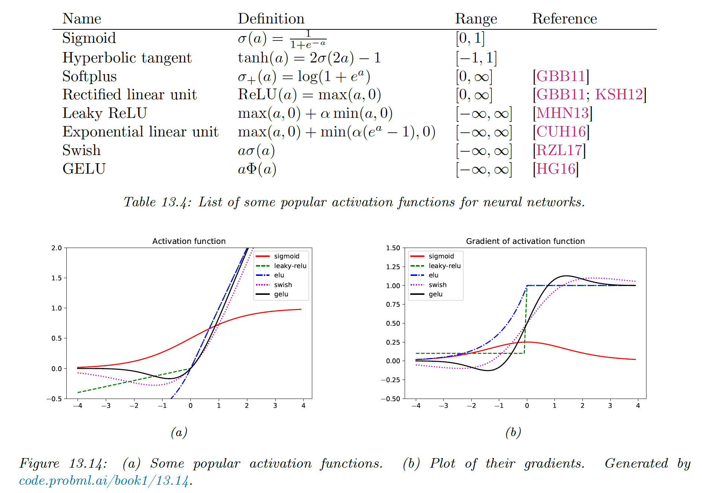

# 13.4 Training neural networks

We now discuss how to fit DNNs to data. The standard approach is to use MLE, by minimizing the NLL:

$$
\mathrm{NLL}(\theta)=-\log p(\mathcal{D}|\theta)=-\sum_{n=1}^N \log p(y_n|x_n;\theta)
$$

In principle, we can use the backprop algorithm and compute the gradient of this loss and pass it to an optimizer. Adam (section 8.4.6.3) is a popular choice, due to its ability to scale to large datasets (by virtue of being of SGD-type) and converges fairly quickly (by virtue of using diagonal preconditioning and momentum).

However, in practice, this may not work well. In addition to practical issues, there are theoretical limitations. In particular, the loss of DNNs is not convex, so we will generally not find the global optimum.

Nevertheless, SGD can often find surprisingly good solutions.

### 13.4.1 Tuning the learning rate

It is essential to tune the learning rate, to ensure convergence to a good solution (see section 8.4.3).

### 13.4.2 Vanishing and exploding gradient

When training very deep networks, the gradient tends to become very small (vanishing) or very large (exploding), because the signal is passed through a series of layers that either amplify it or diminish it.

Consider the gradient of layer $l$:

$$
\frac{\partial \mathcal{L}}{\partial z_l}= \frac{\partial \mathcal{L}}{\partial z_{l+1}}\frac{\partial z_{l+1}}{\partial z_l}=J_l \bold{g}_{l+1}
$$

If $J_l$ is constant across layers, the contribution of the gradient from the final layer, $\bold{g}_L$, to layer $l$ will be $J^{L-l}\bold{g}_L$. Thus the behavior of the system depends on the eigenvectors of $J$.

Although $J$ is a real-valued matrix, it is not symmetric, so its eigenvalues and eigenvectors can be complex-valued, with the imaginary components corresponding to oscillatory behavior.

Let $\lambda$ be the spectral radius of $J$ (the largest absolute eigenvalues). If $\lambda> 1$, the gradient can explode, if $\lambda <1$ the gradient can vanish.

We can counter the exploding problem with **gradient clipping**, in which we cap the value of the magnitude of the gradient to $c$ if it becomes too large:

$$
\bold{g}=\min(1,\frac{c}{||\bold{g}||})\bold{g}
$$

However, the vanishing problem is more difficult to solve. There are various solutions:

- Modify the activation functions (see next section)
- Modify the architecture so that the updates are additive rather than multiplicative (residual networks)
- Modify the architecture to standardize the activation at each layer, so that the distribution of activations over the dataset remains constant during training (batch norm).
- Carefully choose the initial values of the parameters

### 13.4.3 Non-saturating activation functions

As already mentioned in section 13.2.3, the sigmoid activation function and $\tanh$ function saturates for small and large values of activations, vanishing gradient.

For the sigmoid of a linear layer, we have:

$$
\begin{align}
\frac{\partial \mathcal{L}}{\partial \bold{x}} &= W^\top z(1-z)\\
\frac{\partial \mathcal{L}}{\partial W} &= z(1-z)\bold{x}^\top 
\end{align}
$$

Hence, if the activation $z$ is close to 0 or 1, the gradient is close to 0.

**13.4.3.1 ReLU**

The rectified linear unit is defined as:

$$
\mathrm{ReLU}(x)=\max(0, x)=x\mathbb{I}(x>0)
$$

Its gradient is:

$$
\mathrm{ReLU}'(x)=\mathbb{I}(x>0)
$$

Therefore, with a linear layer, we have:

$$
\begin{align}
\frac{\partial \mathcal{L}}{\partial \bold{x}}&=W^\top \mathbb{I}(\bold{z}>0) \\
\frac{\partial \mathcal{L}}{\partial W} &= \mathbb{I}(\bold{z}>0) \bold{x}^\top 
\end{align}
$$

Hence the gradient will not vanish, as long as $\bold{z}$ is positive.

However, if some of the weights are initialized with large negative values, then some activations will go to zero and their gradient too. The algorithm will never be able to escape this situation, so some hidden units will stay permanently off. This is called the “**dead-ReLU”** problem.

**13.4.3.2 Non-saturating ReLU**

The **leaky ReLU** has been proposed to solve the dead-ReLU issue:

$$
\mathrm{LRELU}({x};\alpha)=\max(\alpha {x},{x})
$$

with $0<\alpha<1$, which allows some signal to be passed back to earlier layers, even when the input is negative.

If we allow the parameter $\alpha$ to be learned, this is called **parametric ReLU.**

Another popular choice is **ELU** (exponential linear unit):

$$
\mathrm{ELU}(x;\alpha)=\begin{cases}\alpha (e^x-1 )&\mathrm{if}\;x\leq0\\x&\mathrm{otherwise}\end{cases}
$$

This has the advantage of being a smooth function.

A slight variant of ELU is known as **SELU** (self-normalizing ELU):

$$
\mathrm{SELU}(x;\alpha,\lambda)=\lambda \mathrm{ELU}(x;\alpha)
$$

Surprisingly, it has been proven that by setting $\alpha$ and $\lambda$ carefully, the activation function ensures that the output of each layer is standardized (providing the input is also standardized), even without the use of techniques such as batch norm.

 

**13.4.3.3 Other choices**

**Switch or SiLU** (sigmoid rectified unit) appears to work well for image classification benchmarks and is defined as:

$$
\mathrm{SiLU}(x;\beta)=x\sigma(\beta x)
$$

Another popular choice is **GELU** (Gaussian Error Linear Unit):

$$
\mathrm{GELU}(x)=x\Phi(x)
$$

where $\Phi$ is the cdf of the standard normal distribution:

$$
\Phi(x)=P(\mathcal{N}(0,1)\leq x)=\frac{1}{2}\Big(1+\mathrm{erf}(x/\sqrt{2})\Big)
$$

We see that this is not a convex or monotonic function, unlike most activation functions.

We can think of GELU as a “soft” RELU since it replaces the step function with the Gaussian cdf.

See PyTorch's [non-linear activations module](https://pytorch.org/docs/stable/nn.html#non-linear-activations-weighted-sum-nonlinearity) for an exhaustive list.

### 13.4.4 Residual connections

One solution to the vanishing problem is to use **residual networks** or **ResNet.** This is a feedforward model in which each layer has the form of a residual block:

$$
\mathcal{F}_l'(\bold{x})=\mathcal{F}_l(\bold{x})+\bold{x}
$$

where $\mathcal{F}$ is a standard shallow non-linear mapping (e.g. linear-activation-linear).

Residual connections are often used conjointly with CNNs, but can also be used in MLPs.

A model with residual connections has the same number of parameters as without it but is easier to train. The reason is that gradient can flow directly from the output to the earlier layers.

To see this, note that the activation at the output layer can be derived as:

$$
\bold{z}_L=\bold{z}_l+\sum_{k=l}^{L-1}\mathcal{F}_k(\bold{z}_k,\theta_k)
$$

 We can therefore compute the gradient of the loss wrt the parameters of the $l$th layer as follows:

$$
\begin{align}
\frac{\partial \mathcal{L}}{\partial \theta_l}
&=
\frac{\partial \bold{z}_l}{\partial \theta_l} \frac{\partial \mathcal{L}}{\partial \bold{z}_l}\\
&=
\frac{\partial \bold{z}_L}{\partial \theta_l}\frac{\partial \mathcal{L}}{\partial \bold{z}_L}\frac{\partial \bold{z}_L}{\partial \bold{z}_l} \\
&=\frac{\partial \bold{z}_L}{\partial \theta_l}\frac{\partial \mathcal{L}}{\partial \bold{z}_L}(1+\sum_{k=1}^{L-1} \frac{\partial}{\partial \bold{z}_l}\mathcal{F}_k(\bold{z}_k,\theta_k) \\
&=\frac{\partial \bold{z}_L}{\partial \theta_l}\frac{\partial \mathcal{L}}{\partial \bold{z}_L}+\mathrm{other\;terms}
\end{align}
$$

We see that the gradient at layer $l$ depends directly on the gradient at layer $L$, independently from the network depth.

### 13.4.5 Parameter initialization

Since the objective function of DNNs is non-convex, the initial values of parameters can play a big role in the final solution, as well as how easy the function is to train (i.e. how well signal can flow backward and forward in the model).

**13.4.5.1 Heuristic initialization scheme**

It has been shown that sampling parameters from a standard normal distribution with fixed variance can lead to exploding activation or gradient.

To see why, consider a linear unit $o_i=\sum_{j=1}^{n_{in}}w_{ij}x_j$ where $w_{ij}\sim \mathcal{N}(0,1)$, $\mathbb{E}[x_j]=0$, $\mathbb{V}[x_j]=\gamma^2$:

$$
\begin{align}
\mathbb{E}[o_i]&=\sum_{j=1}^{n_{in}}\mathbb{E}[w_{ij}x_j]=\sum_{j=1}^{n_{in}}\mathbb{E}[w_{ij}]\mathbb{E}[x_j]=0 \\
\mathbb{V}[o_i] &= \mathbb{E}[o_i^2]-\mathbb{E}[o_i]^2 =\sum_{j=1}^{n_{in}}\mathbb{E}[w_{ij}^2x_j^2]-0=\sum_{j=1}^{n_{in}}\mathbb{E}[w_{ij}]^2\mathbb{E}[x_j^2]=n_{in}\sigma^2 \gamma^2
\end{align}
$$

To keep the variance from blowing up, we need to ensure $n_{in}\sigma^2=1$ during forward pass, where $n_{in}$ is the **fan-in** (input connections).

When doing the backward pass, we need $n_{out}\sigma^2=1$, where $n_{out}$ is the fan-out.

To satisfy both requirements we set:

$$
\frac{1}{2}(n_{in}+n_{out})\sigma^2=1
$$

or equivalently:

$$
\sigma^2=\frac{2}{n_{in}+n_{out}}
$$

This is known as **Xavier initialization** (use it for linear, tanh, logistic and softmax activation function).

In the special case of $n_{in}=n_{out}$, we use $\sigma^2=1/n_{in}$, this is **LeCun initialization** (use it for SELU).

Finally, $\sigma^2=2/n_{in}$ is **Hue initialization** (use it for ReLU and variants).

**13.4.5.2 Data-driven initialization**

We can adopt a data-driven approach to parameter initialization, like **layer-sequential unit-variance (LSUV),** working as follow:

- Initialize the weights (fully connected or convolutional) using orthonormal matrices, by drawing $W\sim \mathcal{N}(0,\bold{I})$ then using QR or SVD decomposition.
- For each layer $l$, compute the variance of activation across a minibatch
- Rescale the weights as $W_l=W_l/\sqrt{v_l}$

This can be viewed as orthonormal initialization combined with batch normalization applied on the first mini-batch. This is faster than full-batch normalization and can work just as well.

### 13.4.6 Parallel training

Training large networks can be slow, and specialized hardware for matrix-matrix multiplication like **graphics processing units (GPU)** and **tensor processing unit (TPU)** can boost this process.

If we have multiple GPU, we can further speed things up.

The first approach is **model parallelism**, in which we partition the model across different machines. This is quite complicated since this requires tight communication between machine and we won’t discuss it further.

The second approach is **data parallelism**, which is much simpler as it is **embarrassingly parallel**. For each training step $t$:

- We split the minibatch across $K$ machines to get $\mathcal{D}_t^k$.
- Each machine $k$ computes its own gradient $\bold{g}_t^k=\nabla_\theta \mathcal{L}(\theta,\mathcal{D}_t^k)$
- We sum all gradient on a central machine $\bold{g}_t=\sum_{k=1}^K \bold{g}_t^k$
- We broadcast the summed gradient back to all machines, $\tilde{\bold{g}}_t^k=\bold{g}_t$
- Each machine update its parameters using $\theta_t^k=\theta_{t-1}^k-\eta_t \tilde{\bold{g}}_t^k$

See [this tutorial](https://colab.research.google.com/github/probml/pyprobml/blob/master/notebooks/book1/13/multi_gpu_training_jax.ipynb#scrollTo=UeG2yP57tJBX) for a toy implementation in Jax, and [this tutorial](http://d2l.ai/chapter_computational-performance/multiple-gpus-concise.html) for a more robust solution in PyTorch.