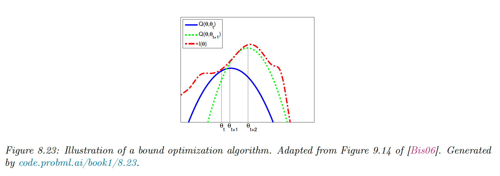
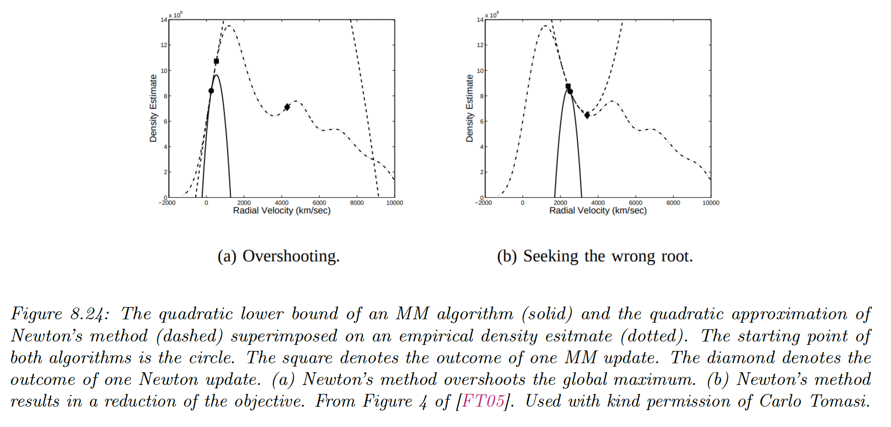
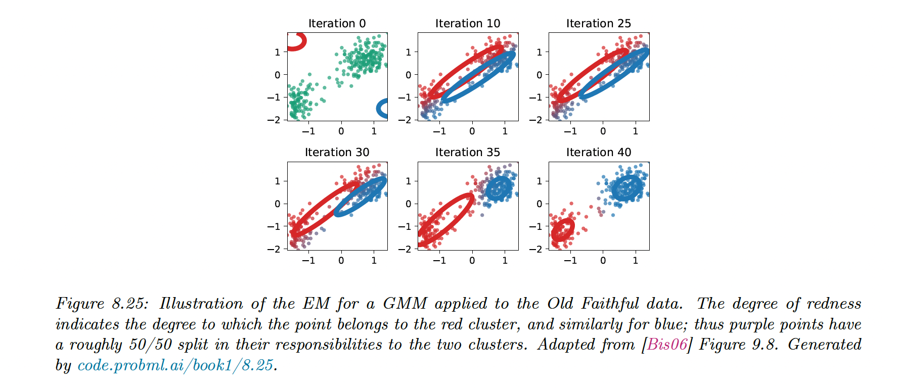

# 8.7 Bound optimization

### 8.7.1 The general algorithm

Our goal is to maximize some function $LL(\theta)$, such as the log-likelihood. We construct a tight lower-bound surrogate function $Q$ such that:

$$
Q(\theta,\theta^t)\leq LL(\theta),\quad Q(\theta^t,\theta^t)= LL(\theta^t)
$$

If these conditions are met, we use the update:

$$
\theta^{t+1}=\argmax_\theta Q(\theta,\theta^t)
$$

This guarantees the monotonic increases of the original objective:

$$
LL(\theta^t)=Q(\theta^t,\theta^t)\leq Q(\theta^{t+1},\theta^t)\leq LL(\theta^{t+1})
$$

This iterative procedure will converge to a local minimum of the $LL$.

If $Q$ is quadratic, then the bound optimization is similar to Newton’s method, which repeatedly fits and optimizes a quadratic approximation.

The difference is that optimizing $Q$ is guaranteed to improve the objective, even if it is not convex, whereas Newton may overshoot or lead to a decrease in the objective since it is a quadratic approximation, not a bound.

### 8.7.2 The EM Algorithm

**8.7.2.1 Lower bound**

The goal of the EM is to maximize the log-likelihood:

$$
LL(\theta)=\sum_{n=1}^N \log p(y_n|\theta)=\sum^N_{n=1}\log  \Big[\sum_{z_n} p(y_n,z_n|\theta)\Big]
$$

where $y_n$ are the visible and $z_n$ the invisible variables.

To push the $\log$ into the sum, we consider arbitrary distributions $q_n(z_n)$:

$$
\begin{align}
LL(\theta) &= \sum^N_{n=1}\log  \Big[\sum_{z_n} q_n(z_n)\frac{p(y_n,z_n|\theta)}{q_n(z_n)}\Big] \\
&\geq \sum^N_{n=1} \sum_{z_n} q_n\log \frac{p(y_n,z_n|\theta)}{q_n(z_n)} \\
& = \sum_{n=1}^N \mathbb{E}_{q_n}[\log p(y_n,z_n|\theta)] + \mathbb{H}(q_n) \\
& = \sum_{n=1}^N \frak{L}(\theta,q_n|y_n) = \frak{L}(\theta,q_{\{1:N\}})

\end{align}
$$

Eq 2. used Jensen’s inequality since $\log$  is a concave function and $\sum_{z_n} q_n=1$

$\frak{L}(\theta,q_{\{1:N\}})$ is called Evidence Lower Bound (ELBO), optimizing it is the basis of variational inference.

**8.7.2.2 E step**

We estimate the hidden variables $q_n$

$$
\begin{align}
\frak{L}(\theta,q_n) &=\sum_{z_n}q_n(z_n) \log \frac{p(y_n,z_n|\theta)}{q_n(z_n)}  \\
&= \sum_{z_n}q_n(z_n) \log \frac{p(z_n|y_n,\theta)p(y_n|\theta)}{q_n(z_n)} \\
&= \sum_{z_n} q_n(z_n)\log \frac{p(z_n|y_n,\theta)}{q_n(z_n)}+\sum_{z_n}q_n(z_n) \log p(y_n|\theta) \\
&= -D_{KL}\big(q_n(z_n)||p(z_n|y_n,\theta)\big)+\log p(y_n|\theta)
\end{align}
$$

We can maximize this lower bound by setting $q_n^*=p(z_n|y_n,\theta)$. This is called the E step.

We can define:

$$
Q(\theta,\theta^t)=\frak{L}\big(\theta,p(z_n|y_n,\theta^t)\big)
$$

Then we have $Q(\theta,\theta^t)\leq LL(\theta)$ and $Q(\theta^t,\theta^t)=LL(\theta^t)$ as required.

**8.7.2.3 M Step**

We compute the MLE by maximizing $\frak{L}(\theta,q_{\{1:N\}}^t)$ w.r.t $\theta$, where $q_{1:N}^t$ are the distributions computed during the E step at iteration $t$.

Since $\mathbb{H}(q_n)$ is constant w.r.t $\theta$, we can remove it. We are left with:

$$
\theta^{t+1}=\argmax_\theta\sum_n \mathbb{E}_{q_n^t}[\log(y_n,z_n|\theta)]
$$

